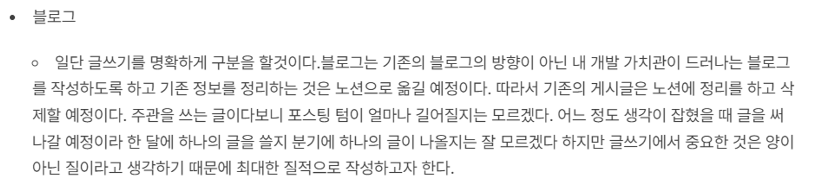
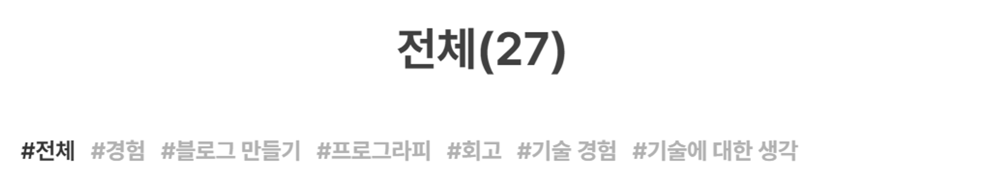
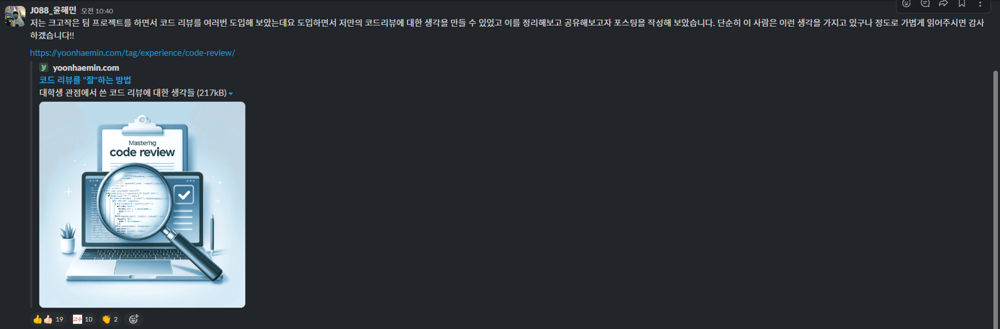

이번 연도에 특별하게 노력하고 향상했다고 생각하는 부분은 가치관의 형성이었습니다. 어떤 개발자가 되고 싶은가? 에 대한 생각을 많이 했고 개발자를 넘어 나라는 사람은 어떤 사람인가에 대한 고민과 결과들이 이번 연도의 가장 큰 수확이라 생각합니다. 특히 프로그라피 동아리와 네이버 부스트캠프를 진행하고 다양한 사람들을 만나며 내게 필요한 부분들을 찾으며 실천하고자 하였습니다. 그래서 이번 연도에 생각하고 실천해 본 것을 돌이켜보고자 합니다.

### 여유를 가지자

프로젝트나 공부를 진행하다 보면 수많은 문제와 수많은 결정과 의사소통이 필요합니다. 이 과정에서 많은 개발자들은 스트레스나 고민하곤 하죠. 저 또한 마찬가지였는데요. 저는 여유를 가지고 최대한의 컨디션을 유지하며 이런 결정들의 만족도 비율을 유지하려 하고 있습니다. 일정한 컨디션으로 일정한 선택의 품질을 보장하도록 한다는 것이죠. 그러기 위해서는 여유가 필요합니다.

 

저는 가장 첫 번째로 잠을 하루 7시간씩 자는 걸 택했습니다. 푹 자고 일어나야 사람이 예민해지지 않고 머리도 잘 돌아가거든요. 특히 저는 더 그랬습니다. 부스트 캠프 기간 잠의 중요성을 많이 느꼈는데 아무리 바쁘거나 밀렸어도 내 활동 시간을 벗어나서 하는 것보다 자고 일어나서 컨디션을 회복하고 하는 것이 2배 이상 효율이 높았습니다.

 

두 번째로는 취미를 가지자는 것이었습니다. 내가 뭔가 스트레스나 일에 지쳤을 때 풀 수 있는 수단이 필요했는데 올해 초까지만 해도 그런 게 없었습니다. 그러다 보니 자꾸 성격이나 기분이 안 좋은 쪽으로 굽게 되고 이게 자꾸 태도로 나타나곤 했습니다. 악순환이 반복된 것이죠. 그래서 스트레스를 풀게 하는 방법이 필요했고 친구의 취미 추천과 운동을 통해서 이를 극복하고자 하였고 지금은 다양한 취미 생활을 가지고 있습니다.

### 안정을 부수자

제가 부족하다고 느낀 것으로는 안정을 중요시하다 보니 때때로 특정 예기치 않은 상황에 대해서 내가 추구하거나 생각한 만큼 잘 잘 대응하지 못하곤 합니다. 이게 개발이 된 적도 있고 일상적인 내용이 된 적도 있죠. 따라서 사실 이렇게 닥친 내용의 대응은 굉장히 만족하지 못하곤 합니다. 또한 이런 점이 자주 스트레스로 다가왔는데요.

 

그래서 이런 훈련을 조금 해보고자 평소에 안 하던 것들을 진행해 보았습니다. 대신 여기서 조건이 기본적으로 여유가 깔려 있어야 이런 불안정한 상황에서 저를 컨트롤하고 스트레스를 덜 받도록 조절할 능력이 된다는 전제 조건이 깔립니다. 잘못하면 스트레스만 받는 것이죠.

 

그래서 진행했던 것이 취미 늘리기와 새로운 사람들 자주 만나기였습니다. 크게는 동아리나 모임들을 시작하는 것부터 작게는 조직 내 내부 소모임까지 굉장히 다양한 사람을 만나면서 내가 제어를 못하는 상황이나 예상할 수 없는 상황들에 마주하고자 하였습니다. 제가 가지고 있는 안정을 조금씩 부술 수 있었고 이는 결국 내가 생각하는 안정하지 않는 상황 또는 예기치 않은 상황이 사실은 별것 아니라는 것을 어렴풋이 깨닫게 되었습니다.

### 리스트업 하는 습관을 들이자

가끔씩 생각으로만 정리하기 힘든 복잡한 상황들이 있었습니다. 올해 같은 경우는 부스트캠프를 시작 전에 나는 개발자의 커리어를 어떻게 타야 하는가에 대해서 굉장히 고민을 많이 했고 내가 얽혀있는 상황들이 조금 복잡했습니다. 이런 상황들을 잘 풀어줄 수 있는 것이 리스트업 하는 방법입니다.

 

나만의 QnA 식으로 하나씩 정리해서 왜 이 생각인지 따지면서 정리하다 보면 내가 할 수 있는 길이 보인다는 걸 볼 수 있었죠. 실제로 부스트 캠프에 붙어서도 내가 커리어를 어떻게 쌓아갈 것인가에 대한 고민을 리스트업 하면서 조금 해소하고 있습니다.

 

내가 할 수 있는 것과 없는 것을 리스트업 해본다던가. 왜 안 된다고 하는지 이유를 찾아 나선다거나, 내가 하고 싶은 게 뭔지 리스트업 해본다던가 지속해서 자체 QnA를 진행하면서 내 목표를 스스로 세우고 해결하려 하고 있습니다.

### 겸손하되 나를 낮추지 말자

올해 초까지만 해도 굉장히 저는 굉장히 코딩을 못한다고 생각했고 그 이유로 여러 동아리나 활동들이 떨어진다고 생각하였습니다. 하지만 해당 부분은 코딩이 아닌 다른 부분 즉 내가 이때까지 해왔던 일들을 표현하지 못해서 나의 100%를 보여주지 못해서 생긴 일이라고 추후에 깨닫게 되었는데요. 나조차도 나를 모르고 있었기 때문에 서류나 이력서에 뭔가 남들이 잘하는 것만 따라서 표현하거나 나는 저걸 못했으니까 저 사람보다 나는 더 못하네 라는 마인드가 무의식적으로 깔려 있던 것 같습니다.

 

처음에는 이렇게 나를 낮추는걸 겸손인 줄 알았지만 나를 좀먹고 있는 비관적인 생각이었다는 걸 올해 후반 들어서 네이버 부스트캠프 내에서 깨닫게 되었습니다. 따라서 겸손은 하되 나를 낮추지 말자는 생각으로 일단 내가 생각하는 것보다 20% 정도 나는 더 잘한다는 생각으로 살고자 합니다.

 

또한 나를 낮추지 말자는 것을 행동으로 실천하고자 하였는데요. 일단 비교 자체를 하지 않으려 합니다. 그래서 절대 “부럽다”라는 말은 안 쓰기로 했죠. 남들이 한걸 가지고 부러워하는 게 나는 못했는데 남들은 했네? 라는 식의 뜻으로 나의 가치를 내린다고 생각했거든요. 실제로 그걸 내가 못 하는 게 아니라 내가 경험해 보지 않는 것인데 말이죠. 대신에 “잘했다, 축하한다”라고 변경해서 사용하였죠. 나는 있는 그대로 두지만 상대방은 띄워 주는 것이죠.

 

그다음에는 내 강점에 대해서 집중하기로 하였습니다. 나의 올해 많이 성장하고 가장 많이 들었던 칭찬은 코드를 잘 짠다는 것이었습니다. 잘 짠다는 게 과연 뭘까요? 굉장히 추상적인 말이죠. 저는 초반에 이게 무슨 말일지 몰라서 내 강점으로 생각하지 않았는데요. 개발자로서 잘 짠다는 게 무슨 가치를 두고 있지라는 생각이었습니다. 하지만 이건 부스트 캠프에 들어오면서 바뀌었는데요. 개발자에게 코드를 잘 짠다는 말은 결국 누구나 읽기 쉬우면서 누구나 건드릴 수 있는 코드를 짜는 것입니다. 즉 저도 모르는 사이에 쉬운 코드와 구조화에 대해서 집중하고 있었고 이게 저의 가치였던 것입니다. 이는 저는 빠른 개발 및 유지보수를 쉽게 하고 있었고 이는 개발자들의 시간을 아끼고 다른 고민을 하게 해주는 원동력이 되고 있었던 것입니다. 따라서 이 가치에 집중하며 저를 표현하고자 합니다.

### 생각보다 더 큰 글의 긍정적 가치

블로그를 시작했던 이유 중 하나가 글이 생각했던 것보다 더 큰 가치를 지니고 있다는 것을 깨닫게 되었습니다. 특히나 저는 말로 설명하는 것보다는 글로써 작성하는 게 더 편하고 더 정확하고 깊게 전달하고 있다는 것을 느꼈었는데 이번 연도 활동을 하면서 더 확신하게 되었습니다.

 

그래서 노력하고자 했던 게 생각을 잘 정리해서 공유해서 보지였습니다. 2022 회고를 보면 블로그는 내 개발 가치관이 드러나는 글을 쓰는 것이라고 회고 했었습니다.

가치관이 잘 나타나는 글, 즉 내 생각들을 넣는 글 내 주관이 들어간 글, 내가 어떤 문제를 해결해야 하는지 그 과정에서 어떤 생각을 하고 있는지 나타내 주는 게 이 개발 가치관이 드러나는 글이라고 생각하였습니다.

그래서 카테고리도, 경험, 회고, 기술 경험, 기술에 대한 생각 등 주관이 들어가는 카테고리들로 만들었습니다.

1년간 직접 블로그를 만들고 운영하였지만 경험에 대한 내용이 조회수는 잘 안 나오더라고요. 키워드도 뚜렷하지 않고 검색이라는 게 경험을 검색하는 것이 아니라 정보를 검색하기 때문에 조회수랑은 거리가 먼 이야기입니다.
블로그 시작의 계기가 조회수는 아니었으므로 크게 연연하지는 않았습니다. 하지만 내가 검색에 개시가 안되고 있다는 건 내 글이 가치가 없어서이진 않을까? 라는 의문이 종종 들었었습니다. 글을 잘못 썼나 갸우뚱하기도 했고요.

하지만 이런 경험의 글은 부스트 캠프에 들어가서 되게 가치가 있다고 느꼈습니다.

여러 캠퍼분이 글을 공유하는 것을 보고 나도 그냥 한번 공유해 보지 뭐 하면서 공유했던 글이었는데 생각보다 많은 사람들이 좋아해 주셨습니다. 실제로 도움이 되셨다는 사람들도 있었고 재미있게 봤다는 후기도 있었습니다.

또한 블로그 글을 읽고 왜 이렇게 하셨나요? 이러면 안 되나요? 같은 질문을 받을 때마다 한편으로는 글을 너무 잘 읽어주셔서 감사하고 내가 이 경험에서 어디를 더 봐야 하는지 어딜 더 전달해야 하는지 등의 방향을 잡을 수 있었습니다.

따라서 처음에 시작한 내 글의 가치를 남들에게 전달하는 것은 잘하고 있었고 이것은 제가 생각한 것보다 나 포함한 모든 사람에게 큰 힘이 된다는 걸 알게 되었습니다.

## 내년에 해야 할 것

올해를 보내면서 고민했던 점도 있었지만 앞으로 뭘 하고 싶다 생긴 것도 있습니다.

### 오픈소스 찾아서 써보기

사실 올해 초 ~ 말까지는 특별히 큰 스택 변화 없이 기존 기술 그대로 사용한 경향이 있었습니다. 코어를 다지기 위한 작업을 했었는데요. 블로그 글이나 기술도 최소한의 기술 스택에 대한 것들만 사용하였고 큰 라이브러리들의 철학에 다가가기 위한 노력을 했었습니다. 이런 결과 프론트엔드 생태계의 핵심적인 변화와 해당 라이브러리로 코드를 잘 짜는 방법 같은 추상적이고 철학적인 내용들을 엿볼 수 있었습니다. 대표적으로 [Redux 까보기](https://yoonhaemin.com/tag/technical-experience/analyze-redux-store/), [JS로 React 흉내 내기](https://github.com/Yoon-Hae-Min/create-react-with-vanilla-js-study), [타입스크립트 스터디](https://github.com/boostcampwm2023/typescript-book-study), 부스트캠프 챌린지 등이 있었죠.

 

하지만 이렇게 했을 때 들었던 생각이 너무 시야를 좁게 보고 있다는 것입니다. 생태계는 빠르게 변화하고 있고 더 좋은 기술들이 나오지만, 핵심이라고 생각되는 라이브러리만 보고 있으면서 너무 보수적이고 단조로운 프로젝트만 진행했다는 점입니다.

 

따라서 내년부터는 이 핵심이라 생각하는 라이브러리를 기준으로 더 편하고 더 빠르고 다른 넓은 관점의 오픈소스들을 찾아다니면서 시야를 넓힐 생각입니다.

### 면접 준비하기

사실 아직도 내가 자랑하고 싶은 부분이나 나의 100%를 남들에게 효과적으로 뽐내지 못한다고 생각합니다. 특히 이번에 처음으로 인턴십 면접을 보면서 뼈저리게 느꼈었는데요. 대답은 할 수 있지만 그 대답이 내가 할 수 있는 BEST의 대답은 아니었다는 걸 면접을 회고하면서 느꼈었습니다. 나를 정확하게 알고 내가 아는 범위 내에서 가장 잘 드러내는 연습이 필요하다 생각했고 그것은 바로 면접 준비라 생각합니다. 단순하게 태도를 교정하는 면접 준비가 아닌 내 생각과 내가 경험한 것을 말로 전환하는 것에 집중하면서 준비해 보려 합니다.

### 블로그 홍보하기

저는 조회수에 집착하지 않고 나만의 글을 쓰고 있었는데요. 위에서 서술했듯이 글에서는 생각보다 많은 긍정적인 가치가 있다는 사실을 깨달았습니다. 따라서 내 글을 피드백받고 이런 가치를 조금 더 전달해 보자 용기 내 링크드인이나 커리어리 등에 조금씩 올려보면서 "나"라는 사람의 가치를 공유해 보고자 합니다.

## 결론

2023도 알찼고 2024도 알차자!
