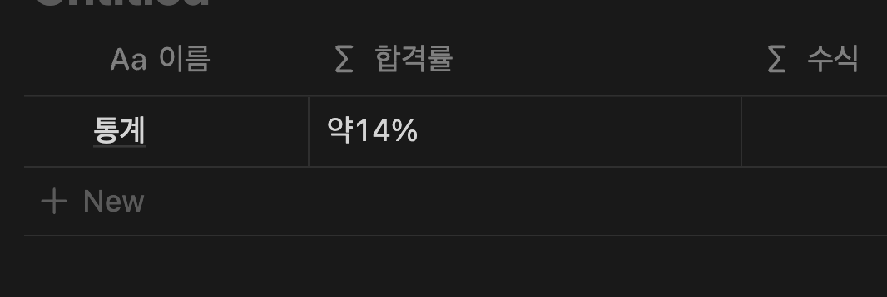
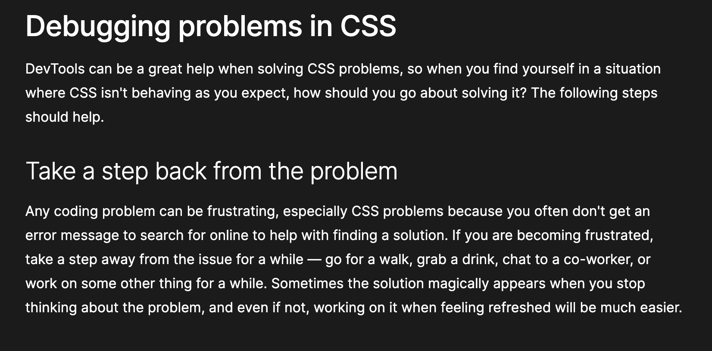

부스트 캠프가 끝나고 약 반년 간 저는 인턴 및 정규직에 도전하였습니다. 제가 가고 싶었던 회사 상은 뚜렷하였고 1년 전부터 꼭 비즈니스의 한가운데서 직접 개발을 하며 가치 창출을 하고 싶다는 목표가 있었기 때문에 설렌 과정이었습니다.
하지만 결론적으로는 전부 실패했습니다. 실패 속에서 매우 큰 상실감이 있었는데 이 과정에서 제가 극복한 방법과 어떤 걸 얻었는지 회고를 통해서 정리해 보고자 합니다.

## 회사에 지원하자

서류 합격률은 약 14퍼센트 정도였습니다. 저 같은 경우에는 3-2학기 휴학 상태라는 거대한 족쇄 하나가 있었는데요. 그 탓인지 제 생각보다 많은 곳에서 탈락을 받을 수 있었습니다. 원티드에 이력서가 열람하였다는 알람이 뜨고 10분 만에 탈락으로 바뀌는 회사도 있었습니다.

그래도 제가 가고 싶었던 회사들이 서류가 합격하여 퍼센트는 별로 신경을 쓰지 않았습니다.

 

서류가 합격하면 보통 면접을 보거나 과제가 나오는데요. 한 회사의 면접이 끝나서 결과가 나오면 다음 회사의 면접이나 과제를 시작하고 하는 식으로 끝없이 계속 이어졌습니다. 그때 당시에는 전형이 안 겹쳐서 다행이다. 제대로 준비할 수 있겠다는 희망을 얻었지만 지금 생각해 보면 오히려 이런 식으로 진행돼서 더 희망을 놓지 못하고 피폐해지지 않았나 싶습니다.

## 지원하면서 얻은 것들

올해 초까지만 하더라도 아무런 스킬이 없었기 때문에 아쉬운 부분이 많았고 그 과정에서 채용 자체에 많은 걸 배울 수 있었습니다.

### 과제

과제의 경우 회사마다 구현해야 하는 것은 다르지만, 지원자의 코딩 스타일이나 지식의 수준 등을 가장 잘 드러내 줄 수 있는 특징을 가지고 있습니다. 저는 이런 과제 전형 단계가 제 장점을 더 잘 보여줄 수 있다고 생각하였고 코딩 테스트가 있는 회사보다는 과제 위주의 회사를 지원하였습니다.

하지만 첫 과제인 클라썸 회사의 과제 테스트 탈락을 받고 회고를 해보니 단순히 내가 개발하는데, 구현에 치우쳐져 있다는 것을 깨닫게 해 주었습니다. 과제에서는 내 구현 능력을 보여주는 게 의도라 생각해서 하나하나 전부 구현하였으나 실제 개발을 생각해 보면 상황에 맞는 라이브러리, 상황에 맞는 설계 방법 등, 이 부분들이 좀 부족하게 드러나지 않았나 깨닫게 해 주었습니다.

그래서 이런 점을 보완하고 진행하였더니 그다음부터는 과제에서 떨어지지 않았고 심지어 어떤 회사에서는 면접에서 과제에 대해 칭찬을 받을 수 있었습니다.

### 기술 면접

제가 가장 약한 부분입니다. 2023 회고에서 "나"라는 사람을 100% 뽐내지 못한다고 느꼈는데 실제 면접에서도 아는데 답변을 제대로 못 해 아쉬운 부분들이 생겼습니다. 그래서 저는 제 모든 근거를 제 경험에 기반해서 설명하려 하였습니다. 그러면 어떤 질문에 대한 답을 외울 필요 없이 그 당시 상황을 회상하며 팩트만을 설명하니 답변의 신뢰성이 더 생기는 효과가 있었습니다.

 

그래서 저는 면접을 준비할 때 해당 사항을 회상하는 식으로 정리를 하였습니다. 그러다 보면 해당 프로젝트에서 굉장히 인상깊고 나를 잘 드러내는 경험들이 눈에 보이게 되는데요. 저는 그 부분을 중점으로 면접에서 전달해 주고자 하였습니다.

 

면접을 진행하다 보니 기술 면접을 보면서 느끼는 것이 회사마다 스타일이 다 달랐습니다. 문제 스피드 퀴즈, 내 경험을 바탕으로 하는 질문, 과제질문, 과제 외 질문 등 굉장히 다양하기 때문에 경험 이외에 기술적인 부분의 준비도 필요했습니다. 사실 이 부분은 아직도 미완성이긴 한데 이것도 실제 경험을 바탕으로 진행하려 하고 있습니다.
대표적으로 React관련 JS관련 대표 질문들, 이력서에 적혀있는 기술적 질문들이 있는데 제가 실제 코드를 어떻게 짜는지를 나타내려고 노력하였습니다. 기술에 대한 내용을 저는 이렇게 써봤고 이렇게 동작한다는 식으로 설명하였습니다. 기존에는 질문과 답변을 외우는 식으로 했지만, 이 방법은 시간이 지나면 까먹는다는 문제가 있었기 때문에 이 방법을 채택하였습니다.

 

기술 면접을 보면 나도 해당 회사에 대한 평가가 자연스럽게 생기게 됩니다. 제가 채용자의 입장에서 생각해 본다면 당장 지원자의 경험이 우리 팀에 어떤 영향을 미치는지 우리가 필수로 해야 하는 문제들을 이 사람이 소화해 낼 수 있는지 확인을 하기에 경험보다 잘 판단해 주는 것은 없다고 생각합니다. 개발자의 가장 큰 무기는 경험이라고 생각하는데 채용 단계에서 이런 가치관을 보여주는 회사는 합격 불합격과 관계없이 더 나와 맞는다고 생각할 수 있었습니다. 단순히 평가가 아닌 사람이 궁금하다는 듯한 느낌이 좋았습니다.

### 인성 면접

기술 면접에 인성 면접도 같이 진행하는데요. 이 부분은 내 프로젝트 내용을 잘 정리하고 내가 어떤 사람인지 잘 정의를 하면 어렵지 않았습니다. 저는 인성 면접을 준비하면서 좀 더 내가 어떤 사람인지 정리를 할 수 있었습니다.

 

또한 면접을 보면서 프로젝트 자체와 나에 대해 쭉 파고드는 질문과 답변을 주고받다 보면 결국 해당 프로젝트에서 못한 부분이나 아쉬운 부분이 나오는데 해당 부분들이 피드백되어서 나중에 내가 해결해야 할 숙제들이 되는 것을 볼 수 있었습니다. 대표적으로 저는 회의를 효과적으로 더 잘하는 방법을 연구해 보고 개발자의 시간 산출을 잘하려면 어떻게 해야 할까를 숙제로 남길 수 있었습니다.

## 환영받지 못한 개발자

6개월간 탈락하고 다시 수정하고 도전하고 반복했지만, 최종 합격할 수는 없었습니다. 위에서 서술한 기술 인성 면접은 전부 답이 어느 정도 있습니다. 기술이야 내가 해당 회사가 원하는 수준을 넘도록 공부하면 되고 인성은 내가 개발을 위해 노력한 것이 많았기에 더 잘 정리해서 표현하면 되었습니다.

하지만 인프랩 29cm 컬처핏 탈락을 두 번 경험하고 나니 매우 큰 허탈감과 상실감을 맛보았습니다. 다른 회사였으면 그 회사의 문화와 알맞지 않아서 컬처핏에서 떨어졌다고 생각할 수 있습니다. 하지만 저 두 회사가 저에게 주는 의미는 컸습니다.

 

먼저 제 개발의 시작은 인프런에서 제로초님의 강의로 시작하였고 개발 가치관 자체는 개발바닥의 향로 님의 생각을 많이 받았습니다. 그러다 보니 자연스럽게 인프런이라는 회사에 대한 관심과 가치관이 형성되고 있었습니다. 그리고 29cm는 작년 프로그라피 동아리에서 만난 개발자의 이야기를 들으면서 나와 맞을 거 같고 내가 걸어온 길과 굉장히 유사하다는 느낌을 많이 받았었습니다.

 

그래서 컬처핏 탈락은 내가 가고자 하는 길, 왔던 길이 통째로 부정당한 느낌을 주었습니다. 컬처핏 탈락은 내가 추구하고 가고자 하는 회사들이 너 우리랑 안 맞아서 올 수 없다고 말하는 것처럼 들렸기 때문입니다. 여기서 오는 상실감이 매우 컸고 이것을 납득하고 싶어 피드백 요청을 드렸으나 인프랩에서는 방향성이 맞지 않는다는 불명확한 피드백과 29cm는 답장을 받지 못하였습니다.

 

컬처핏 피드백은 회사 입장에서도 조심스러울 수밖에 없다는 것은 머리로는 이해하지만, 가슴으로는 납득하기 어려웠습니다. 내 생각에 어떤 문제가 있으면 고치거나 다시 생각을 해볼 수 있는데 그것이 뭔지는 알 수 없다는 느낌이 컸기 때문이죠. 단순히 내가 졸업을 안 해서 회사 입장에서는 불안한 사람이라 생각해서 떨어진 것인지 진짜 회사랑 어느 부분이 안 맞는지 해당 포지션에만 안 맞는 것인지 등 감을 잡을 수 없었기 때문입니다.

 

그래서 며칠 동안은 이런 생각에 사로잡혀 있었습니다. 그러다 보니 자연스럽게 개발 동기와 목표 또한 사라졌습니다. 내가 추구하고자 하는 길이 맞는지 확신도 없어졌고 뭘 해야 하는지도 모르는 힘든 날을 보내고 있었습니다. 그냥 저 스스로 내릴 만한 답이 없었습니다.

## 나를 디버깅해보자

이 상황에 대해 주변 개발자 지인과 이야기해 보았습니다. 저 스스로 내린 결론이고 저 스스로 느끼기 때문에 혼자서는 계속 같은 상황만 반복될 것 같기 때문에 외부에서 답을 찾아보고자 하였습니다. 이 중에서 가장 재미있었던 조언이 CSS 디버깅처럼 일단 한발 물러 나라였습니다.

그래서 저는 한발 물러서서 보기를 사용해 보았습니다. 코드에서는 잘 사용하는 기법이지만 저를 대상으로 사용하니 뭔가 재미있었습니다. 답을 찾으려 하지 말고 한발 물러선 후에 제3자의 시선으로 상황을 다시 보자 하였습니다.

그래서 노션을 켜고 나는 6개월 동안 어떤 것을 배웠고 무엇을 했고 왜 나는 힘들어하고 뭘 할 거고 어떤 개발자 그리고 어떤 삶을 살고 싶은지 그냥 문제가 아닌 내 상황 자체에 대해서 생각해 보았습니다.

가장 힘들게 저를 괴롭히고 있었던 것들을 토대로 정리해 보았습니다. 단순한 회사 탈락이 이렇게 힘들어지는 이유가 뭔지 생각을 해봤지만, 실상은 탈락은 하나의 트리거였고 이와 엮여있는 더 많은 문제가 있었습니다.

### 왜 나는 힘든가?

1. 쉬고 싶은데 쉴만한 자본이 없다. 쉬어도 쉬는 게 아니다. 비참하다
2. 뭘 해야할지 모르겠다. 노력을 해도 가고 싶은 회사를 갈 수 있을지 모르겠다
3. 내가 가지고 있는 개발 실력으로 무언가에 기여를 하고 싶은데 공부한 2년간 한 것이 없다. 동기가 꺾인다.
4. 비교를 하면 안 되는 걸 알지만 나와 같이 공부했던 or 주변인들이 전부 취직해서 내가 해보고 싶은 걸 하며 폭풍 성장 중이다.
5. 하나의 면접 전형이 끝나면 바로 다음 면접 전형이 시작되고 이걸 6개월 동안 진행했는데 전부 탈락이라 남는 게 없다.

 

나를 내가 인터뷰하듯이 진행하고 나니 더 구체적인 이유로 변환할 수 있었습니다. 이렇고 구체적으로 꺼내고 나니 큰 틀이 보였습니다. 자본 부족, 동기 부족, 비교, 지침 4개의 키워드가 메인이었습니다. 기존의 문제와 다르게 해당 문제들은 해결할 방법이 보였고 이것 먼저 해결하고자 하였습니다.

 

1. 자본 부족: 돈을 벌 수단을 마련하자
2. 동기 부족: 내가 하고 싶은 개발을 찾자 (아이디어를 얻자). 작은 성공을 해서 스스로 활력을 넣어 스노우볼을 굴리자
3. 비교: 머리로는 이해하지만, 마음으로는 이해하기 힘들다. 나도 나 스스로에게 집중을 많이 했다. 꼭 기억하자. 기술로 1등을 하려 하지 말라 좋은 개발자는 1등 개발자가 아닌 팀과 잘 어우러지는 개발자이다.
4. 지침: 면접 전형에서 많은 에너지가 소모되었으니 쉬는 게 필요하다. 쉬면서 뭘 하고 싶은지 찾자

## 구체적인 해결

자본은 외주를 통한 해결을 하였고 동기 부족은 목표를 다시 세워서 활력을 불어넣으려 했습니다. 5년간 미뤄둔 운전면허를 따며 작은 성공부터 시작해 스노우볼을 굴리고 있습니다.

 

비교는 사실 완전히 안 하기 힘든 것 같습니다. 특히 마음에 여유가 사라질수록 계속 생각나게 된다는 점이 힘들지만 그럴수록 나에게 집중하면서 남과 단절하고자 합니다. 저는 엄청나게 기술을 잘하는 느낌이 드는 것보다는 어떠한 상황에서도 문제를 잘 해결하는 일 잘하는 사람을 더 추구하기 때문입니다. 그러다 보면 당연히 어떤 지식에서는 다른 사람보다 덜 가지고 있는 부분도 생길 수 있다는 이해하려 합니다. 사실 이 부분은 당연하지만 실천하기 가장 어려운 것으로 마음에 여유가 꼭 필요한 것 같습니다.

 

그리고 마지막으로 약간의 휴식 기간을 가지려 합니다. 6개월간의 회사 지원에서 엄청난 심적 에너지를 사용했습니다. 어떤 기술을 익히는 활동은 많이 없어서 아쉬웠지만 지금의 개발은 아무런 흥미도 없고 여유도 없기 때문에 이대로 진행하면 아무것도 못 할 것 같습니다.

 

여기까지 생각하고 나니까 다시 마음의 여유가 생기게 되었습니다. 탈락의 이유를 졸업하지 않은 이유 때문이라고 생각하기로 하며 개발 자체에 대한 끈을 놓지 않으려 합니다. 만약 내가 생각하는 최악의 상황이 맞더라도 그건 1년 뒤에 정확히 판단할 수 있고 개발에 대한 열정과 생각 자체는 취직한 다른 지인 보다 더 크다고 생각하기 때문입니다.

## 결론

상황이 이런 이상 3-2를 다니고 졸업을 한 후 다시 취직에 도전을 하자 생각하며 6개월간의 취직 행보는 막을 내리려 합니다.
지금 굉장히 불안정한 상태입니다. 따라서 섣부르게 했다간 모두 무너질 가능성이 높죠. 하지만 객관적으로 바라보기와 주변 지인 덕분에 정신 차릴 수 있을 만큼의 마음 여유가 생겼습니다. 이런 주변 지인의 중요성을 또 한 번 느끼고 좀 더 외부 활동을 하면서 제가 가는 길을 검증하고자 합니다.
