## 서론

이미지는 사용자 경험에 큰 영향을 주는 요소입니다. 특히 이미지가 많고 고화질일수록 웹페이지의 로딩이 느려지는 문제를 한 번쯤 겪어보셨을 겁니다. 저 역시 이미지가 중요한 프로젝트를 진행하면서 이런 로딩이 느린 문제를 해결하기 위해 CDN과 코드레벨에서의 최적화 기법을 사용하였습니다. 그러다 문득 이런생각이 들었습니다.

> “어떻게 이런 설정으로 성능이 달라질 수 있는거지?”
>
> “이게 왜 최적화가 되는것일까?”

이런 궁금증을 바탕으로 실제로 적용했던 옵션이 어떤 원리로 동작하며 실제 최적화라고 부를 수 있는지 확인하고자 하였습니다.

<br/>

시작에 앞서 제가 하고 있는 프로젝트 상황은 다음과 같습니다.

- 실제 이미지가 중요하고 많은 이미지가 있는 프로젝트
- github pages를 이용한 배포
- 페이지당 약 60개정도의 이미지를 불러오고 있음
- 한국에서만 서비스를 진행할 예정

## 최적화가 없다면?

내가 필요한 이미지를 서비스내에서 단순히 사용한다면 local에서 불러오는 형태가 될것입니다.

제가 사용하고 있는 이미지는 평균 1.4~1.5Mb의 용량을 차지하고 있고 약 65장의 이미지가 동시에 로드되고 있는 환경입니다. 이 환경에서는 로딩완료까지 약 25초 정도가 걸리고 있었죠

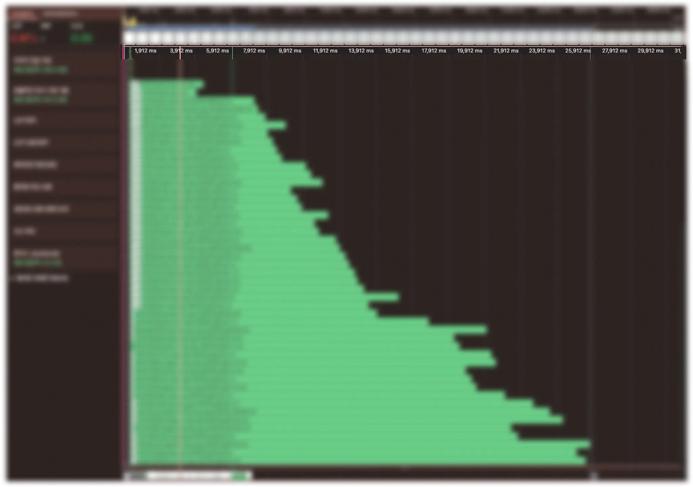
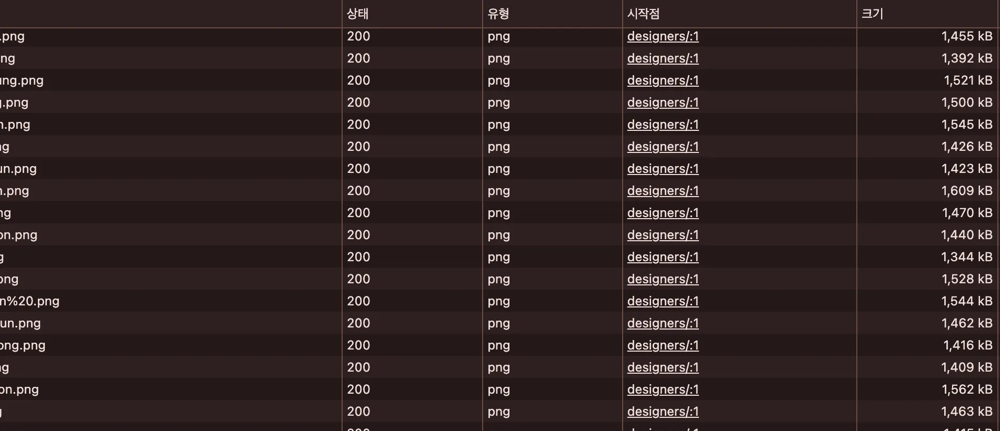

이 문제를 해결하기 위해 가장 먼저 고려한 방법은 CDN을 도입하는 것이었습니다. 현재 프로젝트는 GitHub Pages를 통해 정적 배포되고 있는데 이는 서울 리전에 대한 엣지 서버가 없어 국내 사용자라 하더라도 이미지 요청이 물리적으로 먼 서버로 향하게 됩니다. 그에 따라 필연적으로 지연이 발생합니다.

또한 GitHub Pages는 오리진 서버 자체 성능이 뛰어나지 않기 때문에 다량의 이미지 리소스를 동시에 서빙하기에 적합하지 않다고 생각하였습니다. 정적 콘텐츠는 CDN에 위임하고 오리진은 최소한의 역할만 맡는 것이 더 효율적이라 판단했습니다.

마지막으로 운영 측면에서도 별도의 이미지 전용 CDN을 두는 것이 캐싱 전략, 도메인 분리, 만료 제어 등 여러 관리 포인트에서 유리하다고 판단했습니다.

## Imgix를 이용해서 최적화 하자

저는 CDN으로 [Imgix](https://www.imgix.com/) 서비스를 선택하였습니다. Imgix는 이미지 CDN 기반의 처리 서비스로 압축, 포맷 변환, 크기 조절, 색상 보정, 메타데이터 제거 등 다양한 최적화 기능을 URL 파라미터만으로 제공해 줍니다. 또한 서울 리전에 대한 엣지 서버가 있어 빠르게 이미지를 공급해 줄 수 있습니다.

즉 별도의 서버 사이드에서 이미지 가공 로직을 설정하지 않아도 Imgix를 사용하면 URL 파라미터만으로 최적화된 이미지 형태를 만들 수 있는 장점이 있다는 점에서 이번 프로젝트에 가장 적합한 솔루션이라고 생각하였습니다.


단순히 이미지를 CDN으로 옮겼더니 25초에서 20초로 줄어들었습니다. 이제 조금 더 나은 상황이 되었네요.

하지만 20초의 시간을 기다릴수 있는 사용자는 몇이나 될까요?? 이를 더 줄이기 위해서 때문에 Imgix에서 제공해 주는 최적화 옵션을 적용해 보도록 했습니다.

## Imgix 이미지 `auto=compress` 압축

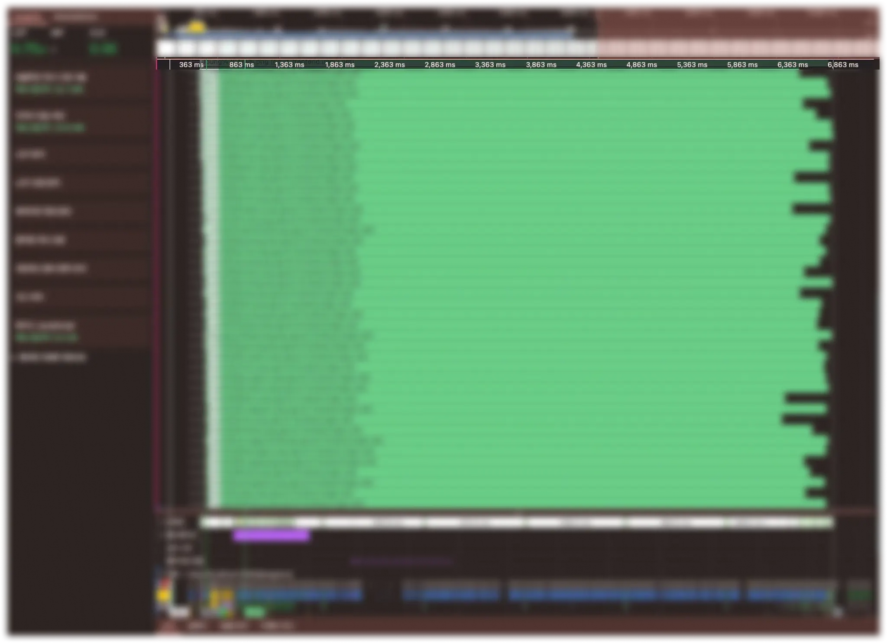

[Imgix에서 제공하는 `auto=compress` 파라미터](https://docs.imgix.com/en-US/apis/rendering/automatic#compress)를 사용하여 이미지 압축을 진행하였습니다. 로딩 완료까지 6초, 다운받는 사진 또한 1.5Mb에서 500kb로 1/3로 줄일 수 있습니다.

<br/>

공식 문서에 따르면 `auto=compress`를 적용하면 이미지 확장자에 따라 서로 다른 압축 방식을 사용한다고 합니다. 구체적인 알고리즘은 공개되지 않았지만 [블로그](https://www.imgix.com/blog/auto-compress#:~:text=Note%3A%20Files%20without%20transparency%20will,a%20loss%20in%20image%20quality)와, 문서에서는 대표적인 최적화 방식으로 다음 세 가지를 언급하고 있습니다.

<br/>

1. png 이지만 알파채널을 사용하지 않으면 JPEG를 사용한다
2. 넓은 단색 영역이나 투명한 배경을 가진 일러스트나 로고 같은 이미지의 경우 용량 절감 효과는 더욱 극적일 수 있습니다.
3. 컬러 프로파일(metadata) 제거합니다.

<br/>

### 왜?) PNG vs JPEG

> png 이지만 알파채널을 사용하지 않으면 JPEG를 사용한다

알파채널이 없으면 왜 JPEG를 사용할까요? 각 포멧이 어떤 특징을 가지고 있는지를 알아보며 비교해 보겠습니다.

#### PNG

**압축 방법**: 무손실 압축

**알파채널**: O

**알고리즘**: DEFLATE 알고리즘

<br/>

---

- **알고리즘 순서**
  - LZ77 압축 → 허프만 코딩(Huffman Coding)
- **LZ77 압축**
  - 중복되는 문자열을 찾아서 이전에 나왔던 데이터의 참조로 치환하는 방식입니다.
  - 슬라이딩 윈도우 방식을 이용해서 연속적으로 데이터가 존재할때 최적화를 진행합니다.
  - 예를 들어 `abcabcabc` 같은 데이터가 있으면 뒤쪽 `abc`들을 앞에서 3글자만큼 뒤로 가면 같은 게 있어와 같이 내용과 빈도를 기록하는 식으로 표현해 공간을 절약합니다.
- **허프만 코딩(Huffman Coding)**
  - 자주 등장하는 데이터는 더 짧은 비트로, 드물게 등장하는 데이터는 더 긴 비트로 표현하는 방식입니다.
  - 기본 규칙은 작은 영역은 왼쪽 큰 영역은 오른쪽을 기준으로 모두 하나의 트리가 될때까지 작은 숫자2개를 가져와 구성합니다.
  - 트리가 구성이 되고 나면 좌측은 0 오른쪽은 1로 구성하여 리프노드에 2비트를 할당합니다.
    1. **집합**
       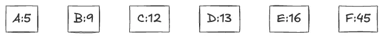
    2. **가장 작은 2개 트리화**
       
       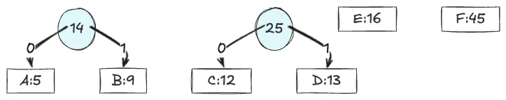
       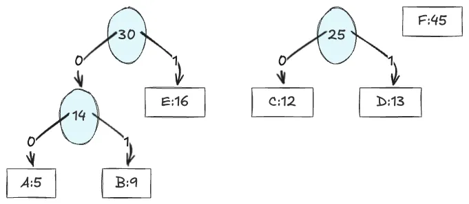
    3. **반복 후 결과**
       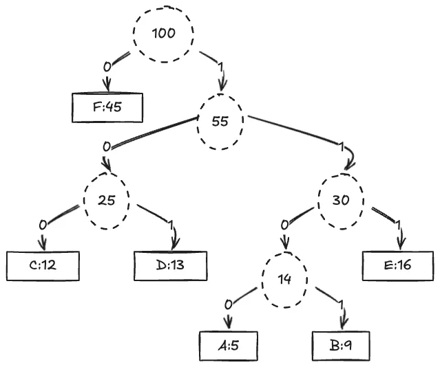
    - `F = 0`
    - `C = 100`
    - `D = 101`
    - `E = 111`
    - `A = 1100`
    - `B = 1101`
- **결론**
  - 연속적으로 중복되는 이미지 데이터는 참조로 치환하며 수를 기록하고 이렇게 치환된 데이터의 묶음으로 허프만 코딩을 진행하며 최대한 짧은 비트를 기반으로 사진을 저장합니다.
  - 따라서 PNG는 알파 채널이 있으면서 원본 데이터를 수정하지 않고 압축된 파일 형태입니다.

#### JPEG

**압축 방법**: 손실 압축

**알파채널**: X

**알고리즘**: 컬러 공간 변환 → 다운샘플링 → DCT → 양자화 → 허프만 코딩

<br/>

---

- **설명**
  - JPEG의 핵심은 사람의 눈에 덜 민감한 정보를 버려서 용량을 줄이는 방식을 사용합니다.
- **컬러 공간 변환**

  - 인간의 눈은 밝기에 더 민감하고 색상에는 더 둔감합니다. 따라서 덜 민감한 정보인 색상의 해상도를 줄여서 압축합니다.
  - 따라서 색상을 밝기와 색차의 단위인 YCbCr(밝기 Y, 색차 Cb/Cr 분리)로 변경합니다.
    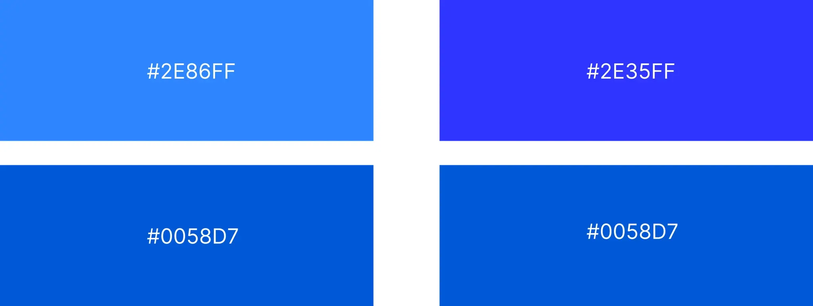

  - 같은 절대값의 색상 차이임에도 불구하고 밝기 차이가 더 뚜렷하게 대비되는 현상을 볼 수 있습니다.

- **다운 샘플링**

  - 이제 각 민감한 밝기 정보(Y)의 경우 그대로 두고 색상(CbCr)의경우 특정 비율에 따라서 대표값을 설정하여 저장합니다. 이때 삭제된 데이터는 대표값이 됩니다
    
  - 4:2:0 압축을 한다고 했을때 Y(8bit) UV(8bit)에서 Y(8bit) UV(2bit)의 데이터만 저장될 수 있습니다
  - 즉 기존에 8+8+8 bit정보에서 8+2+2 bit정보로 절반으로 압축을 할 수 있습니다.

- **DCT (Discrete Cosine Transform)**
  - 공간 영역의 데이터를 주파수 영역으로 변환하여 이미지가 어떤 변화를 띄고 있는지 확인합니다.
  - 이미지에서 인접한 픽셀과의 색상 차이가 적은 경우 낮은 공간 주파수를 가지고
  - 이미지에서 인접한 픽셀과의 색상 차이가 많은 경우 높은 공간 주파수를 가집니다.
    
    이미지와 전혀 관련없는 4px의 레드 점을 찍어 보았습니다. 왼쪽의 이미지의 빨간 점이 더 쉽고 잘 보이는것을 볼 수 있습니다. 즉 낮은 공간 주파수가 높은 공간 주파수 영역 보다 변경사항이 더 잘보입니다.
    이를 통해서 우리는 낮은 공간주파수에서 몇개의 픽셀 정보가 손실된다면 사람은 그것을 빠르게 인지할 것입니다. 반면에 높은 공간 주파수의 경우 몇개의 픽셀 정보가 손실 된다면 우리는 상대적으로 인지하기 힘듭니다.
    이를 이용해서 저주파 영역은 유지하고 고주파 영역은 압축하는 방법으로 진행해야 할것입니다. 이를 DCT식을 이용해서 변환합니다.
    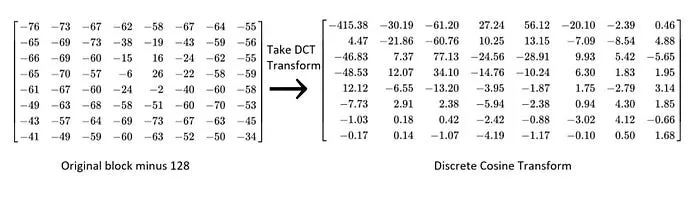
- **양자화**

  - 이제 변환된 행렬을 토대로 고주파 성분을 제거해 압축을 해야 합니다. Quantization table을 이용하여 값을 나누어 압축을 진행합니다.
  - Quantization table의 값이 클수록 압축률이 올라갑니다. 값이 커질수록 0과 비슷한 값이 더 많이 남게되고 이렇게 되면 원본의 데이터가 점점 줄어들며 압축률이 올라가게 됩니다.

  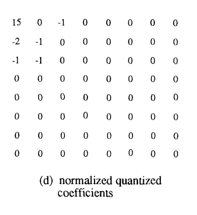

- **무손실 압축**

  - 이제 해당 데이터를 토대로 무손실압축인 런-렝스 코딩과 허프만 코딩을 이용해서 압축을 시키면 완성입니다.

#### 결론

PNG는 알파 채널을 포함할 수 있고 손실 없는 압축이 장점이지만 불필요하게 용량이 커질 수 있습니다. 반면 JPEG는 알파 채널을 지원하지 않지만, 시각적으로 손실이 거의 느껴지지 않으면서 용량을 크게 줄일 수 있습니다.

따라서 알파 채널이 없는 경우라면 PNG의 장점을 활용하지 못하기 때문에 JPEG로 자동 변환하는 것이 브라우저나 CDN 입장에서도 더 합리적입니다.

### 왜?) PNG-8

> “넓은 단색 영역이나 투명한 배경을 가진 일러스트나 로고 같은 이미지의 경우 용량 절감 효과는 더욱 극적일 수 있습니다.”

PNG 포맷은 이미지의 색상 종류가 단순할수록 압축 효율이 더 커지는 경향이 있습니다. 왜 그럴까요??

<br/>

PNG는 내부적으로 PNG-8, PNG-24, PNG-32와 같이 몇 가지 타입으로 나뉘어 사용됩니다.

- PNG-8: 최대 256가지 색상을 표현할 수 있는 팔레트 방식을 사용합니다.
- PNG-24 / PNG-32: 약 1,677만 색상(24비트 컬러)을 표현할 수 있으며 PNG-32는 여기에 알파 채널(투명도)까지 포함된 형식입니다.

<br/>

이 중 PNG-8은 팔레트 기반으로 동작합니다. 즉 이미지에서 사용하는 색상을 미리 정의한 뒤 각 픽셀은 그 색상 테이블에서 인덱스를 참조하는 방식입니다. 예를 들어 이미지에 실제로 사용된 색이 40가지뿐이라면 이 40개의 색상만 팔레트에 담아두고 각 픽셀은 해당 색의 번호만 저장하면 됩니다. 이렇게 되면 데이터 양이 줄어들고 자연스럽게 이미지 크기도 작아집니다.

하지만 원본 이미지에 사용된 색상이 이보다 많다면 색상 수를 줄이는 과정이 필요해지며, 이때 도구나 서비스에 따라 손실이 발생할 수 있습니다.

<br/>

실제 최적화를 봐보겠습니다. 원본 이미지 파일의 경우 PNG-32(RGBA)를 사용하고 있는 파일입니다.

```text
 PNG image data, 888 x 1110, 8-bit/color RGBA, non-interlaced
```

Imgix에서 auto=compress 옵션을 사용한 파일은 다음과 같이 PNG-8(colormap)로 변형된 것을 알 수 있습니다.

```text
PNG image data, 888 x 1110, 8-bit colormap, non-interlaced
```

따라서 이미지의 색상이 적을 수록 이 팔레트의 수가 적어지기 때문에 용량 절감 효과는 더욱 극대적 입니다.

### 왜?) color profile metadata

> **컬러 프로파일(metadata)** 제거

이미지 파일에는 단순히 픽셀 데이터뿐만 아니라 다양한 메타데이터(metadata)도 함께 저장됩니다. 그 중 하나가 컬러 프로파일(color profile)로, 이는 이미지에 사용된 색 공간(color space)에 대한 정보를 담고 있습니다.

왜 이 정보가 필요한 걸까요?

<br/>

모니터, 카메라, 프린터 등 각 기기는 색상을 표현하는 방식이 서로 다릅니다. 이러한 차이에도 불구하고 원본의 색상을 가능한 정확하게 표현하기 위해, 이미지는 특정 표준에 따른 색 공간 정보를 포함하게 됩니다. 이 정보는 일반적으로 ICC(International Color Consortium)에서 정의한 규격을 따릅니다.

<br/>

예시로는 다음과 같은 색 공간들이 있습니다:

- **sRGB**: 웹과 대부분의 디스플레이에서 표준으로 사용되는 색 공간
- **Adobe RGB**: sRGB보다 넓은 색 영역을 표현할 수 있어 인쇄용으로 적합함
- **ProPhoto RGB**: 매우 넓은 색역을 가진 색 공간으로, 전문적인 사진 및 영상 작업에 사용됨
- **Display P3**: Apple 디스플레이 등에서 주로 사용되며, sRGB보다 넓은 색역을 지원함

<br/>

웹에서는 일반적으로 sRGB를 표준으로 사용하여 이미지의 색상을 표현합니다. 따라서 이미지가 sRGB가 아닌 색 공간으로 저장되어 있을 경우 브라우저가 이를 sRGB로 강제로 변환하여 보여주게 됩니다. 이 과정에서 원래의 색상이 일부 누락되거나 다르게 보일 수 있습니다.

<br/>

아래에 같은 이미지이지만 다른 ICC를 설정해 둔 예제입니다. [(이미지 출처)](https://www.eizoglobal.com/library/management/color-management-summary/)

**이미지가 Adobe RGB를 사용하는경우**


**이미지가 sRGB를 사용하는 경우**


웹에서는 이미지가 서로 다르지만 다운로드에서 비교해 보면 같은 이미지 인것을 확인할 수 있습니다.

<br/>

웹에서는 대부분 sRGB를 사용하여 이미지를 보여줍니다. 즉 어떤 컬러 메타데이터가 포함되어 있더라도 결국에는 sRGB로 변환되어 표시되기 때문에 실질적인 표시 결과에는 큰 차이가 없습니다. 따라서 컬러메타 데이터를 제거하더라도 시각적 품질 저하 없이 이미지 파일의 용량을 절감할 수 있습니다.

## Imgix 이미지 `auto=format` 압축

이미지를 압축하였음에도 불구하고, 사용자는 여전히 최대 6초 이상 로딩을 기다려야 했습니다. Imgix는 단순한 압축 외에도 이미지 포맷을 브라우저에 맞게 자동으로 전환하는 `auto=format` 옵션 사용을 권장합니다.

해당 옵션을 적용하면, 브라우저의 지원 여부에 따라 다음과 같은 포맷이 자동으로 선택됩니다.

- **AVIF** (가장 우선)
- **WebP** (AVIF 미지원 시)
- **JPEG/PNG** (WebP도 미지원일 경우)

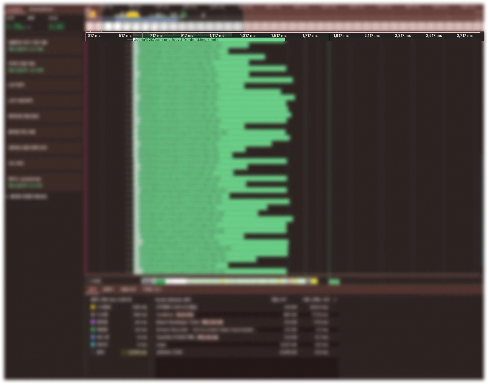
`auto=format`을 도입한 후, 전체 리소스 로딩 시간은 약 6초 → 1.6초로 단축되었으며, 약 15배의 성능 향상을 경험할 수 있었습니다.

그렇다면, AVIF와 WebP 포맷은 기존 포맷과 어떤 점에서 다르길래 이렇게 효과적일까요?

### WebP

**압축 방법**: 손실, 무손실 압축

**알파채널**: O

**알고리즘**: 컬러 공간 변환 → 다운샘플링→ 내부 예측모드 → DCT → 양자화 → 무손실 포맷 변경

<br/>

---

<br/>

WebP는 웹에서 더 빠르고 가볍게 이미지를 전달하기 위해 구글에서 개발한 이미지 포맷입니다. JPEG보다 더 정교한 압축 방식을 사용하며, 무손실 압축과 알파 채널(투명도)을 함께 지원한다는 장점이 있습니다.

WebP의 손실 압축은 동영상 포맷인 VP8을 기반으로 합니다. JPEG와 기본 구조는 유사하지만 다음과 같은 차이점이 존재합니다

- **내부 예측 모드 적용**

  - 다운샘플링 이후, 주변 블록 정보를 활용하여 현재 블록을 예측하고, 실제 이미지와의 오차만 저장합니다. 단순히 픽셀을 버리는 것이 아니라 예측 기반 보간을 사용하기 때문에 더 자연스러운 결과를 얻을 수 있습니다.

- **블록 단위로 다른 양자화 테이블 사용**

  - JPEG는 전체 이미지에 하나의 양자화 테이블만 사용하는 반면, WebP는 블록별로 압축 강도를 조절할 수 있어 세밀한 품질 제어가 가능합니다.

- **[효율적인 무손실 압축 방식](https://developers.google.com/speed/webp/docs/compression?hl=ko#lossless_webp)**

  - JPEG는 RLE(런-렝스 코딩)와 허프만 코딩을 사용하는 반면, WebP는 더욱 정교한 예측자, 색상 역상관 변환 등의 다양한 기법을 활용해 압축 효율을 높입니다.


WebP는 알파 채널을 지원하면서도 용량이 작고, 대부분의 현대 브라우저에서 지원되는 실용적인 포맷입니다. 실제로 WebP를 사용할 경우 JPEG보다 더 선명해 보이지만 용량은 더 작은 이미지를 전달할 수 있습니다.

### AVIF

**압축 방법**: 손실, 무손실 압축

**알파채널**: O

**알고리즘**: 컬러 공간 변환 → 다운샘플링→ 내부 예측모드 → 다양한 변환 커널 → 양자화 → 무손실 포맷 변경

<br/>

---

<br/>

AVIF는 가장 높은 압축 효율을 자랑하는 최신 이미지 포맷입니다. 동영상 코덱인 AV1을 기반으로 하며, WebP와 유사한 구조를 가지고 있지만 각 단계에서 더 다양한 변환 알고리즘을 적용하여 훨씬 더 높은 압축을 지원합니다.

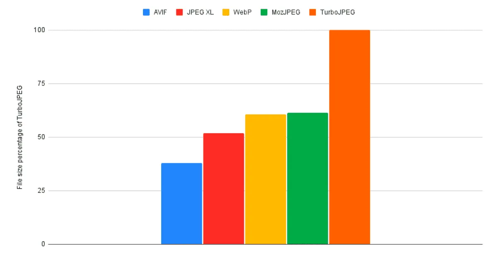
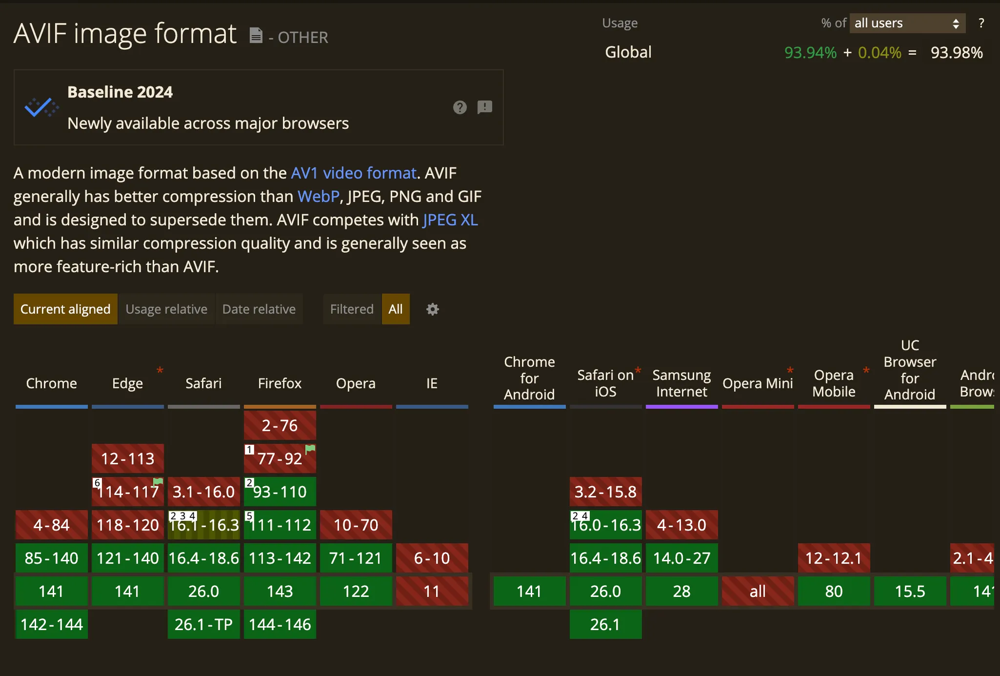

WebP 비슷하게 IE 제외 대부분의 브라우저에서 사용할 수 있지만 IE 및 일부 구형 브라우저에서는 호환성 문제가 발생할 수 있습니다. 그럼에도 불구하고 최신 웹 환경에서는 가장 강력한 이미지 포맷 중 하나입니다.

### 결론

이미지 포맷별 압축 방식에는 차이가 있지만, 공통적으로는 JPEG 기반의 손실 압축 방식에서 점점 진화해왔다는 흐름을 알 수 있었습니다. 그 결과 `auto=format` 옵션을 통해 브라우저가 지원하는 최상의 포맷으로 이미지를 제공하는 것만으로도 용량 감소와 이미지 품질을 챙길 수 있습니다.

## 코드에서 이미지 최적화 하기

이미지 자체에 대한 포맷 변경이나 메타데이터 제거 등 리소스 레벨의 최적화를 마쳤다면, 이제는 서비스 내 코드에서 실현할 수 있는 최적화 방법을 고민해야 합니다. 저는 3가지 방법으로 이를 최적화 하였습니다.

### **Lazy Loading**

`img` 태그에 `loading="lazy"` 속성을 추가하면, 해당 이미지가 뷰포트(사용자 시야)에 가까워질 때에만 리소스를 요청합니다.

```tsx

```

loading 속성은 이미지나 iframe을 불러오는 방식을 제어하는 속성입니다.
lazy로 설정하면 뷰포트 근처에 도달했을 때 로드되며, eager로 설정하면 문서를 파싱하는 도중 바로 로드됩니다.

<br/>

제 프로젝트의 한 페이지에는 총 60개의 이미지가 있습니다. 하지만 사용자가 처음 페이지에 진입했을 때 실제로 화면에 보이는 이미지는 16개뿐입니다.

loading="lazy"를 적용하지 않고 단순히 `` 태그만 사용할 경우, 브라우저는 초기 렌더링 시 60개의 이미지를 모두 요청하게 되어 페이지 로딩 속도가 느려집니다.

반면 loading="lazy"를 적용하면 초기 화면에 노출되는 16개의 이미지만 먼저 로드되고 나머지는 사용자가 스크롤할 때 순차적으로 불러와집니다. 이로 인해 초기 로딩 속도가 크게 개선되어 더 쾌적한 사용자 경험을 제공할 수 있었습니다.

#### Lazy Loading은 만능이 아니다

언뜻 보면 모든 이미지에 `lazy`를 적용하는 것이 가장 좋아 보일 수 있습니다. 하지만 실제 서비스 환경에서는 다음과 같은 단점도 함께 고려해야 합니다

- LCP에 관여되는 이미지를 Lazy Loading 했을 경우 로딩이 더 느리다
  - LCP(Largest Contentful Paint)는 웹 페이지가 시각적으로 주요 콘텐츠를 렌더링하는 데 걸리는 시간을 의미합니다. 해당 LCP 영역에 포함되는 이미지를 `lazy`로 설정하면, 브라우저가 이를 늦게 로드하게 되어 오히려 [LCP 점수가 악화](https://web.dev/articles/lcp-lazy-loading?hl=ko)될 수 있습니다.
    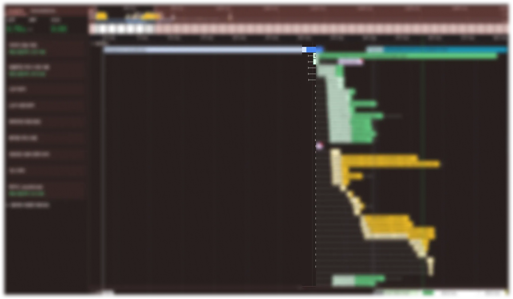
    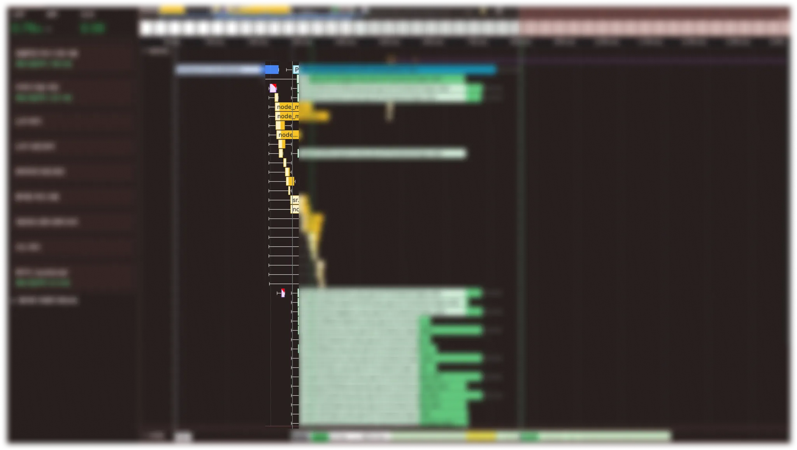
    - Lazy Loading을 적용된 리소스는 html랜더링이 완료된 이후 리소스 요청을 진행합니다.
- 페이지 내에 지속적인 반응이 필요하는 부분의 경험이 좋지 않다.
  - 이미지를 포함한 페이지가 사용자의 지속적인 상호작용을 요구하는 경우 Lazy Loading으로 인해 UI가 끊어지는 안 좋은 사용자 경험을 유발할 수 있습니다.

따라서 지속적으로 인터렉션이 필요하지 않는 페이지에 대해 LCP에 관여되지 않는 부분을 Lazy Loading 처리하는것이 가장 좋은 방법이라고 할 수 있습니다.

### Background Image

웹 개발을 하다 보면 단순한 배경 이미지를 처리할 때 고민이 생깁니다. 콘텐츠 내용과 연관이 없는 백그라운드 이미지는 img tag에 넣어야 할까요? 아니면 css background 속성에 넣어야 할까요?

<br/>

시멘틱 구조 측면에서는 `background`를 쓰는 게 자연스러울 수 있지만 성능 최적화 관점에서는 `` 태그를 사용하는 편이 더 유리합니다.

<br/>

브라우저는 HTML을 파싱할 때 병렬로 리소스를 미리 다운로드하는 `preload scanner`라는 메커니즘을 사용합니다. 이는 HTML 파서가 중단되는 상황(예: `<link>`나 `<script>`를 만날 때)에서 백그라운드에서 HTML 전체를 훑으며 미리 리소스를 요청할 수 있도록 도와줍니다.

<br/>

이때, preload scanner는 HTML 안에 명시적으로 적혀 있는 리소스만 인식합니다

- ``
- `<link rel="stylesheet">`
- `<script src="...">`
- `<link rel="preload">`, `<link rel="prefetch">`

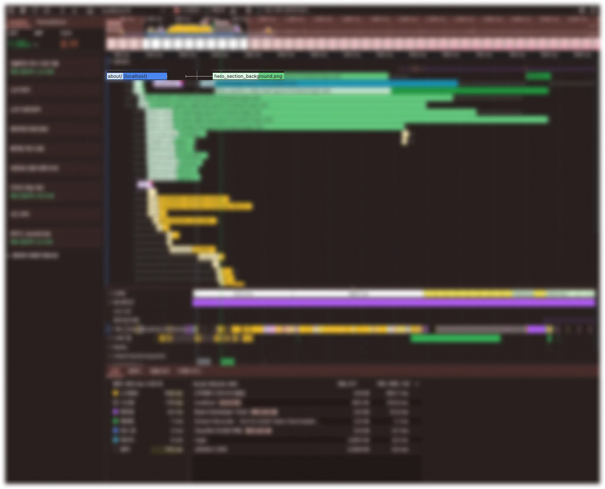

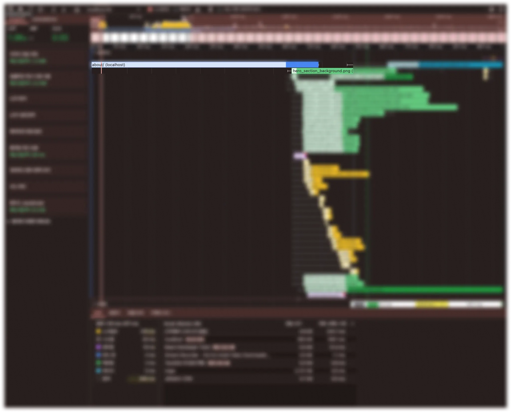

실제 요청 기록을 보면 img 태그를 사용할때는 html 파싱 중에 img 리소스 요청이 일어나기 시작했고 css background 속성을 사용하면 html 파싱이후 리소스 요청이 일어났다는것을 확인할 수 있었습니다.

### 반응형 이미지

서비스에서 다양한 기기의 크기를 지원하는 반응형 웹 디자인(Responsive Web Design)을 적용하고 있다면 작은 화면에서 큰 이미지를 그대로 렌더링하는 것은 매우 비효율적입니다.

<br/>

아무리 잘 압축한 이미지라도, 모바일 기기에서 고해상도 이미지를 그대로 로드하게 되면 불필요한 데이터 낭비와 느린 로딩 속도를 초래하게 됩니다. 그래서 기기 해상도별로 적절한 크기의 이미지를 제공하는 ‘반응형 이미지(Responsive Image)’ 전략이 필요합니다.

<br/>

HTML에서는 이를 위한 두 가지 방법을 제공합니다. 하나는 `` 태그의 `srcset`과 `sizes` 속성을 이용하는 것이고 다른 하나는 `<picture>` 태그를 사용하는 방식입니다.

```tsx

```

```tsx
<picture>
  {/* 브라우저가 AVIF를 지원한다면 아래 source로부터 적절한 이미지를 선택 */}
  <source
    srcset="
      image-600.avif 600w,
      image-1200.avif 1200w,
      image-2000.avif 2000w
    "
    sizes="(max-width: 768px) 100vw, (max-width: 1280px) 80vw, 60vw"
    type="image/avif"
  />

  {/* AVIF를 지원하지 않지만 WebP를 지원하는 경우 */}
  <source
    srcset="
      image-600.webp 600w,
      image-1200.webp 1200w,
      image-2000.webp 2000w
    "
    sizes="(max-width: 768px) 100vw, (max-width: 1280px) 80vw, 60vw"
    type="image/webp"
  />

  {/* 위의 포맷들을 모두 지원하지 않는 브라우저는 이 fallback 이미지를 사용 */}
  
</picture>
```

img의 경우 단순 이미지를 골라주는 역할만 한다면 picture 태그를 사용하면 반응형 별로 다른 포멧이나 다른 이미지를 가져올 수 있습니다.

## 마무리

최적화를 위해 다음 4가지 전략을 적용했습니다

1. **CDN(Imgix) 적용**
   - `auto=compress`로 이미지 압축
   - `auto=format`으로 AVIF 등 최신 포맷 제공 (브라우저별 자동 대응)
2. **Lazy Loading**
   - `` 속성으로 사용자 Viewport에 진입할 때 로드
   - 초기 렌더링 시 네트워크 리소스 절약
3. **배경 이미지의 `` 태그 사용**
   - CSS `background-image` 대신 `` 사용하여 preload-scanner의 이점 확보
   - 브라우저가 빠르게 리소스를 요청할 수 있도록 유도
4. **반응형 이미지 사용**
   - `srcset`, `sizes`, `<picture>` 태그를 통해 기기별 해상도에 맞는 이미지 선택
   - 모바일에서 불필요한 고해상도 이미지 다운로드 방지

그 결과 기존에 Content Load시간이 25초에서 0.8초로 약 97% 빨라졌고 LCP또한 기존 1.8초에서 0.63초로 65% 감소하였습니다.

단순히 성능을 개선하는 데 그치지 않고 그 과정에서 왜 이러한 최적화가 효과적인지 그 원리와 배경을 함께 이해하려 노력했습니다. 이를 통해 상황에 맞는 최적화 방식을 선택하는 안목을 기를 수 있었고 이미지 포맷과 웹 브라우저의 렌더링 방식에 대한 기초 지식도 함께 확장할 수 있는 경험이 되었습니다.
