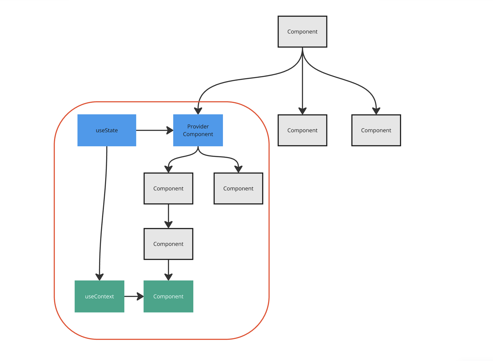
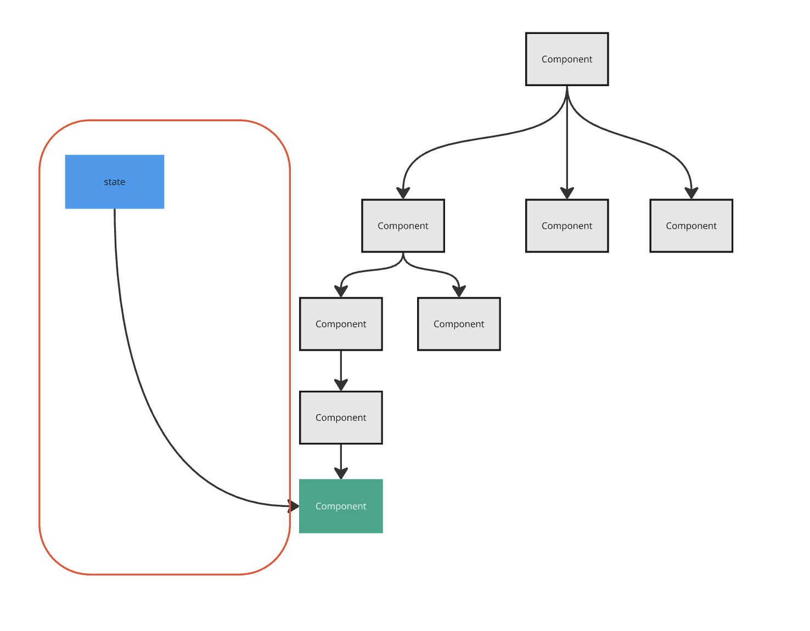
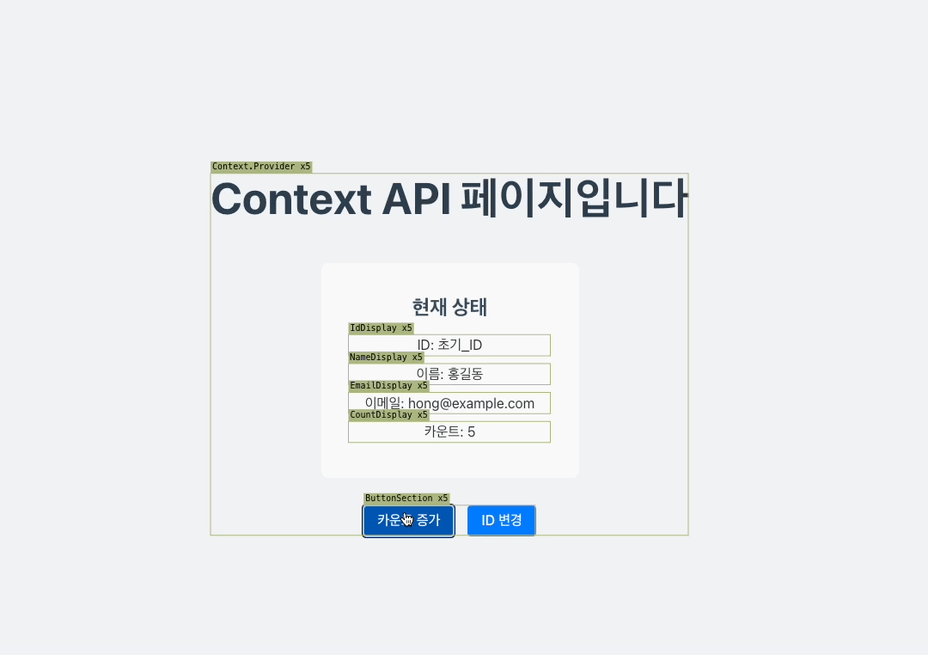
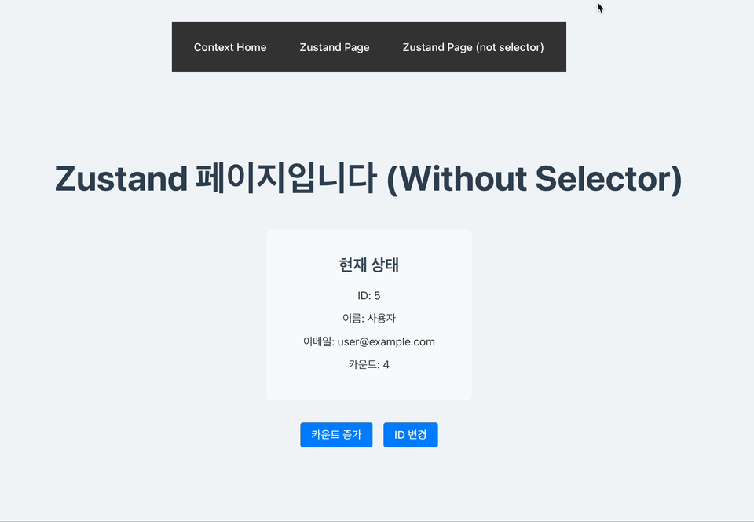
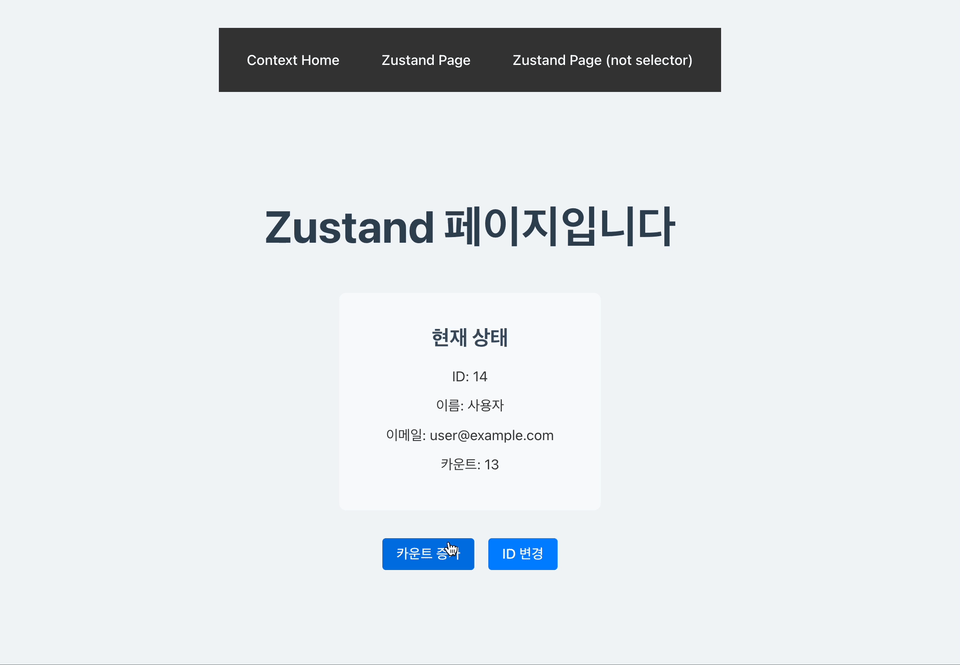

# 서론

React에서는 부모 컴포넌트에서 자식 컴포넌트로 props 통해 정보를 전달하고는 합니다. 하지만 때때로 상당히 깊은 props 통해 자식에게 전달하고는 하는데요. 이를 props drilling이라고 합니다. React팀에서는 이를 해결하기 위해서 Context API를 만들어 컴포넌트 깊이에 상관없이 데이터를 넘겨줄 줄 수 있습니다.

<br/>

이에 대한 내용은 [React 듀토리얼](https://ko.react.dev/learn/passing-data-deeply-with-context)에서도 잘 설명하고 있습니다. 하지만 Context API에 관한 부가 정보나 설명을 작성한 블로그 글에서는 종종 오해하기 쉬운 표현과 잘못된 정보를 전달하고 있다는 걸 보았습니다. 저 또한 검증 없이 읽었을 때는 이러한 표현을 사용했었습니다. 이번 글에서는 Context API에 대한 흔한 오해들을 살펴보고, 진정한 가치를 정리해 보려 합니다.

# Context에 관한 오해

구글에 검색하거나 Context API 문서를 찾다 보면 볼 수 있는 내용을 기반으로 준비해 보았습니다.

## 전역 상태를 관리해 준다.

> - 전역 상태 라이브러리의 대안이다
> - 규모가 작은 곳에 전역 상태로 사용하면 좋다.

흔히 Context API 하면 전역 상태에 대한 대안으로 생각하는 경우가 많습니다. 하지만 엄연히 잘못되었습니다. 둘은 서로를 대응할 수 있는 위치가 아니거든요. Context API는 단순한 파이프 관으로 비유할 수 있고 전역 상태 라이브러리는 상수 시설로 비유할 수 있는데요. 관을 이용해서 상수도를 만들 수 있지만 파이프 관 없이 우물의 형태로도 만들 수 있습니다. 즉 우리는 재료와 시설을 동일 선상에 두고 비교하지 않듯 Context API와 전역 상태 또한 대응점으로 비교할 수 없습니다. 즉 논제 자체가 잘못되었습니다.

<br/>

구현체를 보면 전역 상태와 비교했을 때 비슷한 느낌이 있고 실제로 컴포넌트 외부에 상태를 두고 싶을 때 사용하기 때문에 이런 오해가 나왔다고 추측되는데요. Context API, Redux, Zustand 코드를 통해 한번 비교해 보겠습니다.

### 코드 비교

1. Context API

```tsx
import React, { createContext, useContext, useState } from 'react';

const CounterContext = createContext();
// 1. context 생성

export function CounterProvider({ children }) {
  const [count, setCount] = useState(0);
  return <CounterContext.Provider value={{ count, setCount }}>{children}</CounterContext.Provider>;
}
// 2. provider 주입

export function useCounter() {
  return useContext(CounterContext);
}

export function ContextCounter() {
  const { count, setCount } = useCounter();
  // 3. provider에 주입된 값 가져오기
  return (
    <div>
      <p>Count: {count}</p>
      <button onClick={() => setCount(count + 1)}>Increase</button>
    </div>
  );
}
```

2. redux

```tsx
// 2. Redux
import { configureStore, createSlice } from '@reduxjs/toolkit';
import { Provider, useDispatch, useSelector } from 'react-redux';

const counterSlice = createSlice({
  name: 'counter',
  initialState: 0,
  reducers: {
    increment: (state) => state + 1
  }
});
// 1. slice 생성

const store = configureStore({ reducer: counterSlice.reducer });
// 2. store 생성

export function ReduxCounter() {
  const count = useSelector((state) => state);
  // 3. 전역 상태 가져오기
  const dispatch = useDispatch();
  return (
    <div>
      <p>Count: {count}</p>
      <button onClick={() => dispatch(counterSlice.actions.increment())}>Increase</button>
    </div>
  );
}

export function ReduxProvider({ children }) {
  return <Provider store={store}>{children}</Provider>;
}
```

3. zustand

```tsx
import create from 'zustand';

const useZustandStore = create((set) => ({
  count: 0,
  increment: () => set((state) => ({ count: state.count + 1 }))
}));
// 1. store 생성

export function ZustandCounter() {
  const { count, increment } = useZustandStore();
  // 2. 전역 상태 가져오기
  return (
    <div>
      <p>Count: {count}</p>
      <button onClick={increment}>Increase</button>
    </div>
  );
}
```

세 버전 전부 버튼을 누르면 counter 상태가 증가하는 동작을 하고 있습니다. 모두 전역 상태처럼 보이는 걸 생성하고 hook을 통해서 그 값을 가져오는 꼴을 하고 있습니다. 하지만 전역 상태 라이브러리와 Context API에서 상태는 서로 다른 것에 관여합니다.

### 차이점



Context API는 의존성 주입 도구로 랜더트리에 관여하는 특징을 가지고 있습니다. Provider의 부분을 기점으로 그 하위에 state를 주입하고 있죠. 단순히 useContext로 context를 가져오는 건 Provider에 있는 useState를 가져오는 것과 똑같습니다.

```tsx
export function CounterProvider({ children }) {
  const [count, setCount] = useState(0);
  return <CounterContext.Provider value={{ count, setCount }}>{children}</CounterContext.Provider>;
}
```

해당 예제는 useState로 상태를 만들어 하위 랜더트리에서 접근할 수 있게끔 의존성을 주입했으므로 랜더트리내(사진속 빨간 원)구역에서는 중첩된 컴포넌트와 관련 없이 전역 상태처럼 접근할 수 있습니다.

<br/>

반면에 전역 상태 라이브러리는 조금 다릅니다.



랜더트리 외부에서 상태를 만들어 컴포넌트에서 이를 사용하는 구조입니다. 이는 랜더트리 구조에 영향을 받지 않고 쓸 수 있다는 것이 큰 특징입니다. 프로젝트 랜더트리 구조를 모두 무시한 채 진짜 전역적으로 사용할 수 있습니다.

### 결론

정리하자면 랜더트리에 관여해 범위를 제한적으로 사용할 수 있으면 Context API, 프로젝트 전역적으로 랜더트리에 관여 없이 사용할 수 있으면 전역 상태로 구분할 수 있습니다. 이는 'Context API는 전역 상태를 관리한다'가 아닌 '의존성 주입을 통해 랜더트리 범위에서 상태를 사용해 전역 상태처럼 사용할 수 있다'로 정리할 수 있습니다.

## 값을 변경하면 하위 컴포넌트가 모두 리랜더링 된다.

> - 값을 변경하면 이 값을 사용하는 하위 컴포넌트가 전부 리랜더링 된다.
> - 리랜더링 최적화가 안되어 있다.
> - 값 변화가 적은 곳에 사용해야 한다.

Context API와 전역 상태 라이브러리를 비교할 때 가장 많이 하는 말이고 단순히 '그렇구나!' 하면서 믿고 있었던 문장입니다. 하지만 이런 말은 오해를 불러일으키기 좋은 말입니다.

### 코드 비교

```tsx
import React, { createContext, useContext, useState } from 'react';
import { AppState } from '../types';

// Context의 기본값 타입 정의
interface AppContextType {
  state: AppState;
  incrementCount: () => void;
  changeId: () => void;
}

// Context 생성
const AppContext = createContext<AppContextType | undefined>(undefined);

// Provider 컴포넌트
export function AppProvider({ children }: { children: React.ReactNode }) {
  const [state, setState] = useState<AppState>({
    id: '초기_ID',
    user: {
      name: '홍길동',
      email: 'hong@example.com'
    },
    count: 0
  });

  const incrementCount = () => {
    setState((prev) => ({
      ...prev,
      count: prev.count + 1
    }));
  };

  const changeId = () => {
    const newId = Math.random().toString(36).substr(2, 9);
    setState((prev) => ({
      ...prev,
      id: newId
    }));
  };

  return (
    <AppContext.Provider value={{ state, incrementCount, changeId }}>
      {children}
    </AppContext.Provider>
  );
}

// Custom Hook
export function useAppContext() {
  const context = useContext(AppContext);
  if (context === undefined) {
    throw new Error('useAppContext must be used within an AppProvider');
  }
  return context;
}
```

```tsx
import React from 'react';
import { useAppContext, AppProvider } from '../context/AppContext';

const Header = () => {
  return <h1>홈페이지입니다</h1>;
};

const IdDisplay = () => {
  const { state } = useAppContext();
  return <p>ID: {state.id}</p>;
};

const NameDisplay = () => {
  const { state } = useAppContext();
  return <p>이름: {state.user.name}</p>;
};

const EmailDisplay = () => {
  const { state } = useAppContext();
  return <p>이메일: {state.user.email}</p>;
};

const CountDisplay = () => {
  const { state } = useAppContext();
  return <p>카운트: {state.count}</p>;
};

const StatusInfo = () => {
  return (
    <div className="info-section">
      <h2>현재 상태</h2>
      <IdDisplay />
      <NameDisplay />
      <EmailDisplay />
      <CountDisplay />
    </div>
  );
};

const ButtonSection = () => {
  const { incrementCount, changeId } = useAppContext();

  return (
    <div className="button-section">
      <button onClick={incrementCount} className="action-button">
        카운트 증가
      </button>

      <button onClick={changeId} className="action-button">
        ID 변경
      </button>
    </div>
  );
};

function Home() {
  return (
    <AppProvider>
      <div className="home-container">
        <Header />
        <StatusInfo />
        <ButtonSection />
      </div>
    </AppProvider>
  );
}

export default Home;
```

Context API를 이용한 간단한 예제입니다. button을 클릭해서 state에 변화 준다면 어떻게 될까요?? 알고 있는 대로 Provider의 children은 전부 리랜더링 되는 것일까요??



컴포넌트에서 참조하는 상태와 상관없이 모든 useAppContext를 가지고 있는 컴포넌트 및 Provider만 리랜더링 되는 것을 볼 수 있습니다. 이를 통해서 Provider 컴포넌트의 자식 컴포넌트가 모두 리랜더링 된다는 주장은 잘못되었다는 것을 알 수 있습니다.

<br/>

그러면 전역 상태 라이브러리는 이를 해결해 줄까요?? zustand를 사용해서 위의 예제와 똑같이 구현해 보겠습니다.

```tsx
import { create } from 'zustand';

interface User {
  name: string;
  email: string;
}

interface State {
  id: number;
  user: User;
  count: number;
}

interface Actions {
  incrementCount: () => void;
  changeId: () => void;
}

export const useStore = create<State & Actions>((set) => ({
  id: 1,
  user: {
    name: '사용자',
    email: 'user@example.com'
  },
  count: 0,
  incrementCount: () => set((state) => ({ count: state.count + 1 })),
  changeId: () => set((state) => ({ id: state.id + 1 }))
}));
```

```tsx
import React from 'react';
import { useStore } from '../store/useStore';
import './Home.css';

const Header = () => {
  return <h1>Zustand 페이지입니다 (Without Selector)</h1>;
};

const IdDisplay = () => {
  const store = useStore();
  return <p>ID: {store.id}</p>;
};

const NameDisplay = () => {
  const store = useStore();
  return <p>이름: {store.user.name}</p>;
};

const EmailDisplay = () => {
  const store = useStore();
  return <p>이메일: {store.user.email}</p>;
};

const CountDisplay = () => {
  const store = useStore();
  return <p>카운트: {store.count}</p>;
};

const StatusInfo = () => {
  return (
    <div className="info-section">
      <h2>현재 상태</h2>
      <IdDisplay />
      <NameDisplay />
      <EmailDisplay />
      <CountDisplay />
    </div>
  );
};

const ButtonSection = () => {
  const store = useStore();

  return (
    <div className="button-section">
      <button onClick={store.incrementCount} className="action-button">
        카운트 증가
      </button>

      <button onClick={store.changeId} className="action-button">
        ID 변경
      </button>
    </div>
  );
};

function ZustandNotSelector() {
  return (
    <div className="home-container">
      <Header />
      <StatusInfo />
      <ButtonSection />
    </div>
  );
}

export default ZustandNotSelector;
```



Context API와 똑같이 컴포넌트에서 사용하는 상태와 관련 없이 모든 컴포넌트가 리랜더링 됩니다. 단순히 전역 상태를 사용했을 때 리랜더링이 최적화된다는 말은 틀렸다는 걸 볼 수 있죠.

<br/>

이렇게 모든 컴포넌트가 리랜더링 되는 이유는 Context API와 전역 상태 상태를 가져오는 방식이 동일하기 때문입니다. Context API에서는 useState, zustand 에서는 create 매서드를 통해 생성된 객체 형태의 상태를 사용하고 있습니다. 여기서 객체 형태라는 점을 주목해 보죠

```tsx
// Context API의 상태
const [state, setState] = useState<AppState>({
  id: '초기_ID',
  user: {
    name: '홍길동',
    email: 'hong@example.com'
  },
  count: 0
});

// zustand의 상태
export const useStore = create<State & Actions>((set) => ({
  id: 1,
  user: {
    name: '사용자',
    email: 'user@example.com'
  },
  count: 0,
  incrementCount: () => set((state) => ({ count: state.count + 1 })),
  changeId: () => set((state) => ({ id: state.id + 1 }))
}));
```

React에서 상태는 불변성을 갖습니다. 내부에 하나의 값만 바뀌더라도 새로운 주소를 갖는 상태가 생성된다는 뜻입니다. 즉, 위에 예제는 내부 프로퍼티가 바뀔때 객체가 새로 생성되어 상태가 전부 다 변경되어 Context API, Zustand 모두 리랜더링이 일어나는 것입니다.

### 차이점

그렇다면 단순히 전역 상태와 Context API는 랜더 트리 관여 여부를 제외하고는 똑같은 것일까요?? 아닙니다. 전역 상태에서는 라이브러리별로 추가 기능이 존재합니다. zustand 에서는 리랜더링 최적화를 할 수 있는 selector라는 추가 기능을 통해서 쉽게 랜더링 최적화를 할 수 있습니다.

```tsx
import React from 'react';
import { useStore } from '../store/useStore';
import './Home.css';

const Header = () => {
  return <h1>Zustand 페이지입니다</h1>;
};

const IdDisplay = () => {
  const id = useStore((state) => state.id);
  return <p>ID: {id}</p>;
};

const NameDisplay = () => {
  const name = useStore((state) => state.user.name);
  return <p>이름: {name}</p>;
};

const EmailDisplay = () => {
  const email = useStore((state) => state.user.email);
  return <p>이메일: {email}</p>;
};

const CountDisplay = () => {
  const count = useStore((state) => state.count);
  return <p>카운트: {count}</p>;
};

const StatusInfo = () => {
  return (
    <div className="info-section">
      <h2>현재 상태</h2>
      <IdDisplay />
      <NameDisplay />
      <EmailDisplay />
      <CountDisplay />
    </div>
  );
};

const ButtonSection = () => {
  const incrementCount = useStore((state) => state.incrementCount);
  const changeId = useStore((state) => state.changeId);

  return (
    <div className="button-section">
      <button onClick={incrementCount} className="action-button">
        카운트 증가
      </button>

      <button onClick={changeId} className="action-button">
        ID 변경
      </button>
    </div>
  );
};

function Zustand() {
  return (
    <div className="home-container">
      <Header />
      <StatusInfo />
      <ButtonSection />
    </div>
  );
}

export default Zustand;
```

Selector를 추가해 주면 변경된 부분만 리랜더링이 일어납니다.



만약 Context API를 사용해서 똑같이 리랜더링 최적화를 하려면 모든 상태를 각각의 state로 분리하는 꼴로 사용했어야 합니다 하지만 전역 상태는 쉬운 방법으로 수정할 수 있습니다. 이는 전역 상태 라이브러리에 큰 특징이자 장점입니다.

### 결론

“값을 변경하면 하위 컴포넌트가 모두 리랜더링 된다.” 가 아닌 "상태는 리랜더링 조건에 따라서 리랜더링 되고 전역 상태 라이브러리에 selector를 이용해 쉽게 최적화할 수 있다."로 정리할 수 있습니다.

# 결론

> 예제로 사용한 코드는 전부 AI로 생성하였으며 ([CodeSandBox](https://codesandbox.io/p/github/Yoon-Hae-Min/blog-context-api-example/main?import=true), [Github](https://github.com/Yoon-Hae-Min/blog-context-api-example))에서 확인할 수 있습니다.

Context API와 전역 상태를 비교해 보면서 오해들을 풀어 봤습니다. Context API, 전역 상태 중 어느 게 더 좋은 게 아닌 해결하고자 하는 문제에 맞는 기술 선택이 필요합니다.

<br/>

전역 상태의 편리함에 대한 내용이 많았지만 실제로 전역 상태는 랜더트리 밖이기 때문에 초기화 단계에서 랜더트리에 직접적인 영향을 받을 수 없습니다.

<br/>

이에 따라서 API로 인한 초기화 시 사이드 이펙트 처리가 필요하다거나 무분별한 전역 상태 사용으로 인한 재사용성 하락 등으로 이어진다는 문제점도 가지고 있습니다. [해당 글](https://velog.io/@ojj1123/zustand-and-react-context)에서는 전역 상태와 Context API를 조합하여 둘의 장점만 가져가는 방법도 소개하고 있으니 해당 방법이 궁금하시다면 한번 읽어보시길 추천해 드립니다.
