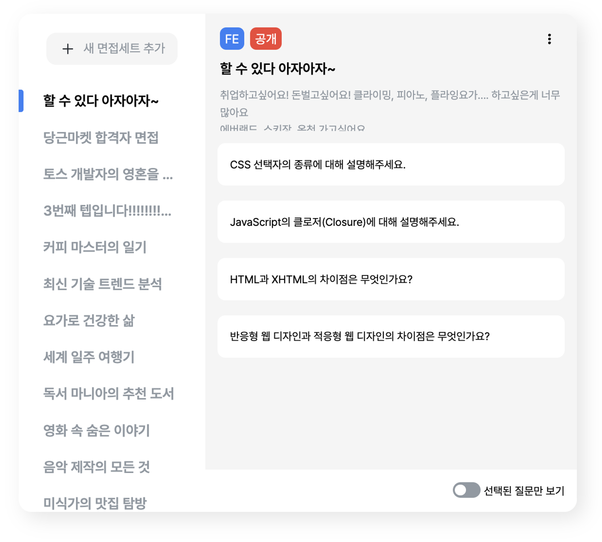

## 문제점 발견

곰터뷰 프로젝트가 끝나고 리팩토링 및 추가 수정 사항들을 수정하다 설정 페이지에서 문제를 선택하는 컴포넌트를 수정하다 마주친 상황이었습니다.



해당 컴포넌트에서는 보이지 않지만 3개의 관심사가 존재합니다.

1. 에러가 났을 때 관심사
2. 데이터가 비어있을 때 관심사
3. 데이터 로딩에 대한 관심사

컴포넌트 상에서 모두 표현을 해주면 다음과 같은 구조로 이루어지게 됩니다.

```tsx
const { data, isLoading, isError } = useQuery();

if (!data) {
  return <EmptyComponent />;
}

if (isLoading) {
  return <LoadingComponent />;
}

if (isError) {
  return <ErrorComponent />;
}

return <Component />;
```

보통은 이런 구조로 자리 잡지만 뭔가 아쉬웠습니다. 짧은 경우 괜찮았지만 구조가 복잡해질수록 해당 컴포넌트에 대한 코드들이 어떻게 이루어져 있는지 알아보기 힘들었습니다.

<br/>

Suspense 컴포넌트를 사용하면 Loading이라는 관심사를 Suspense에 줄 수 있고 선언적으로 처리를 담당할 수 있습니다. 비슷하게 해당 프로젝트에서는 ErrorBoundary도 사용하고 있었습니다. 이는 컴포넌트 구조와 상관없이 Error와 Loading을 상위 컴포넌트에 던져 주어 현재 내가 관리하고 싶은 컴포넌트에서는 이를 신경 쓰지 않아도 되고 있었죠.

<br/>

그래서 위의 코드에서 loading과 error에 대한 처리는 해당 컴포넌트가 아닌 새로운 컴포넌트로 위임할 수 있습니다.

<br/>

데이터가 비어있을 때 다음과 같이 비어있다는 화면을 보여주어야 하는데 이 또한 비슷한 방법으로 처리하면 3개의 관심사가 잘 분리가 되지 않을까 생각하였습니다.


## 목표 설정

아이디어는 Suspense와 ErrorBoundary처럼 상위 컴포넌트를 감싸기만 하면 감싸인 위치에 맞게 Empty 컴포넌트가 렌더링 되도록 하는 것이 목표였습니다.

```tsx
<ErrorBoundary fallback={}>
	<Suspense fallback={}>
		<EmptySuspense fallback={}>
			<Component/>
		</EmptySuspense>
	</Suspense>
</ErroBoundary>

// 이런 식으로 말이죠.
```

## 상태를 throw 하는 방식으로 접근하자

Suspense와 ErrorBoundary의 특징은 하위 컴포넌트에서 throw 하면 상위 컴포넌트에서 catch를 한다는 특징이 있습니다. 똑같은 방법으로 빈값일 때 하위에서 throw 하고 상위 컴포넌트에서 catch 하는 방식으로 하면 어떨까? 생각하며 접근하였습니다.

<br/>

저는 이를 위해 contextAPI를 사용했는데요. custom hook과 custom component를 이용하고 로직을 캡슐화 하고 사용할 때는 실제 상위컴포넌트에 비어있다고 알려주어 빈 컴포넌트를 렌더링하도록 하였습니다.

<br/>

제가 contextAPI를 사용한 이유는 다음과 같습니다.

1. 여러 개가 중첩해 있을 때 가장 하위에 있는 Provider가 적용된다.
2. 여러 개의 Provider를 사용하더라도 독립적으로 작동한다.
3. 다른 라이브러리에 의존성이 없다.

### 1. 여러 개가 중첩해 있을 때 가장 하위에 있는 Provider가 적용된다.

EmptySuspense는 하나의 페이지에서 여러 개가 사용될 수 있습니다. 그에 맞는 계층 구조도 생길 수 있죠. 여러 개의 컴포넌트가 중첩되더라도 가장 가까운 컴포넌트가 반응해야 하는데요. contextAPI를 사용하면 이를 가능하게 해 줍니다.

```tsx
// By ChatGPT4.0
import React, { createContext, useState } from 'react';

// Context 생성
const MyContext = createContext();

// App 컴포넌트
function App() {
  return (
    <div>
      <OuterProvider />
    </div>
  );
}

// 외부 Provider 컴포넌트
function OuterProvider() {
  const [value, setValue] = useState('Outer Value');

  return (
    <MyContext.Provider value={value}>
      {/* 중첩된 Provider를 포함한 어떤 컴포넌트 */}
      <div>
        <p>Outside the Nested Provider</p>
        <ConsumerComponent />
        {/* 내부 Provider */}
        <InnerProvider />
      </div>
    </MyContext.Provider>
  );
}

// 내부 Provider 컴포넌트
function InnerProvider() {
  const [value, setValue] = useState('Inner Value');

  return (
    <MyContext.Provider value={value}>
      <div>
        <p>Inside the Nested Provider</p>
        <ConsumerComponent />
      </div>
    </MyContext.Provider>
  );
}

// Context 값을 소비하는 컴포넌트
function ConsumerComponent() {
  return <MyContext.Consumer>{(value) => <div>Context Value: {value}</div>}</MyContext.Consumer>;
}

export default App;
```

해당 코드를 보면 2개의 중첩된 context가 있음에도 불구하고 가장 마지막에 있는 Provider의 값을 사용하게 됩니다.

### 2. 여러 개의 Provider를 사용하더라도 독립적으로 작동한다.

EmptySuspense는 하나의 페이지에서 여러 개가 사용할 수 있습니다. 독립적이지 않다면 하나의 값이 변경되면 모든 empty가 동시에 변경이 되는 일이 생길 수 있습니다.

하지만 contextAPI는 하나의 context에 대해서 여러 개의 Provider가 있더라도 주입하는 state가 독립적이기 때문에 같은 context를 사용하더라도 다 다른 독립적인 값으로 작동합니다.

```tsx
// By ChatGPT4.0

import React, { createContext, useState } from 'react';

const UserContext = createContext();

function ProviderA({ children }) {
  const [user, setUser] = useState({ name: 'User A' });

  return <UserContext.Provider value={user}>{children}</UserContext.Provider>;
}

function ProviderB({ children }) {
  const [user, setUser] = useState({ name: 'User B' });

  return <UserContext.Provider value={user}>{children}</UserContext.Provider>;
}

function ConsumerComponent() {
  return (
    <UserContext.Consumer>{(user) => <div>Current User: {user.name}</div>}</UserContext.Consumer>
  );
}

// App 컴포넌트에서는 ProviderA와 ProviderB를 사용
function App() {
  return (
    <div>
      <ProviderA>
        <ConsumerComponent /> {/* 'User A' 출력 */}
      </ProviderA>
      <ProviderB>
        <ConsumerComponent /> {/* 'User B' 출력 */}
      </ProviderB>
    </div>
  );
}
```

### 3. 다른 라이브러리에 의존성이 없다.

React API의 기능을 사용해서 다른 라이브러리에 의존하지 않아 타 라이브러리에 대응할 일이 없습니다. 따라서 한번 만들어두면 버그가 있지 않는 한 수정 없이 오래 사용할 수 있습니다.

## 구현

간단합니다. 만약 하위에서 전파받은 데이터가 있으면 callback으로 들어오는 컴포넌트를 보여주고 남은 게 없다면 기존의 것을 렌더링하는 방식입니다.

```tsx
import React, { createContext, useRef, useState } from 'react';

type EmptySuspenseProps = {
  children: React.ReactNode;
  callback: React.ReactNode;
};

export const EmptyContext = createContext({
  isEmpty: false,
  setIsEmpty: (isEmpty: boolean) => {}
});

const EmptySuspense: React.FC<EmptySuspenseProps> = ({ children, callback }) => {
  const [isEmpty, setIsEmpty] = useState(false);

  return (
    <EmptyContext.Provider value={{ isEmpty, setIsEmpty }}>
      {isEmpty ? callback : children}
    </EmptyContext.Provider>
  );
};

export default EmptySuspense;
```

그러면 하위 컴포넌트에서는 이 isEmpty라는 값을 조정해 주어야 합니다. 저는 이것을 custom hook을 이용해서 작성했는데요

```tsx
import { EmptyContext } from '@foundation/EmptySuspense/EmptySuspense';
import { useContext, useEffect } from 'react';

const useEmptySuspenseEffect = (data: unknown) => {
  const { setIsEmpty } = useContext(EmptyContext);

  useEffect(() => {
    const isEmpty = data === null || (Array.isArray(data) && data.length === 0);
    setIsEmpty(isEmpty);
  }, [data, setIsEmpty]);
};

export default useEmptySuspenseEffect;
```

상위에서 주입받은 context를 데이터가 변경할 때마다 체크해서 상위의 context에 state를 변경하는 로직입니다. 정말 간단하죠. 단순히 상위의 state를 변경시킬 뿐 입니다.

## 사용법

```tsx
const useCategoryQuery = () => {
  const result = useQuery({
    queryKey: QUERY_KEY.CATEGORY,
    queryFn: getCategory
  });

  useEmptySuspenseEffect(result.data);
};
```

```tsx
<EmptySuspense callback={<QuestionTabPanelBlank />}>
  <QuestionAccordionList
    isEditMode={isEditMode}
    cancelEditMode={() => setIsEditMode(false)}
    workbookInfo={workbookInfo}
    onlySelectedOption={onlySelectedOption}
  />
</EmptySuspense>
```

단순히 다음과 같이 API로 받은 데이터나 아니면 가공하고 난 후의 데이터를 `useEmptySuspenseEffect`를 이용해서 empty가 발생했다고 알려주면 됩니다. 그다음 적절한 곳에 EmptySuspense를 감싸주면 해당 부분은 empty 컴포넌트가 렌더링 될 것입니다.

## 추가 구현

하지만 하나의 문제점이 있습니다. Suspense 같은 경우는 비동기 처리에 대한 작업이니 비동기 작업이 끝나면 then을 통해서 비동기 작업에 대한 결괏값이 실행됩니다. 즉 로딩이 끝나면 다시 Suspense의 children이 렌더링이 되는 것이죠.

<br/>

ErrorBoundary도 마찬가지입니다. 하위에서 받은 Error를 해결했다고 알리는 `const { resetBoundary } = useErrorBoundary();` 라는 hook이 존재합니다.

<br/>

반면에 지금 만든 EmptySuspense의 경우에는 한번 Empty가 되어버리면 이를 해소하기 위해서는 컴포넌트를 다시 mount 해서 계산하는 것이 유일한 방법입니다. 그래서 empty 상태를 다시 계산하기 위한 옵션을 추가했습니다.

```tsx
import React, { createContext, useRef, useState } from 'react';

type EmptySuspenseProps = {
  children: React.ReactNode;
  callback: React.ReactNode;
  trigger?: boolean;
};

export const EmptyContext = createContext({
  isEmpty: false,
  setIsEmpty: (isEmpty: boolean) => {}
});

const EmptySuspense: React.FC<EmptySuspenseProps> = ({ children, callback, trigger }) => {
  const [isEmpty, setIsEmpty] = useState(false);
  const prevTriggerRef = useRef(trigger); // 이전 trigger 값 저장

  if (prevTriggerRef.current !== trigger) {
    setIsEmpty(false); // trigger 값이 변경되었을 때만 isEmpty 상태 업데이트
    prevTriggerRef.current = trigger; // 현재 trigger 값을 이전 값으로 업데이트
  }

  return (
    <EmptyContext.Provider value={{ isEmpty, setIsEmpty }}>
      {isEmpty ? callback : children}
    </EmptyContext.Provider>
  );
};

export default EmptySuspense;
```

trigger로 지정되는 값이 이전 상태와 다르다면 children으로 다시 렌더링을 진행합니다. 만약 여기서 또 빈 데이터가 도출된다면 다시 empty 컴포넌트를 보여주겠죠.

## 결론

실제 프로젝트에서 다음과 같이 사용하고 있습니다.


선택된 질문만 보기의 상태를 trigger로 넘겨 toggle 옵션이 클릭 될 때마다 데이터의 반값을 다시 계산하도록 하였습니다.

```tsx
<EmptySuspense callback={<QuestionTabPanelBlank />} trigger={onlySelectedOption}>
  <QuestionAccordionList
    isEditMode={isEditMode}
    cancelEditMode={() => setIsEditMode(false)}
    workbookInfo={workbookInfo}
    onlySelectedOption={onlySelectedOption}
  />
</EmptySuspense>
```

```tsx
// QuestionAccordionList 컴포넌트 중 일부

import useEmptySuspenseEffect from '@hooks/useEmptySuspenseEffect';

...
const questionData = onlySelectedOption ? selectedQuestions : questionAPIData;
// toggle 버튼에 따라서 어떤 데이터를 보여줄 것인지 선택

useEmptySuspenseEffect(questionData);
// 해당 데이터에 대해서 반값이라면 EmptySuspense에 callback을 실행하는 effect

...
```

이제 Suspense와 ErrorBoundary까지 함께 사용하니 컴포넌트 안에는 해당 컴포넌트에 대한 책임만 남아있고 선언적으로 프로그래밍이 되어 어떤 구조로 어느 구역에 렌더링 되는지 쉽게 알 수 있습니다.

<br/>

또한 Empty 컴포넌트는 내부 구조와 상관없이 어느 컴포넌트까지 교체해서 보여주는지 쉽게 설정할 수 있습니다. 지금은 QuestionAccordionList라는 위치에서 빈 컴포넌트를 보여주지만, 만약 더 상위 컴포넌트까지 이 컴포넌트를 보여주고 싶으면 단순하게 EmptySuspense의 위치만 옮겨주면 됩니다.

```tsx
<EmptySuspense callback={<QuestionTabPanelBlank />} trigger={onlySelectedOption}>
  // ... 여러 개의 컴포넌트 ...
  <QuestionAccordionList
    isEditMode={isEditMode}
    cancelEditMode={() => setIsEditMode(false)}
    workbookInfo={workbookInfo}
    onlySelectedOption={onlySelectedOption}
  />
  // ...여러 개의 컴포넌트 ...
</EmptySuspense>
```
