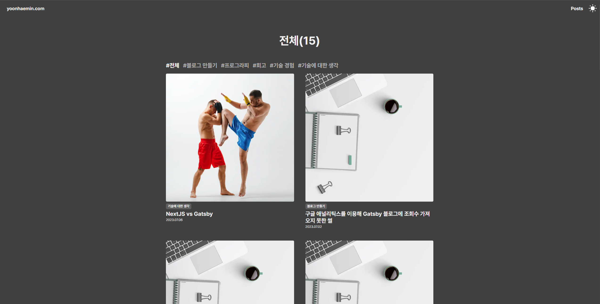
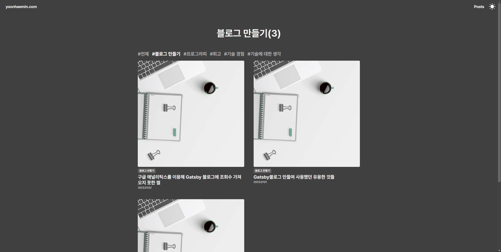

나만의 블로그를 만들어 보기가 일차적으로 끝이 났습니다. 진짜 내가 익혀보고 싶은 것들을 마구마구 넣을 수 있는 공간을 만드니 기분이 좋네요. 열심히 학습 및 경험을 정리하는 공간으로 만들어 보겠습니다.

## 구현 중 고려사항

라우팅을 구성하면서 root path에서 tag path랑 똑같이 보여주는 것은 ‘직관적이지 않은 라우팅 설계이다’라고 생각했습니다. 처음 설계한 것은 root path에 모든 게시글을 불러오고 tag/[name] path에 해당 주제의 게시글을 불러오도록 설계했습니다.

하지만 두 페이지는 내용만 다를 뿐 같은 구조로 되어 있었죠. 이는 코드상에서도 같은 코드를 사용하지만, 다른 파일에 중복되어 있었습니다. 또한 URL의 의미상 전체 게시글을 보는 페이지는 아무것도 없는 root path보다 tag/all이 더 정확하다고 생각하여 모든 게시글을 보여주는 페이지는 tag/all로 이동하였고 메인페이지를 새로 만들었습니다.

## 유저 피드백

개발하면서 가장 중요하게 생각했던 건 사용자에게 나쁜 경험을 주지 말자는 것이었습니다. 피그마에서는 구현하지 못한 사용자 피드백에 대한 내용도 추가하며 모든 액션에 사용자의 반응을 넣어주어서 최대한 사용자가 이 버튼이나 의도가 무엇인지 알도록 하려고 노력했습니다.

- 게시글 hover 시 이미지 확대 및 밑줄 처리로 hover 반응 피드백해 주기
- 메인 로고나 Posts hover 시 언더라인 밑줄로 피드백해 주기
- 게시글 스크롤 시 진행도를 나타내는 progress bar 생성해 주기
- 태블릿 및 휴대폰 반응형 제작하기
- 깃허브 Gmail 링크드인 등 아이콘 버튼에 tooltip 표시

## 아쉬운 점

첫 번째로는 예기치 않게 메인과 블로그를 구별하다 보니까 메인에 기획 및 디자인적 요소를 추가할 수 없었다는 점이 아쉬웠습니다. 특히 메인페이지에 제가 생각한 것보다 텅 빈 느낌이라 무언가를 인터랙티브 한 재미있는 요소를 추가하지 못한 점이 아쉽습니다.

 

두 번째로는 dynamic file router 부분입니다. typescript 동적 파일 라우팅을 사용하려다 보니 파싱 에러를 마주하게 되었는데요 해결 방법으로 TS 대신 해당 파일만 JS를 사용하는 방법과 gatsby-node에서 createPages 매서드를 사용해 페이지를 생성하는 방법이라는 선택 길에 놓이게 되었습니다.

저는 JS로 낮춰서 해결하는 방법을 선택했지만 VSC에서 한 프로젝트 내에 typescript와 Javascript의 코드 자동완성이 지원되지 않았습니다. 한두 번 검색을 해보고 설정 방법을 알 수 없어서 그냥 진행했었는데 이게 생각보다 많은 오류와 불편함을 동반했었습니다. 이 점을 그냥 묻힌 상태로 진행했다는 점이 좀 아쉽습니다. 실제로 해결하고 했었으면 개발 능률이 더 올라가지 않았나 싶네요.

## 더 해보고 싶은 점

첫 번째로는 RSS를 추가해 보고 싶습니다. 아직 RSS가 뭔지도 잘 모르고 키워드만 아는 상태라 직접 적용해 보면서 RSS에 대해서 알아보고 싶습니다.

 

두 번째로는 PWA를 추가해 보고 싶습니다. 지금 PWA는 progressive web app의 약자로 모바일에서 웹 애플리케이션이 네이티브 앱과 비슷한 경험을 주는 것을 의미하는 거로 알고 있습니다. PWA도 직접 구현해 보면서 앱 환경에서도 제 공간을 만들며 점차 PWA에 대해서 알아보고 싶습니다.

 

세 번째로는 메인페이지를 리뉴얼하는 것입니다. 메인페이지에 처음 기획했던 내용이 기술적 한계에 부딪혀 실패하게 되었습니다. 시간적 여유가 된다면 인터렉티브 하게 꾸며보고 싶습니다.

## 기타 (포스팅 어투 변경)

기존에 블로그 글은 ~하다의 평어체를 사용했습니다. 나만의 공간에서는 경어체로 사용하며 사적으로 자유도가 높게 사용하는 게 맞는다고 생각했었죠. 그렇게 몇 개의 블로그 글을 포스팅하다 보니 글을 나에게 맞출 수는 있지만 글 자체는 자연스럽게 이어져서 읽힌다는 것보다는 진짜 내 생각을 메모한 느낌이라고 생각했습니다. 블로그에 포스팅하는 것은 내 생각을 “표현”하자 인데 표현에 있어서 평어체가 맞지 않다고 생각하여 경어체를 사용해 볼까 합니다.
