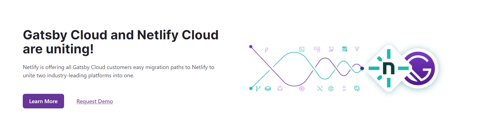
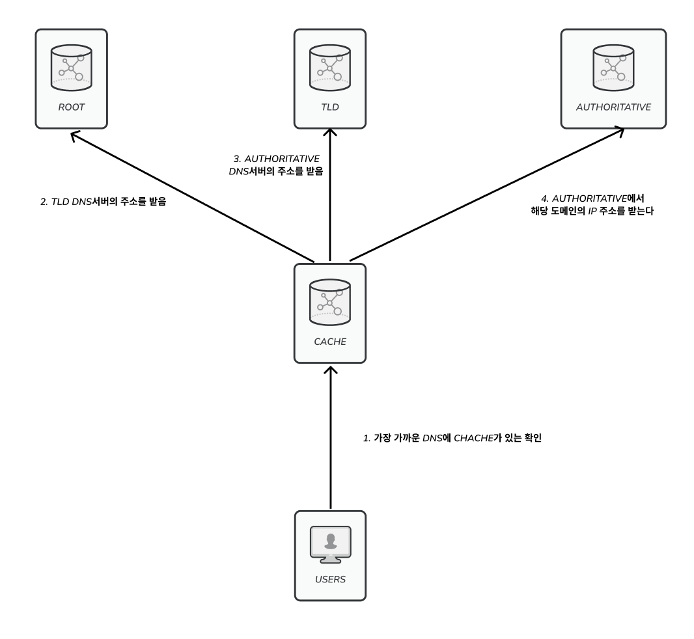
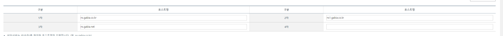
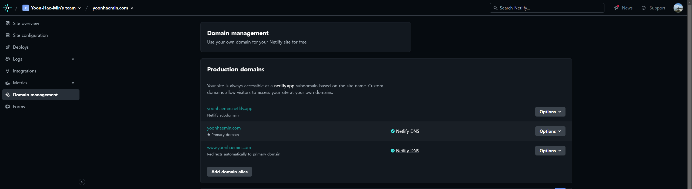
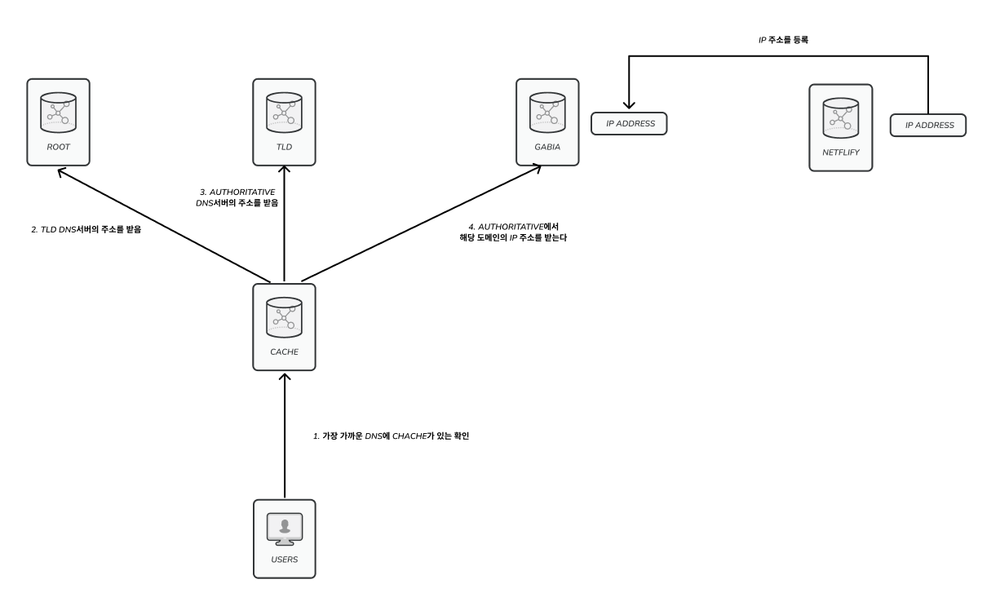
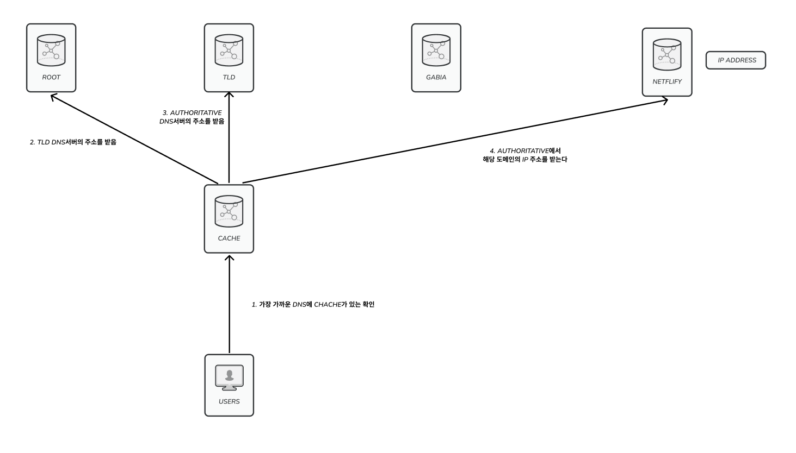
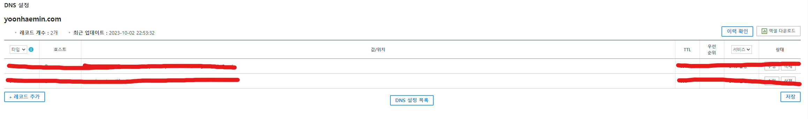
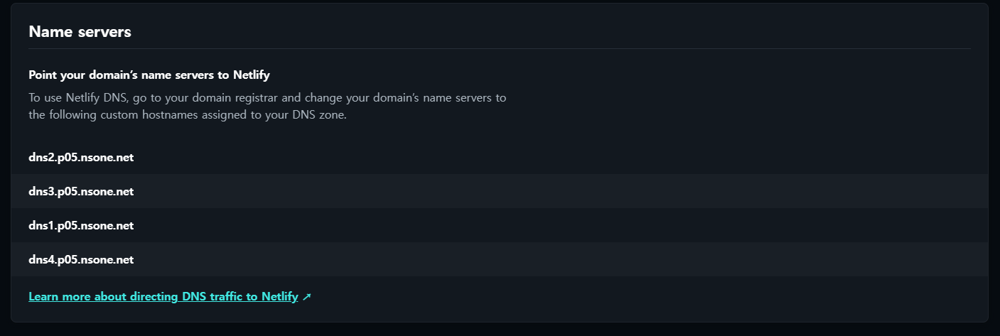
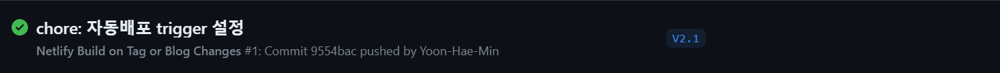
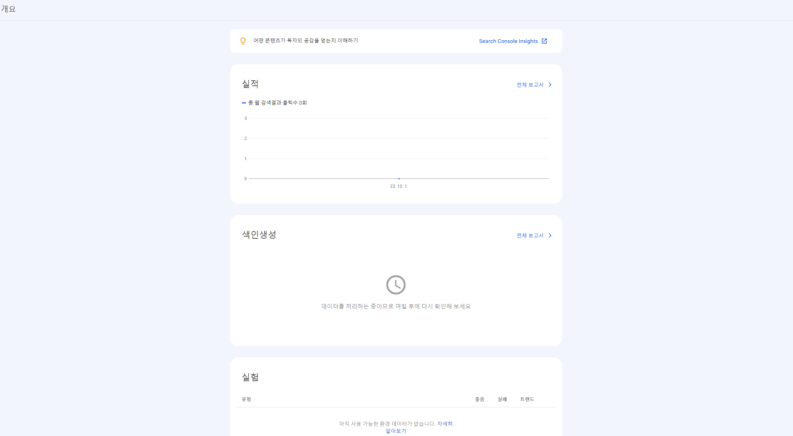

## 동기

기존에 빠르고 편하게 호스팅하려고 Github page를 사용하여 호스팅 하고 있었습니다. 하지만 도메인 뒤에 '.github.io' 붙는 게 싫었고 추가로 내가 build trigger를 만들거나 다른 설정 로그 등 추가적인 기능이 부족했기에 이번 기회에 나만의 도메인을 추가하면서 호스팅 서비스를 옮기기로 했습니다.

<br/>

제가 추가하고 싶었던 것은 다음과 같았습니다.

1. https 적용이 가능해야 한다.
2. build trigger가 가능해야 한다. (release 노트를 작성하거나 게시글이 작성되었을 때 자동으로 build가 되어야 한다)
3. custom domain을 설정할 수 있어야 한다.

가장 먼저 생각난 것이 AWS였는데 AWS를 사용하기에는 정적인 페이지를 띄우는데 너무 많은 설정과 비용이 들어간다는 점때문에 선택하지 않았고 제 블로그의 특성에 맞게끔 다른 호스팅 방법을 찾아보기로 하였습니다.



Gatsby에서는 Netlify를 추천하고 있었습니다.

<br/>

Netlify를 보니 Github page처럼 자동으로 빌드 후 배포를 해주었고 dashboard 제공 및 빌드 과정을 볼 수 있고 GUI를 이용해서 다양한 설정을 커스텀할 수 있다는 점과 webhook을 이용해서 제가 하고 싶었던 build trigger 또한 할 수 있었습니다. 따라서 Netlify를 사용해서 호스팅하기를 결정했습니다.

## custom domain 설정하기

도메인은 사실상 하나의 이름에 불과합니다. 실제로 접속할 때는 IP를 이용해서 접속하므로 도메인을 IP로 바꾸는 과정이 필요하죠. 즉 DNS를 이용해서 IP로 변환하는 과정이 필요합니다.



이렇게 DNS 서버에서 IP 주소를 받아오면 해당 IP로 접속을 하는것이죠. 우리가 이 custom domain을 등록해 사용하려면 여기서 네임 서버(authoritative)의 DNS 설정이 필요합니다.

<br/>

현재 제 블로그는 가비아에서 [yoonhaemin.com](https://yoonhaemin.com) 도메인을 구입하였습니다. 가비아에서 아무 설정 없이 사용한다면 [yoonhaemin.com](https://yoonhaemin.com) 도메인은 가비아 네임 서버에 등록이 되어있습니다.



호스팅은 Netlify에서 하고 있고 Netlify에서는 빌드된 결과물을 가지고 자체적인 도메인(yoonhaemin.netlify.app)으로 호스팅 되어 있습니다. 즉 해당 도메인은 Netlify의 네임 서버에 등록이 되어 있는 것이죠.

<br/>

제가 해주어야 할 부분은 내가 구입한 [yoonhaemin.com](https://yoonhaemin.com)을 들어갔을 때 Netlify의 빌드 결과로 들어갈 수 있게끔 바꾸어 주어야 하는 것입니다.

<br/>

Netlify에서는 이를 편하게 지원하기 위해서 domain management가 있습니다.



해당 페이지에서 add domain으로 내가 산 도메인을 추가하여 등록할 수 있습니다. Netlify에 해당 도메인을 쓰도록 추가를 해줍니다.

그다음은 네임 서버에서 내 도메인의 IP를 가져올 때 Netlify에서 빌드한 IP를 가져오게 해야 합니다. 여기서 방법이 2가지가 있는데요. 첫 번째는 내가 구매한 도메인의 네임 서버 (가비아)에서 내 서비스 IP(netlify 호스팅 IP)를 등록해 IP주소를 바로 주는 방법이 있고



두 번째로는 [yoonhaemin.com](http://yoonhaemin.com)이라는 DNS를 검색할 때 네임 서버를 내가 구매한 도메인의 네임 서버(가비아)로 가는 게 아니라 Netlify의 네임 서버로 가게 하는 방법입니다.



첫 번째 방법은 가비아의 DNS 레코드 설정으로 레코드에 직접 IP address를 집어넣어서 사용할 수 있고 두 번째 방법은 가비아의 네임 서버 변경을 통해서 설정할 수 있습니다.




저는 네임 서버 자체를 바꾸는 방법을 선택했는데요. 도메인을 Netflify로 통합시키는게 관리하기 좀 더 수월하기 때문입니다.

Netflify에서 어떤 네임 서버로 등록하라고 안내해 주는데 해당 사항 그대로 가비아에 입력하면 됩니다.



Netflify에 네임 서버를 등록하면 자동으로 도메인들의 레코드를 추가해 줍니다.

설정이 끝난다면 해당 도메인에 대한 정보를 전 세계로 전파해 DNS서버에 등록하는데요 이 과정이 끝나면 Netflify에서 자동으로 https를 인증해 줍니다. 그러면 이제 [yoonhaemin.com](http://yoonhaemin.com)이라는 사이트로 접속이 가능해집니다.

## webhook 설정하기

기존의 Github page 빌드는 로컬에서 수동으로 deploy 스크립트를 이용하여 배포하고 있었습니다. 이는 매우 귀찮았고 가끔 까먹는 경우도 생겼습니다. 따라서 2가지 트리거를 통해 자동으로 배포가 되게끔 만들어 보고자 하였습니다.

1. 게시글이 작성되면 자동으로 build 해서 배포가 되어야 한다.
2. 새로운 기능이 release가 되면 자동으로 build 해서 배포가 되어야 한다.

Netflify에서는 webhook으로 build 후 재배포를 트리거해줄 수 있었는데요. Github Action와 webhook을 이용해서 두 개의 조건에 대해 배포하도록 만들어 보기로 하였습니다.

```yaml
name: Netlify Build on Tag or Blog Changes

on:
  push:
    paths:
      - 'blog/**'
    tags:
      - '*'

jobs:
  build:
    runs-on: ubuntu-latest
    steps:
      - name: Netlify Webhook
        run: curl -X POST ${{ secrets.NETLIFY_WEBHOOK_URL }}
```

굉장히 간단하게 짤 수 있었는데요. blog 폴더에 변경 사항이 생기거나 tag를 생성해서 release를 할 상황에 해당 webhook을 실행시켜 자동으로 재배포가 되게끔 설정하였습니다.



## 마무리

네트워크 지식이 이렇게 쓰이니 뭔가 신선하였습니다. 도메인 가격은 조금 나가지만 진짜 나만의 공간을 구축한 것 같아서 기분은 좋습니다. 하지만 구글 콘솔에 색인을 다시 만들어야 하다니.... 블로그가 다시 백지가 되었습니다


