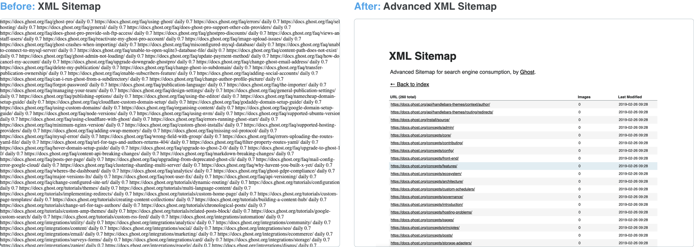

# 구글 서치 콘솔

내가 만든 사이트를 구글 검색엔진에 등록해서 검색되게끔 도와주는 서비스이다. 또한 등록과 더불어서 사용자가 구글 검색으로 얼마만큼 노출이 되었고 얼마만큼 클릭하였는지 통계도 보여준다.
특히 페이지에서 모바일 경험 측정과 색인 생성을 통해서 알림도 주는 기능이 있다.

**[https://search.google.com/search-console?hl=ko](https://search.google.com/search-console?hl=ko)**

# 네이버 서치 어드바이저

내가 만든 사이트를 네이버 검색 엔진에 등록해서 검색되게끔 도와주는 서비스이다. 또한 URL 진단으로 사이트 관리에서 필요한 진단 리포트를 제공해 주기도 한다. 개인적으로 리포트 관련 항목은 구글 서치가 기능 및 분석을 더 잘해주는 것 같다.

https://searchadvisor.naver.com/

# 다음 검색 등록

내가 만든 사이트를 네이버 검색 엔진에 등록해서 검색되게끔 도와주는 서비스이다. 네이버나 구글처럼 따로 리포트 기능은 없고 등록만 해준다.

https://register.search.daum.net/index.daum

# Gatsby 플러그인

Gatsby를 이용해 블로그를 구성할 때 많은 플러그인과 툴을 사용했었다. 이러한 플러그인 사용 덕분에 편리하게 기능을 만들 수 있었다.

## 1. `gatsby-plugin-google-gtag`

기존 티스토리 블로그에서는 방문자 집계 및 조회수와 분석까지 다 해주었지만, 블로그를 직접 만들려면 방문자 수 및 조회수와 분석을 직접 연결해야 한다.

이를 위해서 구글 애널리틱스를 사용하였는데 Gatsby 서비스를 연결하려면 플러그인을 사용해야 했다. `gatsby-plugin-google-analytics`라는 플러그인도 있으나 관리가 중단되어 gtag 플러그인을 쓰라고 한다.

```jsx
{
      resolve: 'gatsby-plugin-google-gtag',
      options: {
        trackingIds: ['G-00000000000']
      }
    },
```

다음과 같이 설정하면 구글 애널리틱스가 내 서비스에 대해서 집계를 하기 시작한다.

## 2. `gatsby-plugin-advanced-sitemap`



기존의 XML sitemap은 내 sitemap이 적용이 제대로 되었는지 보기 힘들다 하지만 `gatsby-plugin-advanced-sitemap`을 이용한다면 내 사이트의 sitemap이 등록이 잘되어있는지 깔끔하게 보여준다. sitemap이 이상 없는지 확인할 때 좋다.

## 3. `gatsby-plugin-mdx`

mdx, md파일에 블로그 글을 작성하고 코드상에 해당 파일의 정보를 가져오려면 사용해야 하는 플러그인이다. CommonMarkdown을 지원하고 있다.

```jsx
module.exports = {
  plugins: [
    `gatsby-plugin-mdx`,
    {
      resolve: `gatsby-source-filesystem`,
      options: {
        name: `pages`,
        path: `${__dirname}/src/pages`
      }
    }
  ]
};
```

간단하게 플러그인을 추가하면 되지만 github MD 파일처럼 마크다운의 문법이 다른 경우에는 인식하지 못한다는 문제가 있다. 나 같은 경우에는 MD 파일에서 표를 사용했었는데 이 표를 나타내는 문법이 CommonMarkdown이 아니다. 따라서 4-1 소개처럼 추가적인 라이브러리를 사용하였다.

MDX 파일을 읽어오면 문법에 맞춰서 html tag로 묶어준다. 즉 MDX 파일을 스타일링하고 싶으면 따로 해당 태그들의 스타일을 정의하는 컴포넌트가 필요하다 나는 ChakraUI를 사용하고 있었고 `@mdx-js/react`의 MDXProvider를 이용해서 태그별로 스타일링을 한 후 이를 적용시켰다.

```jsx
import {
  Box,
  Heading,
  HeadingProps,
  Image,
  Link,
  LinkProps,
  Text,
  TextProps
} from '@chakra-ui/react';
import { MDXProvider } from '@mdx-js/react';
import React, { ReactNode } from 'react';

const components = {
  h1: (props: HeadingProps) => <Heading size="2xl" mt={'3rem'} mb={'1.5rem'} {...props} />,
  h2: (props: HeadingProps) => <Heading size="xl" mt={'3rem'} mb={'1.5rem'} {...props} />,
  h3: (props: HeadingProps) => <Heading size="lg" mt={'3rem'} mb={'1.5rem'} {...props} />,
  h4: (props: HeadingProps) => <Heading size="md" mt={'3rem'} mb={'1.5rem'} {...props} />,
  h5: (props: HeadingProps) => <Heading size="sm" mt={'3rem'} mb={'1.5rem'} {...props} />,
  h6: (props: HeadingProps) => <Heading {...props} />,
  a: (props: LinkProps) => <Link color="blue.300" fontWeight={500} {...props} />,
  p: (props: TextProps) => <Text as="p" lineHeight="1.9" fontSize="1.2rem" {...props} />,
  ul: (props: Object) => (
    <Box
      as="ul"
      sx={{
        '* > ul': {
          margin: 0,
          marginLeft: '1.6rem'
        }
      }}
      fontSize="1.2rem"
      lineHeight="1.6"
      {...props}
    />
  ),
  ol: (props: Object) => (
    <Box as="ol" fontSize="1.2rem" lineHeight="1.6" listStylePosition="inside" {...props} />
  ),
  li: (props: Object) => (
    <Box
      as="li"
      sx={{
        '* > ul': {
          margin: 0,
          marginLeft: '1.6rem'
        },
        '> p': {
          display: 'inline'
        }
      }}
      my={'1.2rem'}
      fontSize="1.2rem"
      listStylePosition="inside"
      {...props}
    />
  ),
  blockquote: ({ ...props }) => {
    const { children } = props;
    return (
      <Box
        as="blockquote"
        textAlign="start"
        borderRadius="0.4rem"
        my="1.2rem"
        _light={{
          bg: 'gray.100',
          borderLeft: '0.4rem solid',
          borderColor: 'gray.500'
        }}
        _dark={{
          bg: 'gray.900',
          borderLeft: '0.4rem solid white'
        }}
        {...props}
      >
        <Box p="0.5rem 1rem">{children}</Box>
      </Box>
    );
  },
  img: (props: Object) => <Image {...props} margin="1.8rem auto" />
};

const MarkDownProvider = ({ children }: { children: ReactNode }) => {
  return <MDXProvider components={components}>{children}</MDXProvider>;
};

export default MarkDownProvider;
```

### 3-1 `remark-gfm`

```jsx
resolve: 'gatsby-plugin-mdx',
      options: {
        extensions: [`.mdx`, `.md`],
        mdxOptions: {
          remarkPlugins: [remarkGfm]
        },
}
```

다음과 같이 remarkPlugins를 적용해서 추가적인 문법을 지원하게 할 수 있다.

https://github.com/gatsbyjs/gatsby/blob/master/examples/using-mdx/gatsby-config.mjs#L36

다만 이 라이브러리는 module 파일로 정의해야 하기 때문에 `gatsby-config.js` 파일을 `gatsby-config.mjs`로 수정해야 한다.

### 3-2 `gatsby-remark-gifs` `gatsby-remark-images`

md파일에 이미지와 gif 파일을 지원하기 위해서 추가하였다. gatsbyRemarkPlugins 옵션을 이용해서 gtsby-remark-\* 플러그인을 넣을 수 있다.

```jsx
{
      resolve: 'gatsby-plugin-mdx',
      options: {
        extensions: [`.mdx`, `.md`],
        mdxOptions: {
          remarkPlugins: [remarkGfm]
        },
        gatsbyRemarkPlugins: [
          'gatsby-remark-gifs',
          {
            resolve: `gatsby-remark-images`,
            options: {
              maxWidth: 1200,
              wrapperStyle: 'margin: 1.8rem auto;',
              showCaptions: true
            }
          }
				]
			}
}
```

### 3-3 `gatsby-remark-prismjs`

md파일에 있는 코드의 하이라이팅을 위해서 사용하였다.

https://github.com/PrismJS/prism/tree/1d5047df37aacc900f8270b1c6215028f6988eb1/themes

해당 테마들을 적용해서 코드의 하이라이팅을 구현할 수 있다.

```jsx
{
      resolve: 'gatsby-plugin-mdx',
      options: {
        extensions: [`.mdx`, `.md`],
        mdxOptions: {
          remarkPlugins: [remarkGfm]
        },
        gatsbyRemarkPlugins: [
          'gatsby-remark-gifs',
          {
            resolve: `gatsby-remark-images`,
            options: {
              maxWidth: 1200,
              wrapperStyle: 'margin: 1.8rem auto;',
              showCaptions: true
            }
          },
					{
            resolve: `gatsby-remark-prismjs`,
            options: {
              classPrefix: 'language-',
              inlineCodeMarker: null,
              aliases: {},
              showLineNumbers: false,
              noInlineHighlight: false,
              languageExtensions: [
                {
                  language: 'superscript',
                  extend: 'javascript',
                  definition: {
                    superscript_types: /(SuperType)/
                  },
                  insertBefore: {
                    function: {
                      superscript_keywords: /(superif|superelse)/
                    }
                  }
                }
              ],
              prompt: {
                user: 'root',
                host: 'localhost',
                global: false
              },
              escapeEntities: {}
            }
          }
				]
			}
}
```

만약 이게 싫다면 플러그인이 아닌 코드 강조 라이브러리를 찾아서 MDX 스타일링시에(MDXProvider) 적용하도록 해야 한다.
