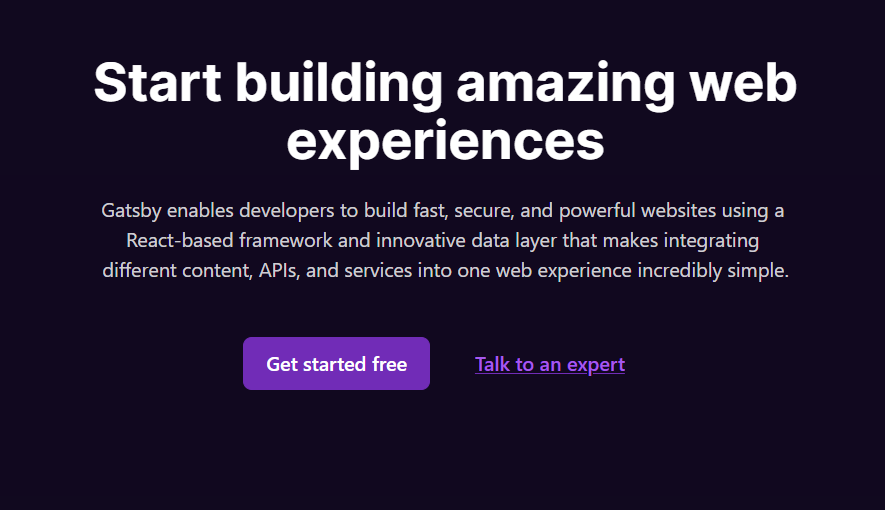
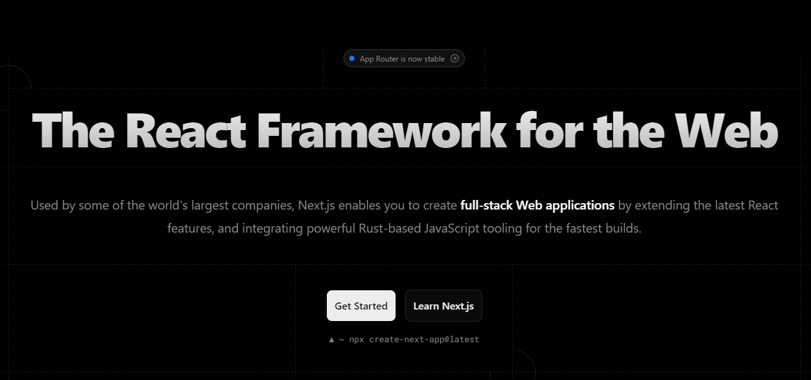
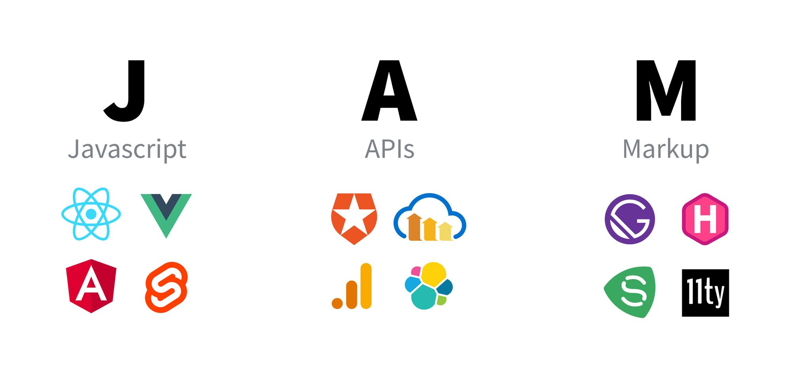
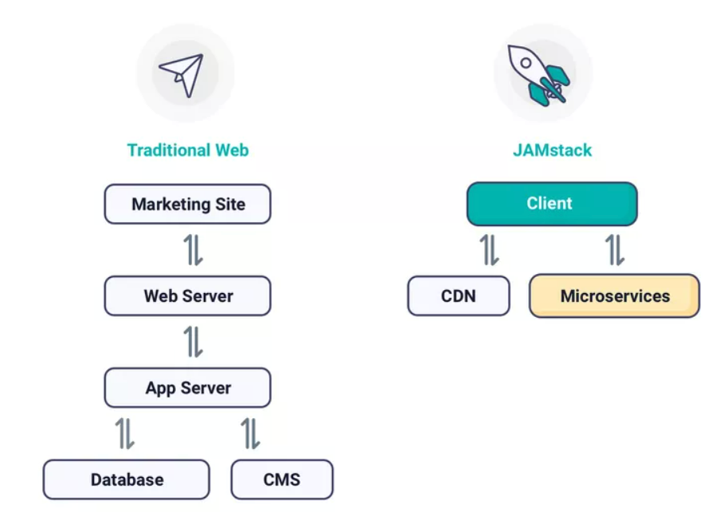
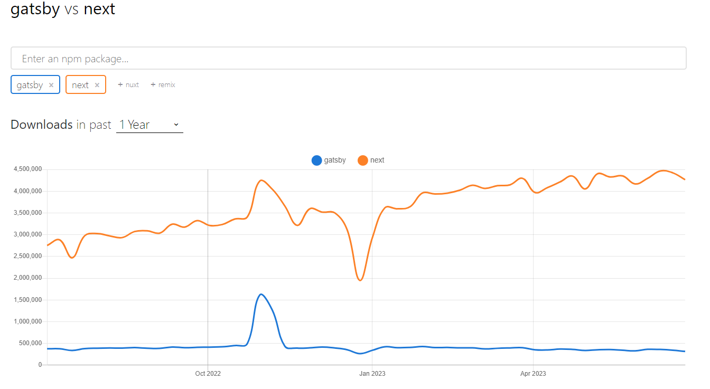

프론트엔드 시장에서 React 라이브러리가 주가 됨에 따라서 이를 더 효율적으로 사용하게끔 NextJS와 Gatsby 등등의 프레임워크들이 생겨났습니다. 그중에서 많은 서비스에 적용된 NextJS와 Gatsby를 비교해 보겠습니다.

## Gatsby

Gatsby는 정적 웹사이트 생성에 최적화된 프레임워크입니다. 홈페이지에 들어가 보면 Gatsby는 다양한 콘텐츠를 하나의 웹 경험으로 통합하는 React 기반의 프레임워크라고 적혀 있는 걸 볼 수 있죠. 실제로 많은 개발 블로그가 Gatsby를 사용하고 있는데 이는 Gatsby가 React 기반의 CMS(Content Management System)로 좋은 선택지여서 그렇다고 생각합니다. 플러그인을 사용해서 빠르고 간편하게 개발을 시작할 수 있고 정적 사이트 생성을 통해 콘텐츠를 빠르게 사용자에게 제시하는 특징을 가지고 있죠.

콘텐츠 통합 관점에서 봤을 때 Gatsby에서 GraphQL을 사용한다는 것이 기존 Rest API를 사용하는 것보다 좀 더 효과적인 방법이라 느낄 수 있었습니다. 한 번의 Query 문을 이용해서 여러 개의 리소스를 가지고 와 Rest API가 가지고 있는 오버페칭과 언더페칭 및 스키마의 종속성을 없애 다양한 콘텐츠를 하나의 웹 경험으로 통합하자는 Gatsby의 목표에 알맞은 선택이라고 생각합니다.

## NextJs

Gatsby는 다양한 콘텐츠를 하나의 웹 경험으로 통합하는 데 중점을 둔다면 NextJS는 빠른 웹 애플리케이션을 만들어 주기 위해 개발자의 경험을 올리는데 중점을 두고 있습니다.

기존의 React는 UI를 중점적으로 다루었기 때문에 라우팅, 데이터 페칭, 구조 등 전부 서드파티 라이브러리를 사용해야 했고 자유도가 높아짐에 따라 가이드나 best practice 각 라이브러리의 궁합 및 지원이 React에 비해서 늦어진다는 점이 문제가 있었습니다. 하지만 NextJS는 React를 사용하여 UI를 구축한 후 이외의 라우팅, 데이터 페칭, 최적화와 같은 요구 사항들을 NextJS에 위임하여 이를 해결했어요.

또한 NextJS에서는 SSR과 CSR을 사용하고 싶은 페이지에 적재적소로 골라서 사용하며 편리하게 SEO를 관리할 수 있어 SSR을 사용하는 서비스에서는 독보적으로 사용되는 프레임워크라고 생각합니다.

## JAMstack

이번에 Gatsby를 보면서 새로 알게 된 개념으로 웹사이트를 어떻게 구성해야 할 것인지에 대한 아키텍처입니다.

Javascript를 이용해 동적인 요소를 처리하고 API를 활용해서 데이터를 요청한 후 Markup 언어로 구성된 웹사이트를 이야기해요.

전통적인 웹은 브라우저가 서버에 요청하고 서버에서 DB 서버에 요청을 해 데이터를 가져오지만 JAMstack방법은 정적 사이트를 CDN에 올려서 사용하는 것을 볼 수 있습니다. 즉 정적인 사이트를 CDN에 올려두고 클라이언트에게 해당 사이트를 주기만 하면 되죠. 이러한 특징 때문에 더 빠르게 클라이언트에게 응답을 줄 수 있고 확장성 또한 쉬운 서비스를 만들 수 있는 특징을 가지고 있습니다.

[JAMStack 홈페이지](https://jamstack.org/generators/)를 보면 NextJS Gatsby는 둘 다 JAMStack 아키텍처를 만들 수 있는 프레임워크인 것을 알 수 있습니다. 다만 두 가지 프레임워크가 추구하는 방향이 다르니 목적에 맞게 선택하는 것이 좋겠습니다.

## 느낀 점

Gatsby를 사용하고 난 후에 쓴 글이라 Gatsby에 대해서 중점적으로 작성해 보겠습니다.

Gatsby를 사용하면서 플러그인 부분이 가장 도움이 많이 되었던 거 같습니다. [블로그 글](https://yoon-hae-min.github.io/blog/useful-gatsby-blog/) 에서 쓴 것처럼 다양한 플러그인들을 사용하였는데 플러그인 덕분에 직접적으로 설정하고 개발해야 하는 일이 현저히 줄어들었습니다. 플러그인 생태계 또한 커서 선택지나 생각하는 기능들이 많이 존재한다는 점이 인상 깊었었죠.

 

공식 문서의 양 자체는 많아서 좋았는데 많은 문서가 흩뿌려져 있어서 가이드라인이 조금 부족했던 것 같습니다.

 

Gatsby를 사용하면서 GraphQL을 처음 사용해 보았는데요. 되게 재미있는 언어인 것 같습니다. 처음에 접했을 때 쿼리문의 depth가 상당히 많아서 놀랐지만 GraphQL페이지에 들어가 쿼리문에 적응하면서 사용하였더니 오히려 이런 depth는 데이터가 무엇을 가리키고 있는지 코드 레벨에서 알아볼 수 있고 이 말은 즉 API 명세서의 필요성이 사라졌다는 것을 느꼈습니다. 프론트엔드 개발자가 화면에 필요한 데이터를 쿼리문으로 직접 접근해서 사용하면 되니 해당 데이터의 타입만 알고 있으면 되고 있고 이는 클라이언트에 필요한 데이터가 변경되었을 때 빠르게 변경 사항을 수용할 수 있겠다고도 생각하였습니다.

 

물론 아쉬웠던 점도 있었습니다. 타입스크립트에 대한 지원이 약간 아쉬웠는데요. MDX플러그인을 사용하고 파일시스템 라우팅을 사용할 때 타입스크립트를 사용하면 적용되지 않는 이슈가 있습니다. [해당 이슈](https://github.com/gatsbyjs/gatsby/issues/38058)를 해결하기 위해서는 확장자명을 tsx에서 jsx로 바꾸거나 파일시스템 라우팅이 아닌 template을 이용해서 직접 페이지를 만드는 방법을 사용해야 하는데요. 이는 타입스크립트 개발환경에서 개발자에게 있어서 되게 안 좋은 경험을 선사한다고 생각합니다.

 

반면에 NextJS는 개발자 경험을 중요시하고 있는데 이런 경험에서인지 공식 문서 또한 처음 입문하기에는 깔끔하게 정리되어 있다는 걸 느낄 수 있었습니다. 개발자 친화적이고 SSR 또한 훌륭하게 지원해 주어서 NextJS가 가장 인기가 있는 프레임워크가 아닐까 싶습니다.

그 이외의 프레임워크의 구조라든지 문법 등은 Gatsby와 NextJS 비슷해서 큰 어려움 없이 진행했던 것 같네요.

만약 기술을 선택해야 한다면 저는 CMS 서비스를 만들어야 할 때는 Gatsby를 그게 아니고 SSR과 CSR SSG 등이 섞여 있으면 NextJS를 사용할 것 같습니다. 아직 블로그 말고 완벽하게 정적인 서비스가 무엇이 있을지 모르겠지만 CMS 서비스를 운영하는 데는 좋은 철학을 가지고 있는 프레임워크인 것 같습니다.
