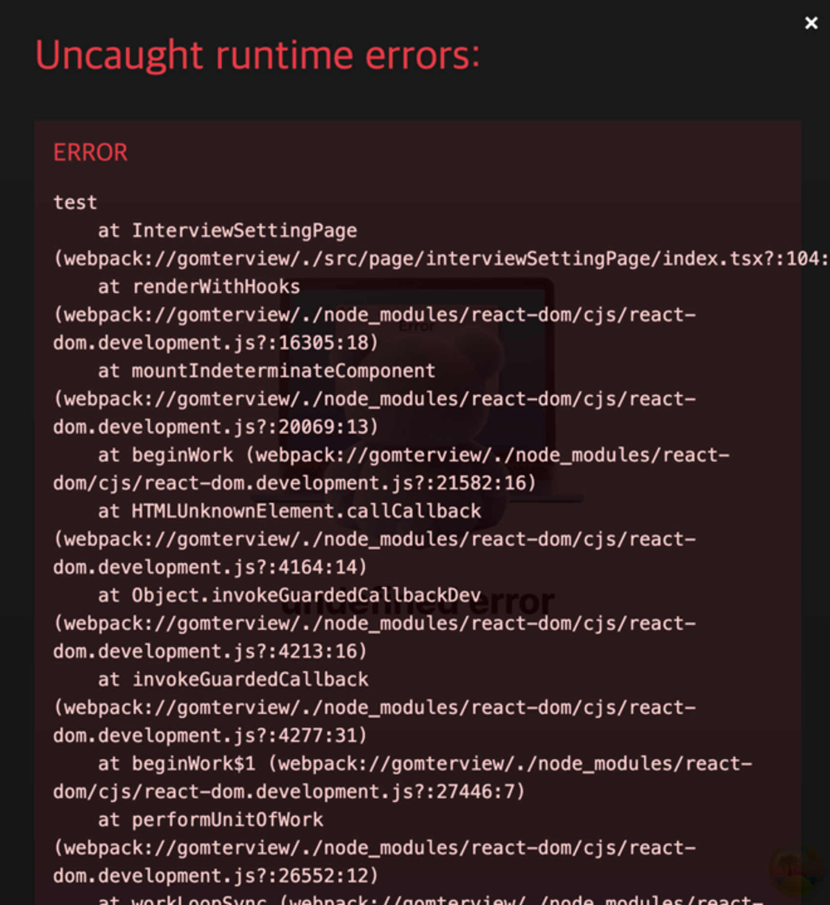

React 내부에서 에러를 처리한다 하면 try catch 문을 이용해서 에러를 핸들링하는 방법을 바로 떠올릴 것입니다. 이는 명령적으로 프로그래밍을 짜는 것인데요.

```jsx
function riskyFunction() {
  if (Math.random() < 0.5) {
    throw new Error('Something went wrong!');
  }
  return 'Success!';
}

try {
  const result = riskyFunction();
  console.log(result);
} catch (error) {
  console.error('Caught an error:', error);
}
```

내가 하고 싶은 에러를 잡기 위해서 어떻게 에러를 잡을 것인지 하나하나 명령해서 작성하는 것이죠. 하지만 React에서는 선언적인 프로그래밍을 지향합니다. 어떻게 할 것인지 아닌 무엇을 할것 인지 말이죠.

그래서 React에서는 선언적으로 에러처리를 더 잘할 수 있게 하는 방법이 존재합니다. 바로 React 16에서 도입된 ErrorBoundary인데요. 자식의 컴포넌트에서 일어난 에러를 감지해서 새로운 컴포넌트를 보여주는 역할을 하는 컴포넌트입니다.

```jsx
<ErrorBoundary>
  <MyComponent />
</ErrorBoundary>
```

되게 간단하죠? 나는 에러를 잡기 위해서 ErrorBoundary를 사용할 거야라고 선언해 주면 됩니다.

단점으로는 class 컴포넌트를 사용해야 합니다.

```jsx
class ErrorBoundary extends React.Component {
  constructor(props) {
    super(props);
    this.state = { hasError: false };
  }

  static getDerivedStateFromError(error) {
    // 다음 렌더링에서 폴백 UI가 보이도록 상태를 업데이트 합니다.
    return { hasError: true };
  }

  componentDidCatch(error, errorInfo) {
    // 에러 리포팅 서비스에 에러를 기록할 수도 있습니다.
    logErrorToMyService(error, errorInfo);
  }

  render() {
    if (this.state.hasError) {
      // 폴백 UI를 커스텀하여 렌더링할 수 있습니다.
      return <h1>Something went wrong.</h1>;
    }

    return this.props.children;
  }
}
```

functional component와 다르게 class component에서는 랜더링 주기를 전부 표현할 수 있습니다. React에서 class component에서 functional component로 바꾸면서 모든 랜더링 주기에 대해 대응하지 못했는데 이 ErrorBoundary의 핵심적인 랜더링 주기가 바로 이 예시입니다.


대신에 [react-error-boundary](https://github.com/bvaughn/react-error-boundary)를 사용해서 내 프로젝트 내에 class 컴포넌트를 사용하지 않게 할 수 있습니다.

간단한 사용 방법은 다음과 같습니다. 에러가 발생할 때 설정한 FallbackComponent로 전환이 됩니다.

```jsx
function ErrorFallback({ error, resetErrorBoundary }) {
  return (
    <div role="alert">
      <p>Something went wrong:</p>
      <pre>{error.message}</pre>
      <button onClick={resetErrorBoundary}>Try again</button>
    </div>
  );
}

function MyComponent() {
  return (
    <ErrorBoundary
      FallbackComponent={ErrorFallback}
      // 에러를 감짓 해당 컴포넌트를 보여줌
      onReset={() => {
        // reset the state of your app so the error doesn't happen again
      }}
    >
      <ComponentThatMayThrowError />
    </ErrorBoundary>
  );
}
```

resetErrorBoundary를 이용해서 컴포넌트의 api 재 호출을 수행할 수 있습니다

```jsx
const RetryComponent = ({ error, resetErrorBoundary }: FallbackProps) => {
  return (
    <div>
      다시 시도해 주세요
      <button onClick={resetErrorBoundary}>Retry</button>
    </div>
  );
};

const APILocalErrorBoundary: React.FC<PropsWithChildren> = ({ children }) => {
  const { reset } = useQueryErrorResetBoundary();
  // react-query의 hook

  return (
    <ErrorBoundary fallbackRender={RetryComponent} onReset={reset}>
      {children}
    </ErrorBoundary>
  );
};
```

하지만 해당 react-error-boundary는 만능이 아닌데요 다음과 같은 내용은 포착하지 않습니다.


즉 이걸 거꾸로 생각해 보면 React의 생명 주기 이외의 것들은 포착하지 못한다는 것이죠. 그렇기 때문에 JS에서 지원하는 try catch와는 조금 다른 특징을 지녔습니다.

만약에 내가 비동기 처리에 대한 내용을 error boundary로 잡고 싶다면 React 생명주기에 이를 포함하는 작업이 필요합니다 라이브러리 단에서 지원할 수도 있고(React-query의 throwOnError 옵션) 아니면 직접 error에 관련된 state를 만들어서 강제로 React 사이클에 집어넣을 수도 있습니다.

## errorBoundary 자세히 보기

errorBoundary를 작성하던 중 하나의 이슈를 만났는데요 저는 분명히 ErrorBoundary로 감싸서 에러를 처리하고 있지만 development 환경에서 임의의 에러를 발생 시 다음과 같이 핸들링되지 않는 에러로 정의가 된다는 점이었습니다.



여기서 저는 실제로 에러가 핸들링되지 않아서 터진 문제라 판단하였고 여기서 ErrorBoundary는 포착만 하고 실제 에러는 해결하지 못한 줄 알았습니다. 하지만 빌드 해서 실행을 하면 다음과 같은 에러 포착은 되지 않습니다.

이는 React의 에러 디버거 때문에 생긴 문제였는데요. 사용한 프로젝트에서는 webpack dev server를 사용하고 있었고 webpack 내의 debug tool이 사진과 같이 에러를 추적해 주는 역할하고 있습니다. ErrorBoundary를 이용하면 서비스에서는 에러를 캐치했지만 debug 툴은 해당 에러를 캐치했는지 못했는지 모르는 상태라고 추측할 수 있습니다.

## 뭐가 다르길래?

이는 JS에서 처리하는 try catch와 error boundary가 에러처리 하는 방법이 똑같지 않기 때문에 생기는 문제입니다.

https://github.com/facebook/create-react-app/issues/6530

[Why are Error Boundaries not triggered for event handlers? · Issue #11409 · facebook/react](https://github.com/facebook/react/issues/11409#issuecomment-340859253)

이 답변은 CRA레포지토리 내에서 이에 대한 문제의 답을 해 주었는데요. 간단히 이야기하면 React 메커니즘에서 ErrorBoundary로 잡힌 오류와 잡히지 않는 오류를 구별하는 방법이 없다고 합니다.

> 💡 추론 주의) 해당 내용은 코드를 단편적으로 본 추론으로써 실제 내용과 다를 수 있습니다!! 주의해서 봐주세요

제 임의대로 한번 React 코드 내부에 에러를 전파하는 코드를 까보았습니다.

```jsx
function throwAndUnwindWorkLoop(unitOfWork: Fiber, thrownValue: mixed) {
  // This is a fork of performUnitOfWork specifcally for unwinding a fiber
  // that threw an exception.
  //
  // Return to the normal work loop. This will unwind the stack, and potentially
  // result in showing a fallback.
  resetSuspendedWorkLoopOnUnwind(unitOfWork);

  const returnFiber = unitOfWork.return;
  if (returnFiber === null || workInProgressRoot === null) {
    // Expected to be working on a non-root fiber. This is a fatal error
    // because there's no ancestor that can handle it; the root is
    // supposed to capture all errors that weren't caught by an error
    // boundary.
    workInProgressRootExitStatus = RootFatalErrored;
    workInProgressRootFatalError = thrownValue;
    // Set `workInProgress` to null. This represents advancing to the next
    // sibling, or the parent if there are no siblings. But since the root
    // has no siblings nor a parent, we set it to null. Usually this is
    // handled by `completeUnitOfWork` or `unwindWork`, but since we're
    // intentionally not calling those, we need set it here.
    // TODO: Consider calling `unwindWork` to pop the contexts.
    workInProgress = null;
    return;
  }

  try {
    // Find and mark the nearest Suspense or error boundary that can handle
    // this "exception".
    throwException(
      workInProgressRoot,
      returnFiber,
      unitOfWork,
      thrownValue,
      workInProgressRootRenderLanes
    );
  } catch (error) {
    // We had trouble processing the error. An example of this happening is
    // when accessing the `componentDidCatch` property of an error boundary
    // throws an error. A weird edge case. There's a regression test for this.
    // To prevent an infinite loop, bubble the error up to the next parent.
    workInProgress = returnFiber;
    throw error;
  }

  if (unitOfWork.flags & Incomplete) {
    // Unwind the stack until we reach the nearest boundary.
    unwindUnitOfWork(unitOfWork);
  } else {
    // Although the fiber suspended, we're intentionally going to commit it in
    // an inconsistent state. We can do this safely in cases where we know the
    // inconsistent tree will be hidden.
    //
    // This currently only applies to Legacy Suspense implementation, but we may
    // port a version of this to concurrent roots, too, when performing a
    // synchronous render. Because that will allow us to mutate the tree as we
    // go instead of buffering mutations until the end. Though it's unclear if
    // this particular path is how that would be implemented.
    completeUnitOfWork(unitOfWork);
  }
}
```

해당 코드 조각은 Fiber에서 예외가 발생했을때 실행하는 코드로 추측합니다. 여기서 봐야 하는 건 throwException인데요 ErrorBoundary 자식에있는 컴포넌트에서 만약 error가 일어났다면 이는 컴포넌트에서 일어난 에러 일 것입니다. 이는 현재 보이는 Fiber에서 예외가 발생했다는 증거고 그에 대한 내용으로 해당 코드와 throwException을 통해 상위에 있는 ErrorBoundary를 찾을 것이죠.

여기서 봐야 할 점이 바로 throw error로 실제 에러를 던지는 게 아닌 JS 코드로 에러에 대한 정보를 변수로 지정해 주고 있다는 점입니다.

throwException에서 코드의 일부분을 보겠습니다.

```jsx
do {
  switch (workInProgress.tag) {
    case HostRoot: {
      const errorInfo = value;
      workInProgress.flags |= ShouldCapture;
      const lane = pickArbitraryLane(rootRenderLanes);
      workInProgress.lanes = mergeLanes(workInProgress.lanes, lane);
      const update = createRootErrorUpdate(workInProgress, errorInfo, lane);
      enqueueCapturedUpdate(workInProgress, update);
      return;
    }
    case ClassComponent:
      // Capture and retry
      const errorInfo = value;
      const ctor = workInProgress.type;
      const instance = workInProgress.stateNode;
      if (
        (workInProgress.flags & DidCapture) === NoFlags &&
        (typeof ctor.getDerivedStateFromError === 'function' ||
          (instance !== null &&
            typeof instance.componentDidCatch === 'function' &&
            !isAlreadyFailedLegacyErrorBoundary(instance)))
      ) {
        workInProgress.flags |= ShouldCapture;
        const lane = pickArbitraryLane(rootRenderLanes);
        workInProgress.lanes = mergeLanes(workInProgress.lanes, lane);
        // Schedule the error boundary to re-render using updated state
        const update = createClassErrorUpdate(workInProgress, errorInfo, lane);
        enqueueCapturedUpdate(workInProgress, update);
        return;
      }
      break;
    default:
      break;
  }
  // $FlowFixMe[incompatible-type] we bail out when we get a null
  workInProgress = workInProgress.return;
} while (workInProgress !== null);
```

아까 ErrorBoundary는 class component라고 했습니다. 그렇기 때문에 해당 case로 들어갈 것으로 추측이 되고 error를 변수로 할당해서 뭔지는 모르겠지만 enqueue에 해당 에러를 업데이트시키는 것을 볼 수 있습니다. 따라서 React에서는 에러를 JS 변수로 관리하기 때문에 어떤 것이 핸들링 된 에러인지 안된 에러인지 알 수 없다고 추측할 수 있습니다.

## 결론

ErrorBoundary를 이용하면 선언적으로 에러 핸들링을 할 수 있습니다. 하지만 ErrorBoundary는 try/catch와 다르기 때문에 주의해야 합니다. 에러핸들링은 무조건 Errorboundary 사용이 아닌 상황에 맞게 사용해야겠죠. 제 프로젝트 같은 경우에는 ErrorBoundary는 어쩔 수 없이 에러 페이지를 보여주어야 할 때 사용하고 있고 그 이외에는 axios나 다른 계층으로 분리해서 사용 중입니다. 다음 포스팅에서 한번 작성해 보겠습니다.
