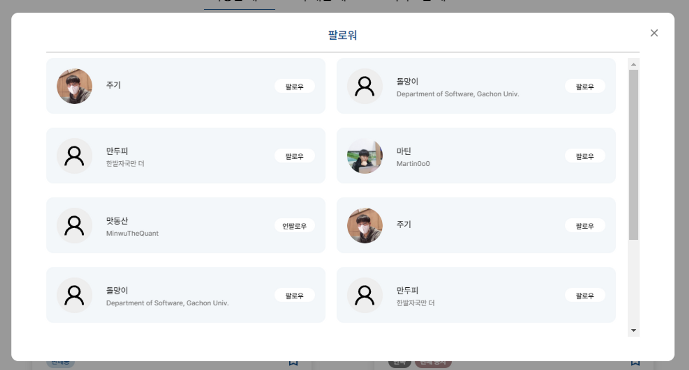
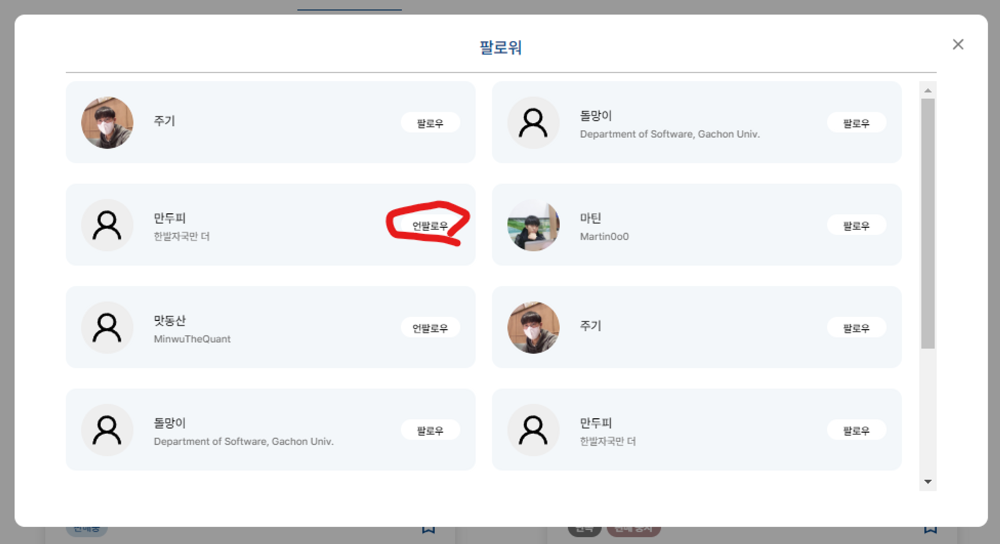
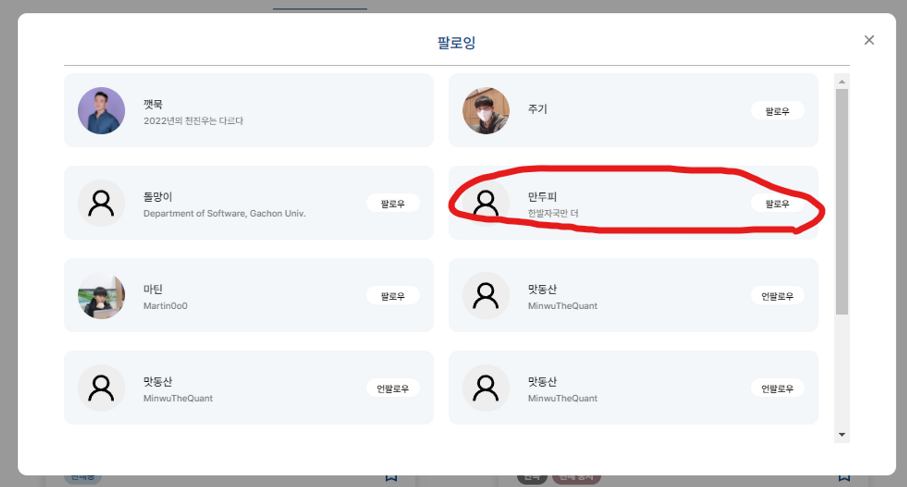
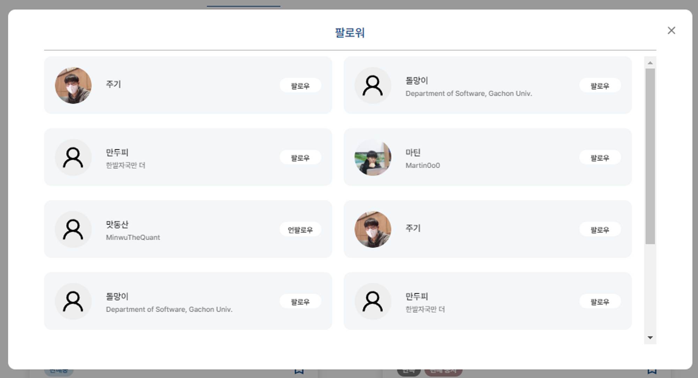
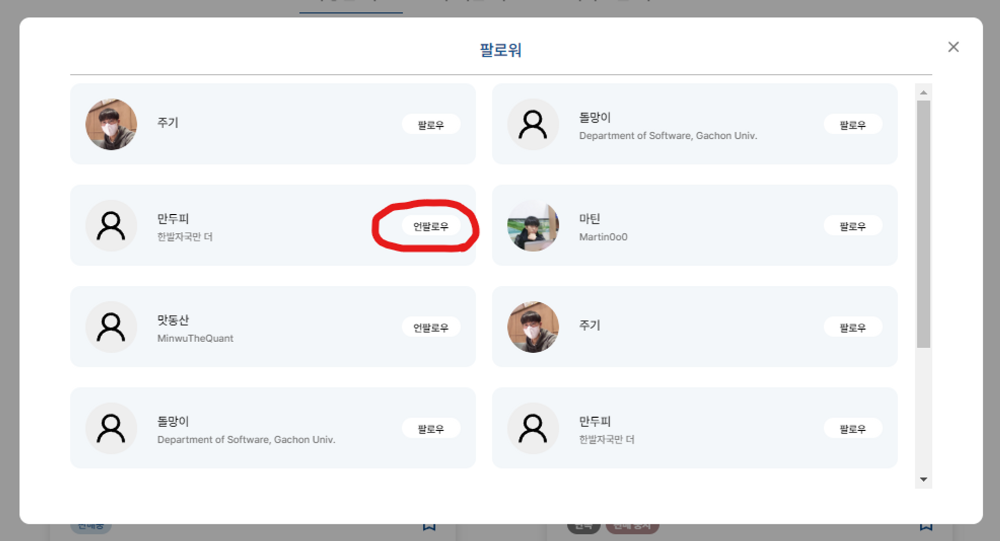
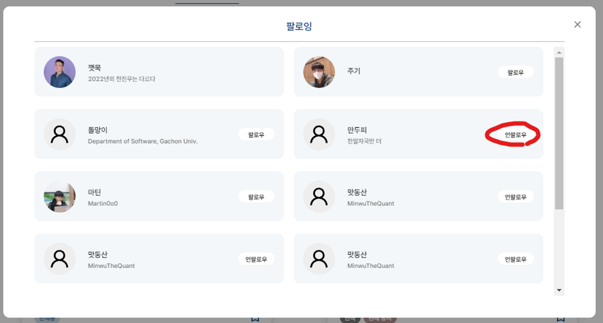

### 진행 동기

Breaking프로젝트를 진행하면서 프로필 팔로잉 팔로워 모달창에서 유저를 팔로잉 할시에 반대편 모달창에 그 값이 적용되지 않았고 이를 해결하기 위해서 Profile Modal에 state로 만들어 두 개의 Modal을 묶어서 처리했는데 이보다 좋은 방법이 없을까 고민하던 중 optimistic update를 배우면서 이와 비슷하게 직접 queryCache에 접근해서 해결해 보자고 생각하였다.

### 리펙토링 시리즈

1.  [인피니티 스크롤에서 데이터가 많아지면 프레임이 떨어짐](https://throwfe.tistory.com/17)
2.  **마이페이지 팔로우 팔로워 modal창에서 데이터 동기화 방법수정 필요 (현재 글)**

### 관련 PR

[Following Follower Modal창 동기화하기 by Yoon-Hae-Min · Pull Request #2](https://github.com/Yoon-Hae-Min/breaking-frontend/pull/2)

### Modal창 동기화 하기


이 창에서 만두피를 팔로우를 누르고 팔로우가 성공이 되면 언팔로우로 바뀐다


팔로잉 Modal로 넘어가면 내가 해당 유저를 팔로우했음에도 불구하고 팔로우 버튼이 있는 것을 확인할 수 있었다.


첫 시도에는 두 개의 Modal을 묶는 컴포넌트를 만들어서 state를 내려주는 형식으로 사용했다. 하지만 이 state 때문에 하위 컴포넌트들이 묶여있어서 각 컴포넌트의 의존도가 올라가였고 코드의 재사용성이 어려워지면서 이걸 억지로 맞추다 보니 관련 컴포넌트들의 코드가 스파게티로 꼬여버렸다.

### 해결방안

원티드 프리온보딩 todo list 프로젝트를 하면서 optimistic update를 사용하였다. 여기서 영감을 받았다 optimistic update 즉 낙관적 업데이트는 api 요청이 성공했다고 가정하고 데이터를 먼저 바꾸고 실패 시에 데이터를 원상복구 시키는 방법이다. 여기서 데이터를 바꿀 때 queryClient로 직접 캐시에 접근을 하여 데이터를 변경하였다. 지금 문제도 팔로우 또는 팔로워시에 queryClient로 chache에 접근해서 값을 수정하면 반대쪽 modal창에도 적용이 될 것이라 기대하고 리펙토링을 진행했다.

```jsx
const toggleIsFollowingField = ({ userId, queryKey }) => {
  const previousFollow = queryClient.getQueryData(queryKey);
  if (previousFollow) {
    queryClient.setQueryData(queryKey, {
      ...previousFollow,
      pages: [
        ...previousFollow.pages.map(({ cursor, result }) => {
          return {
            cursor,
            result: result.map((item) =>
              item.userId === userId
                ? {
                    ...item,
                    isFollowing: !item.isFollowing
                  }
                : {
                    ...item
                  }
            )
          };
        })
      ]
    });
  }
};
```

코드가 조금 복잡하지만 원리만 보면 팔로우 팔로워 querykey의 데이터에 접근해서 userId의 isFollowing필드 값을 변경하는 코드이다.

```jsx
const UnFollowMutation = (queryKey) =>
  useUnFollow({
    onSuccess: (data, userId) => {
      queryClient.invalidateQueries('profile');
      toggleIsFollowingField({ userId, queryKey });
    },
    onError: () => {
      //에러처리
    }
  });

const FollowMutation = (queryKey) =>
  useFollow({
    onSuccess: (data, userId) => {
      queryClient.invalidateQueries('profile');
      toggleIsFollowingField({ userId, queryKey });
    },
    onError: () => {
      //에러처리
    }
  });
```

팔로우 팔로워 요청이 성공했을 때 바뀌도록 onSuccess부분에 코드를 넣고 사용하였다.

조금 더 리펙토링을 하기 위해서 공통부분은 hook로직으로 옮겼다.

공통적으로 팔로우 팔로워 버튼이 누르면 해당 list의 데이터 값을 직접 변경하는 방식으로 전환했다. 만약 queryKey를 받으면 api성공 시에 데이터를 수정하도록 하고 null이라면 직접 onSuccess값을 지정해 주도록 하였다

```jsx
const useUnFollow = (queryKey, option) => {
  const queryClient = useQueryClient();
  return useMutation(deleteUnFollow, {
    onSuccess: (data, followId) =>
      queryKey && toggleIsFollowingField({ queryClient, followId, queryKey }),
    ...option
  });
};
```

그리고 팔로우 언팔로우를 사용하는 모든 부분에 이 hook으로 변경하였다

### 사용방법

follow follower 동기화가 필요한 부분은 다음과 같은 구조로 코드를 작성한다

```jsx
const option = {
  onSuccess: (data, followId) => {
    queryClient.invalidateQueries('profile');
    toggleIsFollowingField({
      queryClient,
      followId,
      queryKey: ['followingList', userId]
    });
    toggleIsFollowingField({
      queryClient,
      followId,
      queryKey: ['followerList', userId]
    });
  }
};

const UnFollowMutation = useUnFollow(null, option);

const FollowMutation = useFollow(null, option);
```

동기화가 필요 없는 부분은 다음과 같은 구조로 querykey를 직접 인수로 전달한다.

```jsx
const PostLikeListModal = ({ postId, isOpen, closeClick }) => {
  const queryKey = ['postLikeList', postId, 10];
  return (
    <ProfileCardsModal
      title="좋아요"
      toggleModal={closeClick}
      isModalOpen={isOpen}
      infiniteQuery={usePostLikeList(queryKey)}
      FollowMutation={useFollow(queryKey)}
      UnFollowMutation={useUnFollow(queryKey)}
    />
  );
};
```

### 결과


만두피를 팔로우를 누른다


그러면 언팔로우로 변경이 되고


팔로잉 modal에서도 언팔로우로 변경이 되어있는 걸 볼 수 있다.

### 리펙토링을 모두 마친 후기

사실 이 프로젝트를 살릴려면 할거는 더 많다. 기본적인 컴포넌트 구조도 바꿔야하고 꼬인코드도 풀어야하고 추가 기능 개발도 해야한다. 하지만 이미 프로젝트는 죽어버렸고 다시 살리고 싶은 프로젝트도 아니라고 판단해서 그당시 개발 하면서 이건 꼭 수정해봤으면 좋겠다 라는 부분만 따로 빼서 혼자 수정을 해봤는데 생각보다 재밌었다. 無에서부터 시작하는 개발이랑은 확실히 다른 느낌이다.

1\. 6개월전의 나... 뭐한거지?

사실 처음 시작했을때 난감했었다. 6개월전에 프로젝트를 시작했을때 최선의 다해서 만족할만큼 개발을 했었고 결과도 좋다고 자부했었다 이정도면 나중에 볼때 리펙토링도 쉽고 읽기도 편하겠지 라는 생각이었다. 하지만 리펙토링을 시작하면서 다시  봤을때는 부족한 부분이 많아 보인다. 몇몇 컴포넌트는 같은 기능을 하지만 세부 내용이 다르단 이유로 완전히 다른 로직으로 작성이되고, 어느 컴포넌트는 다른 컴포넌트와 의존성이 너무 강해 수정할때 파일 두 세개를 거의다 뜯어 고쳤었다.

다행히도 위의 두가지는 리펙토링을 진행하면서 인지하고 수정한 부분인데 나머지도 까보면 리펙토링 내용이 100퍼센트 존재할 것이다. ㅋㅋㅋㅋ

2\. 한번 맛보면 헤어 나올수 없는 맛 ts

지금은 ts를 쓰고있지만 이 프로젝트는 js로 작성이 되었다. 리펙토링을 하면서 느낀것이 js에서는 type이 없어 런타임 오류들이 자주 발생하였고 값을 찾으려면 폴더를 이동해 직접 찾아보거나 console.log로 직접 값을 확인해야 한다는게 얼마나 비용이 많이 들어가는 일인지 직접 체감하고 나니 더더욱 typescript욕구가 뿜뿜 ~(그래도 제네릭은 어렵다)~
