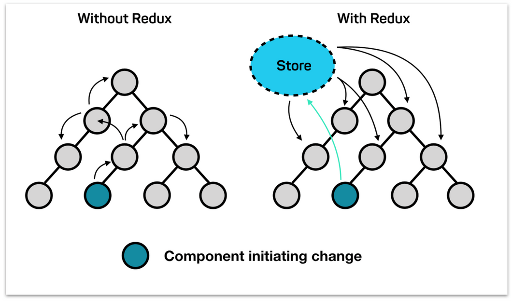

## 발단

처음 React query를 사용하면서 잘못된 개념을 하나 가지고 갔었다. React-query를 사용하면 전역 상태가 필요 없다는 것이었다. 애초에 개념이 다른 말인데 왜 이렇게 생각했는지에 대해서 풀어보고자 한다.

## 상태

프론트엔드 개발에서 꼭 필수적인 것이 state 즉 상태이다. 상태를 주관적으로 정의를 내려본다면 사용자와 상호작용하기 위해 동적으로 변하는 데이터를 말할 수 있다. 이 상태에 따라 UI를 적절하게 보여주도록 설정하는 것이 상태 관리인 것이다.

하지만 상태가 복잡해지고 다양화 됨에 따라 하나의 상태가 영향을 미치는 페이지들이 많아지게 되면 이를 해결하기 위해서 state끌어치기 기법을 이용하면 props drilling이 일어나게 되고 이는 결국 많은 컴포넌트에 의존성을 남기게 된다 즉 state가 파편화됨에 따라 상태를 관리하기 힘들어 진다. 이를 효과적이고 효율적이게 해결해주기 위해 등장한것이 전역 상태 관리 도구들이다.

대표적으로 Redux, Recoil, Mobx, jotai 등이 있다.

기존의 상태는 하나의 컴포넌트에서 시작되었지만 전역 상태관리를 사용하면 컴포넌트 외부의 store이라는 곳에서 관리를 하게 된다. 상태를 props로 넘기는 것이 아닌 컴포넌트에서 필요한 상태만 store에 접근해 사용하는 방식으로 작동을 하는 것이다. 이렇게 되면 props drilling문제뿐만 아니라 데이터 자체도 단방향으로만 흐르기 때문에 상태관리에 용이해진다.

첫 전역 상태 라이브러리를 사용할 때 Redux, Redux Saga조합으로 사용하였다. 기존의 전역 상태를 사용하지 않고 개발하였을 때 보다 효과적으로 상태관리를 할 수 있었다. 하지만 그럼에도 새로운 문제가 생겨났었다.

> 1.  간단한 상태변경에도 store redux-saga 등 변경점이 너무 많네...?
> 2.  상태를 관리하려고 도입한 기술이 api fetch코드만 있네...? 의미적으로 이게 맞는 건가?

## React-query

그래서 찾았던 대안 방법이 React-query였다. 하지만 내가 선택한 이유가 전역 상태를 대체하기 위함이었던 만큼 여전히 전역 상태라는 개념에 사로 잡혀있어 React-query를 전역 상태관리 라이브러리처럼 사용하려고 했다. query cache를 전역 store로 사용하는 등 이상한 짓을 많이 했다. 하지만 뭔가 모르게 억지로 끼워 맞춘다는 느낌이 들었고 이에 이게 맞는 방법인지 처음으로 돌아가서 다시 생각해 보기로 했다.

## 전역 상태관리를 언제 했는가?

내가 Rest API를 사용하면서 어떻게 전역 상태를 관리했는지 생각해 보았다. 서버에서 데이터를 불러오면 데이터가 state로 저장이 되어 사용되는 모습을 단번에 떠오릴 수 있었다. 그렇다 대부분의 전역 상태는 서버의 데이터를 가공해서 상태로 사용하고 있었던 것이다. 즉 전역으로 저장하는 대부분의 정보들은 서버의 상태를 관리하기 위해서 존재하고 있다는 것이다.

내가 만들었던 거의 모든 애플리케이션은 이런 방법으로 상태를 관리하였다. redux redux-saga를 사용할 때도 똑같이 서버의 데이터를 전역 상태로 넣어서 사용하다 보니 store에 api fetch코드들만 있었고 이런 문제를 해결 하고자 React-Query를 사용하였다. 이런 순서로 진행하다보니 React-Query또한 전역 상태 라이브러리 + 캐싱이나 로딩 처리 등을 해주는 라이브러리로 생각하게 되었다.

## 마주한 진실

> (중요) React-query는 전역 상태 라이브러리가 아니다 api 통신을 도와주는 라이브러리이다.

React-Query를 두번째로 프로젝트에 적용하면서 본 글귀이다. 이 한 줄을 보고 나니 내가 React-query를 이해하지 못했다고 알 수 있었다.

React-query는 상태를 서버상태와 클라이언트 상태로 분류해서 생각하자는 것이 핵심이다. 서버에서 받아오는 데이터를 서버 상태 클라이언트에서 관리하는 상태를 클라이언트 상태로 지칭한다. 그런데 내가 사용하고 있는 전역 상태는 대부분 서버의 상태를 관리하고 있었고 그렇기 때문에 전역 상태 대신 React-Query로 서버 상태관리만 해도 전역 상태 없이 충분히 상태관리를 할수 있었다. 따라서 이제는 React-query는 전역 상태관리보다는 서버상태를 관리해주어서 전역상태의 일을 대신해 주는 라이브러리라 정의할 수 있었다.

하지만  전역 상태를 프로젝트에 완전히 사용하지 않는 것은 아니었다. SNS기능을 만들 때 로그인 정보를 가지고 여러 페이지에서 사용해야 하는 경우가 생겼는데 이때는 전역 상태로 관리하는 것이 효과적이었다. 그래서 복잡한 상태가 나오지 않는다면 React의 내장 기능인 context API를 통해서 이를 해결하는 방식으로 진행했다.

## 결론

React-query와 전역 상태는 서로 다른 내용이지만 React-query만을 가지고 전역 상태문제를 해결하는 것처럼 보인다. 하지만 전역상태의 일을 일부 위임한다는 것 뿐이지 전부 대체를 하는 것은 아니다. 따라서 만드는 서비스에 상태관리에 따라 전역상태를 채택할 것이지 생각해 보는 것이 좋겠다.

### 도입 3단 방법

1.  데이터 통신이 필요한가? ->React-query도입
2.  서버로 데이터를 보내기 전에 하나의 상태에 대해서 여러 페이지의 접근이 필요한가? ->전역 상태관리 라이브러리 사용
3.  전역상태가 contextApi로 감당이 가능한가? -> 불가능하면 전역 상태관리 라이브러리 사용
