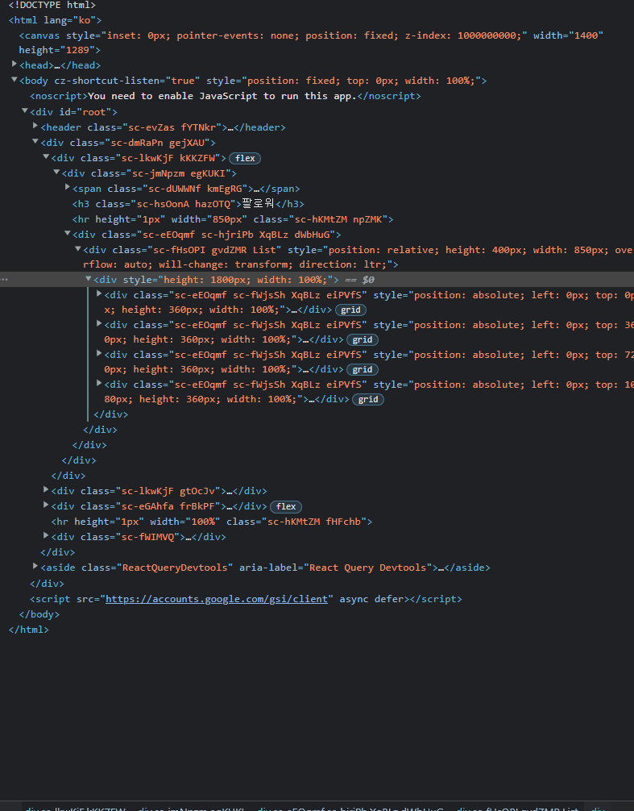

## 진행 동기

Breaking프로젝트를 진행하면서 성능과 코드 구조에 대해서 아쉬운 부분이 남았고 이에 시간이 없어서 수정하지 못한 2가지를 리펙토링 프로젝트를 통해 수정해 보고자 하였다 첫 리펙토링은 인피니티 스크롤을 리펙토링이다. [(인피니티 스크롤 최적화하기 PR)](https://github.com/Yoon-Hae-Min/breaking-frontend/pull/1)

### 리펙토링 시리즈

1.  **⭐ 인피니티 스크롤에서 데이터가 많아지면 프레임이 떨어짐 (현재 글) ⭐**
2.  [마이페이지 팔로우 팔로워 modal창에서 데이터 동기화 방법](https://throwfe.tistory.com/19)

### 기존 인피니티 스크롤 전략

기존에 인피니티 스크롤 방법은 IntersectionObserver 객체를 이용해 인피니티 스크롤이 필요한 부분에 div 태그를 만들고 해당 태그에 교차시에 다음 페이지 fetch를 하도록 설정하였다.


전략을 세웠으니 바로 hook을 생성했다.

```jsx
import { useEffect, useRef } from 'react';

const useInfiniteScroll = (data, FetchNextPage) => {
  const targetRef = useRef();

  const observer = new IntersectionObserver(
    ([entry], observer) => {
      if (entry.isIntersecting) {
        observer.unobserve(entry.target);
        FetchNextPage();
      }
    },
    { threshold: 0.8 }
  );

  useEffect(() => {
    if (!data) FetchNextPage();

    if (targetRef.current) observer.observe(targetRef.current);
    return () => observer && observer.disconnect();
  }, [data]);

  return { targetRef };
};

export default useInfiniteScroll;
```

가상의 div태그에 줄 observer를 생성후 ref값을 return 해 그 값을 가상의 div태그에 넣어 교차 시에 FetchNextPage가 실행되도록 hook을 구성하였다.

### 문제점 발생

하지만 이 방법은 스크롤을 계속 내릴수록 데이터를 계속 불러왔고 데이터가 수십개 수백 개 되자 프레임이 떨어지는 문제가 발생했다. 인피니티 스크롤을 할 때마다 DOM트리에 데이터 결과 값을 추가해야 하니 div 태그가 많아질 수밖에 없었던 것이다.


## 새로운 전략 

이를 해결하기 위해서 생각해 낸것이 ‘사용자에게 보이는 부분만 element를 만들고 보이지 않는 부분은 DOM에서 element를 제거하는 형식으로 만들자’였다 하지만 그냥 DOM에서 제거를 하게 되면 제거된 DOM의 크기만큼 화면의 높이가 줄어들게 되어서 부자연스러운 결과를 낳게 된다. 따라서 추가적인 로직이 필수로 동반되어야 했고 이 방법을 [오늘의 집 페이지](https://ohou.se/productions/feed?query=%EC%9D%98%EC%9E%90&input_source=integrated&search_affect_type=Typing)에서 사용하고 있었다.


사용자가 보이는 view의 일정 부분만 dom에 남겨두고 padding-top을 이용해 사라진 부분만큼 공백을 만들어서 dom을 관리하고 있는걸 볼 수 있다.

이러면 사용자 입장에서는 데이터를 끊킴없이 불러오면서 볼 수 있는 장점이 있고 데이터를 아무리 불러와도 dom자체에는 할당된 양만큼의 div 태그가 있기 때문에 프레임 드롭이 일어나지 않는다. 나도 이 방법을 토대로 똑같이 문제를 해결 해 보고자 하였다.

### 문제 해결 시 고려할 점

1.  DOM에 제거가 되어도 스크롤 위치는 가만히 있어야 할 것
2.  제거가 되는 순간 화면에 보이는 내용이 바뀌면 안 될 것
3.  스크롤을 올리면 기존의 내용이 그대로 나올 것
4.  인피니티 스크롤이 가능할 것

### 첫 시도

데이터(followList)를 가져와 보여주는 컴포넌트의 일부이다.

```jsx
<>
  {followList &&
    followList
      .slice(followList.length - 3 > 0 ? followList.length - 3 : 0, followList.length)
      .map((items) =>
        items.result.map((item) => (
          <FollowCard
            cardClick={() => {
              toggleModal();
              navigate(PAGE_PATH.PROFILE(item.userId));
            }}
            isPermission={item.userId !== userData.userId && userData.isLogin}
            profileData={item}
            key={`follow-${item.userId}`}
            FollowMutation={FollowMutation}
            UnFollowMutation={UnFollowMutation}
          />
        ))
      )}
  {isLoading && (
    <>
      <FollowCardSkeleton />
      <FollowCardSkeleton />
      <FollowCardSkeleton />
      <FollowCardSkeleton />
      <FollowCardSkeleton />
      <FollowCardSkeleton />
    </>
  )}
</>
```

받아온 데이터 중 보여줄 3페이지만 slice 해서 보여주고 사라진 DOM의 크기만큼 Padding을 주는 로직을 추가해서 해결하려고 했다. 하지만 slice로 인해 생기는 문제점들이 있었다.

> 1. 데이터에 관한 연산이 api 선언문이 아닌 컴포넌트에서 직접 한다는 점.
>
> 2. modal창에 일정 크기의 padding이 들어갈 시 overflow css가 무시되는 현상
>
> 3. 스크롤을 위로 올릴시 기존 데이터를 받아오는 로직이 추가로 있어야 함

이는 기능을 하나 추가할 때마다 코드의 복잡도를 매우 올리기 때문에 리펙토링이나 구현 과정에서 큰 난이도를 요구하였다.

### 두 번째 시도(react-window 도입)

직접 구현은 일단 놔두고 라이브러리가 있는지 찾아보았다. 다행히 React가 권장하는 라이브러리들이 있었다.


[react-window](https://github.com/bvaughn/react-window)와 [react-virtualized](https://github.com/bvaughn/react-window-infinite-loader)가 있는데 나는 인피니티 스크롤과 windowing 기법만 이용하고 싶었기 때문에 용량이 더 적은 react-window를 선택하였다.

이 라이브러리들은 데이터의 일부분만 화면에 랜더링 해줌으로써 최적화를 시켜준다. 컴포넌트 wrapper로 인피니티 스크롤 기능을 제공해 주어서 현재 문제 해결에 가장 적합하다고 생각하였다.
[react-window-infinite-loader-codesandbox 예제](https://codesandbox.io/s/happy-bogdan-rd596c?file=/src/App.js)

### 적용해 보자

여러 컴포넌트가 있었지만 나는 FixedSizeList 컴포넌트를 통해서 문제를 해결하고자 하였다.

> - FixedSizeList의 children은 element가 아닌 함수형 컴포넌트를 갖는다
> - FixedSizeList의 children은 props로 index, style를 갖는다
> - FixedSizeList의 children의 props 중 style은 꼭 return 되는 element에 wrapper로 적용해야 한다 아니면 라이브러리에서 화면을 제대로 인식하지 못한다.
> - react-query의 hasNextPage는 마지막에 데이터를 보내보고 없을 시에 false가 되므로 itemCount에서 false시에 크기를 1 더 줄여야 한다.

실 서비스의 레이아웃이 grid임에도 불구하고 FixedSizeList를 선택해서 사용한 이유는 두 가지였다

첫번째로는 react-query의 useInfinityScroll의 hook은 한번 api통신을 할 때마다 return값으로 객체 6개의 값이담긴 하나의 배열로 주는데 를 주는데 이 array의 값 하나를 하나의 컴포넌트로 보아야 한다고 생각했기 때문이다.


두번째로는 pages array(followList)중 하나의 값을 넘겨주어서 처리하는 기존의 컴포넌트가 있었기 때문에 재사용하면 좋겠다고 생각했다.

그렇게해서 코드를 다시 정비했다.

```jsx
// props로 받은 followList를 각각의 Card로 만들어주는 컴포넌트가 존재했다.

return (
  <>
    {followList.map((item) => (
      <FollowCard
        cardClick={() => {
          toggleModal();
          navigate(PAGE_PATH.PROFILE(item.userId));
        }}
        isPermission={item.userId !== userData.userId && userData.isLogin}
        profileData={item}
        key={`follow-${item.userId}`}
        FollowMutation={FollowMutation}
        UnFollowMutation={UnFollowMutation}
      />
    ))}
  </>
);
```



아무리 스크롤을 내려도 dom이 일정 개수 이상 늘어나지 않는걸 볼수 있었다.

### 행복한 결말?

이제 해당 내용을 컴포넌트화 해서 인피니티 스크롤이 사용되는 부분을 해당 컴포넌트로 교체하려 하였다. 하지만 메인 피드 부분의 스크롤은 window 스크롤을 기준으로 사용되고 있었기 때문에 react-window에서는 해당 기능을 지원해주고 있지 않아 이를 해결할 수 없었다. ~(필요한 기능을 충분히 탐색하지 않은 내 잘못이다)~

따라서 다시 react-virtualized를 선택하여 WindowScroller기능을 사용하기로 하였다.

### 세 번째 시도

react-window와 react-virtualized에 있는 컴포넌트명은 같지만 파라미터명은 서로 달라 일일이 수정해 주어햐 했다.
또한 기존에 FixedSizeList를 사용해서 처리하고 있었는데 그렇게 하면 생각보다 많은 element가 dom에 들어있었다 테스트 도중에 데이터를 확인해 보니 한 묶음에 8개의 element가 있었고 그런 게 10묶음이 있으니 최적화를 해도 80묶음의 element가 Dom에 있었던 것이다. 따라서 새로 컴포넌트를 만들고 Grid 형식으로 만들기로 하였다.

#### api response값 데이터 처리하기

List에서 Grid로 바꾸려면 기존의 response 데이터를 가공해 주어야 했다. useInfiniteQuery의 결괏값은 pages, pagePrams로 구성되어 있는데 이를 1차원 배열로 반환하도록 추가 설정하였다

```jsx
const useMainFeedOption = (sort, option) => {
  return useInfiniteQuery(['mainFeedOption', { sort, option }], getFeeds, {
    getNextPageParam: (lastPage) => {
      return lastPage.cursor;
    },
    select: (data) => {
      return data.pages.reduce((acc, { result }) => [...result, ...acc], []);
      // pages안에 있는 결과값만 추출해서 return하도록 설정
    }
  });
};
```

#### react-virtualized로 마이그레이션

InfiniteGridWrapper라는 컴포넌트를 생성해 InfiniteLoader와 Grid 컴포넌트를 합쳤다.

props types 설명
| props | type | 설명 |
| ----------------- | ---------------------------------------------------------------------- | ----------------------------------------------------------------------------------------------------------- |
| data | Array | 화면에 보여줄 데이터 |
| hasNextPage | Bool | react-query의 hasNextPage를 props로 내림 다음페이지가 있는지 확인하는 역활 |
| isNextPageLoading | Bool | react-query의 isFetching을 props로 내림 fetch중이면 true |
| loadNextPage | Function | react-query의 fechNextPage를 props로 내림 다음데이터를 가져오는 함수 |
| totalHeight | Number | Grid의 전체 레이아웃 높이 |
| totalWidth | Number | Grid의 전체 레이아웃 너비 |
| rowHeight | Number | 각 아이템의 세로 높이 |
| columnWidth | Number | 각 아이템의 가로 너비 |
| columnCount | Number | column의 개수 |
| itemComponent | `Function: ({isRowLoaded, rowIndex, columnIndex, style, key})⇒element` | Gird에 적용되는 하나의 아이템 컴포넌트 |
| isUseWindowScroll | Bool | window 스크롤을 사용할것인지 선택하는 옵션 true시 window스크롤을 따라가서 false시 상위 태그의 스크롤이 생김 |

```jsx
import React from 'react';
import PropTypes from 'prop-types';
import AutoSizer from 'react-virtualized-auto-sizer';
// 자동으로 width나 height을 가져옴
import { Grid, InfiniteLoader, WindowScroller } from 'react-virtualized';
// InfiniteLoader: 무한스크롤, WindowScroller: 브라우저의 window 스크롤바를 사용하려면 사용,

const InfiniteGridWrapper = ({
  data,
  hasNextPage,
  isNextPageLoading,
  loadNextPage,
  totalHeight,
  totalWidth,
  rowHeight,
  columnWidth,
  columnCount,
  itemComponent,
  isUseWindowScroll = false
}) => {
  const rowCount = hasNextPage ? data.length / 2 + 1 : data.length / 2 - 1;
  // 다음페이지가 있다면 로딩창(스켈레톤 UI)을 생성해야함 (+2개 생성)
  // react-query는 마지막 데이터를 가져왔는데 값이 없으면 hasNextPage가 false가 되므로 0이 되므로 한번 더 가져온 꼴이 되니 -2로 조정해 주어야함
  const loadMoreRows = isNextPageLoading ? () => {} : loadNextPage;
  // 데이터를 불러오는 도중에는 Fetch가 실행되지 않도록 막음

  const isRowLoaded = (index) => !hasNextPage || index < data.length;
  // 해당 index가 받아온 데이터의 범위안에 들어가는 확인
  // 받아온 데이터보다 크면 false를 return

  return (
    <InfiniteLoader
      rowCount={rowCount}
      loadMoreRows={loadMoreRows}
      isRowLoaded={isRowLoaded}
      threshold={1}
    >
      {({ onRowsRendered }) => {
        const onSectionRendered = ({ rowStartIndex, rowStopIndex, columnStopIndex }) => {
          const startIndex = rowStartIndex * columnStopIndex;
          // 2차원을 grid를 1차원으로 변환
          const stopIndex = rowStopIndex * columnStopIndex;

          if (stopIndex >= data.length / 2 - 2)
            // 브라우저가 보여지는 곳이 바닥보다 1칸 위라면 다음데이터를 불러옴
            onRowsRendered({
              startIndex,
              stopIndex
            });
        };
        return isUseWindowScroll ? (
          // 브라우저의 window 스크롤을 사용하려면 WindowScroller wrapper가 있어야하고 사용하지 않으려면 wrapper가 필요없음
          <AutoSizer className="autoSizer">
            {({ height: rowDefaultHeight, width }) => (
              <WindowScroller class="windowScroller">
                {({ height, scrollTop }) => {
                  return (
                    <Grid
                      autoHeight={isUseWindowScroll}
                      width={totalWidth ?? width}
                      height={totalHeight ?? height}
                      columnWidth={columnWidth}
                      rowHeight={rowHeight ?? rowDefaultHeight}
                      rowCount={rowCount}
                      columnCount={columnCount}
                      scrollTop={scrollTop}
                      onSectionRendered={onSectionRendered}
                      cellRenderer={({ rowIndex, columnIndex, style, key }) =>
                        itemComponent({
                          isRowLoaded,
                          rowIndex,
                          columnIndex,
                          style,
                          key
                        })
                      }
                    />
                  );
                }}
              </WindowScroller>
            )}
          </AutoSizer>
        ) : (
          <Grid
            width={totalWidth}
            height={totalHeight}
            columnWidth={columnWidth}
            rowHeight={rowHeight}
            rowCount={rowCount}
            columnCount={columnCount}
            onSectionRendered={onSectionRendered}
            cellRenderer={({ rowIndex, columnIndex, style, key }) =>
              itemComponent({
                isRowLoaded,
                rowIndex,
                columnIndex,
                style,
                key
              })
            }
          />
        );
      }}
    </InfiniteLoader>
  );
};

InfiniteGridWrapper.propTypes = {
  hasNextPage: PropTypes.bool,
  data: PropTypes.array,
  isNextPageLoading: PropTypes.bool,
  loadNextPage: PropTypes.func,
  totalHeight: PropTypes.number,
  totalWidth: PropTypes.number,
  rowHeight: PropTypes.number,
  columnWidth: PropTypes.number,
  columnCount: PropTypes.number,
  itemComponent: PropTypes.func,
  isUseWindowScroll: PropTypes.bool
};

export default InfiniteGridWrapper;
```

#### Main에 InfiniteGridWrapper 적용하기

컴포넌트 호출부

```jsx
{
  mainFeedData && (
    <InfiniteGridWrapper
      hasNextPage={isMainFeedHasNextPage}
      data={mainFeedData}
      isNextPageLoading={isMainFeedFetching}
      loadNextPage={FetchNextMainFeed}
      rowHeight={520}
      columnWidth={440}
      columnCount={2}
      itemComponent={Feeds}
      isUseWindowScroll={true}
    />
  );
}
```

다음과 같이 적용해 주면 잘 동작하는 것을 확인할 수 있다.

#### Profile follower following modal에 InfiniteGridWrapper 적용하기

둘이 공통되는 점이 많은 컴포넌트여서 공통되는 부분을 컴포넌트로 추출하였다.

#### 컴포넌트 선언부

props types 설명

| props             | type     | 설명                                                                                      |
| ----------------- | -------- | ----------------------------------------------------------------------------------------- |
| title             | String   | modal의 타이틀명을 지정함                                                                 |
| userId            | Number   | 현제 profile 유저의 userId                                                                |
| toggleFollowModal | Function | modal state를 ture시 false false시 true로 바꿔주는 함수                                   |
| isFollowModalOpen | Bool     | modal state의 boolean 여부를 나타냄 open시 modal이 띄워짐                                 |
| infiniteQuery     | Function | modal의 데이터를 가져오는 쿼리, react-query의 useInfiniteQuery로 지정된 함수를 넣어줘야함 |
| isPermission      | Bool     | 팔로우 팔로워 버튼을 활성화를 선택하는 옵션                                               |
|                   |          |                                                                                           |

```jsx
import InfiniteGridWrapper from 'components/InfiniteGridWrapper/InfiniteGridWrapper';
import Modal from 'components/Modal/Modal';
import React, { useContext } from 'react';
import PropTypes from 'prop-types';
import { useNavigate } from 'react-router-dom';
import { UserInformationContext } from 'providers/UserInformationProvider';
import { useMutation, useQueryClient } from 'react-query';
import { deleteUnFollow, postFollow } from 'api/profile';
import { FollowCardSkeleton } from 'components/Skeleton/Skeleton';
import FollowCard from 'components/FollowCard/FollowCard';
import { PAGE_PATH } from 'constants/path';

const FollowModal = ({
  title,
  userId,
  toggleFollowModal,
  isFollowModalOpen,
  infiniteQuery,
  isPermission
}) => {
  const navigate = useNavigate();
  const userData = useContext(UserInformationContext);
  const queryClient = useQueryClient();
  const {
    data: FollowData,
    isFetching: isFollowListFetching,
    fetchNextPage: FetchNextFollowList,
    hasNextPage: isFollowListHasNextPage
  } = infiniteQuery(userId);

  const UnFollowMutation = useMutation(deleteUnFollow, {
    onSuccess: (data, userId) => {
      queryClient.invalidateQueries('profile');
    },
    onError: () => {
      //에러처리
    }
  });
  const FollowMutation = useMutation(postFollow, {
    onSuccess: (data, userId) => {
      queryClient.invalidateQueries('profile');
    },
    onError: () => {
      //에러처리
    }
  });

  const Cards = ({ isRowLoaded, rowIndex, columnIndex, style, key }) => {
    return !isRowLoaded(rowIndex * 2 + columnIndex) ? (
      <div style={style} key={key}>
        <FollowCardSkeleton />
      </div>
    ) : (
      <div style={style} key={key}>
        <FollowCard
          cardClick={() => {
            toggleFollowModal();
            navigate(PAGE_PATH.PROFILE(FollowData[rowIndex * 2 + columnIndex].userId));
          }}
          isPermission={
            FollowData[rowIndex * 2 + columnIndex].userId !== userData.userId &&
            userData.isLogin &&
            isPermission
          }
          profileData={FollowData[rowIndex * 2 + columnIndex]}
          key={`follow-${FollowData[rowIndex * 2 + columnIndex].userId}`}
          FollowMutation={FollowMutation}
          UnFollowMutation={UnFollowMutation}
        />
      </div>
    );
  };

  Cards.propTypes = {
    isRowLoaded: PropTypes.func,
    rowIndex: PropTypes.number,
    columnIndex: PropTypes.number,
    style: PropTypes.object,
    key: PropTypes.string
  };

  return (
    <Modal isOpen={isFollowModalOpen} closeClick={toggleFollowModal} title={title} grid={false}>
      {FollowData && (
        <InfiniteGridWrapper
          hasNextPage={isFollowListHasNextPage}
          data={FollowData}
          isNextPageLoading={isFollowListFetching}
          loadNextPage={FetchNextFollowList}
          rowHeight={100}
          columnWidth={416}
          totalWidth={850}
          totalHeight={400}
          columnCount={2}
          itemComponent={Cards}
          isUseWindowScroll={false}
        />
      )}
    </Modal>
  );
};

FollowModal.propTypes = {
  title: PropTypes.string,
  userId: PropTypes.number,
  toggleFollowModal: PropTypes.func,
  isFollowModalOpen: PropTypes.bool,
  infiniteQuery: PropTypes.func,
  isPermission: PropTypes.bool
};

export default FollowModal;
```

#### 컴포넌트 호출부

```jsx
import useFollowerList from 'pages/Profile/Profile/hooks/queries/useFollowerList';
import useFollowingList from 'pages/Profile/Profile/hooks/queries/useFollowingList';
import React from 'react';
import PropTypes from 'prop-types';
import FollowModal from '../FollowModal/FollowModal';

const ProfileFollowModal = ({
  isFollowerModalOpen,
  isFollowingModalOpen,
  toggleFollowerModal,
  toggleFollowingModal,
  userId
}) => {
  return (
    <>
      <FollowModal
        title="팔로워"
        userId={userId}
        toggleFollowModal={toggleFollowerModal}
        isFollowModalOpen={isFollowerModalOpen}
        infiniteQuery={useFollowerList}
        isPermission={true}
      />
      <FollowModal
        title="팔로잉"
        userId={userId}
        toggleFollowModal={toggleFollowingModal}
        isFollowModalOpen={isFollowingModalOpen}
        infiniteQuery={useFollowingList}
        isPermission={true}
      />
    </>
  );
};

ProfileFollowModal.propTypes = {
  isFollowerModalOpen: PropTypes.bool,
  isFollowingModalOpen: PropTypes.bool,
  toggleFollowerModal: PropTypes.func,
  toggleFollowingModal: PropTypes.func,
  userId: PropTypes.number
};

export default ProfileFollowModal;
```

## 진짜 행복한 결말

사실 처음에 리펙토링 기간을 이틀로 잡았는데 사이사이 이런 삽질 때문에 4일이 걸려버렸다 React에서 추천하는 라이브러리인데 너무 관리가 안된(?) 느낌이 나서 복잡한 기능이 들어가면 그냥 직접 구현하는 게 나을 것 같다. 지금처럼 한가한 시간이 남는다면 다음번에는 직접 windowing을 구현해 보는 것도 좋을 것 같다.

## 후기

1. 진짜 타입스크립트 없으면 못살겠다. ts를 쓰다가 js로 넘어오니 코드를 실행할때마다 런타임 에러들이 쭉쭉보인다.

2. 6개월전의 나 생각보다 코드를 못짰구나... 구조화가 안된게 눈에 보이지만 그걸 다 해결하기는 실제로 서비스를 하지 않아서 그런지 손이안간다.

3. 확실히 개발은 동기 부여가 필요하다. 유저가 있거나 프로젝트가 진행중이거나 해야 좀더 깊게 관심있이 하는것같다 리펙토링을 하면서도 에이 어짜피 안쓰는것인데 라는 생각이 계속 들다보니 더 잘할수 있는데 자꾸 타협을 하는것 같다.

4. 그래도 직접 성능을 최적화했다는 점에서 나름 성장한것이 아닌가?!

5. 인피니티 스크롤은 너무 고려할게 많다 페이지네이션 좋...아....

### PS. 마이그레이션을 포기하고 4번째 시도로 바꿀 뻔했던 썰….

사건은 마이그레이션 도중 테스트를 하면서 발생하였다. 인피니티 스크롤로 데이터를 fetch 하면 스크롤 위치가 다시 처음으로 돌아오는 현상이었다

WindowScroller를 사용하였을 때는 괜찮았는데 div 태그 안에 있는 스크롤을 사용하면 해당 문제가 일어났다

이유를 모른 채 여기저기 찾아봤지만 알 방법이 없던 도중 하나의 이슈를 찾았다.

[Adding new items to List causes Scrollbar Jumping · Issue #1745 · bvaughn/react-virtualized](https://github.com/bvaughn/react-virtualized/issues/1745)

해결책은 아니었지만 이 글을 보고 ‘styled-component??? 설마 라이브러리가 충돌 난 것인가?’ 생각해서 Grid를 rename 한 styled를 지워보기로 하였다.

```jsx
import { Grid, InfiniteLoader, WindowScroller } from 'react-virtualized';
import styled from 'styled-components';

const customScrollGrid = styled(Grid)`
	...커스텀 스크롤 css 코드...
`;
```

여기가 문제였다 커스텀 스크롤을 위해 styled-component를 만들었는데 이 부분에서 원인 모를 에러가 났다. 아마 두 개의 라이브러리가 어디서 충돌이 나는 것 같으나 정확한 것은 찾지 못하였기 때문에 직접 까봐야 알 것 같다.

여하튼 커스텀 스크롤을 다른 방법으로 해결하려고 이것저것 시도해 봤지만 커스텀이 되지 않았고 방법을 찾던 도중 또 이슈를 발견했다.

[Why don't this support custom scrollbars? · Issue #1275 · bvaughn/react-virtualizedm](https://github.com/bvaughn/react-virtualized/issues/1275)

커스텀 스크롤을 지원하지 않는다뇨!!!! 누가 커스텀 스크롤이 되게끔 PR을 날렸지만 검토 조차 하지 않았다. 그래서 필수적으로 이를 위해 또 다른 라이브러리 \`react-custom-scrollbars\` 를 사용해야 했다.

하지만 여기서부터는 원인을 해결하는 게 아닌 땜빵질을 한다고 생각 + 리펙토링의 목적에서 벗어난다고 생각서 스크롤 커스텀은 일단 놔두고 나중에 다시 보기로 마음먹었다.
