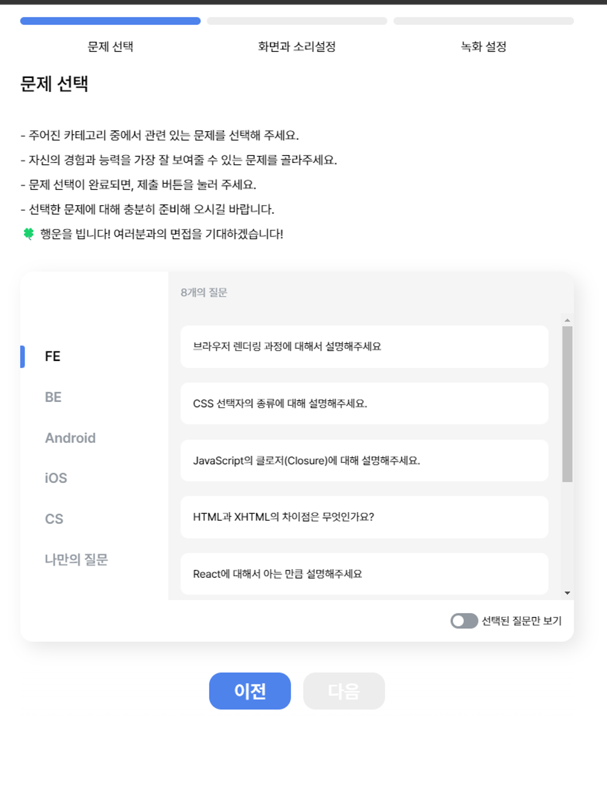
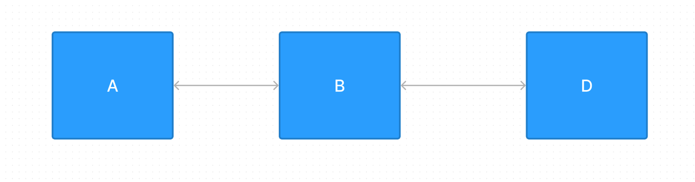
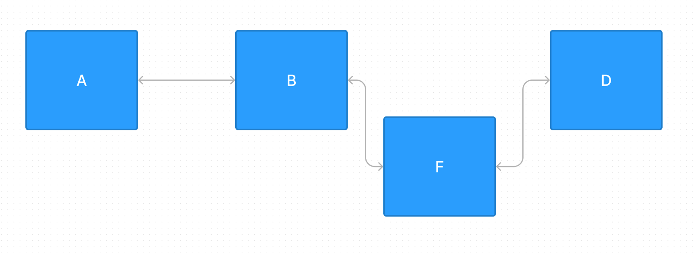
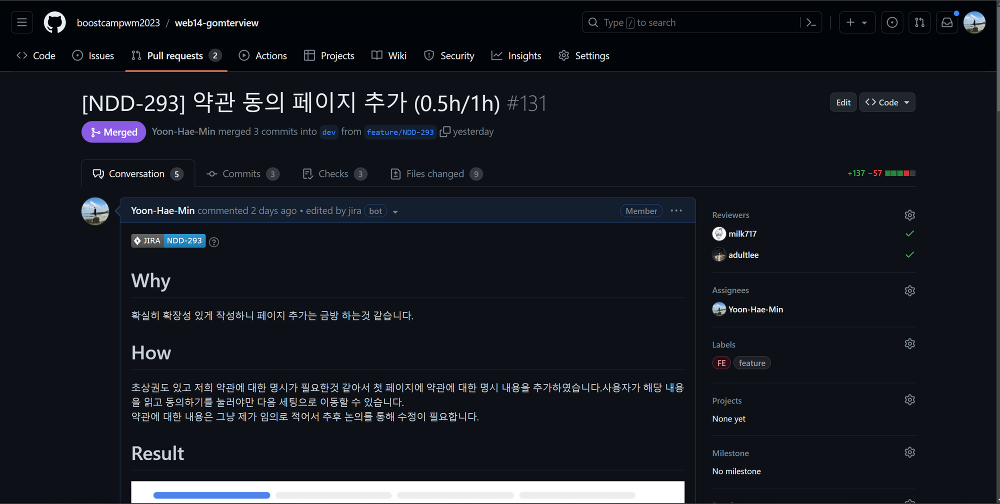

때는 곰터뷰 프로젝트에서 구현 도중에 생긴 일입니다. 곰터뷰에서는 다음과 같은 페이지가 있는데요.



면접 연습을 하기 위해서 사용하는 설정 페이지인데 해당 페이지에서 설정을하고 다음 설정으로 넘어가는 식으로 진행하는 페이지들을 구현해야 했습니다. 이를 구성하면서 페이지의 흐름이 어떻게 관리가 되는지 고민을 하였고 이를 풀어보고자 합니다.

## 개선 전

처음 고려했던 것 해당 페이지들을 URL로써 표현을 해주어야 하는가?였습니다.

URL 변경 없이 페이지를 전환시킬 수도 있지만 저희는 설정 페이지에 어디까지 갔는지 명시를 해주고 history 내에 저장하면서 뒤로, 앞으로 가기 등의 효과를 추가할 수 있어서 URL에 해당 페이지의 경로를 명시해주기로 했습니다.

<br/>

URL에 경로를 추가한다는 선택지 내에서도 Query String을 사용하는 방법과 Path Variable을 사용하는 방법이 있습니다. 설정 페이지의 의미상으로는 Path Variable이 더 적절하다고 생각하였습니다. 각 설정 페이지에 “접근”을 해서 설정하는 것이니까요.

<br/>

그다음으로는 라우터 처리를 어떻게 할 것인지에 대해서 봐야 합니다. 저희 프로젝트에서는 react-router-dom의 createBrowserRouter를 사용하고 있었고 이를 이용해 다음과 같이 표시할 수 있습니다.

```jsx
{
    path: PATH.INTERVIEW_SETTING,
    element: <InterviewSettingPage />,
    children: [
      {
        index: true,
        element: <QuestionSelection />,
      },
      {
        path: PATH.CONNECTION,
        element: <VideoSetting />,
      },
      {
        path: PATH.RECORD,
        element: <RecordMethod />,
      },
    ],
  },
```

그리고 가장 상위인 InterviewSettingPage에는 다음과 같이 작성되어 있었죠

```jsx
return (
  <InterviewSettingPageLayout>
    <Header />
    <Outlet />
  </InterviewSettingPageLayout>
);
// 대충 이런 느낌입니다.
```

여기까지 되게 합당하게 코드를 구성한것 같습니다. 공통인 부분을 묶고 페이지마다 개별적인 컴포넌트를 적용할 수 있으니까요 이런 식으로 작성이 된다면 `<Outlet/>`인 세팅 페이지 별로는 각각의 세팅 결과를 상태에 저장하는 로직과 페이지 내부의 UI가 들어갈 것입니다.

```jsx
return (
  <div>
    <div>대충 페이지 내부</div>
    <div>대충 상태 변경되는 컴포넌트</div>

    <button>이전 버튼</button>
    <button>다음 버튼</button>
  </div>
);

// 이런식으로 페이지 내용이 들어가겠네
```

`<Header>` 컴포넌트에는 지금의 진행도가 몇 단계인지 알려주는 로직이 들어가겠네요.

하지만 해당 페이지는 페이지의 흐름이 있다는 부분에서 기존의 페이지와 다른 특성을 띠고 있습니다. 따라서 하나의 페이지를 구성하는 방식과 같은 방법을 사용하면 약간의 불편함이 생깁니다.

## 어떤 점이 불편할까?

첫 번째는 해당 페이지의 흐름이 안 보인다는 것입니다. 다음 페이지로 넘어갈 때 또는 이전 페이지로 돌아올 때 버튼을 누르게 되는데 해당 버튼을 눌렀을 때 어디로 갈 것인지에 대한 정의가 각각의 페이지에 존재한다는 점입니다.

```jsx
// 현재는 B페이지

const handlePrePage= ()=>{
	navigate(A페이지로 이동)
}
const handleNextPage= ()=>{
	navigate(D페이지로 이동)
}

return (
    <div>
      <div>대충 페이지 내부</div>
      <div>대충 상태 변경되는 컴포넌트</div>

      <button onClick={handlePrePage}>이전 버튼</button>
      <button onClick={handleNextPage}>다음 버튼</button>
    </div>
  );
```

이런 페이지가 여러 개 있다고 상상해 봅시다 페이지가 어디서 어디로 가는지 흐름을 알려면 한눈에 보기 힘들겠지요. 그러다 보니 이 페이지들에, 흐름에 대한 명세서가 따로 필요했습니다.

두 번째로는 변경 점이 많다였습니다

F 페이지가 새로 생성이 되고 이는 B 페이지의 다음 설정으로 해야 한다고 가정해 보겠습니다.



A → B → D의 흐름으로 진행 중인 페이지

이제 F 페이지를 수정하려면 B 페이지에서 다음 버튼을 F 페이지로 연결하고 F 페이지에서 이전 버튼을 B 페이지로 설정하고 B 페이지에서 다음 페이지를 D 페이지로 설정해야 합니다. 또한 D 페이지 이전 버튼도 B 페이지로 설정해야겠지요.



벌써 복잡하죠? 하나를 추가하기 위해서 모든 페이지를 찾아다니며 이전 버튼과 다음 버튼을 재연결해 주어야 합니다. 그리고 변경 점도 3개나 됩니다. 이는 로직이 더 복잡해지면 복잡할수록 더 많은 복잡도와 변경 점을 불러오는 것입니다. 이는 결국 유지보수의 저하를 불러오죠

또 이런 특징은 `<Header>` 컴포넌트에도 볼 수 있는데요


제가 구현해야 하는 `<Header>`의 progress bar를 보겠습니다. 이 `<Header>` 컴포넌트 내부에 3개의 페이지에 대한 정보가 필요합니다.

처음에는 다음과 같은 꼴로 구현했습니다.

```jsx
const pageInfo = [....]

return(
	<div>
	{pageInfo.map(()=>{
		<div>
			대충 디자인
		</div>
	})}
	</div>
)
```

페이지가 하나 추가 되거나 제거될 때마다 `<Header>` 컴포넌트 내부에 page의 정보를 추가해 주어야 합니다. 페이지를 추가하면 page 연결과 `<Header>` 컴포넌트에 추가로 넣어주어야겠죠

<br/>

만약 createBrowserRouter의 pages 정보를 외부에서 받고 싶어서 props로 주입을 해주면 되는 거 아닌가 생각할 수도 있습니다.

```jsx
{
    path: PATH.INTERVIEW_SETTING,
    element: <InterviewSettingPage />,
    children: [
      {
        index: true,
        element: <QuestionSelectionBox />,
      },
      {
        path: PATH.CONNECTION,
        element: <VideoSettingBox />,
      },
      {
        path: PATH.RECORD,
        element: <RecordMethodBox />,
      },
    ],
// 이 부분을 <InterviewSettingPage />안에 있는 `<Header>`에 주입해 주면 되는 거 아닌가?
  },
```

children 정보를 InterviewSettingPage props로 넣고 `<Header>` 컴포넌트에 props로 주는 형식으로 props drilling을 통해 줄 수는 있습니다

```jsx
const pageInfo = [
      {
        index: true,
        element: <QuestionSelectionBox />,
      },
      {
        path: PATH.CONNECTION,
        element: <VideoSettingBox />,
      },
      {
        path: PATH.RECORD,
        element: <RecordMethodBox />,
      },
    ]

...

{
    path: PATH.INTERVIEW_SETTING,
    element: <InterviewSettingPage pageInfo={pageInfo}/>,
    children: pageInfo
  },
```

하지만 이는 페이지 react-router-dom에 너무 의존적이게 데이터를 주는 것이고 만약 `<Header>` 내에서 페이지에 대한 정보가 추가로 필요하다면 사용할 수 없는 방법이었습니다.

변수 pageInfo은 이미 react-router-dom에 의존적이니 변경할 수 없고 새로운 객체나 변수를 지정해야 합니다. 결국 이 방법도 페이지가 변경되었을 때 페이지도 변경하고 이 새로운 객체나 변수를 위한 값도 변경할 수밖에 없다는 결론을 내립니다.

<br/>

세 번째로는 관심사의 분리가 잘 되어있지 않다는 점 입니다.

설정 페이지 내부에서 다음, 이전의 페이지의 흐름과 페이지 내부 UI, 전역 상태 관리 등 모든 것을 담당하고 있습니다. 사실 일반적인 페이지를 보면 3가지 책임이 다 한 페이지 내부에 있는 것은 맞습니다. 하지만 지금 페이지는 “흐름이 있는 페이지”입니다. 그래서 저는 이 흐름은 하나의 관심사로 묶어서 보는 게 관리하기 쉽다고 생각하였습니다.

## 개선 후

이런 문제에서 생각난 것이 [토스의 컨퍼런스](https://www.youtube.com/watch?v=NwLWX2RNVcw)가 생각났습니다. useFunnel이라는 훅으로 페이지를 관리하는 것에 아이디어를 얻어 한번 적용해 보고자 하였습니다.

먼저 페이지의 흐름을 관리하기 위해서는 기존에 react-router-dom에서 와의 의존 관계를 끊고 세팅이라는 가장 상위 레벨의 페이지에서 페이지들을 관리해 페이지 내부의 상태로 관리하는 것이 좋다고 생각하였습니다.

```jsx
{
    path: PATH.INTERVIEW_SETTING,
    element: <InterviewSettingPage />,
    children: [
      {
        index: true,
        element: <QuestionSelectionBox />,
      },
      {
        path: PATH.CONNECTION,
        element: <VideoSettingBox />,
      },
      {
        path: PATH.RECORD,
        element: <RecordMethodBox />,
      },
    ],
  },
```

즉 이 부분의 코드를 다음과 같이 내부 페이지로 모두 넣어주어 개발자가 페이지들의 상태를 직접 관리하도록 변경하였습니다.

```jsx
{
    path: PATH.INTERVIEW_SETTING,
    element: <InterviewSettingPage />,
  },
```

그리고 해당 InterviewSettingPage안에선 페이지의 흐름만 관리하도록 하는 책임을 주었습니다. 따라서 기존의 Outlet을 이용한 템플릿을 선언하는 책임에서 페이지의 흐름을 직접 정의해 주는 흐름으로 변경하고자 하였습니다.

page 내부의 Query String으로 페이지의 상태를 관리하게 되었고 이 Query String에 따라 알맞는 페이지를 랜더링 하도록 설정하였습니다. Tab 컴포넌트를 사용하는 것과 비슷하다고 생각하시면 됩니다.

```jsx
const [current, setCurrent] = useStepPage(data.map((item) => item.path));

const [searchParams, setSearchParams] = useSearchParams();

return (
  <InterviewSettingPageLayout>
    <SettingProgressBar current={current}>
      {data.map((item) => {
        <SettingProgressBar.step name={item.name} onClick={changePageHandler} />;
      })}
    </SettingProgressBar>
    <StepPage.wrapper current={current}>
      {data.map((item) => {
        <StepPage.step path={item.path}>{item.page}</StepPage.step>;
      })}
    </StepPage.wrapper>
  </InterviewSettingPageLayout>
);
// 대충 이런 느낌으로 진행 하고자 하였습니다.
// 실제 코드는 아님 주의
```

StepPage 컴포넌트는 인자로 받는 current에 따라서 알맞은 StepPage.step을 렌더링 해주는 컴포넌트입니다. 이를 통해서 Query String에 따른 알맞은 페이지를 렌더링 시켜줄 수 있죠.

`<Header/>` 에있는 progress bar 또한 해당 페이지에 넣어서 페이지들의 정보를 받아서 작동하도록 수정하였습니다.

이렇게 jsx를 선언하면 자연스럽게 페이지 정의도 다음과 같이 맞춰지는데요.

```jsx
  const data = [
    {
      name: '문제 선택',
      path: 'question',
      page: <QuestionSelectionBox onNextClick={} onBeforeClick={} />,
    },
    {
      name: '화면과 소리설정',
      path: PATH.CONNECTION,
      page: <VideoSettingBox onNextClick={} onBeforeClick={} />,
    },
    {
      name: '녹화 설정',
      path: PATH.RECORD,
      page: <RecordMethodBox onNextClick={} onBeforeClick={} />,
    },
  ];

```

되게 간단하게 페이지 정보를 정의할 수 있습니다.

합쳐서 보면 다음과 같습니다.

```jsx
const InterviewSettingPage: React.FC = () => {
  const navigate = useNavigate();
  const data = [
    {
      name: '문제 선택',
      path: 'question',
      page: <QuestionSelectionBox onNextClick={} onBeforeClick={} />,
    },
    {
      name: '화면과 소리설정',
      path: PATH.CONNECTION,
      page: <VideoSettingBox onNextClick={} onBeforeClick={} />,
    },
    {
      name: '녹화 설정',
      path: PATH.RECORD,
      page: <RecordMethodBox onNextClick={} onBeforeClick={} />,
    },
  ];

  const [current, setCurrent] = useStepPage(data.map((item) => item.path));

  const [searchParams, setSearchParams] = useSearchParams();

  const changePageHandler = () => {
    //query string만 바꾸는 함수
  };
  return (
    <InterviewSettingPageLayout>
      <SettingProgressBar current={current}>
        {data.map((item) => {
          <SettingProgressBar.step
            name={item.name}
            onClick={changePageHandler}
          />;
        })}
      </SettingProgressBar>
      <StepPage.wrapper current={current}>
        {data.map((item) => {
          <StepPage.step path={item.path}>{item.page}</StepPage.step>;
        })}
      </StepPage.wrapper>
    </InterviewSettingPageLayout>
  );
};

export default InterviewSettingPage;
```

이제 아까 보았던 문제점을 다시 보겠습니다. 첫 번째로 흐름이 잘 보이지 않는다. data라는 배열에 페이지에 대한 정보가 저장되어 있으니 해당 배열에서 어떤 페이지로 넘어가는지 바로 볼 수 있습니다.

<br/>

두 번째로는 변경 점이 많다였는데 지금 추가하거나 삭제를 하면 해당 페이지 data배열만 변경 점이 생기니 적은 변경 점과 적은 코드 수정을 가져갈 수 있습니다.

<br/>

세 번째로는 해당 페이지는 페이지의 흐름에 대한 관심사만 가지고 있어 내가 페이지를 추가할 때는 해당 페이지가 어떤 역할을 하는지만 집중할 수 있습니다.

<br/>

해당 코드를 바탕으로 동료들과 코드를 미리 맞춰보는 pre commit review를 진행하여 미리 코드를 점검받고 큰 구조 변경에 대한 사항들을 미리 숙지시키며 의견을 맞춰 본 다음 실제로 적용하였습니다

구현 도중 페이지 접근에 대한 예외 처리와 `const [current, setCurrent] = useStepPage(data.map((item) => item.path));`
대신에 searchParams 자체로 상태를 사용하면 된다는 점을 추가해 다음과 같이 수정하여 최종본을 만들 수 있습니다.

```jsx
const InterviewSettingPage: React.FC = () => {
  const navigate = useNavigate();
  const [searchParams, setSearchParams] = useSearchParams();

  const currentPage = searchParams.get('page');

  const pageInfo = [
    {
      name: '문제 선택',
      path: SETTING_PATH.QUESTION,
      page: (
        <QuestionSettingPage
          onPrevClick={() => navigate('/')}
          onNextClick={() => changeSearchParams(SETTING_PATH.CONNECTION)}
        />
      ),
      state: useRecoilValue(questionSetting)
    },
    {
      name: '화면과 소리설정',
      path: SETTING_PATH.CONNECTION,
      page: (
        <VideoSettingPage
          isCurrentPage={currentPage === SETTING_PATH.CONNECTION}
          onPrevClick={() => changeSearchParams(SETTING_PATH.QUESTION)}
          onNextClick={() => changeSearchParams(SETTING_PATH.RECORD)}
        />
      ),
      state: useRecoilValue(videoSetting)
    },
    {
      name: '녹화 설정',
      path: SETTING_PATH.RECORD,
      page: (
        <RecordSettingPage
          onPrevClick={() => changeSearchParams(SETTING_PATH.CONNECTION)}
          onNextClick={() => navigate('/interview')}
        />
      ),
      state: useRecoilValue(recordSetting)
    }
  ];

  const changeSearchParams = (newPage: string) => {
    const newSearchParams = new URLSearchParams(searchParams);
    newSearchParams.set('page', newPage);
    setSearchParams(newSearchParams, { replace: true });
  };

  //... 페이지 접근에 따른 예외 처리...//

  return (
    <InterviewSettingPageLayout>
      <div css={css`...`}>
        <ProgressStepBar>
          {pageInfo.map((item) => (
            <ProgressStepBar.Item
              key={item.name}
              name={item.name}
              isCompleted={item.state.isSuccess || currentPage === item.path}
            ></ProgressStepBar.Item>
          ))}
        </ProgressStepBar>
      </div>
      <StepPage page={currentPage}>
        {pageInfo.map((item) => (
          <StepPage.step key={item.path} path={item.path} page={currentPage}>
            {item.page}
          </StepPage.step>
        ))}
      </StepPage>
    </InterviewSettingPageLayout>
  );
};

export default InterviewSettingPage;
```

최근에 설정 페이지에 약관 동의 설정을 추가할 일이 있었는데요 처음에 이 페이지를 설계하면서 의도한 대로 큰 변경 점 없이 배열의 값 하나만 추가해서 구현할 수 있었습니다.

페이지 내부에만 신경 써서 구현하면 되니 굉장히 쉽게 변경할 수 있었습니다.


