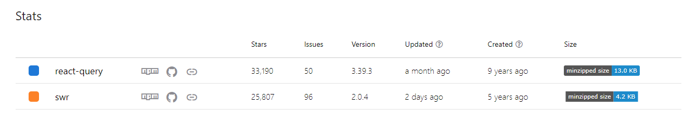

## 서론

둘이 비교하기 앞서 왜 이런 라이브러리를 쓰는지부터 보고 가자

React에서 서버로부터 데이터를 가져오거나 전송해야할때 fetch Api를 사용하거나 axios를 사용하고는 한다. 이를 사용해서 충분히 서버와 데이터를 주고받을 수 있으나 규모가 커지면서 데이터 처리, 에러핸들링과 같은 부가적인 요인들이 많아지게 된다. 직접 구현해도 되지만 라이브러리를 이용해서 좀 더 쉽게 처리할 수 있다.

## 공통점

1\. 데이터 요청 및 관리를 하기 쉽게 만들어 준다.

2\. 캐시를 통해 api 호출을 줄이고 성능(UX)를 향상할 수 있다.

두 가지의 공통점은 React-Query, SWR의 공통점이자 데이터 fetch라이브러리를 사용하는 가장 큰 특징이라 생각한다.

#### 1\. 데이터 요청 및 관리 용이

먼저 첫번째 특징은 한 번이라도 사용해 봤으면 체감적으로 쉽게 이해할 수 있다.

기존의 axios를 사용해서 데이터를 처리하면 다음과 같이 data에 대한 상태, loading의 대한 상태 error의 대한 상태를 만들어서 직접 설정해 주어야 한다.

```jsx
const [data, setData] = useState([]);
const [isLoading, setIsLoading] = useState(true);
const [error, setError] = useState(null);

useEffect(() => {
  const fetchData = async () => {
    try {
      const response = await axios.get(url);
      setData(response.data);
      setIsLoading(false);
    } catch (error) {
      setError(error);
      setIsLoading(false);
    }
  };
  fetchData();
}, []);
```

다만 데이터 fetch라이브러리를 사용한다면 다음과 같이 한줄로 처리할 수 있다.

```jsx
// react-query
const { isLoading, error, data } = useQuery('posts', () => axios.get(url).then((res) => res.data));
```

또한 onSuccess, onError등 옵션함수를 사용하여 데이터를 처리할 수 있다. 한눈에 봐도 훨씬 사용하기 편해진 것을 알 수 있다.

#### 2\. 캐시

두 라이브러리 전부 swr(stale-while-revalidate)전략을 사용해서 데이터를 캐시 한다. SWR라이브러리는 stale-while-revalidate 전략의 줄임말인 swr을 그대로 라이브러리명으로 사용한다. 그래서 stale-while-revalidate전략을 검색하고 싶으면 swr이 아닌 풀 키워드로 검색해야 관련 검색결과가 나온다. 왜 이름을 이렇게 지어서 ㅠㅠ

stale-while-revalidate전략은 클라이언트 측에서 캐시된 데이터를 반환하면서 서버로부터 새로운 데이터를 비동기적으로 가져오는 캐시 전략이다. 비유를 해서 설명하자면 장난감을 만들어주는 기계를 렌트한다고 생각해 보자  내가 가지고 있는 캐시 데이터를 먼저 보여주고 뒤에서 새로운 데이터를 가져온다.

우유가 하나 판다고 가정 하자. 이 우유는 유통기한과 소비기한이 있다. 유통기간이 지나지 않았으면 그대로 팔아도 되고 소비기한이 지나지 않았으면 마셔도 된다. 캐시도 마찬가지이다. 캐시의 cache Time은 유통기한으로 이 기간이 지나지 않았으면 기존의 데이터를 써도 된다. stale Time은 소비기한으로 우유를 마시는 건 가능하지만 팔기에는 찝찝한 기간이다. 여기서 swr전략이 제시한 것이 기존의 데이터를 보여주면서 뒤에서 새로운 데이터를 가져온다는 것이다. 즉 소비기한이 지나지 않은 우유는 팔아도 되지만 팔면서 새로운 우유를 사 와서 기존우유랑 교체해야 된다는 것이다. 만약 소비기한이 지났다면 우유를 폐기하고 새로운 우유를 가져와야 한다.

#### stale Time

```jsx
//react-query
const { data } = useQuery('myData', fetchMyData, { staleTime: 10000 });
```

```jsx
//swr

const { data, error } = useSWR(url, {
  // staleTime을 10초로 설정
  staleTime: 10000
});
```

option의 설정으로 간편하게 stale Time을 설정할수 있다.

#### cache Time

```jsx
//SWR
const { data, error } = useSWR('myData', fetchMyData, { dedupingInterval: 5000 });
```

```jsx
// react-query
const { data, isLoading, error } = useQuery('myData', fetchMyData, { cacheTime: 10000 });
```

option의 설정으로 간편하게 cacheTime을 설정할수 있다.

유통기한(cache Time)과 소비기한(stale Time)을 상황에 맞게 적절히 선택해서 사용하면 더 효과적으로 우유를 팔 수 있다. \= 캐시를 사용한다면 서버와 불필요한 통신을 줄일수 있고 swr 전략 방법을 사용한다면 서버에서 데이터를 불러오는 사이에 기존의 데이터를 보여줌으로써 페이지에서 로딩창이 아닌 데이터를 사용하게 되는 것이므로 사용자 경험(UX)을 높일 수 있다.

적절한 시간을 선택한다면 좋은 결과로 이어지는것이다.... 마법의 단어 "적절한".. 그래서 내 기준을 한번 정리해 보겠다.

1. 별이유가 없으면 기본 값으로 세팅하자 크게 느껴지는 단점이 없거나 최적화가 필요하지 않는다 생각하면 기본값에서 잘 바꾸지 않는다. 보통은 최적화 단계에서 캐시 관련 부분을 고민한 듯하다. 2. 절대 바뀌지 않는 값은 그냥 cache Time을 길게 설정해서 캐시값으로 들고 있자.

2. cache Time보다 stale Time이 크지 않도록 설정한다.

\=> 만약 cache Time이 커지게 된다면 캐시 된 데이터가 먼저 만료 되므로 캐시된 데이터를 보여줘야 하는데 보여줄 데이터가 없게 된다.

4. 프로젝트의 특징을 고려한다.

\=> 어쩔 수 없이 개발자의 판단 및 경험이 들어가야 한다. 이건 경험의 영역인 것 같다. 일단 실패해도 좋으니 설정을 해보고 피드백해 나아가자

## 차이점

#### 1\. 기능의 차이

1-1. 문법의 차이

```jsx
//SWR
const { data, error } = useSWR('myData', fetchMyData, { dedupingInterval: 5000 });
```

```jsx
// react-query
const { data, isLoading, error } = useQuery('myData', fetchMyData, { cacheTime: 10000 });
```

위의 예제를 다시 가져왔다 기본적인 문법은 다르지만 둘 다 추구하는 방향은 같아 사용방법은 비슷하다는 것을 알 수 있다.

자세한 차이점은 공식문서를 보면 알수 있다.

&nbsp;

1-2. 지원 목록의 차이

React-Query는 GraphQl과 WebSocket을 지원하지만 SWR은 그렇지 않다.

&nbsp;

1-3. dev tools유무

React-Query는 정식 dev tool이 있지만 SWR은 정식 dev toold이 없다.

이외에도 여러 차이점이 있지만 내가 전부 경험한 것도 아니기 때문에 링크로 대체하겠다.

[React Query vs SWR React Query와 SWR의 차이점](https://tech.madup.com/react-query-vs-swr/)

#### 2\. 관점차이

둘이 서버의 데이터를 바라보는 시각이 조금 달랐다는 게 흥미로웠다.

React-query는 상태를 서버상태와 클라이언트 상태로 바라보고 서버 쪽에서 주고받는 데이터를 서버상태로 본다. 그에 비해서 SWR은 서버에서 데이터를 받아와 데이터를 클라이언트에서 전역 상태로 업데이트하는 관점으로 보고 있다. 사실  서버에서 데이터를 받아와 global state로 데이터를 들고 있다는 점은 똑같은데 각 개발의 관점이 다르다는 것이 흥미로웠다.

이 관점의 차이는 기능의 차이로 이어졌다. SWR은 데이터를 받아오는 것에 중점을 두고 있었기 때문에 mutation hook이 존재하지 않았었다 (최근에 업데이트로 useSWRMutation hook이 생겼다) 또한 SWR은 클라리언트의 전역 상태와 연관이 있기 때문에 useSWR hook을 이용해서 서버의 데이터를 받아오는 hook으로만 사용하는 것이 아닌 전역 상태로 사용할 수 있다.

이에 비해서 React-Query는 상태 자체를 서버와 클라이언트를 나누어서 보고 있으므로 클라이언트의 전역 상태를 사용하려면 전역 상태 라이브러리나 context api를 사용해서 관리해야 한다.

#### 3\. 번들 사이즈 차이



번들은 React-Query 13kb, SWR 4kb로 React-Query가 3배가량 크다.

#### 4\. 속도 비교

[Server Side Rendering은 정말 빠르게 render 되는가](https://jasonkang14.github.io/nextjs/is-server-side-rendering-really-faster)

해당 블로그글을 참고해서 보자면 SWR보다 React-Query가 더 빠르다는 것을 알 수 있다. SWR이 Nextjs에서 더 느리다는것이 좀 의외였다.

## 그래서 어느거 쓸래?

내 기준으로는

1\. 팀원과 상의해봤을 때 더 사용하기 익숙한 것

2\. 프로젝트에서 사용하는 기술이 라이브러리 기능에 포함하는지

[Comparison | React Query vs SWR vs Apollo vs RTK Query vs React Router | TanStack Query Docs](https://tanstack.com/query/latest/docs/react/comparison?from=reactQueryV3&original=https%3A%2F%2Ftanstack.com%2Fquery%2Fv3%2Fdocs%2Fcomparison)

솔직히 추구하는 목표는 같기 때문에 무엇을 사용해도 크게 상관이 없다고 생각한다. 편한 거 쓰자 편한 게 짱이여~

그래도 개인적으로는 React-Query가 더 좋다 이것저것 많이 들어있고 무엇보다도 서버상태와 클라이언트 상태로 나누었다는 점을 생각하면서 코드를 짜면 훨씬 더 생각하기도 편해지고 코드도 깔끔하게 나오는 것 같다.
