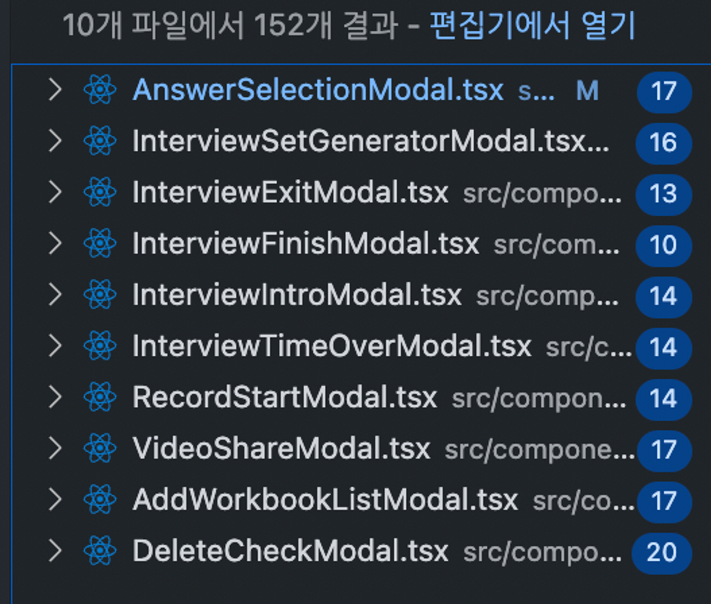
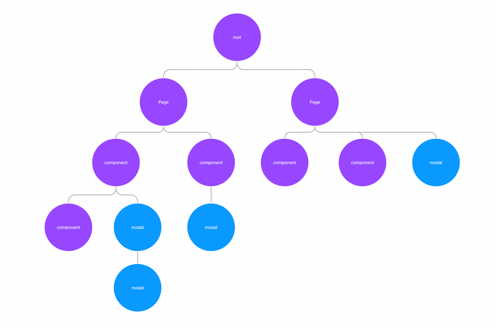
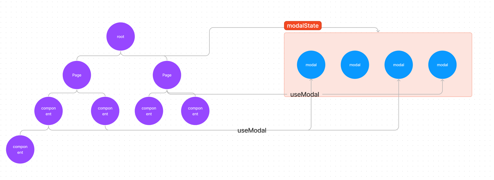
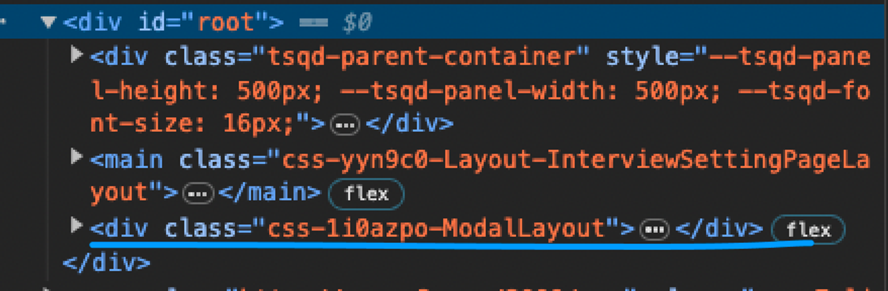
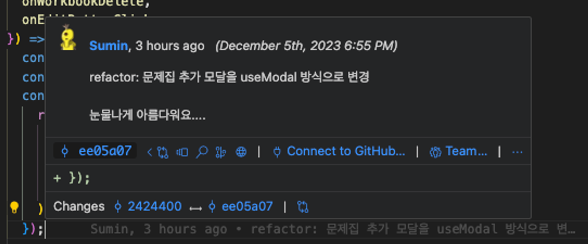

## 서론

프로젝트가 커질수록 점점 더 많은 modal이 생겨나기 시작했습니다. 기존에 존재했던 10개 파일이 있었고 추가로 사용하는 Modal까지 넣는다면 매우 많은 modal이 프로젝트 내에 사용되고 있는 것이었죠.



보통 modal을 관리하는 방법은 하나의 페이지 내부에 state로 modal의 on off를 관리하는 식으로 작동합니다. 저희 프로젝트 또한 이렇게 관리하고 있었습니다.

```jsx
const [isOpen,setIsOpen] = useState(false);

const closeModal = ()=>{
	setIsOpen(false);
}

const openModal = ()=>{
	setIsOpen(true)
}

return (
<Modal1/>
<Modal2/>
...
)
```

하지만 이 페이지나 컴포넌트 안에 있는 modal 둘은 약간의 문제가 있는데요. 컴포넌트나 페이지에 종속적이다 보니 modal의 레이아웃이 밖의 css에 영향을 받는 경우도 종종 생깁니다.

## 일차적 해결 방법

이런 문제를 해결할 방법이 react의 `createPortal`입니다. 해당 dom을 특정 구역에 렌더링시키는 방법입니다.

다음은 root element 바로 밑에 modal을 렌더링 시키는 코드입니다.

```jsx
const Modal = ({ children, isOpen }) => {
  if (!isOpen) {
    return null;
  }

  return ReactDOM.createPortal(
    <div>
      <div>{children}</div>
      <div></div>
    </div>,
    document.getElementById('root')
  );
};

const App = () => {
  const [isModalOpen, setIsModalOpen] = useState(false);

  const closeModal = () => {
    setIsOpen(false);
  };

  const openModal = () => {
    setIsOpen(true);
  };

  return (
    <div>
      <button onClick={openModal}>모달 열기</button>
      <Modal isOpen={isModalOpen}>
        <h1>모달 제목</h1>
        <p>여기에 내용을 채워넣으세요.</p>
        <button onClick={closeModal}>닫기</button>
      </Modal>
    </div>
  );
};
```

하지만 이것은 modal의 렌더링 위치를 바꾸어준다일뿐 코드 구조상으로는 바뀐게 없습니다. 여전히 modal의 on off를 관리하는 state는 해당 페이지나 컴포넌트에 존재하고 있습니다.

## 이차적 해결 방법

일단은 저 closeModal openModal이 modal을 사용하는 파일마다 모두 중복해서 작성해야 한다는 불편한 점이 있습니다. 그래서 간단하게 저것을 useModal hook으로 만들어 보고자 하였습니다.

```jsx
const useModal = (initialState = false) => {
  const [isOpen, setIsOpen] = useState(initialState);

  const openModal = () => setIsOpen(true);
  const closeModal = () => setIsOpen(false);

  return { isOpen, openModal, closeModal };
};

export default useModal;

const App = () => {
  const { isModalOpen, closeModal, openModal } = useModal(false);

  return (
    <div>
      <button onClick={openModal}>모달 열기</button>
      <Modal isOpen={isModalOpen}>
        <h1>모달 제목</h1>
        <p>여기에 내용을 채워넣으세요.</p>
        <button onClick={closeModal}>닫기</button>
      </Modal>
    </div>
  );
};
```

하지만 중복되는 코드는 줄일 수는 있어도 근본적인 문제는 해결하지 못하였습니다. 바로 modal은 페이지나 컴포넌트에 종속적이지 않은데 JSX는 결국 해당 페이지나 컴포넌트의 JSX에 있어야 한다는 점입니다.

이런 식의 코드는 결국 코드가 길어졌을 때 다음과 같은 구조가 됩니다.



이런 구조는 2가지 이상하다고 생각하는 점이 있었는데요. 첫 번째는 페이지나 컴포넌트에서 관심이 있는 것은 이 modal을 열어야 할지 닫아야 할지에 대한 책임만 필요하다 생각했습니다. 두 번째로는 createPortal을 사용하면 dom 자체는 root 바로 밑에서 렌더링 되지만 실제 jsx 연결부는 페이지나 컴포넌트여야 한다는 사실이 이상했습니다.

## 최종 해결 방법

그래서 생각한 게 modal의 JSX가 굳이 여기에 존재하여야 하는가였습니다. 이걸 hook이 관리하면 되지 않을까 생각하였고 마침 전역 상태를 사용하고 있어 이를 이용해 보고자 하였습니다.



이런 식으로 useModal을 이용해서 전역 상태에 modal 컴포넌트 자체를 상태로 올려놓고 root 바로 아래에서 렌더링 시켜주려 하였습니다.

그러면 useModal hook은 다음과 같은 구조로 쓸 수 있죠

```jsx
const { isOpen, openModal, closeModal } = useModal(() => {
  return (
    <AnswerSelectionModal workbookId={workbookId} question={question} closeModal={closeModal} />
  );
});
```

이런 방식으로 구현할때는 다음과 같은 부분을 고려해 주어야 합니다.

1. useModal에서 인자로 받은 컴포넌트를 전역 상태로 설정한다
2. modal은 root 바로 밑에서 렌더링하고 있다
3. 전역 상태에 있는 modal은 항상 열린 상태이다.

### state

```jsx
export const modalState = atom<{ id: string; element: React.FC }[]>({
  key: 'modalState',
  default: [],
});
```

먼저 저희 프로젝트는 recoil을 사용하고 있었으므로 atom을 이용한 전역 상태를 정의해야 합니다. 따라서 다음과 같이 정의를 하였죠. 값은 id와 functional component를 전역으로 받고 있습니다.

id를 이용하여 modal을 식별할 수 있고 배열로 만들어 modal이 여러 개를 open해도 중첩으로 modal을 사용할 수 있도록 하였습니다.

### useModal

useModal의 구현부를 보겠습니다.

```jsx
const isArrEmpty = (arr: unknown[]) => arr.length === 0;

const useModal = (component: React.FC) => {
  const [modalElements, setModal] = useRecoilState(modalState);
  // 전역 상태에 element 자체를 상태로 저장한다.
  const [isOpen, setIsOpen] = useState(false);
  // 해당 컴포넌트가 열렸는지 안열렸는지 알려주는 상태
  const id = useId();
  // 컴포넌트에 id를 부여해서 식별한다.

  const modalComponent = useMemo(() => component, []);

  const openModal = useCallback(() => {
    setIsOpen(true);
    setModal((pre) => [...pre, { id: id, element: modalComponent }]);
    // modal을 전역상태에 추가한다
    document.body.style.overflow = 'hidden';
    // modal이 open되면 배경의 스크롤을 막아야함
  }, []);

  const closeModal = useCallback(() => {
    setIsOpen(false);
    setModal((pre) => pre.filter((c) => c.id !== id));
    // modal을 전역상태에서 제거한다.

    if (isArrEmpty(modalElements)) document.body.style.overflow = 'unset';
    // modal이 모두 꺼지면 배경의 스크롤이 가능해야함
  }, []);

  return { isOpen, openModal, closeModal };
};

export default useModal;
```

useModal은 전역 상태에 해당 modal 컴포넌트들을 추가 또는 제거해서 modal이 열렸는지 닫혔는지를 관리해 주는 hook입니다. 첫 번째 고려사항이죠

### ModalProvider

자 그러면 이제 전역 상태인 modal 컴포넌트를 랜더링 해서 modal이 root 바로 밑에서 열린다는 두 번째 고려 사항을 보겠습니다. 저는 이를 ModalProvider로 해결했는데요

```jsx
import { modalState } from '@atoms/modal';
import { useRecoilState } from 'recoil';

const ModalProvider = () => {
  const [state] = useRecoilState(modalState);
  return (
    <>
      {state.map(({ id, element }) => {
        return <Component key={id} component={element} />;
      })}
    </>
  );
};

const Component = ({ component, ...rest }: { component: React.FC }) => {
  return component({ ...rest });
};

export default ModalProvider;
```

전역 상태를 가져와서 단순하게 렌더링 해주고 있는 역할을 하는 것을 볼 수 있습니다. 배열로 되어 있어 배열에서 뒤 순서로 있는 modal이 쌓임 맥락 때문에 이전 modal보다 더 위에 존재하게 되어서 중첩 modal을 이런 단순 배열로 처리할 수 있습니다.

해당 ModalProvider은 provider들을 관리하고 있는 App 컴포넌트에서 실행이 되고 있는데요

```jsx
...
<RecoilRoot>
  <ThemeProvider theme={theme}>
    <Global styles={_global} />
    <AppRouter queryClient={queryClient} />
    <GlobalSVGProvider />
    <ModalProvider />
  </ThemeProvider>
</RecoilRoot>
...
```

이러면 router보다는 바깥 영역이고 root보다는 아래 영역이니 다음과 같은 곳에서 modal이 추가가 된 것을 볼 수 있습니다.



결국 해당 전역 state에 컴포넌트를 추가하면 그 즉시 root 하단 부에 바로 렌더링 되고 있는 걸 볼 수 있습니다.

## 결론

modal을 제어하는 부분을 hook으로 모으면서 응집도를 높일 수 있고 확실한 책임을 주었는데요. 제가 이 hook을 사용하면서 가장 크게 장점으로 느낀 것은 modal의 종류가 많은 프로젝트에 유용하게 사용되었다고 생각합니다. 각각의 modal에 필요한 데이터가 많은데 modal을 등록하는 위치가 자유로우니 선택할 수 있는 선택지가 많아진 것이죠.

<br/>

특히 불필요한 코드들이 줄이면서 더 이상 개발자는 modal의 상태를 지정하는 state modal의 렌더링 위치 등을 알 필요가 없어졌습니다. 그냥 modal을 잘 디자인하고 잘 동작시키기만 하는데 집중을 하면 됩니다.


