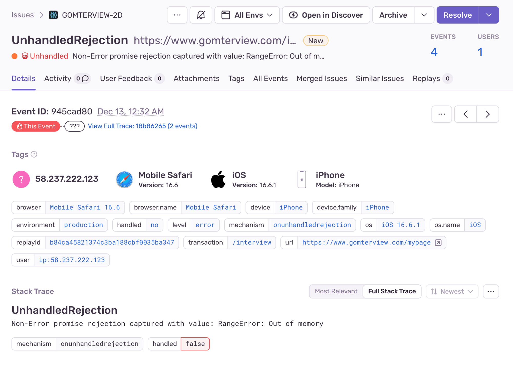

## 서론

만약 사용자가 우리의 서비스를 사용하고 있다가 뜻밖의 에러를 만나서 서비스가 동작하지 않는다면 어떨까요? 굉장히 당황스럽겠죠. 어떤 안내도 없이 서비스가 터져버려서 빈 화면이 나타나던지 아니면 앱이 깨진다던지 등 예상치 못한 상황들이 발생하면 이는 UX에 있어서 굉장히 큰 타격을 줍니다.

그래서 프론트엔드에서 에러 핸들링은 UX을 위해서 중요한데요. 곰터뷰에서 사용했던 에러 핸들링 기법을 보면서 한번 소개해 보고자 합니다.

## 어떤 에러가 있을까?

프론트에서 어떤 에러가 일어날 수 있는지부터 보겠습니다.

1. 유저의 상호작용으로 일어난 에러
2. API 통신으로 일어난 에러
3. 환경에 의한 에러
4. 아무도 모르는 에러

먼저 유저의 상호작용으로 일어나는 에러는 유저의 어떤 클릭이나 인터렉션으로 인해서 코드의 충돌로 인한 오류들입니다. 이 부분은 프론트엔드 개발자가 직접 제어할 수 있는 부분으로 코드를 짜고 테스트할 때 대부분 제거할 수 있습니다.

API 통신으로 일어난 에러는 프론트에서 직접 제어할 수 없으므로 직접적인 제거는 불가능하는데요. 그래서 API 통신 에러들은 네트워크 환경이 불안정합니다 재시도해주세요 등과 같은 API를 다시 시도하는 선택지를 주곤 합니다.


환경에 의한 에러도 있는데요. 브라우저의 환경에 따른 내부 서비스의 지원 여부 라든가 네트워크가 너무 느려서 접근하기 힘든 환경들도 있을 것입니다. 이는 직접적으로 하나하나씩 다 조사해서 판단해야 하기 때문에 이미 알고 있는 문제가 아니면 굉장히 찾기 힘든 과정들입니다.

마지막으로는 아무도 모르는 에러 즉 개발자도 예상하지 못한 에러들입니다. 이것은 막을 방법도 찾는 방법도 모르는 진짜 에러들을 뜻합니다.

## 에러를 잡아보자

프론트엔드 개발자는 이런 에러들을 잡을 방법이 여러 가지가 존재합니다.

가장 기본적으로는 try/catch문입니다.

```jsx
try {
      void createNewWorkbook();
      onAddNewWorkbook();
    } catch (err) {
      console.log(err);
      throw err;
    }
  };
```

에러 상황이 발생할 수 있는 문제에 대해서는 JS에서 제공해 주는 try/catch문으로 감싸서 에러에 대한 분기처리를 해줄 수 있습니다. 이런 식으로 에러 핸들링을 사용하면 개발자가 에러에 대해서 어떻게 지정해 줄 것인지 직접적으로 확인할 수 있죠

두 번째로는 react-query에서는 onError라는 옵션이 존재합니다.

```jsx
useMutation(addTodo, {
  onError: (error, variables, context) => {
    // 오류 처리 로직
    console.error(`Adding todo failed:`, error);
  }
});
```

해당 API가 실행되고 나서 오류 발생 시를 컨트롤할 수가 있었죠.

세 번째로는 react-router-dom의 설정에서도 처리가 가능합니다

```jsx
const router = createBrowserRouter([
  {
    path: '/',
    element: <HomePage />,
    errorElement: <ErrorPage />
  },
  {
    path: '*',
    element: <NotFoundPage />
  }
]);
```

네 번째로는 axios에서 설정도 가능합니다.

```jsx
axios.interceptors.response.use(
  (response) => {
    // 요청이 성공했을 때 실행될 로직
    return response;
  },
  (error) => {
    // 요청이 실패했을 때 실행될 로직
    // 여기서 error는 HTTP 응답 상태 코드가 200 범위가 아닌 경우 발생
    if (error.response) {
      // 서버가 응답을 반환했으나 2xx 범위가 아닌 상태 코드인 경우
      console.log('Server responded with non 2xx code:', error.response.status);
      console.log('Response data:', error.response.data);
    } else if (error.request) {
      // 요청이 이루어졌으나 응답을 받지 못한 경우
      console.log('No response received:', error.request);
    } else {
      // 요청 설정 중 발생한 오류
      console.log('Error setting up request:', error.message);
    }

    // 오류 처리 후 오류를 다시 throw하여 호출한 쪽에서도 처리할 수 있게 함
    return Promise.reject(error);
  }
);
```

이 이외에 다른 라이브러리에서도 에러처리를 할 수 있게끔 설정을 주고 있습니다.

그러면 개발자는 이걸 전부 다 사용해서 모든 경우의 수를 다 잡아야 할까요? 물론 그래도 상관은 없지만 이랬을 때의 문제점이 에러가 어떻게 처리되는지 알려면 모든 라이브러리의 사용처를 다 찾아봐야 한다는 문제가 생깁니다. 또한 axios나 react-query 같은 경우는 둘 다 API에 대한 에러를 처리를 담당하고 있는데 둘 다 설정을 해주게 된다면 에러가 어디로 들어가서 처리가 되는지 중복으로 에러설정을 하고 있는지 등의 문제도 발생합니다.

## 계층을 나누어 보자

그래서 에러를 계층으로 나누어 봐서 필요한 옵션만 사용해야 합니다.

중복되는 에러는 하나로 합치고 가장 상위로 위임해서 최소한의 관리점에서 관리하려 하였고 그 결과 다음과 같은 구조로 만들 수 있었습니다.


에러는 각각의 페이지나 컴포넌트에서 잡지 말고 가장 최상위 계층에서 처리하는 구조로 이루어져 있는 걸 볼 수 있습니다. 따라서 에러가 수정되거나 추가되었을 때 해당 파일만 관리하면 됩니다.

### Router 내부 에러

페이지를 진입할 때 생기는 에러를 핸들링합니다 이 페이지에 접근할 수 있는지에 관한 설정을 합니다.

```jsx
const router = createBrowserRouter([
  {
    path: '/',
    element: <HomePage />,
    errorElement: <ErrorPage />
  },
  {
    path: '*',
    element: <NotFoundPage />
  }
]);
```

지정되지 않은 경로로 들어가면 NotFoundPage를 보여주고 loader에서 에러(페이지 진입 시 실행되는 함수)가 발생하면 errorElement로 넘어가도록 설정을 하고 있습니다. 실제 페이지에 접근하지 않고 라우터단에서 바로 전환한다는 특징이 있습니다.

### 페이지 내부 에러

페이지 내부에서 수많은 API를 사용하고 있는데요. 각각의 엔드포인트에 대한 에러에 대해서 핸들링이 필요합니다. API 하나당 가능한 에러는 많기 때문에 프론트 혼자서 케이스를 찾기는 힘듭니다. 그래서 백엔드와 협업해서 에러에 대한 정의를 확립한 후 작업을 해야 합니다.

에러를 계층으로 처리하기 이전에는 API호출부에서 에러코드를 입혀주는 식으로 작업해야 하지만 계층으로 분리하니 전역에서 에러코드를 어떻게 처리하면 될 것인지 관리를 하면 됩니다.

```jsx
// before

try {
    const response = await axios.get('/some-endpoint');
    return response.data;
  } catch (error) {
    // Axios 오류 객체에서 응답을 추출하고 오류 처리
    if (error.response) {
      case 'W01':
			...로직...
			  break;
			case 'W02':
			...로직...
			  break;
			case 'W03':
			...로직...
				break;
// 모든 API에 해당하는 에러코드를 이런식으로 달아주어야 했다.
    } else {
      throw new Error('Network Error');
    }
  }

// after

// 모든 axios에 대한 응답이 왔을때 실행이됨
axios.interceptors.response.use(
  response => {
    // 요청이 성공했을 때 실행될 로직
    return response;
  },
  error => {
		...
		case 'W01':
		...로직...
		  break;
		case 'W02':
		...로직...
		  break;
		case 'W03':
		...로직...
			break;
		// API에 대한 에러를 가장 상위로 던지고 여기서 모든 에러 케이스에 대한 설정사항을 작성하면 된다.

    return Promise.reject(error);
  }
);

```

(여기서는 axios부분에서 전역적으로 error를 핸들링했지만 react-query의 onError를 이용해서도 똑같이 구현할 수 있습니다.)

그 이외의 에러 unknown error는 전부 다 상위로 던져서 해당 파일에서 에러를 처리하도록 해서 파일의 책임을 명확하게 구별해 주었습니다.

### Auth 관련 에러

곰터뷰 서비스에서는 JWT를 이용해서 로그인 처리를 하는데요. accessToken을 쿠키로 관리해서 인증을 하고 있습니다. 페이지 첫 진입 시 로컬에서 가지고 있는 쿠키가 유효한지 판단해서 로그인한 사용자의 정보를 가져오는 member라는 API를 실행하고 있습니다. 만약 해당 쿠키의 유효시간이 지났다면 401 에러가 뜨는 구조이죠. 하지만 기존의 에러 계층에서는 이 또한 에러로 잡혀서 에러 페이지로 넘어가는 문제점이 있습니다. 또한 410 에러가 떴을 시에는 토큰을 다시 받아오는 로직도 추가되었어야 했죠.

그래서 이 Auth 계층을 분리해서 해당 에러를 따로 보도록 하였습니다. 그전에 member 에러가 어떻게 처리되는지 보겠습니다.

1. router에서 member정보를 받아오는 api실행
2. axios interceptors에 정의되어 있는 에러 핸들링이 있다면 에러를 잡음
3. router에서 에러가 발생했다면 react-router-dom에서 에러를 잡음
4. 상위의 unknown에서 처리되지 않은 모든 에러를 잡음

지금의 같은 경우에는 2번에 API에 관한 정의가 되어있어 2번에서 에러를 받을 것입니다. 사실 Auth는 에러를 잡아서 예외처리가 필요 없습니다. 왜냐? 로그인 안 한 사용자라고 에러를 터트리면 이건 로그인한 사용자만 접근이 가능하게 막는다는 것이지만 저희 서비스에서는 비회원도 멀쩡히 서비스를 사용해야 하거든요. 즉 에러지만 에러를 무시해도 되는 거죠.

그래서 핸들링이 필요 없는 Auth를 따로 뺐습니다. 모든 케이스에 대해서 auth는 같은 에러 핸들링이 필요했으므로 Axios interceptors를 Auth만의 책임으로 분리하였습니다.

```jsx
api.interceptors.response.use(
  (response) => {
    return response;
  },
  async (error: AxiosError) => {
    if (error.response?.status === 410) {
      try {
        await api({
          method: 'patch',
          url: API.REISSUE,
        });

        return api.request(error.config!);
      } catch (err) {
        return Promise.reject(err);
      }
    }

    return Promise.reject(error);
  }
);
```

그리고 기존에 핸들링되고 있었던 API에 대한 처리는 errorBoundary에 APIErrorBoundary라는 컴포넌트로 위임하였습니다.

```jsx
const APIErrorFallback = ({ error, resetErrorBoundary }: FallbackProps) => {
  if (
    isAxiosError<{
      errorCode: string;
      message: string;
    }>(error)
  ) {
    const responseBody = error.response?.data;

    switch (responseBody?.errorCode) {
      case 'W01':
... 필요한 로직 수행 ...
        break;
... 다른 예외 케이스들 ...

    return <SomethingWrongErrorPage />;
  } else {
    throw error;
    // 제어된 예외가 아닌 경우, 에러를 다시 던져서 UnknownBoundary로 넘어간다.
  }
};

const APIErrorBoundary: React.FC<PropsWithChildren> = ({ children }) => {
  const { reset } = useQueryErrorResetBoundary();

  return (
    <ErrorBoundary FallbackComponent={APIErrorFallback} onReset={reset}>
      {children}
    </ErrorBoundary>
  );
};

export default APIErrorBoundary;
```

따라서 우리가 제어할 수 있는 API 에러들은 해당 로직을 수행하고 ErrorPage를 띄워주도록 설정이 되었습니다.

<aside>
💡 errorBoundary는 router 내부에 정의해 주어야 합니다

</aside>

```tsx
const routes = createBrowserRouter([
    {
      path: PATH.ROOT,
      element: (
        <UnknownErrorBoundary>
          <APIErrorBoundary>
            <Outlet />
            <ModalProvider />
          </APIErrorBoundary>
        </UnknownErrorBoundary>
      ),
		},
...
]);
```

<aside>
💡 errorBoundary사용 시 react-query의 throwOnError 옵션을 켜야 react-query가 error를 먹지 않습니다.

</aside>

```tsx
const queryClient = new QueryClient({
  defaultOptions: {
    queries: {
      throwOnError: true
    },
    mutations: {
      throwOnError: true
    }
  }
});
```

## 에러를 수집해 보자

에러를 전부 핸들링했다 생각했지만 사실 아직 몇 가지를 더 생각해 보아야 합니다. 먼저 과연 내가 정의한 에러가 전부인가?? 처음에 말했던 프론트엔드 에러의 정의를 다시 봅시다. 아무도 모르는 에러 즉 개발자가 예측할 수 없는 에러도 존재합니다.

하지만 기존의 에러처리는 해당 사항을 그냥 임시방편으로 에러 페이지로 이동시킬 뿐 우리에게 디버깅할 수 있는 환경이나 증거들을 제시해 주지 않습니다. 그래서 이 에러를 로깅해서 수집하는 작업이 필요한데요. 저희 팀은 Sentry를 선택하였습니다.

일단 무료고 실시간으로 해당 에러를 감지해서 해당 에러를 모니터링할 수 있는 모니터링 플랫폼입니다. 에러 이외에도 WebVitals라던가 사용자의 Replays도 지정해 주어 사용자가 어떤 식으로 트래킹 하고 있는지도 간단하게나마 보여줍니다.


이런 모니터링 툴을 이용할 때는 모든 에러를 전부 수집해야 할 필요는 없습니다. 필요한 것만 수집해서 필요한 정보만 정확히 얻는 게 중요하죠.

저희 프로젝트의 4가지 계층 중 어느 정보를 얻을지 생각해 보아야 합니다. 저는 라우터 진입 에러 계층과 Auth 에러 계층은 필요 없다고 생각하였습니다. Auth 같은 경우에는 에러 로그로 얻을 수 있는 게 없고 라우터 진입 시에 얻는 에러 또한 그냥 사용자가 접근이 잘못되었으니 이것으로 판단할 수 있는 게 없다고 생각하였습니다.

그에 반해 개발자가 모르고 있는 unknown error와 API에러는 수집해야 한다고 생각하였습니다. 먼저 unknown error는 개발자가 모르고 있기 때문에 대응을 위해서 수집을 해야 하는 것이죠. API에러는 사용자가 정상적인 동작을 하다가 어떤 문제에 의해서 발생을 하였으므로 분석하는데 필요하다 생각하였습니다. 특정 에러가 의도치 않았는지 아니면 어떤 현상에서 많이 발생하는지 중점적으로 보려 하였습니다.

대신에 각에러의 tag와 중요도 등을 따로 설정해서 에러 처리를 진행했습니다. 중요도 fatal 같은 경우에는 슬랙으로 알람을 전해서 바로 대응을 할 수 있게 하고자 하였습니다(무료플랜에서는 slack과 연동이 불가능 해 실현은 못했습니다.)

```jsx
import * as Sentry from '@sentry/react';
import { AxiosError } from 'axios';

// util을 만들어서 로깅을 재사용 하였습니다.
const logAPIErrorToSentry = (
  error: AxiosError<{
    errorCode?: string,
    message?: string
  }>,
  {
    name = error.name,
    level = 'error'
  }: {
    name?: string,
    level?: Sentry.SeverityLevel
  }
) => {
  error.name = name;

  Sentry.withScope((scope) => {
    scope.setLevel(level);
    scope.setTags({
      api: error.name,
      errorCode: error.response?.data.errorCode,
      status: error.status
    });
    scope.setTag('environment', process.env.NODE_ENV);

    scope.setContext('API Request Detail', {
      url: error.config?.url,
      method: error.config?.method,
      data: error.config?.data,
      params: error.config?.params
    });
    scope.setContext('API Response Detail', {
      status: error.response?.status,
      data: error.response?.data
    });

    scope.setFingerprint([
      error.config?.method ?? 'unknown method',
      error.status?.toString() ?? 'unknown status',
      error.config?.url ?? 'unknown url'
    ]);

    Sentry.captureMessage(error.name);
    // 프로젝트에서 정의한 커스텀 에러의 이름을 제목으로 표시해 주고 싶었습니다.
  });
};

export default logAPIErrorToSentry;
```

문법에 대해서는 잘 작성된 게시글이 있으므로 해당 포스팅에서는 사용 방법에 대해서는 언급하지 않겠습니다.

에러 로그에 대한 전략은 다음과 같았습니다.

1. API 에러 내에서 특정 에러인지 나타내기
   1. tag를 이용해서 백엔드에서 정의해 준 errorCode와 이름으로 에러를 분리합니다
2. API가 가지고 있는 값을 같이 로그로 넘겨주기
   1. Context를 이용해서 req res에 대한 값을 전부 넘겨주려 했습니다.
3. 비슷한 로그는 감싸기
   1. fingerprint를 이용해서 중복되는 에러는 합치려 하였습니다

## 그래서 뭘 포착했어?

Sentry를 사용하면서 먼저 포착한 점이 바로 이 Web Vitals 부분입니다. sentry에서 사용자마다 점수를 측정하고 있어서 해당 vitals의 평균을 볼 수 있습니다.


특히 모든 페이지에서 FCP가 정말 처참한 점수를 보여주어서 다음 목표를 초기 FCP를 빠르게 올리는 것을 목표로 잡을 수 있었습니다.



두 번째로는 아이폰에서 인코딩 도중에 out of memory가 뜨는 걸 잡았는데요. 코드를 작성할 때 잘못작성한 부분이 있어서 iOS 인코딩 중에 메모리 누수가 되고 있다는 걸 발견할 수 있었습니다. 만약 sentry가 없었다면 이 부분을 발견하기가 정말 어려웠을 것 같습니다.

세 번째로는 서버가 다운될 때입니다. 누군가 들어와서 서버가 다운되었다면 해당 에러는 sentry로 넘어오게 됩니다. 그러면 이 에러코드는 fatal로 분류가 되어서 바로 알람이 가도록 되어있습니다. 그래서 바로 대응이 가능하죠.

## 결론

에러처리의 시작부터 로깅까지의 아직 사용자가 많지 않고 에러 상황이 흔하게 발생하는 일은 아니어서 로그 수집이 되는 일이 별로 없습니다. 하지만 그만큼 흔하지 않은 일이기 때문에 그 한 번을 잡기 위해서 에러처리와 로깅이 꼭 필요하다고 생각하는데요 그 한 번을 잡고 해당 에러를 분석하면서 프로젝트를 견고하게 만들어 보고자 합니다.
