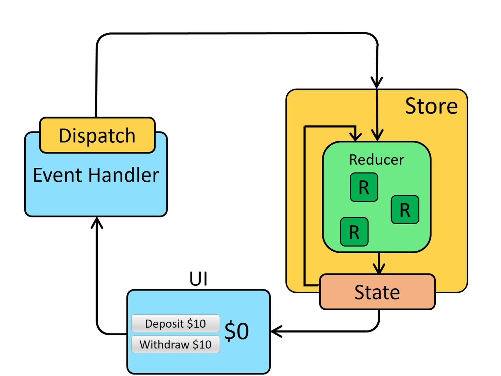

> 코드 내 주석인 `// 파일명.ts:라인수` 는 Redux 라이브러리의 파일을 의미하는 것이고 해당 주석이 없으면 그냥 예시 코드입니다.

## Redux를 살펴보자

redux의 사용 방법부터 살펴보고 가겠습니다.

```typescript
// Actions
const INCREMENT = 'INCREMENT';
const DECREMENT = 'DECREMENT';

// Action Creators
function increment() {
  return {
    type: INCREMENT
  };
}

function decrement() {
  return {
    type: DECREMENT
  };
}

// Reducer
function counterReducer(state = 0, action) {
  switch (action.type) {
    case INCREMENT:
      return state + 1;
    case DECREMENT:
      return state - 1;
    default:
      return state;
  }
}

// Store
const store = Redux.createStore(counterReducer);

// Rendering function
function render() {
  document.getElementById('counter').textContent = store.getState().toString();
}

// Subscribe to store changes
store.subscribe(render);

// Initial render
render();

// Event handlers
document.getElementById('increment').addEventListener('click', function () {
  store.dispatch(increment());
});

document.getElementById('decrement').addEventListener('click', function () {
  store.dispatch(decrement());
});
```

먼저 전역 상태를 바꿀 action을 정의합니다 그리고 reducer를 만들어서 해당 액션이 어떻게 처리할 것인가에 대한 로직을 수행합니다. 그리고 이 reducer를 토대로 store가 생성이 됩니다. 이 store가 전역으로 관리되어서 전역적인 상태관리가 이루어 질 수 있게 합니다.

<br/>

왜 redux는 전역적인 상태를 사용하기 위해서 action, reducer 등의 방법을 사용하는 것일까요?? 그냥 전역 변수에 저장하고 해당 값에 접근하면 되지 않을까? 생각이 드는데 이는 Redux의 원칙과 관련이 있습니다. [3가지 원칙 공식문서](https://redux.js.org/understanding/thinking-in-redux/three-principles)

1. **Single source of truth**
2. **State is read-only**
3. **Changes are made with pure functions[](https://redux.js.org/understanding/thinking-in-redux/three-principles#changes-are-made-with-pure-functions)**

첫번째는 하나의 프로젝트에는 하나의 store만 존재하는 것입니다. 하나의 source에서 모든 값이 관리가 되니 쉽고 범용적으로 사용할 수 있는 특징을 가지고 있는 것이죠.

두 번째로는 하나의 상태를 변경하려면 직접 변경할 수는 없고 action이라는 걸 통해서 변경할 수 있는 것입니다. 직접적으로 state에 접근하지 않고 간접적으로 접근 하는것을 통해 어떤 흐름으로 데이터가 변경되었는지 찾기 쉽습니다.

세 번째로는 변경은 순수함수로만 이루어져야 한다는 점입니다. 상태 변경을 위해 reducer를 작성할 때는 꼭 사이드 이펙트 없이 순수 함수 형태로 새로운 객체를 반환해야 한다는 점입니다.

<br/>

이런 원칙을 모두 지키면서 보다 보면 자연스럽게 다음과 같은 flux 패턴의 형태가 나오게 되는데요. 이 패턴의 특징은 단방향으로 데이터가 흘러서 데이터의 예측 가능성이 매우 높아진다는 특징이 있고 상태 변경이 복잡하면 복잡할수록 이 특징이 장점으로 더 잘 드러납니다.



> 데이터 흐름 순서
>
> 1. UI 변경
> 2. Dispatch로 event 발생
> 3. store의 reducer로 state 변경
> 4. 변경된 state UI에 적용

그러면 방금 봤던 Redux 3가지 원칙과 Redux를 어떻게 쓰는지 이해한 상태에서 코드 까보기 시작해 보겠습니다.

## createStore 코드를 까보자

store를 만드는 코드부터 살펴보겠습니다.

```typescript
// src/createStore.ts:61

export default function createStore<
  S,
  A extends Action,
  Ext = {},
  StateExt = never
>(
  reducer: Reducer<S, A>,
  preloadedState?: PreloadedState<S> | StoreEnhancer<Ext, StateExt>,
  enhancer?: StoreEnhancer<Ext, StateExt>
): Store<ExtendState<S, StateExt>, A, StateExt, Ext> & Ext {...}
```

3개의 인자를 받는 것을 볼 수 있는데요. 다른 건 나중에 보고 지금은 reducer을 위주로 집중해 보겠습니다.

store 내부를 보면 인자로 받은 reducer를 다음과 같이 클로저로 관리하고 있습니다.

```typescript
// src/createStore.ts:110

let currentReducer = reducer;
let currentState = preloadedState as S;
let currentListeners: (() => void)[] | null = [];
let nextListeners = currentListeners;
let isDispatching = false;
```

state나 listener도 클로저로 저장해 두고 있는 것을 볼 수 있네요.

그런데 여기서 조금 신기했던 것이 isDispatching이라는 flag 변수입니다. 이 변수는 dispatch 메서드에서 관리를 해 주고 있는 변수인데요. 바로 뒤에 dispatch 메서드를 분석하며 알아보겠습니다.

### Dispatch 메서드

```typescript
// src/createStore.ts:238

function dispatch(action: A) {
  if (!isPlainObject(action)) {
    throw new Error(
      `Actions must be plain objects. Instead, the actual type was: '${kindOf(
        action
      )}'. You may need to add middleware to your store setup to handle dispatching other values, such as 'redux-thunk' to handle dispatching functions. See https://redux.js.org/tutorials/fundamentals/part-4-store#middleware and https://redux.js.org/tutorials/fundamentals/part-6-async-logic#using-the-redux-thunk-middleware for examples.`
    );
  }
  // action 자체가 순수한 object인지 체크합니다.

  if (typeof action.type === 'undefined') {
    throw new Error(
      'Actions may not have an undefined "type" property. You may have misspelled an action type string constant.'
    );
  }

  if (isDispatching) {
    throw new Error('Reducers may not dispatch actions.');
  }

  try {
    isDispatching = true;
    currentState = currentReducer(currentState, action);
    // reducer 호출부
  } finally {
    isDispatching = false;
  }

  const listeners = (currentListeners = nextListeners);
  for (let i = 0; i < listeners.length; i++) {
    const listener = listeners[i];
    listener();
  }

  return action;
}
```

dispatch 로직은 되게 간단한데요 클로저로 있는 reducer를 통해서 currentState에 state의 변경값을 저장하고 listener에게 해당 값이 바뀌었다고 호출합니다.

방금 보았던 isDispatching이 사용하고 있는것을 볼 수 있는데 dispatch를 하는순간 true값이 되고 state의 업데이트가 끝나면 다시 false가 되는것을 볼 수 있습니다.

이는 reducer안에 같은 store의 메서드를 실행시키지 못하도록 막아줌으로써 Redux의 세번째 원칙인 순수한 함수로만 이루어 져야 하는걸 지킬 수 있게 해주는 방법입니다.

<br/>

이와 관련된 예시를 하나 보겠습니다.

```typescript
const store = createStore((state = {}, action) => {
  switch (action.type) {
    case 'ACTION_ONE':
      console.log('Handling ACTION_ONE');
      // reducer 내부에서 디스패치를 호출하지 못하게 막음
      store.dispatch({ type: 'ACTION_TWO' });
      return { ...state, one: true };

    case 'ACTION_TWO':
      console.log('Handling ACTION_TWO');
      store.dispatch({ type: 'ACTION_ONE' });
      return { ...state, two: true };

    default:
      return state;
  }
});

store.dispatch({ type: 'ACTION_ONE' });
```

ACTION_ONE이 실행되었는데 내부에 ACTION_TWO가 dispatch 되어서 무한루프에 빠진 것을 볼 수 있습니다. 이런 식의 reducer는 data flow를 따라가기 힘들고 예상치 못한 결과를 낳는다는 걸 알 수 있습니다. 이런 점 때문에 isDispatching 변수 사용으로 dispatch도중 action을 추가로 실행하지 못하도록 막고 있는 것이죠.

<br/>

reducer 예시를 좀 더 살펴봅시다.

```typescript
const initialState = {
  users: [],
  posts: [],
  comments: [],
};

function rootReducer(state = initialState, action) {
  switch (action.type) {
    case 'ADD_USER':
      return {
        ...state,
        **users: [...state.users, action.user],**
      };

    case 'ADD_POST':
      return {
        ...state,
        **posts: [...state.posts, action.post],**
      };

    case 'ADD_COMMENT':
      return {
        ...state,
        **comments: [...state.comments, action.comment],**
      };

    default:
      return state;
  }
}

export default rootReducer;
```

reducer선언부와 호출부를 보면 reducer의 반환값은 존재하는 state을 **전부** 반환해야 한다는 것을 볼 수 있습니다. 이는 불변성과 관련이 있는데요 데이터를 수정할 때 한번 생성한 데이터는 수정할 수 없고 새로운 복사본으로 다시 덮어쓰기만 가능한 성질입니다.

<br/>

만약 객체에 직접 지정해 바꾸게 되면 해당 객체가 바뀌었는지 안 바뀌었는지 확인을 하기 위해서는 깊은 비교를 이용해야 합니다. 하지만 이렇게 데이터를 덮어 쓰기만하면 메모리에 객체 주소 자체가 바뀌기 때문에 얕은 비교를 이용해서도 감지할 수 있습니다.

해당 구현에서는 dispatch시에 reducer에 무조건 새로운 state객체가 반환되기 때문에 무조건 변화가 있다고 감지할 수 있고 이는 예측 가능성을 높이면서 구현 구조를 단순화할 수 있는 특징이 있습니다.

### getState 메서드

getState는 간단하게 현재의 state를 return 해줍니다. isDispatching 변수도 들어갔네요. 여기서도 dispatch 중에 해당 메서드를 호출하지 못하도록 막고 있습니다.

```typescript
// src/createStore.ts:134

function getState(): S {
  if (isDispatching) {
    throw new Error(
      'You may not call store.getState() while the reducer is executing. ' +
        'The reducer has already received the state as an argument. ' +
        'Pass it down from the top reducer instead of reading it from the store.'
    );
  }

  return currentState as S;
}
```

### subscribe 메서드

```typescript
// src/createStore.ts:123

function ensureCanMutateNextListeners() {
  if (nextListeners === currentListeners) {
    nextListeners = currentListeners.slice();
  }
}

// src/createStore.ts:169
function subscribe(listener: () => void) {
  if (typeof listener !== 'function') {
    throw new Error(
      `Expected the listener to be a function. Instead, received: '${kindOf(listener)}'`
    );
  }

  if (isDispatching) {
    throw new Error(
      'You may not call store.subscribe() while the reducer is executing. ' +
        'If you would like to be notified after the store has been updated, subscribe from a ' +
        'component and invoke store.getState() in the callback to access the latest state. ' +
        'See https://redux.js.org/api/store#subscribelistener for more details.'
    );
  }

  let isSubscribed = true;

  ensureCanMutateNextListeners();
  nextListeners.push(listener);
  // 리스너 등록

  return function unsubscribe() {
    if (!isSubscribed) {
      return;
    }

    if (isDispatching) {
      throw new Error(
        'You may not unsubscribe from a store listener while the reducer is executing. ' +
          'See https://redux.js.org/api/store#subscribelistener for more details.'
      );
    }

    isSubscribed = false;

    ensureCanMutateNextListeners();
    const index = nextListeners.indexOf(listener);
    nextListeners.splice(index, 1);
    // 해당 리스너의 index값을 찾아 삭제한다.
    currentListeners = null;
  };
}
```

기본적인 예외 처리를 해주고 리스너를 store에 등록하고 unsubscribe라는 함수를 리턴하고 있습니다. 이 함수는 구독을 취소할 수 있는 함수인데요. 여기서 조금 특이했던 것이 listener를 관리하기 위해서 원본 배열을 하나만 사용하는 게 아니라 current와 next 2가지로 사용하고 있다는 것입니다.

<br/>

이런 이유는 [이슈](https://github.com/reduxjs/redux/issues/3469)에서 찾을 수 있는데요. 리스너 호출 작업 도중에 다른 리스너의 구독 취소 작업이 호출될 수도 있어서 2개의 변수로 사용한다고 합니다.

<br/>

조금 더 풀어서 설명하면 다음과 같은 상황 때문입니다.

> 1. 하나의 상태에 대해 A, B, C의 리스너가 있다고 가정합니다.
> 2. action이 dispatch 되어서 상태가 변경되고 A부터 리스너가 호출됩니다.
> 3. 만약 A에서 C를 구독해제하는 로직이 있다고 합시다. 그래서 C는 리스너 배열에서 삭제됩니다.
> 4. 하나의 상태가 변경되었으니 변경된 값이 있다고 모두에게 알린 후에 리스너 배열이 바뀌어야 하는 게 맞습니다. 만약 이를 지켜지지 않는다면 C는 상태가 변경된 것을 알지 못합니다.
> 5. 만약 변수 2개로 관리하지 않고 하나로 관리를 한다면 원본 배열이 바뀌므로 B까지만 실행이 되고 실행이 되질 않습니다.
> 6. 하지만 2개로 관리하기 때문에 현재 순회하는 로직은 A, B, C가 순회를 전부 하고난 후 변경된 배열을 적용하게 됩니다.

### replaceReducer 메서드

```typescript
// src/createStore.ts:283

function replaceReducer<NewState, NewActions extends A>(
  nextReducer: Reducer<NewState, NewActions>
): Store<ExtendState<NewState, StateExt>, NewActions, StateExt, Ext> & Ext {
  if (typeof nextReducer !== 'function') {
    throw new Error(
      `Expected the nextReducer to be a function. Instead, received: '${kindOf(nextReducer)}`
    );
  }

  // TODO: do this more elegantly
  (currentReducer as unknown as Reducer<NewState, NewActions>) = nextReducer;

  // This action has a similar effect to ActionTypes.INIT.
  // Any reducers that existed in both the new and old rootReducer
  // will receive the previous state. This effectively populates
  // the new state tree with any relevant data from the old one.
  dispatch({ type: ActionTypes.REPLACE } as A);
  // change the type of the store by casting it to the new store
  return store as unknown as Store<ExtendState<NewState, StateExt>, NewActions, StateExt, Ext> &
    Ext;
}
```

reducer를 인자로 받은 reducer로 교체하는 단순한 메서드 입니다.

여기서 다음과 같은 코드를 볼 수 있는데요

```typescript
dispatch({ type: ActionTypes.REPLACE } as A);
```

내부에서도 dispatch를 자체적으로 사용하고 있다는 것을 볼 수 있습니다.

어떻게 사용하는지 힌트를 얻기 위해 ActionTypes를 따라가 보았습니다.

```typescript
// src/utils/actionTypes.ts:8

const randomString = () => Math.random().toString(36).substring(7).split('').join('.');

// src/utils/actionTypes.ts:11

const ActionTypes = {
  INIT: `@@redux/INIT${/* #__PURE__ */ randomString()}`,
  REPLACE: `@@redux/REPLACE${/* #__PURE__ */ randomString()}`,
  PROBE_UNKNOWN_ACTION: () => `@@redux/PROBE_UNKNOWN_ACTION${randomString()}`
};

export default ActionTypes;
```

단순한 문자열과 랜덤 문자열을 섞어서 반환하는데요. 정확한 의도는 알기 어려우나 랜덤 문자열을 추가한 이유는 외부 로직과의 충돌을 피하려고 이고 redux의 장점인 데이터의 흐름을 파악하기 쉽게 하기 위해 각각의 기본 action 들을 미리 정의해 두었다고 생각합니다. 해당 객체를 이용해서 action의 실행 여부를 알 수 있으니 devtool에서 로깅 작업을 할 때 내부에서 일어나는 action을 기록해 두어 디버깅을 편리하기 위함이라고 생각했습니다.

## combineReducer를 까보자

redux의 첫번째 원칙 **Single source of truth**를 위해서는 하나의 전역 store만 존재 해야합니다 하지만 reducer를 하나로 통째로 만들어서 쓰기에는 관리하는 reducer가 많아질수록 유지보수 하기가 힘들죠 따라서 reducer를 모듈별로 나누고 하나로 합치는 메서드가 필요합니다.

이 reducer들을 객체형식으로 받아서 하나의 reducer로 만들어주는 역활을 하는 메서드가 combineReducer입니다.

```typescript
// src/combineReducers.ts:125

export default function combineReducers(reducers: ReducersMapObject) {...}
// reducer를 객체 형태로 받음
```

reducer들을 넘겨주면 내부에서는 가공하기 쉽게 각각의 변수로 저장합니다.

```typescript
// src/combineReducers.ts:126

const reducerKeys = Object.keys(reducers)

// reducer를 검증한 후 객체로 저장
  const finalReducers: ReducersMapObject = {}
  for (let i = 0; i < reducerKeys.length; i++) {
    const key = reducerKeys[i]
    if (process.env.NODE_ENV !== 'production') {
      if (typeof reducers[key] === 'undefined') {
        warning(`No reducer provided for key "${key}"`)
      }
    }

// reducer는 function이어야 합니다.
    if (typeof reducers[key] === 'function') {
      finalReducers[key] = reducers[key]
    }
  }

  const finalReducerKeys = Object.keys(finalReducers)
// 체크가 끝났다면 변수를 저장합니다.

  let shapeAssertionError: unknown
  try {
    assertReducerShape(finalReducers)
// reducers안의 콜백의 타입을 체크해준다 문제가 있으면 error
  } catch (e)
    shapeAssertionError = e
  }
```

assertReducerShape를 통해 해당 reducer가 올바른 형태인지 검증합니다.

```typescript
// src/combineReducers.ts:63

function assertReducerShape(reducers: ReducersMapObject) {
  Object.keys(reducers).forEach((key) => {
    const reducer = reducers[key];
    const initialState = reducer(undefined, { type: ActionTypes.INIT });

    if (typeof initialState === 'undefined') {
      throw new Error(
        `The slice reducer for key "${key}" returned undefined during initialization. ` +
          `If the state passed to the reducer is undefined, you must ` +
          `explicitly return the initial state. The initial state may ` +
          `not be undefined. If you don't want to set a value for this reducer, ` +
          `you can use null instead of undefined.`
      );
    }

    if (
      typeof reducer(undefined, {
        type: ActionTypes.PROBE_UNKNOWN_ACTION()
      }) === 'undefined'
    ) {
      throw new Error(
        `The slice reducer for key "${key}" returned undefined when probed with a random type. ` +
          `Don't try to handle '${ActionTypes.INIT}' or other actions in "redux/*" ` +
          `namespace. They are considered private. Instead, you must return the ` +
          `current state for any unknown actions, unless it is undefined, ` +
          `in which case you must return the initial state, regardless of the ` +
          `action type. The initial state may not be undefined, but can be null.`
      );
    }
  });
}
```

<br/>
다음은 리턴을 보겠습니다. reducer를 합치는 것이니 리턴값은 reducer랑 같은 형태의 function이어야 합니다.

```typescript
// src/combineReducers.ts:157

return function combination(
  state: StateFromReducersMapObject<typeof reducers> = {},
  action: AnyAction
) {
  let hasChanged = false;

  const nextState: StateFromReducersMapObject<typeof reducers> = {};
  for (let i = 0; i < finalReducerKeys.length; i++) {
    const key = finalReducerKeys[i];
    const reducer = finalReducers[key];
    const previousStateForKey = state[key];

    const nextStateForKey = reducer(previousStateForKey, action);
    // reducer에 넣어서 해당 reducer에 action에 대한 조건문이 있는지 확인
    if (typeof nextStateForKey === 'undefined') {
      const actionType = action && action.type;
      throw new Error(
        `When called with an action of type ${
          actionType ? `"${String(actionType)}"` : '(unknown type)'
        }, the slice reducer for key "${key}" returned undefined. ` +
          `To ignore an action, you must explicitly return the previous state. ` +
          `If you want this reducer to hold no value, you can return null instead of undefined.`
      );
    }
    nextState[key] = nextStateForKey;
    // 일단 next에 저장하고봄
    hasChanged = hasChanged || nextStateForKey !== previousStateForKey;
  }

  hasChanged = hasChanged || finalReducerKeys.length !== Object.keys(state).length;
  return hasChanged ? nextState : state;
};
```

간단하게 로직을 말하면 reducer 객체를 전부 순회하면서 맞는 action을 찾고 실행한 후 state의 반환값을 리턴하는 함수를 리턴합니다.

여기서도 redux의 불변성을 볼 수 있네요 같은 값이던 다른 값이던 일단 nextState에 저장을 합니다. 그리고 저장 값과 기존 값을 체크해서 변경되었으면 nextState를 반환하고 아니라면 기존 값을 그대로 쓰는 것을 볼 수 있습니다.

<br/>
<br/>
<br/>

2부에서 계속...
