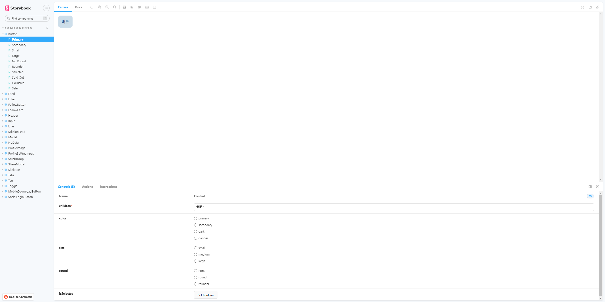
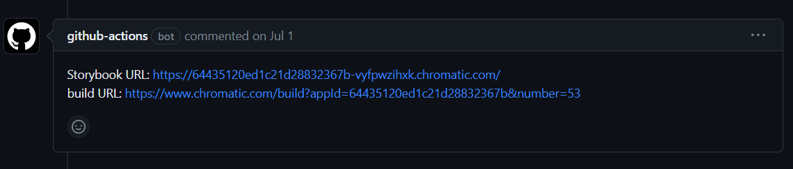

storybook 공식 홈페이지에 들어가 보면 다음과 같이 소개하고 있습니다.

> Storybook is a frontend workshop for building UI components and pages in isolation.
>
> storybook은 UI 구성 요소와 페이지를 개별적으로 빌드하기 위한 프론트엔드 워크샵입니다.

주로 UI의 구성요소를 컴포넌트 단위로 빌드 하기 위해서 사용하는데요. 3개의 크고 작은 프로젝트에 Storybook을 사용하면서 생긴 생각들을 공유해 보고자 합니다.

## Breaking 프로젝트

해당 프로젝트는 디자이너가 없는 프로젝트였고 웹에서 주도적으로 디자인을 생성하였습니다. 당시에는 웹 팀과 모바일 팀이 있었는데 서로간의 이런 디자인의 공유가 필요했었고 이를 위해서 storybook을 도입했습니다.



컴포넌트들을 정리하고 즉각적인 UI 컨트롤로 의사소통의 비용을 줄이는 효과를 기대했었고 실제로도 interactive 한 설명이 필요할때 추상적인 설명없이 storybook을 보여주면서 설명하면 되는 등의 효과를 보았습니다.

```jsx
yarn chromatic --project-token=<project-token>
```

해당 코드를 이용하여 chromatic서비스에 storybook배포를 진행했고 해당 배포 결과를 모바일 팀과 공유하며 사용했습니다.

소통이외에도 프로젝트 내부에서 storybook을 이용해서 여러 컴포넌트를 정리할 수 있었고 실제 페이지 환경이 아닌 독립적으로 컴포넌트 자체를 띄울 수 있다는 점이 좋았습니다. 이는 좀 더 컴포넌트를 독립적으로 개발하도록 유도해 주었고 storybook 코드 자체가 컴포넌트를 이렇게 써 달라는 하나의 설명서가 되어 추후에 오래된 컴포넌트를 불러올때 사용하기 수월했습니다.

## Momokji

Breaking에서 경험했던 긍정적인 내용을 토대로 디자이너가 있는 프로젝트에서도 의사소통 및 즉각적인 피드백을 하기 좋겠다는 생각에 storybook을 도입하였습니다.

<br/>

하지만 해당 프로젝트에서는 storybook이 독으로 다가왔습니다. 일단 Breaking 프로젝트를 할 때는 기획이 모두 끝나 있었고 디자이너 또한 없었던 터라 디자인 변경 사항이 그리 많지 않았지만 Momokji 프로젝트는 기획부터 시작한 프로젝트였기 때문에 기획 자체의 변경 사항이 많았었습니다. 따라서 기획이 바뀔 때마다 storybook의 컴포넌트 또한 바뀌었고 이는 프론트 개발에 있어서 큰 부담으로 다가왔습니다.

<br/>

해당 프로젝트에서는 이런 문제를 해결하기 위해 storybook 파일이 변경되면 github action으로 build후 해당 pr에 배포 결과를 comment로 남겨주는 방법을 사용했습니다.



또한 팀 내부에서는 하나의 포맷을 토대로 최대한 비슷한 storybook 코드를 유지하자고 하였습니다. (29cm에서는 [코드 스니팻](https://medium.com/29cm/%EB%8B%B9%EC%8B%A02-9%ED%95%98%EB%8D%98-storybook-a6b10a62e825)을 만들었다 하더군요.)

<br/>

이런 노력으로 관리 비용은 줄일 수 있었지만 기획이 바뀌어 컴포넌트가 바뀌어 버리면 다시 손을 봐야 하는 것은 막을 수 없었습니다. storybook 관리가 생각보다 많은 비용을 차지하는 일이 되어버린 것이죠.

<br/>

디자이너와 협업 및 QA를 진행할 때 처음 생각한 storybook의 사용 의도와 다르게 storybook 사용 없이 페이지별로 완성이 되면 페이지를 배포해서 전달해 주는 방식이 더 효율적이었습니다. 하나의 컴포넌트가 여러 군데 미치는 영향이 거의 없었고 디자인 패턴을 정의할 일도 없었기 때문에 배포해서 보여주는 게 좀더 명확한 QA를 받을 수 있습니다.

### Storybook 언제 써야해?

작은 프로젝트나 개인이 하는 수준에서 Storybook을 붙여서 진짜 이득을 볼만큼의 퍼포먼스를 내기는 힘들어 보입니다. 생각보다 세팅도 많고 커스텀 지원도 다 되어 있는 게 아니라서 저는 선택을 하지는 않을 것 같습니다.

<br/>

다만 회사의 규모가 커지고 내부 팀의 각자의 서비스가 있을 때 디자인 시스템을 정립해야 할 상황이 오면 Storybook이 큰 이점으로 작용할 것 같습니다. 내부의 팀이 아닌 다른 팀과의 컴포넌트 교류를 할 때 커뮤니티 비용을 대폭 줄일 수 있고 재사용되는 컴포넌트들이 많으니 이는 유지보수 하는 측면에서도 큰 이점을 남길 수 있겠다고 생각하였습니다.

<br/>

이런 Storybook의 정립은 프로젝트를 인수인계하거나 온보딩할 때 하나의 interactive 한 문서로 작용해 긍정적인 효과를 낼 수 있을 것이라 기대할 수도 있습니다.

### Storybook 장점

- chromatic과 쉽게 연결해서 배포할 수 있다.
- slack의 webhook도 지원해줘서 쉽게 webhook을 사용할 수 있다.
- 컴포넌트를 도메인이나 로직에 의존하지 않고 개발할 수 있다.
- storybook이 하나의 설명서로 나중에 인수인계나 컴포넌트를 공유해야 할 일이 있을 때 좋다.
- 브랜치 별로 배포가 가능해 A/B 테스트에 용이하다.
- chromatic을 사용하면 VisualTest가 쉽게 가능하다.

### Storybook 단점

- 프론트의 개발 비용이 더 들어간다
- 커스텀의 한계가 있다
- [Object를 control하는 방법이 없다.](https://github.com/storybookjs/storybook/issues/12078)
- 어떤 컴포넌트를 storybook으로 관리할 것인지에 대한 경계가 모호하다.
- VisualTest를 꼭 해야 할 만큼 컴포넌트가 복잡하지 않는 경우가 대다수이다.

## 결론

여러 프로젝트를 거치다 보니 해당 기술이 어떨 때 사용해야 하는지 알게 된 계기가 되었습니다. Storybook의 단점을 맛봤었지만 저는 아직 Storybook을 좋아합니다. 다만 앞으로 개인 프로젝트에서는 UI 라이브러리를 만들지 않는 한 사용하지 않을듯싶습니다.
