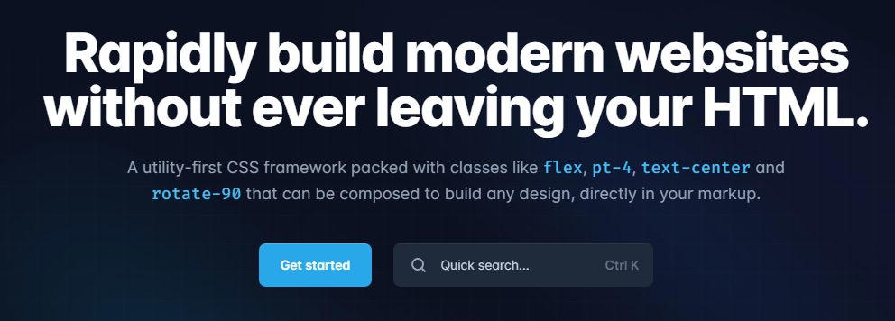
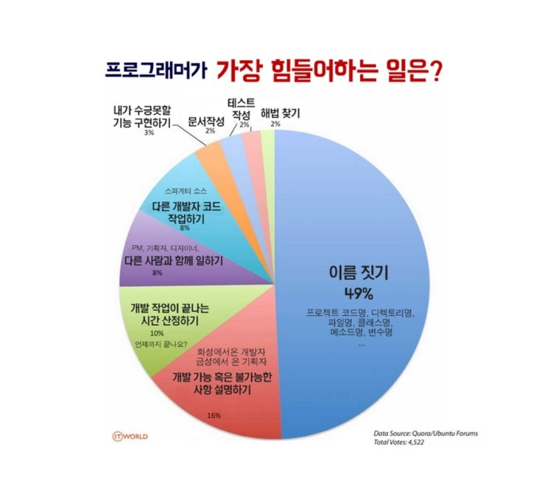
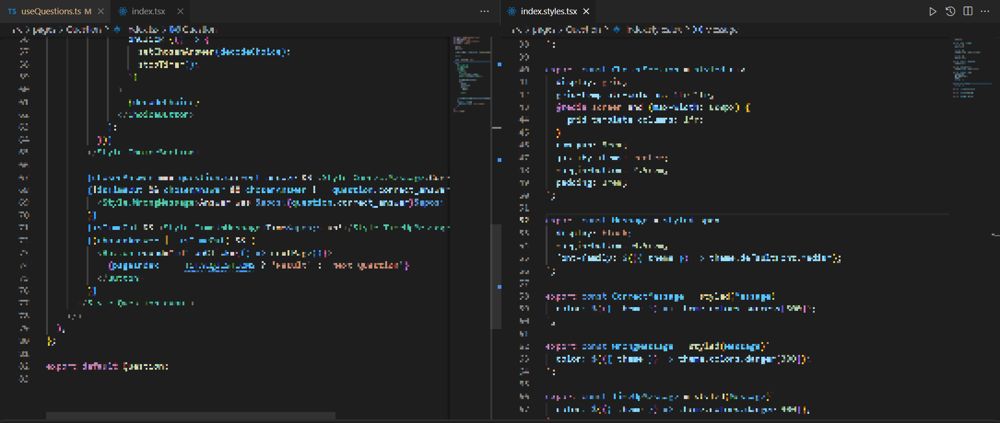
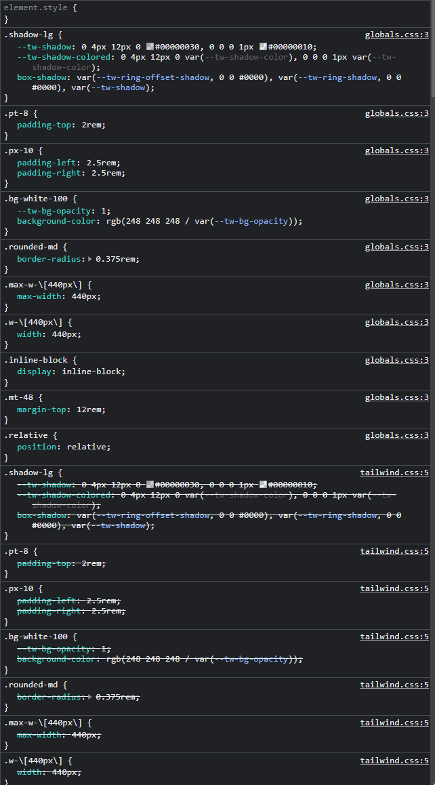

기존에 css-in-js 형식의 emotion과 styled-component를 자주 사용했다. 다만 사용하면서 변수명 짓기와 해당 클래스명을 찾으려면 파일을 띄워놓고 찾고 비교하는 등의 번거로움이 있었고 tailwind css는 이를 고려해서 만들었다기에 slack 클론 코딩에 적용하면서 도입해 보기로 하였다.



## 첫인상

처음 공식문서를 딱 펼치자마자 "으음... 이거 완전 부트스트랩 아니야??"

웹개발 입문전에 부트스트랩 썼던 기억이 새록새록 떠올리는 문법들로 가득 차있었다. 그때 당시를 떠올려보니 부트스트랩에 대한 좋은 경험들이 많았어서 tailwind css의 첫인상은 굉장히 좋았었다. 하지만 사용을 해보니 css-in-js에 비해서 이런저런 장단점들이 존재했다는 것을 느꼈다

## Tailwind css 장점

#### 1\. 변수명 짓는 날이여 안녕~



기존의 css-in-js는 간단한 css 속성 하나만 추가하려 해도 컴포넌트로 만들어야 했었고 이는 변수 네이밍이 필수적으로 동반이 되었다. 정말 이름짓기 어려웠다. margin값 하나만 붙이려 해도 이름을 고민해야 했다. 이에 비해 Tailwind css는 jsx에 인라인으로 작성하기 때문에 변수명을 고민할 필요가 없었다.

```jsx
return (
  <div className=" flex items-center py-2 px-5">
    <div className="chat-img mr-2">
      <Image
        src={`https:${gravatar.url(user.email, { s: '36px', d: 'retro' })}`}
        width={36}
        height={36}
        alt={user.nickname}
      />
    </div>
    <div className="chat-text flex flex-1 flex-col flex-wrap">
      <div className="chat-user flex">
        <b className="mr-1">{user.nickname}</b>
        <span className=" text-sm">{dayjs(data.createdAt).format('h:mm A')}</span>
      </div>
      <div className="whitespace-pre-wrap">{result}</div>
    </div>
  </div>
);
```

~저 많은 양을 전부 이름지을거 생각하면 벌써 머리가 아픕니다...~

#### 2\. 한눈에 들어오는 디자인 결과

위의 코드 중 일부분을 다시 가져와보자

```jsx
<div className="chat-text flex flex-1 flex-col flex-wrap">
  <div className="chat-user flex">
    <b className="mr-1">{user.nickname}</b>
    <span className=" text-sm">{dayjs(data.createdAt).format('h:mm A')}</span>
  </div>
  <div className="whitespace-pre-wrap">{result}</div>
</div>
```

해당 컴포넌트가 어떤 태그로 어떤 스타일로 구성이 되어있는지 한 번에 보인다. 해당 컴포넌트의 디자인의 수정이 필요하거나 태그 수정이 필요하다면 그 부분만 직접 수정하면 끝난다.

#### 3\. 생산성 향상

이는 위의 두개의 장점과 연관이 깊다. 변수명을 짓지 않으니 변수명 고민에 들어가는 시간이 사라지고 한눈에 css 속성이 눈에 들어오니 css-in-js를 사용할 때처럼 해당 style 컴포넌트를 직접 찾아가서 볼 필요도 없다. 그러다 보니 스타일을 구성하고 작업하는 데 있어서는 생산성이 향상되었다.



#### 4\. 커스텀으로 인한 테마 지정가능

[Configuration - Tailwind CSS](https://tailwindcss.com/docs/configuration)

커스텀을 디테일하게 수정할수 있다. 유틸리티 클래스를 수정하여 일관적이게 사용가능하게 해 준다. 사실 css-in-js에서도 theme관련 기능을 제공하고 있어서 비슷한 사용방법으로 사용했던 것 같다.

#### 단점

#### 1\. 더러워...

유틸리티 클래스의 값이 많아질수록 코드가 더러워진다.

```jsx
<button
  type="submit"
  className="shadow-[0_1px_4px_rgba(0, 0, 0, 0.3)] my-3
  h-11 w-full max-w-full cursor-pointer rounded bg-[#4a154b]
  text-lg font-bold text-white
  transition-all duration-75 ease-linear
  hover:bg-[rgba(74,21,75,0.9)]
  focus:shadow-[0_0_0_5px_rgba(18,100,163,1),0_0_0_5px_rgba(29,155,209,0.3)]
  "
>
  로그인
</button>
```

으악 더러워...

#### 2\. 새로운 문법 익히기(러닝커브)

처음 익혔다면 속성 값이 어떤걸 지칭하는지 하나하나 전부 봐야 한다. 지금은 좀 익숙해지긴 했지만 css의 모든 속성을 다 사용한 것은 아니기 때문에 새로운 속성을 지정할 때마다 공식문서를 들여다봐야 할 것 같다.

이런 러닝 커브 때문에 사실 처음에 작업했을 때는 평소보다 오래 걸렸던 것 같다.

#### 3\. js코드 사용불가

css-in-js에서는 css가 js와 같은 시점에 처리되기 때문에 js코드 즉 변수를 이용해서 스타일을 작성할 수 있었다.

하지만 tailwind css는 css-in-js가 아니므로 js를 이용해서 분기적으로 css를 정의하기 힘들다.

특히 tailwind css 컴파일 단계에서 사용하지 않는 css속성을 제거하므로 js를 이용해서 이를 컨트롤했다면 해당 유틸리티 클래스가 컴파일 조차 되지 않아 해당 css가 적용되지 않을 수도 있다.

[Tailwind CSS 사용기 카카오엔터테인먼트 FE 기술블로그](https://fe-developers.kakaoent.com/2022/220303-tailwind-tips/)

#### 4\. 개발자도구의 디버깅



개발 도중 개발자도구를 이용해서 css값을 테스트해보고 싶을 때 굉장히 난처했다. 유틸리티 클래스 하나당 하나의 속성이 들어가다 보니 적용값들이 상당히 많아진 것을 볼 수 있다. 그렇다 매. 우. 더. 럽. 다.

오히려 코드상에서 값을 수정해 보는 방법이 더 가독성이 좋다고 느꼈었다.

## styled-component과의 비교

#### 1\. 전역 theme관리

**styled-component**

```js
import { DefaultTheme } from 'styled-components';

export const fontSize = {
  xl: '2.25rem',
  lg: '1.5rem',
  md: '1rem',
  sm: '0.875rem'
};

export const colors = {
  primary: {
    0: '#000000',
    300: '#808080',
    500: '#e6e6e6'
  },
  success: {
    300: '#33b54a',
    500: '#d2f9d5'
  },
  danger: {
    300: '#ff1d25',
    500: '#f2dddd'
  },
  warning: {
    300: '#ff931e',
    500: '#ffe2ca'
  }
};

export const round = {
  md: '0.5rem',
  lg: '2rem'
};

export const defaultFont = {
  medium: 'NotoSansKRMedium',
  bold: 'NotoSansKRBold'
};

const theme: DefaultTheme = {
  colors,
  fontSize,
  round,
  defaultFont
};

export default theme;
```

styled-component는 ts파일로 객체로 관리를 한다. 객체를 export 해서 styled-component에 접근할 수 있게끔 설정할 수 있다.

**tailwind css**

```js
/** @type {import('tailwindcss').Config} */
const plugin = require('tailwindcss/plugin');

module.exports = {
  content: [
    './pages/**/*.{js,ts,jsx,tsx}',
    './components/**/*.{js,ts,jsx,tsx}',
    './layouts/**/*.{js,ts,jsx,tsx}'
  ],
  theme: {
    extend: {
      boxShadow: ({ theme }) => ({
        focusInput: '0 0 0 1px rgba(29,155,209,1), 0 0 0 5px rgba(29,155,209,0.3)',
        sm: `0 0 0 1px ${theme('colors.black[200]')}30`,
        md: `0 1px 1px 4px ${theme('colors.black.DEFAULT')}30`,
        lg: `0 4px 12px 0 ${theme('colors.black.DEFAULT')}30, 0 0 0 1px ${theme(
          'colors.black.DEFAULT'
        )}10`
      }),
      colors: ({ theme }) => ({
        primary: {
          DEFAULT: '#4a154b',
          200: '#502551',
          250: '#522653',
          400: '#3f0e40'
        },
        error: {
          DEFAULT: '#e01e5a'
        },
        success: {
          DEFAULT: '#2eb67d'
        },
        white: {
          DEFAULT: '#ffffff',
          100: '#f8f8f8',
          150: '#dddddd',
          200: '#eeeeee'
        },
        blue: {
          100: '#1d9bd1',
          300: '#1264a3'
        },
        black: {
          DEFAULT: '#000000',
          200: '#1c1d1c'
        },
        gray: {
          200: '#868686',
          300: '#616061'
        }
      })
    }
  },
  plugins: []
};
```

tailwind.config.js파일에 기존 유틸리티 속성에 덮어씌우거나 새로 만들어서 적용할 수 있다. 기존의 theme를 수정하면 내부에서 관련된 나머지 속성도 적용해 준다.

공통적으로 중앙에서 theme를 관리한다는 점과 객체를 이용해서 적용한다는 점이 비슷했다 딱 코드만 봐도 비슷하게 세팅이 된다는 점이 보였을 것이다.

다만 tailwind css에서 다른 객체의 값을 사용하려면 위와 같이 theme를 props로 받아야 한다는 점이 있고 styled-component는 스타일을 사용하는 컴포넌트에서 theme를 props로 받아서 사용한다는 점이 달랐다.

기존의 styled-component에서 theme을 쓰려면

```js
${({ theme }) => theme.fontSize.xl};
```

처럼 사용해야 했지만 tailwind에서는 예약어로 접근하기 때문에 더 짧고 직관적이게 사용이 가능하다

```js
text - blue - 300;
```

#### 2\. custom style 관리

**styled-component**

```js
export const QuestionHeader = styled.header`
  margin-bottom: 8rem;
  font-size: ${({ theme }) => theme.fontSize.xl};
  font-family: ${({ theme }) => theme.defaultFont.bold};
`;
```

styled-component 자체가 스타일별로 컴포넌트를 만드는 것이므로 하나의 컴포넌트가 하나의 custom 스타일이다. 컴포넌트를 상속하며 override를 할 수 있는 것이 특징이다. css속성을 사용하여 스타일만 지정할 수도 있다.

**tailwind css**

```css
@tailwind base;
@tailwind components;
@tailwind utilities;

@layer components {
  .btn-primary {
    @apply my-3
    h-11 w-full max-w-full cursor-pointer rounded bg-primary
    text-lg font-bold text-white
    shadow-sm transition-all duration-75
    ease-linear
    hover:bg-primary/90
    focus:shadow-[0_0_0_5px_rgba(18,100,163,1),0_0_0_5px_rgba(29,155,209,0.3)];
  }
}
```

global.css파일에 components로 custom style을 지정할수 있다. styled-component와 다르게 custom style에 css속성만 묶여있다. 다만 이 부분에서도 css사용이 아닌 tailwind css문법을 사용하며 일관성을 지킬 수 있었다.

## 느낀 점

사용을 하다 보니 문법이 축약되었다? 정도 말고는 사실상 비슷했었다.

tailwind css는 생산성을 높이자가 큰 장점이라 생각하는데 익숙해지기 전까지는 오히려 생산성이 떨어지다 보니 단점밖에 남지 않게 되었다 ㅋㅋ.

그놈의 스페이스바!! rgb()나 어떤 값을 나열할 때, 사이에 띄어쓰기가 있으면 적용이 되지 않는다. 이런 요소들은 디버깅하는데 틀린 변수명 찾기처럼 힘든 일이었다.

```js
focusInput: '0 0 0 1px rgba(29,155,209,1), 0 0 0 5px rgba(29, 155, 209, 0.3)',
```

다음과 같이 콤마 다음에 스페이스바가 들어가 있으면 rgba값이 적용되지 않는다. 이런 거 너무 찾기 힘들어...

그래도 변수명 짓기에서 해방된 일은 굉장히 좋았었다. 변수명을 사용하지 않고 코딩을 한다는 건 굉장한 메리트가 있다고 생각한다. 또한 인라인으로 직접 입력하다 보니 변경에도 쉬워서. 중간에 디자인이 바뀌어도 해당 컴포넌트에 바로 들어가 쉽게 쉽게 변경할 수 있었던 것은 좋았다.

하지만 이걸 실제 팀 프로젝트로 사용하라고 한다면 조금 고민해 볼 것이다.

첫번째로 css를 직접적으로 사용하지 않기 때문에 css에 대한 지식의 이해도가 떨어질 수 있다. css지식의 양은 방대한데 기초도 모르고 사용하게 된다면 결국 css관련 지식 습득의 부재가 생기는 것이다. 이는 팀의 성장에 있어서 걸림돌이 될 수도 있다고 생각한다

두번째로 처음 사용해 본다면 러닝커브 때문에 제대로 된 결과물과 생산성이 나오지 않는다고 생각이 든다. 따라서 tailwind css를 무조건적으로 도입하지는 않을 것 같고 한 번이라도 따로 써보고 팀프로젝트에 적용하는 것이 좋다고 생각한다.

한줄평: tailwind css좋긴한데 나는 아직 styled-component가 더 편한듯 ㅋㅋ

## 관련 Repo

[GitHub - Yoon-Hae-Min/next-js-slack-clone](https://github.com/Yoon-Hae-Min/next-js-slack-clone)
