곰터뷰 서비스에서는 디자이너가 없어 UI 및 UX 정의를 개발자들이 직접 하는 특수성이 있는 상황이었습니다. 그러다 보니 어떤 하나의 UI 적인 문제점이나 세부 사항이 있으면 해당 작업을 진행하는 개발자가 해당 권한을 가지고 직접 추가하는 식으로 진행이 되었습니다.

그러다 보니 각자 생각하고 이해한 디자인과 기획에 대한 flow가 달랐었습니다. 그러다 보니 자연스럽게 개발자가 개발하기 편한 디자인이 나오고 최종적으로 1.0을 출시했을 때 사용성이 불편한 부분이 다소 생기게 되었습니다.

## 원래 기획 의도

곰터뷰 서비스에서는 문제집을 추가하고 새로운 문제를 추가해서 해당 문제로 면접을 시작해야 하는 단계를 거칩니다.

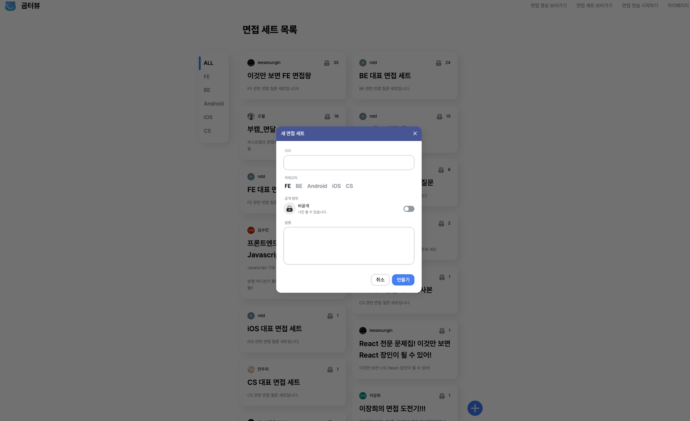

해당 페이지에서 “+” Fab 버튼을 통해 문제집을 생성하고 (혹은 마이페이지에서)
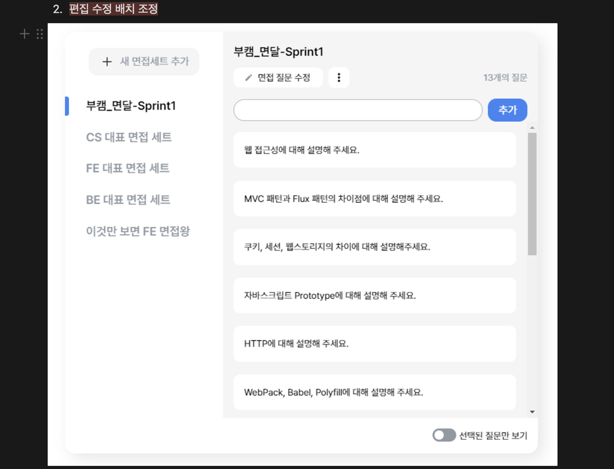

생성한 문제집에 들어가서 문제를 추가하고 해당 문제를 선택하는 flow를 가지고 있습니다. [그림-1] Modal에서는 문제집을 생성하고[그림-2]의 문제 추가 Input으로 문제를 추가하는 게 원래 의도였죠.

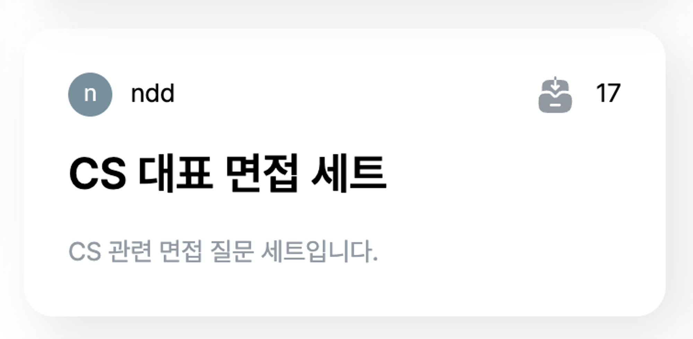
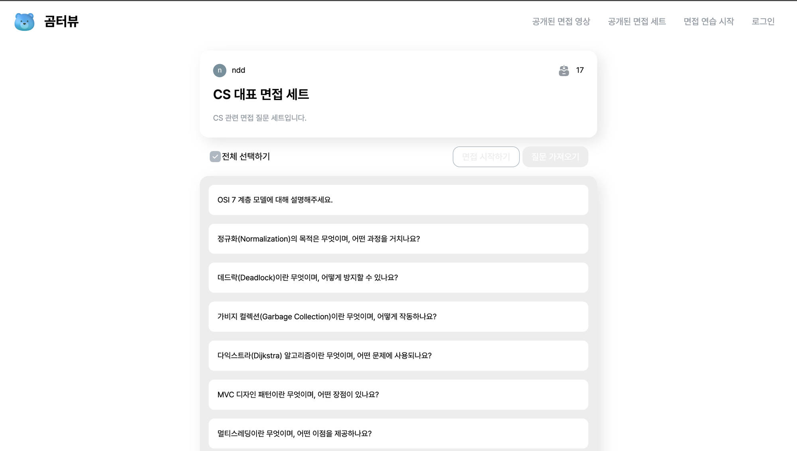
그러면 이런 식으로 생성이 됩니다. 이렇게 생성된 문제들을 가지고 면접 연습을 진행할 수 있습니다.

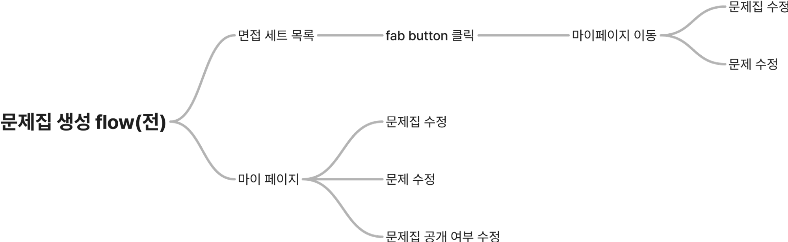

flowchart로 나타내면 다음과 같은 flow로 문제집을 설정할 수 있습니다. 사진에서 보여준 방법 말고도 마이페이지에서도 해당 작업을 할 수 있습니다.

## 잘못된 사용법을 사용하는 사용자

실제 1.0 배포하고 사용자가 들어왔을 때 생긴 일입니다.

한 사용자가 문제 세트를 공개한 채로 문제 세트의 설명 부분을 문제 추가하는 곳으로 인식하고 문제 세트 설명에 문제를 써서 올리기 시작한 것입니다.

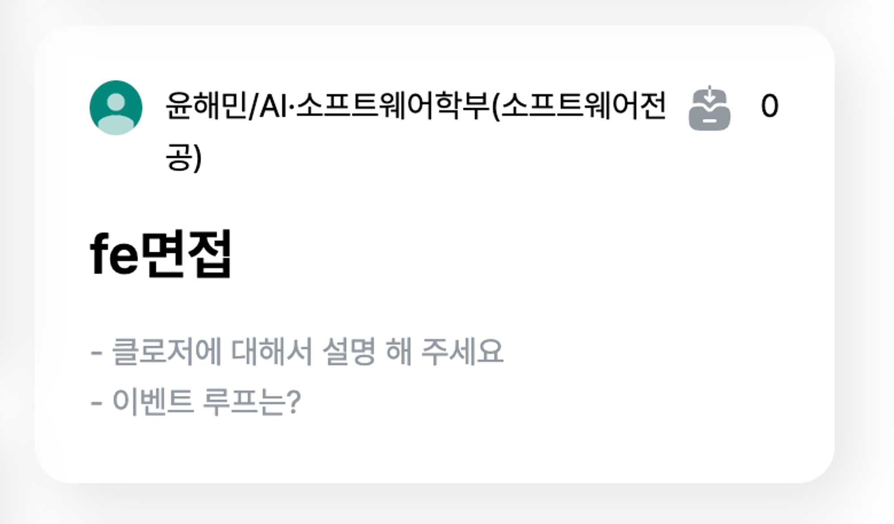

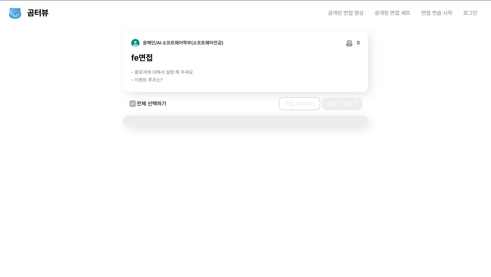

이렇게 생성이 되면 저희 서비스에 제공해 주는 기능들을 제대로 사용할 수 없습니다. 그래서 이것은 뭔가 잘못되었다고 생각하고 서비스에 대한 대대적인 UX 개선 작업에 돌입하기 시작했습니다.

## UX를 개선해 보자

위의 문제는 다음 주제에서 자세히 이야기해 보도록 하고 지금은 곰터뷰의 전반적인 개선점에 집중해 보겠습니다. “사용자를 생각하게 하지마”, “UX/UI의 10가지 심리학 법칙” 두 가지 책을 참고하며 개선 작업을 진행하였습니다.

### 피츠의 법칙

사용자가 대상을 사용하기까지 걸리는 시간이 대상의 크기와 대상까지의 거리와 관련 있다는 법칙입니다.

해당 컴포넌트는 button 내부에 text가 있는데 text 영역만 hover에 대한 스타일이 적용되어 있습니다. 즉 button 영역을 hover 하면 hover 스타일이 바뀌지 않아 실제 사용자가 느끼기에는 button 영역의 클릭 가능한 범위가 실제 클릭할 수 있는 영역보다 좁다고 느낄 수 있습니다.

### 사용자에게 현재 위치를 알려줘라

사용자는 웹페이지에서 무언가를 얻어가기 위해 탐색합니다. 그러다 보니 내가 필요한 페이지를 들어갈 수도 있고 아닐 수도 있습니다. 또한 웹페이지는 규모에 대한 감각이 없기 때문에 나중에 해당 페이지를 다시 찾고 싶을 때 대한 정보가 필요합니다. 즉 현재 위치를 알려주면 사용자는 해당 위치인지 어떤 내용이 있는지 등의 기억을 하기 더 쉽습니다.
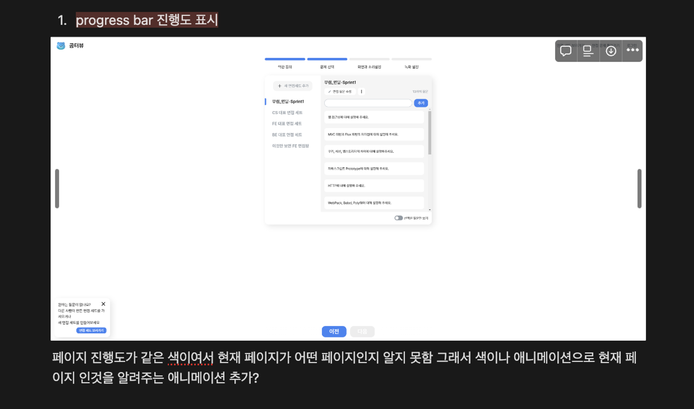

설정 페이지에서는 이런 게 미흡했는데요. progress bar의 색상만 채워져 있어 설정 진행 중 이전 페이지에 돌아갔다면 현재 내 위치가 어디인지 모르는 상태가 될 수 있었습니다. 즉 길을 잃은 것이죠.

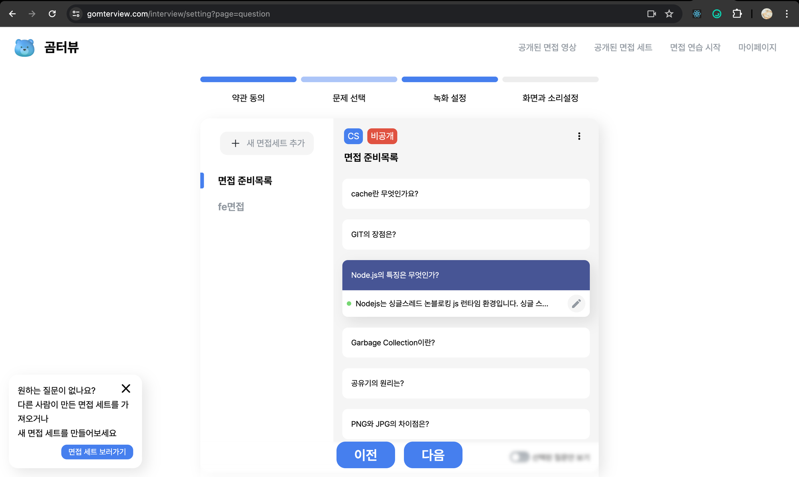
설정 페이지에 현재 위치에 대해서 깜빡임 애니메이션을 넣어서 이를 해결하였습니다.

### 힉의 법칙

사용자에게 주어진 선택 가능한 선택지의 숫자가 많을수록 사용자가 결정하는 데 소요되는 시간이 결정된다는 법칙입니다.
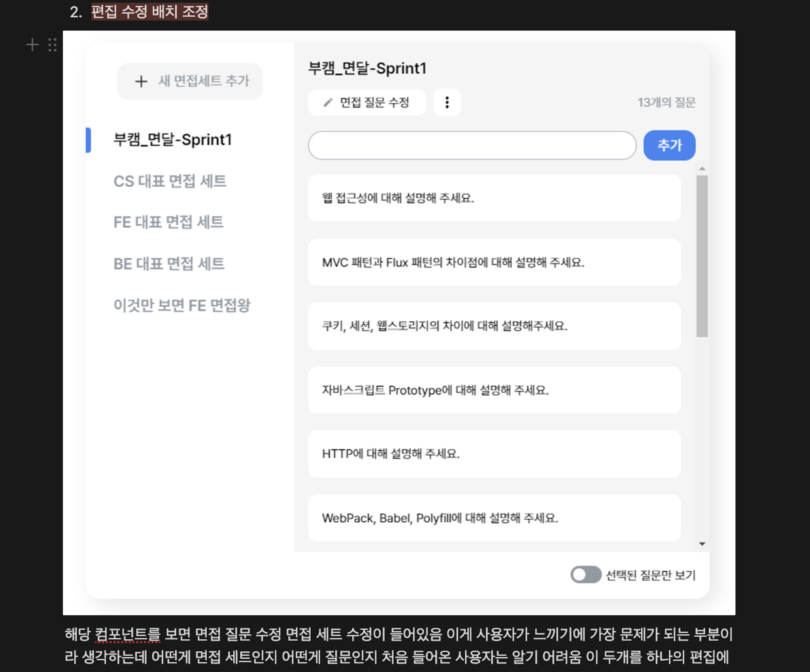

버튼이 많을수록 결정 비용이 더 많이 발생하고 각 버튼당 어떤 편집을 매핑해야 하는지 사용자의 기억 정보에 저장해야 하므로 작업 기억 비용이 더 비싸게 들어갑니다. 즉 기존에 면접 질문을 추가, 수정, 삭제하고 면접 세트를 수정, 삭제를 따로 관리하는 로직은 사용자에게 있어서 더 많은 기억 정보를 저장하게 강제 하고 있죠.

그래서 버튼을 하나로 통일해 이런 기억 정보를 줄이려 하였고 구글 forms에서 아이디어를 얻어 해결하였습니다.

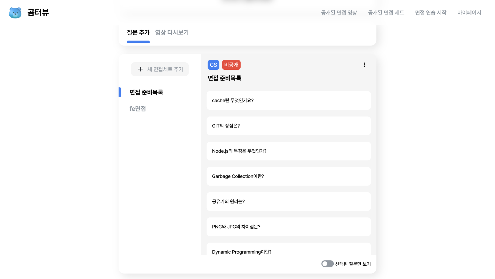

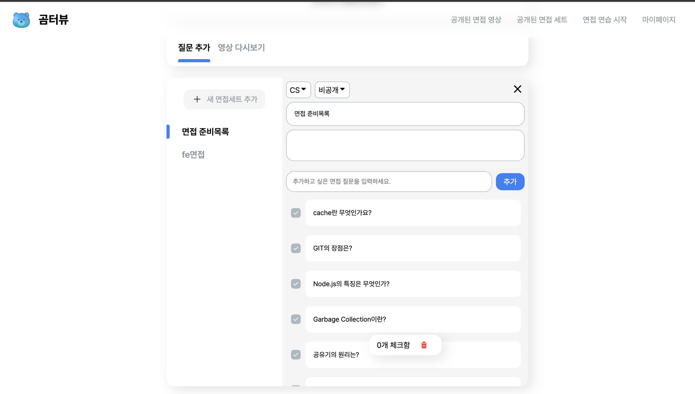

해당 편집기에서 문제집과 문제를 추가 수정 삭제를 진행할 수 있습니다. 기존과 똑같은 API를 사용하지만 사용자가 보기에는 편집 버튼 하나로 사용자가 원하는 부분을 100% 수정할 수 있는 특징을 가지고 있습니다.

### 튜토리얼 생성

간편한 면접 서비스이지만 실제 서비스를 이용하려면 설정 페이지를 거치고 설정 페이지에 어떤 것들이 있는지 단번에 학습하기에는 무리가 있었습니다.

이 작업은 성인님이 제안하고 개발한 것으로 처음 들어온 사용자들이 튜토리얼을 통해서 서비스가 어떤 컨셉이고 동작하는지 사용자들에게 전달할 수 있었습니다.

실제로 해당 기능이 추가됨에 따라 GA의 평균 접속 시간이 약 40s 정도 증가하였습니다. 적어도 카메라를 켜고 면접 진행을 한 번이라도 해본다고 추측할 수 있었습니다.

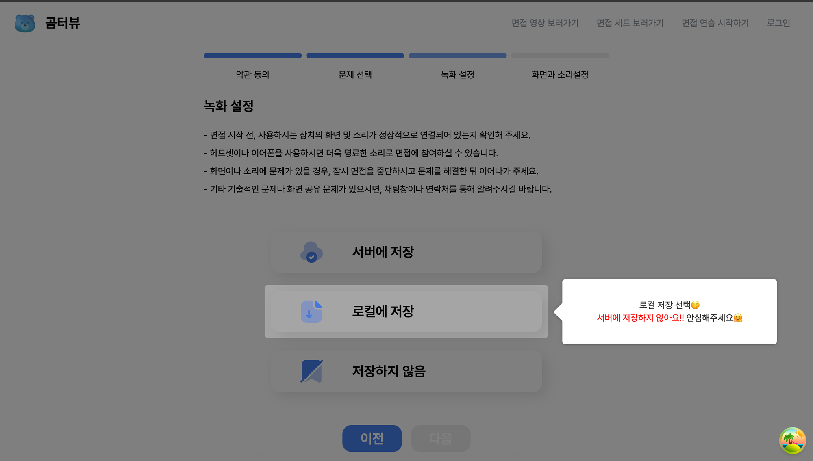

## 왜 사용자는 의도와 다르게 했을까?

다시 처음의 문제로 돌아와서 왜 사용자는 저렇게 하였을까 생각해 보았습니다. 저는 힉의 법칙과 잘못된 면접 세트 버튼(fab 버튼) 때문이라 생각합니다. 의도한 대로 동작하게 하려면 사용자에게 우리는 면접 세트를 만들고 그 후에 면접 세트 내부에 문제를 추가 해야 하는 사전 지식이 필요합니다.

 

하지만 기존의 flow로는 이런 의도를 은연중에 보내는 장치가 존재하지 않았습니다. 만약 이 개념을 모른 채 진행한다면 해당 문제를 편집할 때는 어디를 눌러야 하는지 모릅니다. 문제를 편집하려면 면접 질문 수정 버튼을, 문제 세트를 편집하려면 위의 etc 버튼을 눌렀어야 하는데 처음 들어온 사용자가 이를 파악하려면 전부 다 눌러봐야 알 수 있습니다.

 

저는 문제 세트 생성 후 문제를 추가한다는 개념을 이해시키는 것보다는 둘을 합쳐서 굳이 이런 개념 전달하지 않고도 자연스럽게 사용자에게 기능을 알려 주고자 하였습니다. 왜냐하면 불필요한 개념을 전달시킬 이유가 존재하지 않으니까요. 또한 flow 자체를 하나의 흐름으로만 변경해서 사용자가 다른 방향으로 생각하지 못하도록 유도하였습니다.

 

그래서 fab 버튼을 제거하고(단순히 면접 세트 목록 페이지는 READ 할 수 있는 역할만 가지도록) 사용자는 마이페이지에서 내 문제집만 생성해 컨트롤할 수 있다는 개념만 넣어주도록 하였습니다. 그리고 그 문제집을 해당 페이지에서만 제어할 수 있도록 하는 것이죠.

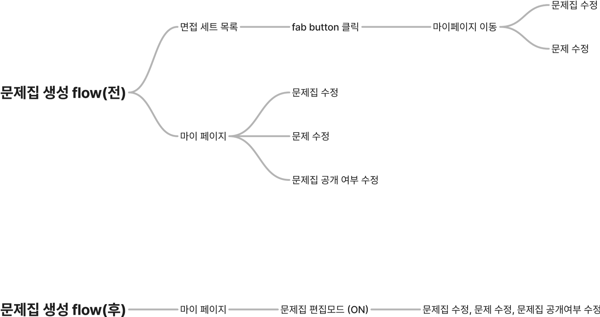

그리고 문제집을 컨트롤할 수 있는 것은 마이페이지밖에 없다는 걸 전달하려 하였습니다.

만약 처음에 예시처럼 사용자가 문제 세트 설명에 문제를 잘못 썼더라도 문제 세트를 추가하면 다음과 같은 창이 바로 보이기 때문에 문제를 공개하기 전에 사용자에게 저희 서비스를 예상과 다르게 사용했다는 것을 전달할 수 있습니다.

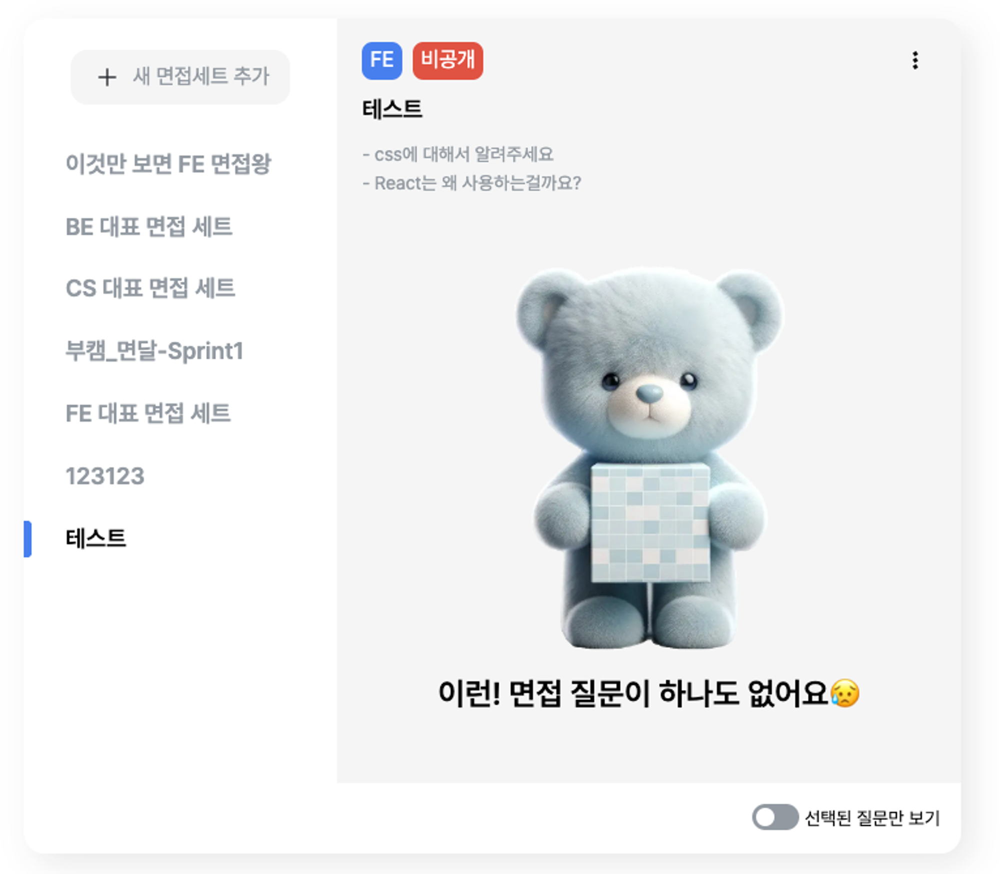

## 아쉬운 점

사실이 작업을 진행하면서 아쉬웠던 부분이 많았습니다. UX의 경우 정답이 없기 때문에 어떤 게 좋은지 주관적으로 판단할 수밖에 없고 이걸 좀 더 객관적으로 사용하려면 로깅을 구성하고 넣어서 데이터 적으로 결과를 비교했어야 한다는 생각이 들었습니다.

 

또한 UX의 경우는 모두가 고객이 되고 모두가 다른 시야를 가지고 있기 때문에 많은 사람의 관점을 보는 게 중요하다고 생각합니다. 하지만 중간에 각자 개인적인 취업 사정으로 인해 저 혼자 모든 의사 결정을 진행했는데 개인적인 의견만 들어갔기 때문에 여기서 오는 다른 관점의 시각들이 부족했습니다.

 

그래서 해당 작업이 사실 만족스럽게 끝나지는 않았는데요. 아직 부족한 점이 눈에 보였고 검증도 하고 싶지만, 검증을 진행할 수단이 없었고 사이드 프로젝트의 한계 또한 맛보게 되었습니다. 규모가 커지면 커질수록 개발 외 직군의 중요성과 개발 규모에 따라서 서비스의 성장이 급격하게 느려지는 게 눈에 보였습니다. 그래서 해당 작업에 대해 완벽히 끝내지 못한 점이 너무 아쉽습니다.

## 결론

그래서 이 프로젝트 자체에 대해서 더 생각을 해보았는데요. 더 서비스적으로 가치를 둘 것이냐 아니면 개발 공부의 놀이터로 이어 나갈 것이냐에 대한 고민이 있었는데 저는 후자를 선택하기로 하였습니다. 아직 하고 싶은 개발이 남아있었기 때문입니다. 규모가 있어야지 할 수 있는 작업을 진행해 보고자 합니다.
