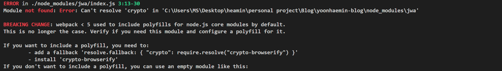
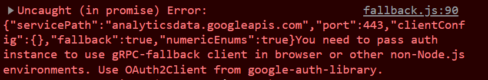

### 애널리틱스를 이용해 조회수를 API로 가져와 보려다 삽질하고 포기한 썰

구글 애널리틱스를 사용하다 보니 내 서비스의 정보를 가져오는 API가 존재한다는 것을 알게 되었다. 나는 총조회수를 블로그에 띄워주고 싶었기 때문에 이를 사용해 보고자 하였다.

그전에 구글 애널리틱스의 데이터 수집에는 UA 방법과 GA4 방법이 있다. 현재 구글 애널리틱스를 시작하면 자동으로 GA4 방법으로 선택되지만, 기존에는 UA 방법을 사용해서 정보를 수집했다고 한다. 나는 GA4 방법이 좀 더 많고 정확한 데이터를 수집하는 방법이고 구글 애널리틱스에서도 2023년 7월부터 UA 데이터 수집 방법을 종료한다고 하여 GA4 방법의 API를 사용하려 했다.

### 사용한 환경

- Gatsby 5 버전
- 구글 애널리틱스 GA4 방식
- React 18 버전

### 한 줄 결론

### 시작해 보자

[공식 문서를 읽어보자](https://developers.google.com/analytics/devguides/reporting/data/v1/quickstart-client-libraries?hl=en)

해당 문서를 보면 Node JS 환경에서 `@google-analytics/data` 라이브러리를 이용하여 API를 호출하고 불러오는 것을 확인할 수 있다. Gatsby에서 NodeJS환경은 `gastby-node.ts` 파일이 있었으나 이는 빌드하는 시점에서 단 한 번만 실행되는 환경이므로 내가 원하는 접속마다 API를 호출하는 기능을 담당하지는 않았다. 따라서 page 파일 안에서 API를 직접 호출해 사용하려 하였으나 해당 문서 어디에서도 React나 JS 내부에서 사용하는 방법은 없었다.

### 버전은 체크해 봤고?

그래서 버전별 호환이 안 돼서 그런 거일 수 있겠다고 생각하여 버전 체크에 들어갔다.

  

첫 번째로는 구글 애널리틱스의 버전을 체크해 봤다. 내가 사용하고자 하는 버전은 **[Data API V1 (Beta)](https://developers.google.com/analytics/devguides/reporting/data/v1)** 버전이었는데 여기서 버전을 내리게 된다면 [Reporting API V4](https://developers.google.com/analytics/devguides/reporting/core/v4)로 내려지게 된다 해당 버전에서는 클라이언트에서 API 사용이 가능했지만 해당 버전은 GA4 방법이 아닌 UA 방법의 라이브러리를 서포트하고 있어 애초에 수집부터 세팅을 UA 방법으로 다시 해야 했다.

  

두 번째로는 `gastby-browser.ts`를 이용해서 데이터를 받아오고 전역 변수로 저장해서 페이지에 이용하는 것이다. 하지만 `gastby-browser.ts`는 [Gatsby 최신 버전](https://www.gatsbyjs.com/docs/reference/release-notes/v5.3/#es-modules-esm-in-gatsby-files)에서 ESM으로 동작하고 있고 `@google-analytics/data` 는 CJS로 동작하기 때문에 적용할 수 없었다. (나중에 알아본 결과 CJS와 ESM은 모듈 차이로 번들링시 설정을 통해 둘 다 한 프로젝트에서 사용할 수 있었다. 하지만 세 번째 이유로 이것 또한 불가능했다.)

  

세 번째로는 웹페이지에서 CJS모듈을 import 하는 방법이다. Webpack 5 버전 이상을 사용하고 있었기 때문에 폴리필 설정을 통해 실행시킬 수 있었지만, 이것 또한 에러가 나왔다.

해당 에러를 보고 google-auth-library를 설정해서 해결하고자 하였지만 에러만 더 늘어나고 답이 보이질 않았다.

  

네 번째로는 `@google-analytics/data` 의 내용을 확인해 보고자 하였다. React 혹은 브라우저에서 돌아갈 방법이 있는가? 에 대해서 찾아보았다. 그러던 중 브라우저 지원에 대한 이슈를 찾았다. [issues/531](https://github.com/googleapis/google-cloud-node/issues/531) 결론은 지원 안 함….ㅋㅋㅋ 아직도 브라우저의 지원 계획은 없다고 한다

### 그래서 어떡하게?

SSG를 사용하고 있었던 터라 선택지가 더 이상 없었다. 그래도 사용하고 싶으면 NodeJS로 블로그 외부의 서비스를 하나 만든 다음 내 블로그에 API를 연결해서 사용해야 한다고 생각하였다. 하지만 그럴 거면 그냥 SSR를 사용해서 조회수를 가져오는 게 더 맞지 않을까 생각하였다. 그래서 일단은 일단락하고 다음에 SSR 프레임워크 기반으로 마이그레이션 하거나 지원이 추가된다면 추가해 보도록 하기로 했다.

### 마치며

이때까지 개발하면서 지원 안 함 때문에 못 한 것은 처음인 거 같아서 한탄 글을 써보게 되었다. 아마 나처럼 SSG나 SPA를 사용하면서 '조회수를 띄워줘야지' 생각하면서 시도하는 찾는 주니어 개발자들이 분명히 있을 것이라 생각하고 내가 시도해 본 내용을 공유하고자 한다. 물론 다른 서비스나 업데이트 혹은 더 좋은 방법이 있다면 댓글로 공유해 주면 바로 블로그에 적용해 보겠다!!
여담으로 깃허브 프로필에 쓰이는 [hits](https://hits.seeyoufarm.com/)를 사용하면 조회수를 띄워줄 수 있다. 나는 적용 안 했지만 혹시라도 마음에 든다면 적용해 보는 것도 좋을 것 같다.
