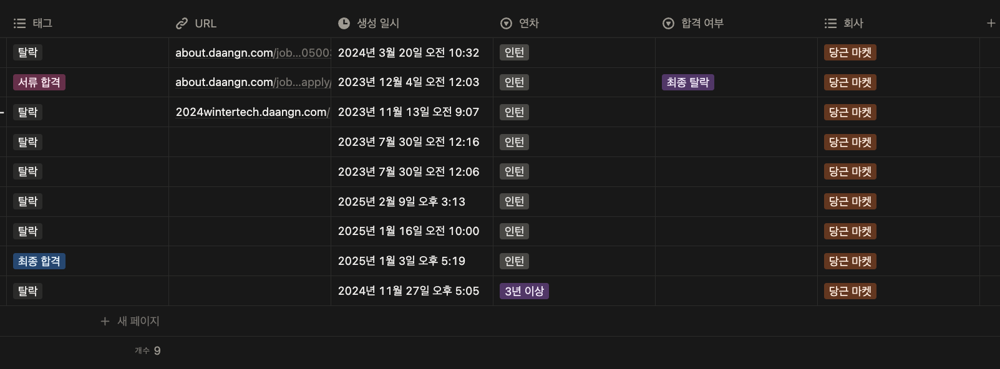
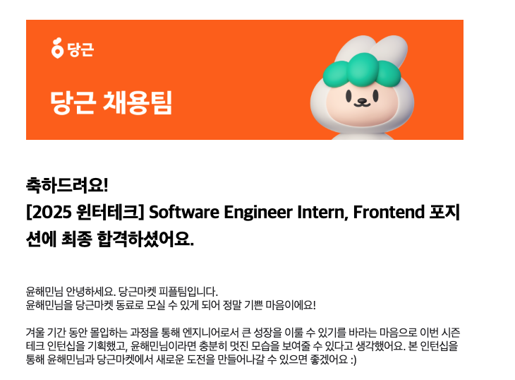

## 9수 후 합격 그리고 시작

저는 당근 합격까지 9번이나 도전했어요. 9번의 실패와 도전이 쉽진 않았지만 그만큼 제가 이 회사를 간절히 원했어요.

저에게 있어 당근은 제품적 사고가 정말 뛰어나고 개개인이 "일을 잘한다"는 것의 표본을 보여주는 회사였거든요. 게다가 개발 실력도 훌륭한 분들이 많아서 “아 저기 들어가면 분명히 많이 배우겠다”라는 확신이 있었죠. 그래서 더더욱 꼭 가고 싶었습니다.

그리고 올해 드디어 상반기에 당근 윈터테크에 합격하게 되었습니다. 내가 당근에서 얻어갈 수 있는것을 다 얻어가자 다짐하며 동네생활 팀에서 인턴을 시작하였습니다.

## 온보딩

처음 들어가자마자 받은 온보딩 과제는 어드민 개선 관리였어요. 저는 첫 회사에 들어가면 꼭 지키고 싶은 다짐이 하나 있었어요. 바로 아주 사소한 PR이라도 3일 안에 PR 올리기입니다.

 

별거 아닐 수 있지만 저한테는 굉장히 큰 의미가 있어요. 빠른 PR은 “내가 관심 있고 열정이 있다”는 신호이자 작은 부분부터라도 팀에 기여하겠다는 의지라고 생각하거든요. 팀에서는 열정을 보여줄 수 있고 개인적으로는 동기부여로 다가오는 다짐이었습니다.

 

실제로 인턴십 이틀 만에 어드민 로고에 알파 버전과 운영 버전을 구분해서 보여주는 PR을 올릴 수 있었어요. 코드 변경은 if문 하나 추가하는 수준이었지만 단순히 수정에 그치지 않고 '왜 이 부분을 바꿔야 하는지', '이 코드가 제품 안에서 어떤 역할을 하는지'를 이해하려 노력했습니다. 덕분에 빠르게 당근의 어드민 시스템과 제품 맥락을 조금 더 깊이 알게 되는 작지만 좋은 기회가 되었어요. 너무 좋은 경험이었기 때문에 앞으로도 첫 온보딩시 이 기조를 계속 이어가고자 다짐하였습니다.

 

온보딩 과제는 동네생활에서 사용 중인 어드민 페이지를 개선하는 것이었어요. 처음에는 온보딩이라 조금 더 명확한 과제가 주어질 것이라고 예상했지만 실제로는 제가 직접 문제 정의부터 시작해야 하는 상황이었죠. 사실 이 부분에서 많이 당황했습니다. 기대했던 온보딩은 실제 업무에 투입되기 전에 기술적인 내용을 익히고 그 이후에 업무를 시작하는 형태였어요. 하지만 실제로는 아무런 맥락을 모르는 상태에서 “개선 작업”이라는 막연한 목표만 가지고 투입된 것이었습니다.

 

그래서 우선은 어드민의 맥락을 이해하고 어떤 점이 필요한지 정리하여 리스트업을 하고 이를 공유하는 방향으로 접근하고자 하였습니다. 하지만 이 과정에서 공유와 소통 자체의 한계를 맛보게 되었습니다.

## 소통의 어려움

저희 팀의 기조는 서로가 무슨 일을 하고 있는지 알고 그 맥락을 전부 공유하는 것이었습니다. 그래서 평소에도 이런 맥락들이 모두가 볼 수 있게 오갔고 필요하다면 해당 프로젝트 참여자가 아니더라도 의견을 주고받을 수 있었어요. 따라서 팀내에서 맥락 관리와 공유가 아주 중요한 요소중 하나로 자리잡고 있어요.

 

하지만 제가 2주차 어드민 과제를 진행하면서 이런 개선작업에 대한 공유와 소통이 부족하다는 피드백을 받았어요. 당근 이전에 제가 진행해온 프로젝트들은 모두 같은 기능과 목표를 바라보며 진행했었습니다. 따라서 팀원들이 같은 맥락을 공유하고 있어 소통에 큰 문제가 없었죠. 하지만 지금은 상황이 달랐습니다. 다른 프로젝트를 하던 사람이 제 프로젝트의 설명을 이해해야 하는 상황에서 제가 제공한 정보가 충분하지 않았던 것입니다.

 

이 문제를 해결하기 위해 저는 팀에서 공유와 소통을 잘하는 사람을 관찰하기 시작했습니다. 그 사람이 작성한 Slack 메시지와 노션 문서를 살펴보며, 어떤 방식으로 내용을 정리하고 전달하는지 탐구했습니다. 그리고 그 과정에서 다음과 같은 배울점을 얻을 수 있었습니다.

 

---

### 1. 맥락을 최대한 넣는다

소통의 기본은 내가 가진 맥락을 최대한 담아내는 것이었습니다. 질문이나 설명을 하기 전에 상대방이 알아야 할 사전 지식과 제가 그 선택에 이르게 된 과정을 함께 전달했습니다. 이를 통해 상대방이 추가로 꼬리 질문을 던지는 횟수를 줄일 수 있었고 결과적으로 의사소통 비용을 절감할 수 있습니다.

> ❌   댓글 작성 시 에러가 발생하고 있고 지금 해결하고 있습니다

> ⭕   댓글 작성 시 500 에러가 발생합니다. 재현 경로는 [게시글 작성 → 댓글 입력 → 등록 버튼 클릭]이고, 어제까진 정상 작동했는데 오늘 새로 배포된 API 변경 이후부터 문제가 생긴 것 같아서 롤백 진행중 있습니다

### 2. 뾰족하게 말한다

소통에는 늘 목적이 있었습니다. 그것이 질문인지, 단순한 공유인지, 아니면 도움 요청인지부터 분명히 했습니다. 또 제가 원하는 답이 흐려지지 않도록 “O/X”처럼 명확하게 답할 수 있는 형태로 묻거나 몇 가지 선택지를 제시하여 결과가 하나로 모이도록 할 수 있습니다.

> ❌   댓글 답글 기능은 어떻게 하는 게 좋을까요?

> ⭕   댓글 **답글 기능**에 대해 고민해봤습니다. 현재 가장 큰 문제는 상태 **구조와 UI 복잡도**입니다. 지금 스프린트 안에서 구현 가능한 방향은 두 가지라고 생각합니다.
>   **A. 단일 깊이만 지원** — 댓글에 바로 답글만 가능 (대댓글은 불가). 구현 난이도 낮고 일정에 맞출 수 있음.
>   **B. 무제한 대댓글 지원** — 자유롭게 깊게 달 수 있음. UX는 좋지만 상태 구조 변경 + UI 설계가 추가로 필요.

### 3. 타이틀 작성해서 전달하기

맥락과 전달해야 할 내용이 많아질수록 글이 길어지고 가독성이 떨어지기 쉽습니다. 그래서 저는 각 내용을 타이틀을 붙여가며 정리하는 방식을 택했습니다. 이렇게 하면 팀원이 해당 문단에서 제가 전하고자 하는 핵심을 빠르게 파악할 수 있고 나중에 글을 다시 보더라도 원하는 부분을 곧바로 찾을 수 있었습니다.

> ❌   커뮤니티 기능 배포는 내일 오후 2시에 진행됩니다. 서비스 중단은 없지만 캐시 리셋 때문에 약 1분 정도 로딩 지연이 있을 수 있습니다. QA 테스트는 완료된 상태이고, 혹시 문제가 생기면 바로 롤백할 수 있도록 준비했습니다.

> ⭕   **커뮤니티 기능 배포 일정**   - 배포 시간: 내일 오후 2시
>   - 서비스 중단: 없음
>   - 특이사항: 캐시 리셋으로 약 1분 로딩 지연 예상
>   **QA 현황**   - QA 테스트 완료   - 문제 발생 시 즉시 롤백 가능

 

---

 

제가 하고 있는 소통 방식에 앞서 말한 세 가지 원칙을 추가하여 철저히 지키려고 노력했습니다. 그 결과 내가 전달하고자 한 내용을 상대가 명확히 이해하고 있다는 걸 체감할 수 있었어요. 또한 소통이 잘 될수록 주변에서도 점차 저를 신뢰하고 있다고 느끼기 시작했어요. 시간이 흐를수록 팀원의 개입이 점점 줄어들었고 결국 저 스스로 주도적으로 일을 수행하는 역할을 맡을 수 있었습니다.

 

결정적으로 마지막 피드백에서 제가 가진 강점 중 하나가 바로 ‘공유’라는 점을 인정받을 수 있었습니다.

## 인턴 연장

윈터테크의 3개월이 지난 후 3개월 연장을 제안받았습니다. 해당 기간의 주요 과제는 실제 서비스를 직접 리딩하고 개발하는 것이었습니다. 사실 이 부분은 조금 놀라웠습니다. 인턴이 실제 서비스를 리딩한다는 것은 어디에서도 듣도 보도 못했기 때문입니다. 이 과정을 통해 리딩부터 분석까지 서비스 개발의 A-Z를 온전히 경험할 수 있었습니다.

### 1. 팀꾸리기

프로젝트 시작을 위해 팀 리드와 원온원을 하며 서비스를 어떻게 구현할지 이야기를 해보았습니다. 사전 준비로 아래와 같은 내용들을 진행했었는데요.

- 러프한 기획 잡기
- 목표 세우기
- 기간 잡기
- 작업 범위 정하기

이 과정에서 가장 크게 느낀 점은 무형의 프로젝트를 유형의 프로젝트로 만들기 위해 단서를 최대한 찾아내야 한다는 것이었습니다. 단서 발굴을 위해서는 다 방면의 생각이 필요했고 이 생각을 토대로 얼마나 걸릴지 예측하고 작업의 범위를 어느 정도로 가져갈지 결정할 수 있었습니다. 이 과정에서 주변에서 툭툭 던져주는 말들이 큰 도움이 되었습니다.

### 2. 기획짜기

- 세부 정책 짜기
- 필요한 디펜던시 파악하기
- 애매한 부분 도움구하기 (법률 상담, 애매한 기획 등)

팀을 꾸린 이후에는 디자인을 시작하고 타 팀의 개발 디펜던시가 필요한지 체크하며 세부 정책을 짜기 시작했습니다. 이 시점에서는 거의 모든 작업이 비동기로 진행되었기 때문에 작업의 우선순위를 잡는 것이 가장 중요했죠. 사람 간의 디펜던시가 깊고 오래 걸리는 일일수록 먼저 진행하였고 요청이 필요한 일은 무조건 오전에 처리하고자 하였습니다. 그리고 남는 시간에는 세부 정책을 정리해 나갔어요.

 

이 과정에서는 설득과 결정이 빈번하게 이루어졌습니다. 그때마다 정확한 데이터 기반의 소통이 필요하다는 점을 크게 느꼈죠. 제가 실제로 담당했던 업무 중 외부 데이터를 내부로 가져오는 정책을 정하는 일이 있었습니다. 이것은 본질적으로 데이터 분석이 뒷받침되어야만 논의할 수 있는 주제들이었어요. 하지만 당시에는 이를 파악하지 못하고 회의를 진행하였고 결국 흐지부지 끝나버리고 말았답니다.

 

따라서 팀원들이 판단해야 하는 순간이나 제가 설득해야 하는 과정에서는 데이터가 필요한지 먼저 확인하고 이를 분석·공유해야 한다는 것을 배웠습니다. 그래야만 불필요한 시간 소모와 의사소통 비용을 줄일 수 있다는 점을 깨달을 수 있었습니다.

### 3. 협업하기

- 기획을 기반으로 회의 하기
- 기획을 기반으로 R&R 정하기
- 기획을 기반으로 개발 설계 하기

이 과정에서는 내가 설명하고자 하는것이 목적인지 수단인지 차이를 잘 구분하는것이 중요하다는것을 깨달았습니다. 목적이 먼저 나오고 그다음 수단에 대한 토론이 이루어져야 개발 설계나 R&R에 대한 결론이 나와요. 수단이 먼저 나오게 되면 회의가 끝나질않고 빙빙도는 느낌을 많이 받았습니다. 그래서 의식적으로 지금 말하는 주제는 해결하기 위한 수단인지 아니면 진짜 우리의 목적인지를 분류하였습니다.

 

프로젝트를 진행할 때 외부 데이터를 어떻게 분리할지에만 초점을 맞추었는데 정작 그 목적인 외부 데이터를 활용해 무엇을 하고 싶은지에 대해서는 잊게 되는 경우가 있었어요. 즉 먼저 외부 데이터를 통해 유저들에게 어떤 가치를 보여주고 싶은지를 논의하고, 그다음에 수단으로서 어떻게 데이터를 분리하고 처리할 것인지를 정해야 결론이 결론이 원활하게 도출됩니다.

### 4. 개발 및 배포 하기

- 폴리글랏 도전기
- 엣지 케이스 잡기
- 코드 작성
- QA
- 배포후 모니터링

팀 내에서는 프론트엔드 개발자가 Spring 서버에 기여하는 방향성이 있었어요. 하지만 뚜렷한 실행으로 이어지지 못하고 흐지부지되는 상황이 많았습니다.

 

제가 프로젝트를 진행하며 Spring 서버에 기능을 추가해야 하는 일이 생겼어요. 이 과정에서 Spring의 철학과 코드 스타일을 직접 탐색할 수 있었고 이렇게 했을때 발생한 문제점, 고민점, 프론트엔드와 백엔드가 문제를 바라보는 관점 차이등을 이해하고 공유 하였어요.

 

그 결과 팀에서는 프론트엔드 개발자가 Spring 서버에 더 기여할 수 있는 발화점이 마련 되었고 조금 더 구체적인 방법으로 정비하며 서버 코드를 기여하는 방향을 실행할 수 있었다는 말을 들었습니다. 한 사람의 작은 액션이 팀 전체의 실행력을 크게 끌어올릴 수 있다는 점을 몸소 경험할 수 있었습니다.

### 5. 결과 분석하기

- 분석할 지표 찾기
- 데이터 분석하기

개발이 끝난 후 모니터링을 진행하며 약 일주일간 이 프로젝트가 예상했던 결과를 가져왔는지 분석하고, 후속 작업과 문제를 검토할 수 있었습니다. 이 과정에서 가장 중요하다고 느낀 부분은 분석할 지표를 선정하는 것이었습니다.

 

데이터가 어떤 의미를 가지는지 해석하는 과정이 필요했고, 실제 쿼리를 바탕으로 결과를 도출했을 때 비로소 제 결과물이 서비스에 어떤 영향을 미치는지 이해할 수 있었습니다. 만약 지표를 잘못 선정한다면 제가 확인하고자 했던 것과 전혀 다른 결과를 보게 될 수 있습니다.

 

실제로 이 과정을 통해 UI 측면에서 개선점을 찾을 수 있었고, 사용자가 의도한 대로 동작하지 않는 지점을 명확히 파악할 수 있었습니다. 또한 몇몇 부분의 데이터가 우리가 보고자 하는 방향이 아니라서 새로운 지표를 추가해야 하기도 하였습니다.

 

## 끝내며

6개월간의 인턴십을 생각해보면 제가 개발자로서 가장 재미있게 일할 수 있었던 시간이었다고 생각합니다. 또한 스스로 문제를 정의하고 소통하며 협업 속에서 일하는 방법을 배우며 성장하는 자리였습니다.

 

하지만 돌아보면 아쉬움도 있었습니다. 저는 팀에 기여하고 일을 잘하는 데만 너무 치중한 나머지, 개인적으로 깊이 학습할 기회를 놓치기도 했습니다. 이는 빠르게 속도를 낼 수 있었지만, 시간이 지날수록 고맥락의 코드와 아키텍처를 이해하는 데 더 많은 시간이 걸리기도 하였습니다.

 

이 경험을 통해 기여와 학습의 균형이 중요하다는 사실을 배웠습니다. 앞으로는 팀에 기여하면서도 의도적인 학습을 병행하며, 더 깊이 있는 성장을 이어가는 개발자가 되고자 합니다.
