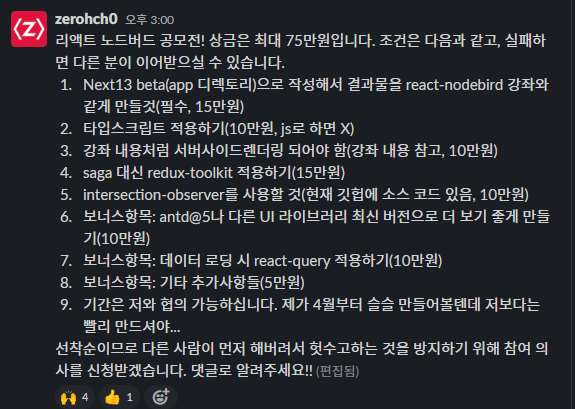

NextJs를 다시 공부하던 중 [제로초스쿨슬랙](http://zerochoschool.slack.com)에서 다음과 같이 리액트노드버드 공모전이 열렸었다. React NodeBird 강의를 NextJs 13의 app directory를 이용해서 프론트엔드를 리뉴얼 하는 것이다.
3주동안 개발을 하면서 NextJS Beta를 맛볼수 있는 시간이 되었다.[(깃허브)](https://github.com/ZeroCho/react-nodebird-next13) [(노션)](https://yoonhaemin.notion.site/1f98e509e37a4494af87d9c381aaac6b)

## NextJs Beta 후기

한줄 평은 조금 더 나중에 사용해볼걸 이었다.확실히 beta인 만큼 자료도 많지 않았고 개발하면서 찾아보니 지원하는 것도 별로 없었기 때문에 지금 사용하는 건 너무 시기상조라고 생각했다.
처음에는 NextJs의 큰 특징중 하나가 서버 컴포넌트를 사용한다는 점이었고 이를 공부해서 적용하고자 하였다. 하지만 사용하는 라이브러리마다 서버컴포넌트를 지원해 주지 않아 모든 파일마다 use client라는 클라이언트 컴포넌트 명시어를 붙여야 했다. 즉 NextJs Beta에서 가장 기대하고 큰 변환점인 서버 컴포넌트를 사용하지 못한 점이 너무 아쉬웠었다.

&nbsp;

layout, page 등 예약 파일이 생기면서 폴더에 들어가는 파일이 많아지다 보니 기존의 NextJs나 CRA를 쓸 때보다 이질 적인 느낌이 들었다 이건 나중에 best practice가 나오면 고민해봐야 할 것 같다. 반면 layout의 예약어는 매우 매우 좋게 사용했다 명확하게 layout을 잡다 보니 NextJs이전 버전을 사용했을 때보다 페이지 구조를 잡고 유지보수하기가 쉬웠다.

## 공모전 후기

작년 1월 React라는 신문물(?)을 처음 배우고 처음으로 들어본 강좌가 NodeBird 강좌였다. 1년 만에 다시 똑같은 걸 시도해 보려는데 감회가 새로웠다. 1년전에 몰라서 넘겼던 부분들이 이제는 할 수 있을만큼 성장했다. 개발은 공모전 요구사항에 있는 체크리스트 순으로 처리하려 했으나 규모가 커지면서 하나의 페이지에 여러 스텍들이 들어가다보니 기능순이 좀더 자연스러웠고 이에 개발은 기능 단위로 작업을 하였었다.

&nbsp;

이번 공모전을 하면서 기술 외적으로 느낀 것이 리펙토링 부분이었다. 제로초님이 강좌에서 항상 하시던 말씀이 리펙토링과 최적화는 필요할 때 해야한다 성급하게 해버리면 나중에 확장이 필요할때 오히려 다시 고쳐야 하는 상황이 벌어진다고 말씀해 주셨다. 그래서 이번에는 리펙토링을 필요한 시점에 해보자 생각하였다. 나는 구조를 고안하면서 미리 코드 분리를 하곤 했는데 이번에는 코드를 추가하면 작업이 좀 더 복잡해지면서 가독성을 해칠 때나 공통인 로직으로 분리를 해야 할 때 리펙토링을 진행하였다.

&nbsp;

그렇게 하다 보니 확실히 리펙토링의 횟수는 줄었지만 규모가 좀 있을때 리펙토링을 하다보니 리펙토링 자체에는 시간을 더 투자했어야 했다. 어떤 타이밍에 리펙토링이 들어가야 하는지, 내가 선택한 시점이 정답인지 모르겠지만 확실한 건 이것도 경험이 필요한 부분인 것 같다. 이론으로는 겹치는 부분이 생기면 분리가 필요하고 로직이 복잡해지거나 양이 많아지거나 여러 로직이 들어가거나 등 여러 이유에서 리펙토링이 필요한데. 이게 사람마다 코드를 짜는 스타일과 구상하고 있는 생각이 다르기 때문에 리펙토링 작업은 사람마다 다른 타이밍에 실행될 수 있다고 생각한다. 즉 리펙토링과 최적화가 필요할 때 해야 한다는 개인적으로는 성급하게 리펙토링을 하지 말고 좀 더 큰 그림을 보고 진행하라는 뜻으로 받아들여졌고 조직적으로는 조직의 기준과 의견을 공유하며 리펙토링을 진행하라는 말을 내포하고 있지 않나 생각이 든다.

## 마무리말

다 끝나고 생각해 보니 내가 과연 이걸 몇 시간을 투자해서 구현했는지 모르겠다. 나의 실력을 나타내는 지표 중 하나가 과연 내가 이 작업을 얼마 만에 끝낼 수 있는지 아는 것이라고 생각한다. 하지만 이번에도 이건 지켜지지 못했고 이점이 아쉬움이 남는다 아마 다음 프로젝트는 내 포트폴리오 사이트 만들기가 될 것 같은데 한번 기능 또는 페이지당 얼마나 시간이 걸렸는지 체크하면서 작업을 해보고자 한다. 꼭 잊지 말자!!!
