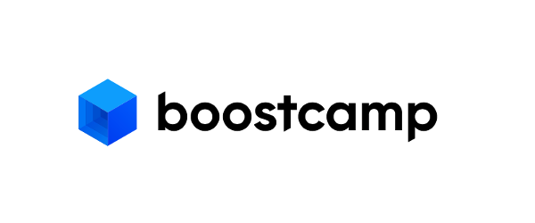
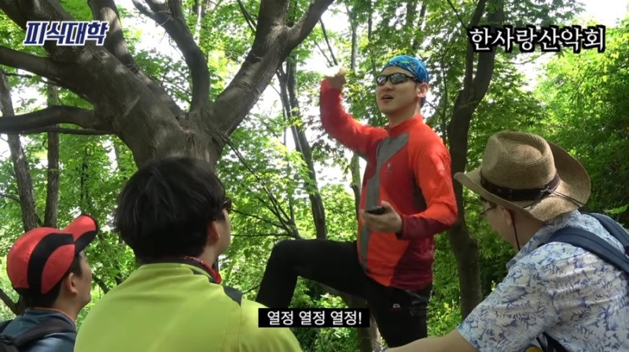

저에게 있어서 부스트 캠프를 한 줄로 요약하라 하면 다음과 같이 말할 것 같습니다.

> **부스트캠프는 개발자로서 지속 가능한 성장을 할 수 있게 몰입하는 환경을 만들어 준다.**

“지속 가능한”, “몰입”, “성장”이 3개의 키워드가 정말 매 미션을 해나갈 때마다 자연스럽게 익혀지는 기분을 들게 해주는 활동이었습니다.

## 운영

제가 참여했던 웹 기준으로 말을 이어가자면 JS를 처음 쓰는 사람부터 주력 언어로 몇 년 쓴 사람까지 다양한 사람들이 참여했어요. 저는 이런 사람들이랑 실력 차이가 나면 어떡하지? 결국 피드백을 받던 결과를 제출하건 완성도의 차이가 날 테고 그러면 결국 잘하는 사람들은 얻어가는 게 없지 않을까? 생각하였습니다.
실제로 대학교 동아리를 할 때도 실력 차이가 크게 나면 결국 잘하는 사람은 계속 가르치기만 하는 형식이 되어버리고 못 하는 사람은 계속 강의받는 형태가 되어 잘하는 사람이 “나는 얻어가는 게 없다." “나 이제 더하기 싫다”와 같은 상황을 많이 봤었죠. 이런 경험 때문인지 처음 운영에 대해서 걱정하였습니다.

하지만 부스트 캠프는 진행하면서 전혀 이런 느낌이 들지 않게 자기 스스로 성장할 수 있는 길들을 과제 내에 제시해 주었습니다. 내가 만약 이쪽 분야가 처음이라 하면 처음인 나름의 어떤 방법을 선택해서 성장해야 할지에 대해 고민한 결과를 과제로 녹이고 만약 내가 이쪽 분야에 견해가 있었으면 그 나름대로 과제를 어떻게 구성해서 해야 할지 고민하면서 하나의 문제에 대해서 다양한 시각을 가지고 접근해 보고 해결할 수 있는 문제들로 구성했다는 점이 너무 좋았어요.

그 덕분에 서로 피드백하면서 다양한 시각들이 오갔고 “이거 너무 쉽다.” “이거 너무 어렵다”로 나눠지는 사람 없이 전부가 “진짜 어려운데?” 로 통일(?)되었습니다.

## 참여

부스트캠프를 하면서 캠퍼분들을 보니 부스트캠프에서 원하는 인재상이 이거라는 것을 많이 느꼈어요. 일단 다들 하나에 대해 포기가 없습니다. 초반에 중도 포기로 나가는 사람이 있었지만 1주일이 지난 후에 남은 사람들은 진짜 몰입할 수 있는 사람들만 남았었죠. 남은 캠퍼분들은 아무리 어려운 문제가 나와도 지정된 시간을 넘어도 포기하지 않고 끈기 있게 헤쳐 나갔습니다. 또한 몇몇 분들의 slack 주도로 분위기 또한 좋게 형성이 되어 서로 으쌰으쌰 해서 헤쳐나가는 모습이 가장 인상 깊었던 것 같네요. 이런 분위기 때문인지 경쟁 없이 하나의 공동체로 진행이 되었다는 점이 너무 놀라웠어요. 이런 점에서 저는 부스트 캠프는 “내가 어떤 것에 몰입해서 끈기 있게 끝까지 포기하지 않고 성장하려는 욕구가 있는 사람들의 모임”이구나라고 느꼈고 저도 열정이 불타오르게 되면서 열심히 참여했던 것 같습니다.

## 나를 돌아보자

많은 걸 습득하기에는 4주가 참 짧은 시간이었습니다. 저는 크게 3가지에 대해서 이야기해 주고 싶네요.

 

첫 번째로는 저의 첫 주차 목표입니다. 무언가 지식을 추가로 습득하기보다는 있는 지식을 리마인드 시키고 연결해 보자였습니다. 새로운 것보다는 아는 걸 다시 상기시켜 과제에 적용하다 보니 아는 것들을 연결하고 연결하면서 나오는 모르는 부분까지 습득할 수 있었죠. 특히 프론트엔드에서 cs 지식이 어디에 적용되어 있지? 라는 궁금증들이 있었는데 이걸 직접 해소할 수 있는 활동들이 있어서 cs 지식의 중요성을 느끼게 되었습니다.

 

두 번째로는 소통의 장은 정말 정말 중요하다입니다. 2023 초창기에 남들과 소통하는 자리의 필요성을 느끼고 동아리와 스터디 등등 시작하였지만 부스트캠프만큼 긴밀하게 소통할 수 있었던 곳은 없었던 것 같습니다. 남들과 소통하면서 저는 확실히 남들에게 무언가를 설명해 줄 때 가장 많이 얻어가는 것 같다고 느꼈어요. 설령 그 내용을 몰랐더라도 말이죠. 부스트캠프 도중 이를 느끼고 최대한 질문이나 설명에 관해서 이야기해 보려고 노력했습니다. 남들이 눈에 띌 정도로 많이 하진 않았지만 그래도 저에게 있어선 많은 시도였다고 생각하였고 이를 토대로 좀 더 자신감을 가지는 계기가 되었죠.

 

마지막으로는 개개인의 속도와 양이 정해져 있으니 나를 믿고 나아가는 것입니다. 초창기에 다른 사람들을 보면서 ‘와 이 사람은 이것도 고려했네’ ‘와 저 사람은 저것도 했네’ 하면서 이것저것 비교하기 시작했고 이런 점을 모두 습득해 나도 시도하려 하였지만 결국 소화하지 못했었죠. 여기서 고비가 한번 왔었습니다. 하지만 이런 생각을 할 때마다 이미 내 앞에는 새로운 과제로 달려야 하고 이런 걱정에 대한 생각의 틈 없이 계속하여 학습을 진행해 나갔었어요. 주차가 지나면서 학습 패턴이 자리 잡게 되었고 그러다 보니 아 이런 방법은 나한테 맞지 않다는 것을 자연스럽게 깨달았습니다. 분명 나도 잘한 게 있고 최선을 다했을 텐데 왜 이래야 하지?라는 생각과 함께 나를 믿고 내 속도에 맞춰서 나아가기로 했습니다. 그래서 지금은 내가 최선을 다했나? 그래서 얻은 게 있나? 이 두 가지가 Yes라면 신경 쓰지 않기로 했습니다.

## 앞으로의 계획

첫 번째로는 팀에 대한 생각이 매우 많아졌습니다. 소프트웨어에서는 애자일이라는 방법론이 많이 대두되는데 그에 대한 생각이 막 정립이 된 것 같습니다. 세세한 애자일 규칙은 팀마다 다르지만, 본질은 애자일을 통해서 고객에게 최고의 가치를 전달하고 스프린트를 통해서 빠른 피드백을 하는 게 목적이라 생각해요. 또한 이런 팀 활동을 원활하게 진행하는 데는 유대감이 필수라고 생각합니다. 부스트 캠프에서도 프로젝트는 아니지만 팀 활동 시간에 이런 유대감이나 각자의 열정에 따라서 활동 시간의 만족도 차이가 컸었습니다. 그래서 꼭 서로 친해지는 기간을 가지고 각자가 생각하는 프로젝트의 본질에 대해서 이야기해보는 시간을 가지는 활동을 기획할 생각입니다.

 

두 번째로는 멤버십에 붙게 된다면 테크톡을 해보자 입니다. 사실 1년 전부터 생각은 하고 있었지만, 기회가 없었습니다. 이번 부스트 캠프를 하면서 남들에게 설명을 해줄 때 습득하는 게 많다고 뼈저리게 느꼈어요. 또한 이런 잘 정리된 내용을 보면서 듣는 사람 또한 내용습득을 할 수 있어 서로 상생되는 학습법이라고 생각합니다.

## 결론

4주 동안 이루어진 과정에 사실 더 욕심이 나는 부분은 있었지만 다시 되돌아가도 지금 느낀 것과 비슷했을 것 같습니다. 멤버십에 떨어져도 후회는 없습니다. 내가 할 수 있는 최선을 다했다고 당당히 말할 수 있는 4주였습니다.
