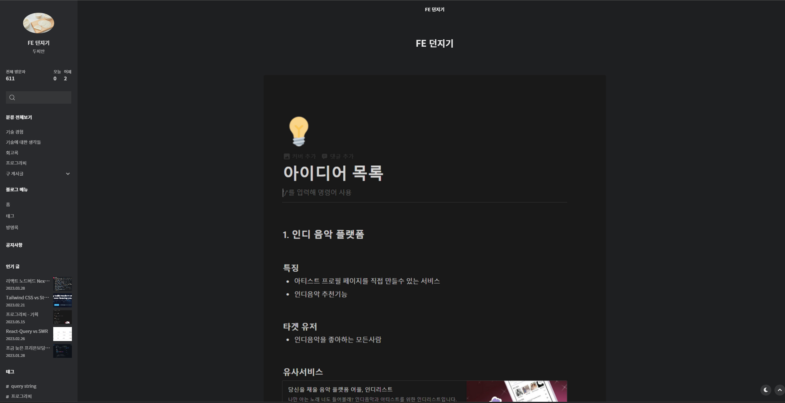

### 왜?

사실 시중에 떠다니는 블로그는 너무 많다. 네이버 블로그, 티스토리, 브랜치, 미디엄, 벨로그 등등 쉬우면서도 강력한 기능을 가진 블로그들이 존재하고 있었고 나도 기존에는 티스토리 블로그를 쓰고 있었다. 각 플랫폼마다 강력한 장점들이 존재함에도 불구하고 나는 블로그를 만들어보고 싶었다.

### 나만의 것을 달라!!

먼저 시중에 있는 블로그들은 템플릿이나 플렛폼 자체에 종속되어있다. 템플릿을 보다보면 수정하고 싶은 사항들이 존재했다. 이런 내용을 모두 수정하는것보다는 내가 직접 만드는것이 나중에 필요한 사항이 발생했을 때 대응하기 편하다고 생각했다.

### 블로그의 용도가 바뀜

처음 블로그를 시작했을때는 내가 겪은 경험을 남들에게 알려주는 것을 주를 삼으며 지식 공유의 글을 작성했었다. 하지만 2022회고에서 처럼 시중에는 나보다 더 정확하고 정리가 잘된 글도 많다고 생각했고 더이상 블로그를 정보 전달 용도가 아닌 이에 내 주관 및 경험을 나타내는 블로그를 만들어보자로 결정을 하였다. 그렇게 6개월을 쓰다 보니 티스토리보다는 블로그를 직접만들어 디자인부터 게시글 기능까지 전부 나를 나타내는 공간으로 만들어야 겠다고 생각하였다.

### 어떤 기능을 넣을까?

시작전 어떤 기능이 들어가야 하는지 정리해봤다.

다크모드, 반응형 디자인, MD파일을 활용한 글, 조회수 기능, 댓글 기능, SEO최적화….등등등 적다보니 한가득 이여서 기본적으로 블로그가 동작하기 위한 첫번째 버전을 위해서 다음과 같이 작업을 나누어 보았다.

- 다크모드
- MD파일을 이용한 포스팅 글
- 애니메이션
- 댓글 기능
- 상단 스크롤바
- 호스팅

여기 까지가 출시를 위한 필수적인 내용이라 생각하였고 해당 작업이 모둔 마친후에 바로 배포를 실시하였다.

- 반응형 디자인
- 포털에 링크 등록
- SEO최적화
- 조회수 체크 (Google Analytics)

이 다음부분은 출시를 한후 빠르게 하나씩 적용해서 지금 포스팅을 하는 시점에서는 전부 완료하였다.

## 기술 스택을 선정해보자!

### NextJS vs Gatsby

기술스텍 중 가장 고민을 했던것은 NextJS vs Gatsby였다. 기본적으로 블로그를 만드려면 검색엔진에 노출되기 위해서 SEO설정이 필수로 들어가야 했고 특히 블로그 글은 잘 바뀌지 않는 정적인 페이지의 특성을 가지고 있었기 때문에 SSG를 선택해야 한다고 생각하였다. 이런 조건속이 맞는 기술 중에서 대표적인것으로 NextJs와 Gatsby가 있다는 것을 알게되었다.

단순히 처음에 사용했을때는 그냥 블로그 많은 플러그인들을 제공해주고 SSG에서의 최적화가 되어 있어 블로그를 만드는 기술 스택으로 채택이 많이 되고 있었고 GraphQL을 사용해 보고 싶어서 선택하였다. 하지만 사용을 하면서 Gatsby가 CMS(콘텐츠 관리 시스템)들을 통합할수 있는 통합 사이트 생성기라는것을 알게되었다. 이는 블로그를 넘어 다양한 콘텐츠를 유용하게 관리하고 사이트를 생성해주는 아주 좋은 도구인것이다. 블로그를 작성할때 사용하는 md파일 뿐만아니라 워드 프레스, 전자상거래 플랫폼 Shopify 등 다양한 통합 기능을 가졌다는 특징을 가지고있었다.

나중에 Gatsby와 NextJS를 비교하는 글을 한번 써보면서 자세하게 다뤄 보겠다.

### Chakra UI

나는 MUI를 즐겨 사용했는데 슬슬 MUI의 스타일이 질리기도 했고 이번 블로그는 디자인도 만들었던 터라 자기주장이 강한(?) 디자인 라이브러리를 사용하고 싶지 않았다 이 점 때문에 Headless UI와 고민을 하였지만. 결국 구현하는 기능이 많기 때문에 조금의 도움을 받는게 낫다고 판단하였다. 그래서 다크모드의 지원이 되어있고 반응형 쿼리를 쉽게 사용해주고 디자인도 마음에 드는 ChakraUI를 사용하게 되었다.

### Gh-pages

처음에 배포는 도메인을 구입해서 하려고 하였다. 하지만 나에게 있어서 우선순위는 도메인 있는 배포가 아니라 완성이었기 때문에 쉽게 배포를 해줄수 있는 Gh-pages를 이용하였다. 손쉬운 세팅으로 deploy시에 알아서 새로 build하고 배포까지 자동화가 이뤄진다.

## 끝…?

이제 블로그가 동작이 되게끔은 만든것 같다. 기본적인 준비는 끝났으니 블로그 콘텐츠도 채우고 나만의 공간을 만들자 + UX를 신경쓰자에 초첨을 맞추어서 계속 발전해 나가보자.
