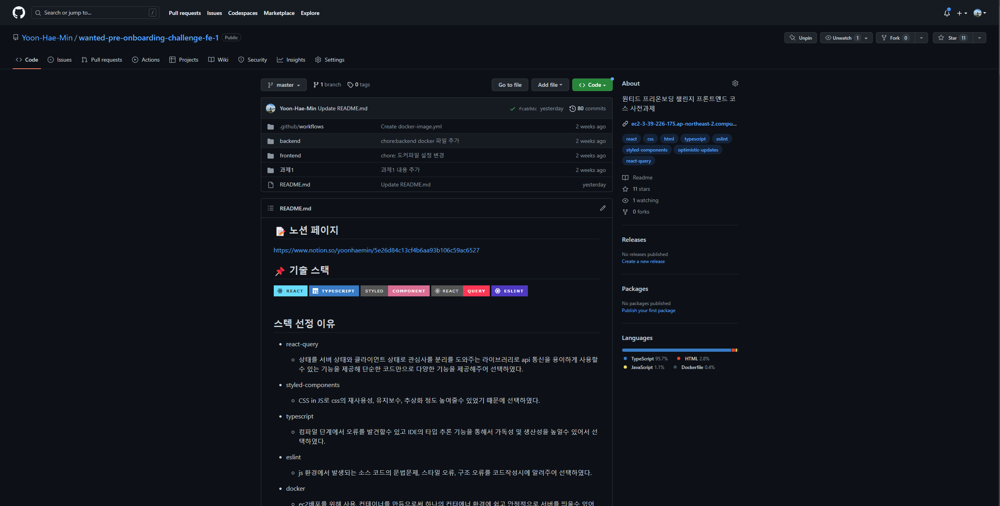
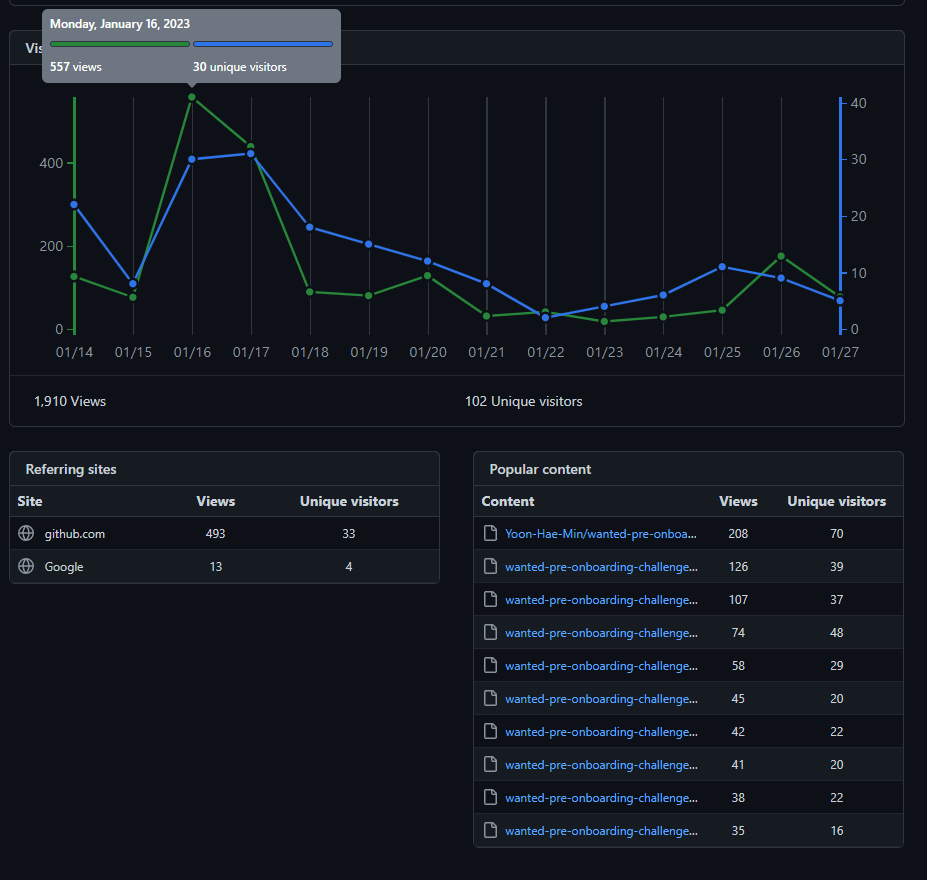

### 기간

2023.01.09 ~ 2023.01.20 (1회에 3시간 같은 4시간 수업을 4번 진행)

### 시작

때는 2022년 12월경 이 정도면 React로 웹좀 만들어 봤고 나름 코드에 대해서 자신감이 붙었을때 과연 내가 작성한 코드가 실제로 어느 위치에 있는지 궁금해졌었다. 내가 잘하고 있는것인지 아니면 보완해야 될 부분이 있을지를 기대하고 원티드 프리온보딩 프론트엔드 챌린지 1월에 참여하였다.

### 사전과제

[GitHub - starkoora/wanted-pre-onboarding-challenge-fe-1-api](https://github.com/starkoora/wanted-pre-onboarding-challenge-fe-1-api)

간단한 Todo List를 만드는 과제였다 처음에는 금방하겠지라는 생각을 가지고 일정을 일주일 생각했지만 하면서 욕심도 내보고 고민하다보니 일정이 4일이 밀리게 되었다. 매 작업할때마다 일정 예측을 하지만 생각보다 일정 정하기가 힘들었다.

실제 과제로 작성한다면 자신있는 기술과 내용으로 담백하게 작성했을것 같은데 그래도 무언가를 만들때는 적어도 하나쯤은 모르는 것을 도입해야 금방 실증나지 않고 더 추가되는게 있기 때문에 다음 3가지를 추가로 고려해서 프로젝트에 넣어봤다.

1.  UI관련 라이브러리 사용없이 직접 컴포넌트를 만들어 프로젝트를 진행하자.
2.  optimistic update라는 개념을 알게 되어서 이를 적용해보자.
3.  애니메이션을 사용해보자.

### 수업기간중 느낀점

초반에 내가 과연 공부를 잘해왔고 어느 수준에 있는지 보기 위해서 신청한 만큼 코드리뷰를 중점으로 들어보고자 하였다. 하지만 내 생각과는 다르게 신청자가 많아 과제를 제출한 사람들위주로 코드를 선정해서 멘토님이 코드리뷰를 해주는 방식으로 진행하였다.

일단 첫 수업부터 느낀것이 나는 기능 구현을 할주는 알지만 이를 표현하는게 힘들었다 였다. 멘토님이 툭툭 던져주는 질문을 들으면서 사용해 본것에 대해서는 답해 보려고 하였지만 느낌만 올뿐 단어 선정과 문장까지는 나오기가 힘들었다. 남들과 소통하며 공부하는것과 내 언어로 다시 표현하는게 필요하다 생각하였고 이를 실천하기 위해서 3가지 원칙을 세웠다

1.  하나의 큰 대단원이 마무리되면 회고록 작성하기
2.  남들과 기술적으로 소통하면서 작업할수 있는 환경 만들기(연합동아리)
3.  하나의 선택지가 생길때마다 글로 표현하기(선택 이유, 공부정리)

실제 프로젝트를 개발하고 리펙토링을 진행하면서 최대한 노션에 남겨보려고 노력하였다. 글쓰기가 매우매우 어렵고 생각하고 정리하고 작성하는 시간이 오래 걸렸지만 이것도 하다보면 익숙해 지리라 믿으면서 작업하였다.

수업을 진행하면서 멘토님이 알려주는 공부방법이나 꿀팁들을 들으면서 공부 방향을 정해 나갔다. 그중 기억에 남는것 두가지만 설명해보겠다

첫번째로는 라이브러리 뒤져보기이다. 항상 생각은 하는데 마음처럼 선뜻 나서기 힘든것이 라이브러리 원리 파악하기였다. Redux의 CreateStore의 최소 구현체를 구현하는 것이었다. 하지만 왠걸? 생각보다 별거 없어서 깜짝놀랐다. js로 작성하는 쉬운 함수였다. 이 과제이후 자신감을 얻어 강사님이 useState hook도 보면 같은 원리다 라고 설명해서 useState도 펼쳐봤지만 비슷한 원리네 라고만 생각했을뿐 정확하게 어떻게 돌아가는지는 이해하지 못했다 ㅋㅋ 그래도 라이브러리를 뜯어본자의 칭호가 생겼기에 앞으로도 큼직큼직한 라이브러리 위주로 뜯어볼것 같다.

두번째는 취업 관련이다. 간단하게 정리하면 취업은 완벽한 사람을 뽑는것이 아니다 회사에 맞는 사람을 뽑는것이라고 이를 위해서는 '나'라는 사람을 잘표현해 주는게 중요하다. 이는 논리적으로 표현하기가 중요하게 여겨야할 덕목(?) 이라고 한다. 이 덕목을 갖추기 위해 위 3가지 원칙을 꼭 지키자는 다짐을 할수있었고 지금 회고록을 작성 및 노션에 기록을 남기면서 실천중이다

### 아쉬웠던점

개인적으로는 개인사정으로 마지막수업을 못 들었던 것이 아쉬웠다. 실제 이력서를 보면서 피드백하는 수업을 보고싶었는데 그점이 좀 아쉬웠다. 😂😂😂

프로그램 상으로는 너무 많은 인원을 받은것이 독이 되었다고 생각한다. 지원자 천명에 실제 듣는 인원 200~300명 과제 제출자는 50명도 안된다는게 너무 아쉬웠고 차라리 열정있게 참여할 자만 선발해서 참여하도록 하면 참여도가 높지 않았을까 생각이 든다.

### 마무리

사실 설날에 이 회고를 작성하려 했지만 또 일정에 밀려버렸다. 일정 이틀짜리 최적화작업 도중에 버그가 생기면서 일정이 밀리게 되었고 다 해결한후 Readme 마무리작업을하고 이를 작성하려다 보니 지금이 되어버렸다. 그래서 머리에서 날아간 내용들이 좀 많다. 따끈따끈하게 주저리 주저리 회고하고싶었는데 ㅋㅋㅋ 아무튼 짧은 2주간의 활동을 마무리 짓고 다음 계획으로 규모있는 프로젝트를 만들어보면서 얻은 내용을 실천해보는 시간을 가져보자!!!

### 번외) 개인 깃헙 최고 스타 레포지토리 달성

첫번째 수업시간에 Modal 컴포넌트가 좋은 코드 예시로 선정됨에 따라서 갑자기 많은 트래픽과 관심을 받게 되었다. 내가 코드를 짜면서 고민하며 적용한 내용이 맞았다는 점이 너무 뿌듯함과 잘성장하고 있었다는 안도감이 밀려온후 그날 스타 뽕에 취해있었다 ㅋㅋㅋㅋ

깃허브 스타는 비전공자 친구들에게 자랑해봤자 '????' 할것이 뻔하기에 블로그에서나 자랑해야겠다

