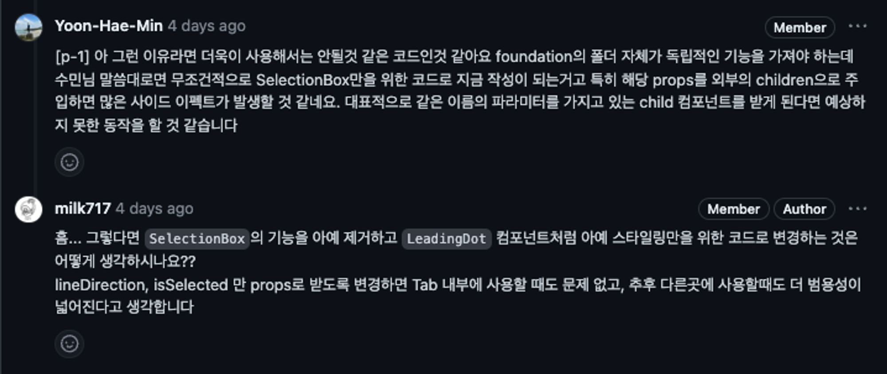

코드 리뷰? 그거 그냥 하면 되는 거 아니야? 이게 올해 초까지 제 생각이었습니다. 어느 모 회사의 코드 리뷰 과제를 받고 이런 생각이 깨지게 되었는데요. 코드 리뷰 과제를 하면서 아 나는 코드 리뷰를 잘못하고 있었다는 생각과 이건 기준을 잡고 어떻게 해야할지 고민을 해보았고 나는 코드 리뷰를 어떻게 할 것인가에 대한 가치관을 정리해 보려 합니다.

## 기존의 리뷰 방법

기존의 코드 리뷰는 그냥 코드를 쓱 보고 정말 이상한 게 없는지 검증하는 과정으로 진행하였습니다. 뭐 간단하게 이야기하자면 뭐가 빠졌네? 실행이 잘되네? 컨벤션 잘 지켰네? 하면 그냥 approve를 진행하는 식으로 진행했었습니다. 지금 보면 굉장히 비효율적인 방법이지만 그 당시에는 코드 리뷰에 쓰는 시간보다는 구현에 쓰는 시간이 많아야 프로젝트도 빨리 구성되기 때문에 그냥 상대방이 잘하고 있나 하는 용도 + 괜찮은 코드를 배우려는 목적으로 사용했던 것 같습니다.

## 왜 코드 리뷰를 해야 할까?

그러면 근본적으로 코드 리뷰는 왜 필요할까요? 사람마다 다양한 이유가 있지만 저는 다음과 같은 이유가 있다고 생각합니다.

<br/>

1. 팀의 코드 스타일을 하나로 동기화하기 위해서
2. 개인의 성장을 위해서
3. 더 견고한 프로젝트를 위해서
4. 동료를 더 잘 알기 위해서

개인이 아니라 팀 단위의 코드를 작성하다 보면 서로의 경험이 다르기 때문에 코드 스타일을 하나로 모아 서로의 코드 스타일을 맞추어 서로의 코드를 더 빠르고 쉽게 읽을 수 있습니다. 코드 스타일이라는 것은 간단하게는 변수명, 코딩 컨벤션, 파일의 위치, 코드의 구조 등등이 있는데요 이게 같다는 것은 팀의 코드를 더 잘 이해할 수 있는 것으로 귀결됩니다. 따라서 코드 자체가 리뷰어한테도 읽기 쉬우니 변경 사항을 이해하는 데 체력적 소모를 줄일 수 있고 이는 더 자세한 리뷰를 끌어낼 수 있습니다.

<br/>

코드 리뷰는 의견을 제시할 뿐만 아니라 질문하는 것도 하나의 일환인데요. 질문을 하며 상대방의 의도를 파악하고 그 과정에서 생기는 지식을 공유하며 개개인의 성장에 기여할 수 있습니다. 개개인의 성장은 결국 팀의 성장을 끌어내는 선순환을 만들 수 있죠. 또한 이 과정에서 내가 처리한 코드에 더 좋은 방법이 나오거나 이거는 불필요하거나 어떤 점이 우려되는지 등 리뷰에 따라서 더 견고한 프로젝트를 완성할 수 있죠.

<br/>

동료를 더 잘 알기 위해서는 코드 리뷰를 과제로 풀면서 느낀 것인데요. 코드 리뷰는 사람마다 중요하게 보는 곳이 다르고 강점도 다르고 주장하는 근거도 다 다릅니다. 코드 리뷰는 작성자와, 리뷰어의 생각을 직접적으로 작성하기 때문에 동료의 개발 가치관을 직접적으로 엿볼 수 있습니다. 이는 결국 팀의 시너지를 끌어낼 수 있는 계기가 되기도 합니다.

## 어떻게 해야 하는가?

사실 여기까지는 뭐 당연히 코드 리뷰에 대한 좋은 말입니다. 하지만 이거를 어떻게 실현 할건데?라는 게 가장 큰 문제죠. 그래서 저는 코드 리뷰를 할 때 몇 가지 저만의 규칙을 세워서 조금 더 효율적으로 해보자 하고 있습니다.

<br/>

1. PR 본문을 잘 읽어 봅니다..
2. 코드를 어떻게 짰는지 내가 잘 이해할 수 있나 확인하며 코드를 살펴봅니다.
3. 내가 만약 코드를 짠다면 어떻게 짤 것인가? 고민해 봅니다.
4. 선언적 코드로 작성하였는가?를 고민해 봅니다.
5. 관심사의 분리가 잘되었는가?를 고민해 봅니다.
6. 재사용이 가능한 부분을 잘 분리하였는가?를 고민해 봅니다.

<br/>

더 추상화하면 크게 2가지로 구분할 수 있는데요 첫번 째는 코드의 흐름을 체크하는 것 두번째는 코드의 퀄리티를 높이는 것입니다. 저는 이 두 개를 한 번에 체크하기가 힘들어서 코드 리뷰를 할 때 총 2번 읽고 진행합니다.

<br/>

먼저 첫 번째 읽을 때는 진행하면 상대방이 어떻게 짰는지 한번 검토해 봅니다. PR 본문을 바탕으로 어떤 작업이 있었는지 어떤 결과물인지 간단하게 파악합니다 해당 내용을 바탕으로 작성자의 작업과 작성자가 어떤 생각을 가지고 있는지를 인지합니다. 내가 짠 코드가 아니니 충분히 읽는 시간을 가져야 코드로 들어가서 볼때 이해가 더 잘 되더라고요.

<br/>

그다음으로는 코드로 넘어가는데 이 때는 동작의 흐름을 따라가는 리뷰만 진행합니다. 저는 제가 잘 이해해야 남들도 잘 이해할 것이기 때문에 만약 내가 이 코드를 이해하기 힘들다면 왜 이해하기 힘든지 먼저 생각을 하고 리뷰에 남기거나 어떻게 수정할 수 있을지에 대한 가이드를 세워서 전달해 주면서 변경 점을 하나하나 읽습니다. 이 과정에서 서로의 스타일을 맞춰 보며 코드 스타일을 점검할 수도 있습니다.


코드 작성자의 생각을 따라가며 작성자의 의도를 이해하고 만약 “나는 이렇게 생각해”라는 부분이 나오면 코멘트를 남깁니다.


이렇게 코드를 이해했고 어떻게 동작하는지 알았으면 코드의 퀄리티를 높이는 리뷰를 하는데요. 다시 처음으로 돌아와서 읽기 시작합니다. 단 이때는 전재조건 하나가 뒤따라야 합니다.바로 프로젝트 전체에 대한 이해도가 기본적으로 있어야 한다는 가정입니다. 프로젝트의 구조를 알아야 해당 코드가 적당한 레이어에 있는 코드인지 해당 구조로 만드는 게 맞는 것인지, 기존 코드로 재사용할 수 있는것인지 등에 대한 판단이 서기 때문입니다. 하지만 프로젝트 초반에는 구조 자체가 없기 때문에 구조를 이렇게 잡아 보자는 느낌의 PR과 코드의 퀄리티보다는 코드의 스타일을 맞추는데 우선시하고 있습니다.


코드 리뷰를 하다 보면 구조 자체를 변경하는 것(컴포넌트 구조나 로직에 대한 레이어 분리나)에 대해 리뷰는 하기가 조심스러운데요. 내가 생각하고 있는 구조가 작성자가 작성한 코드를 전부 바꿔야 하는 거라면, 혹은 변경 점이 너무 많다면 이거를 리뷰해야 하나 말아야 하나 고민을 하게 됩니다.

<br/>

저는 이에 대한 해결책으로 pre commit review라는 방법을 진행하는데요. 구조만 미리 리뷰를 받는 활동입니다. 간단하게 pseudocode를 작성해 PR에 올려서 리뷰를 먼저 받을 수도 있고 아니면 팀원이 모여서 내가 하는 작업에 대한 구조에 대해서 리뷰를 받을 수도 있습니다. 이번 프로젝트에서는 후자의 방법을 선택해서 하고 있고, 프로젝트의 구조가 자리 잡을 때까지 2~3주 정도 진행하고 있습니다.

상대방의 구조를 미리 보니 코드 리뷰할 때도 한층 편하게 리뷰할 수 있고 작성한 코드의 구조를 전부 뒤엎는 불상사를 막을 수 있습니다.

실제로 저는 다음과 같은 코드를 리뷰받았었는데 이게 기존의 구조를 완전히 뒤엎는 구조였던지라 팀원의 의견과 해당 구조에 대한 필요성을 설득하기 위해서 pre commit review를 진행했었습니다.

```jsx
const InterviewSettingPage: React.FC = () => {
  const navigate = useNavigate();
  const data = [
    {
      name: '문제 선택',
      path: 'question',
      page: <QuestionSelectionBox onNextClick={} onBeforeClick={} />,
    },
    {
      name: '화면과 소리설정',
      path: PATH.CONNECTION,
      page: <VideoSettingBox onNextClick={} onBeforeClick={} />,
    },
    {
      name: '녹화 설정',
      path: PATH.RECORD,
      page: <RecordMethodBox onNextClick={} onBeforeClick={} />,
    },
  ];

  const [current, setCurrent] = useStepPage(data.map((item) => item.path));

  const [searchParams, setSearchParams] = useSearchParams();

  const changePageHandler = () => {
    //query string만 바꾸는 함수
  };
  return (
    <InterviewSettingPageLayout>
      <SettingProgressBar current={current}>
        {data.map((item) => {
          <SettingProgressBar.step
            name={item.name}
            onClick={changePageHandler}
          />;
        })}
      </SettingProgressBar>
      <StepPage.wrapper current={current}>
        {data.map((item) => {
          <StepPage.step path={item.path}>{item.page}</StepPage.step>;
        })}
      </StepPage.wrapper>
    </InterviewSettingPageLayout>
  );
};

export default InterviewSettingPage;
```

굉장히 많은 의견이 오갔지만 다행히도 팀원들을 설득할 수 있었고 실제 개발에도 적용할 수 있었습니다(자세한 건 포스팅을 따로 써볼 예정입니다)

## 리뷰어로써 고려해야 할 사항

코드 리뷰라는 게 어쩔 수 없이 쉽게 분위기가 딱딱해지는 활동이라 생각합니다. 글에는 감정이나 분위기를 표현할 수가 없어 내가 의도한 바와 다르게 전달되는 경우가 생각보다 많이 있었습니다. 그래서 저는 이 의도하는 바를 잘 나타내기 위한 방법이 없을까 고민을 하였고 그에 대한 방법을 찾은 게 뱅크 샐러드의 [PN룰](https://blog.banksalad.com/tech/banksalad-code-review-culture/)과 근거있이 말하기였습니다.

코드 리뷰를 읽으면 항상 생각이 드는 게 그래서 이거를 반영을 하라는 거야? 나는 사소해서 넘길 만한 사항이라 생각하는데? 지금 이 리뷰내용이 얼마나 중요한 거지? 등 상대방이 어떤 세기로 주장하고 있는 것인지 잘 몰랐습니다. 그래서 PN룰을 넣어서 내가 이거는 얼마큼의 세기로 주장하고 있는 거야라는 것을 표현해 주고자 하였습니다.

PN 룰은 팀마다 규칙으로 지정해 놓을 수 있는데 저는 보통 p1~p5까지 설정하고 p1으로 갈수록 주장을 강력하게 하는 것으로 지정합니다.


그다음은 근거있이 주장하기인 데요. 이게 생각보다 어렵고 코드 리뷰의 시간을 가장 많이 잡아먹는 방법입니다. 간단하게 사용하자면 내 의견에 Why와 How를 붙이는 건데요. 왜 이거는 이래야 하는지 근거를 들어서 설명하고 (할 수 있다면) 어떤 방향으로 고쳐야 하는지 방향성을 잡아주는 것입니다.



하지만 가끔 이게 뭔가 아닌 거 같은데 주장하기에는 근거가 부족한 상황들이 종종 생기는데요. 처음에 저는 이런 것까지 같이 공유하면 좋지 않을까 생각해서 코드 리뷰에 해당 사항을 적었지만, 상대방은 이를 내 코드에 불만을 품고 있다고 생각하는 경우도 있었습니다.

<br/>

그래서 저는 차라리 이런 내용은 코드 리뷰에 작성하지 말고 회의나 따로 육성으로 이야기하는 게 좋다고 생각합니다. 이런 경우는 뭔가 감정과 비언어적 행동까지 상대방에게 전달되어야 나는 이거 태클이 아니라 같이 고민해 보고 싶다는 뉘앙스가 잘 전달이 되어 조금 더 조심스러운 의견 전달이 되는 느낌이었습니다.

<br/>

코드 리뷰를 할 때 주의해야 할 점도 있는데요. 가장 기피해야 하는 게 남에게 상처를 주지 말지입니다. 사람마다 상처받는 기준치가 다릅니다. 자기 코드에 대한 애정도가 높아서 상처받을 수도 있고 말투나 다른 이유에서 개개인의 상처를 받는 지점은 다 다릅니다. 저 또한 코드 리뷰를 처음 했었을 때는 리뷰에서 많은 수정 사항과 코멘트를 받으면 괜히 조금 침울해지곤 했었습니다. 저는 그래서 상대방에게 상처를 조금 줄이고자 PR에 칭찬하기와 피식하고 지나갈 수 있는 것 만들기를 하려고 노력하고 있습니다.


## 코드 리뷰는 문화다

코드 리뷰는 다들 문화라고 표현하는데요. 문화는 지역마다 사람의 구성원마다 달라진다는 특징이 있습니다. 저는 이런 생각을 하고 있지만 다른 사람은 이 문화와 안 맞을 수도 있습니다.

<br/>

흔히들 하는 실수가 코드 리뷰는 하나의 규칙이라고 생각을 가진 상태로 코드 리뷰를 한다는 것입니다. 하나의 규칙으로 작용하게 된다면 되게 부담스러운 활동으로 다가올 수도 있는데요. 저는 초반에 코드 리뷰를 하나의 규칙으로 생각하고 진행을 했는데 저에게 있어선 숙제 검사를 한다는 느낌으로 다가왔고 굉장히 스트레스받는 하나의 작업이 되었습니다. 하지만 코드 리뷰를 하는 팀원들이 바뀌면서 한 분이 코드 리뷰에 굉장히 관대하고 하나의 코드에 대한 채팅창 정도로 생각하시는 분을 만나면서 코드 리뷰에 대해 부담감을 덜 수 있었습니다.

<br/>

그래서 저는 코드 리뷰를 하나의 문화로 생각하고 가치관을 성립해서 여러 코드 리뷰 문화권의 사람과 섞이도록 노력하고 있습니다. 저는 위와 같은 방법으로 사용을 하지만 어떤 팀에서는 내용 중 일부를 채택하기도 하고 아니면 다른 사람이 생각하는 코드 리뷰의 특징들을 채택해서 사용하기도 합니다. 우리 팀은 어떤 가치를 따를 것인지 잘 고민하고 문화로써 적용해 보는게 코드 리뷰를 가장 "잘" 하고 현명하게 하는 방법이라 생각합니다.
