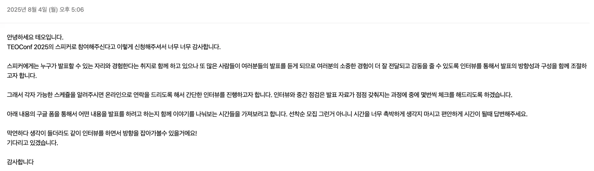
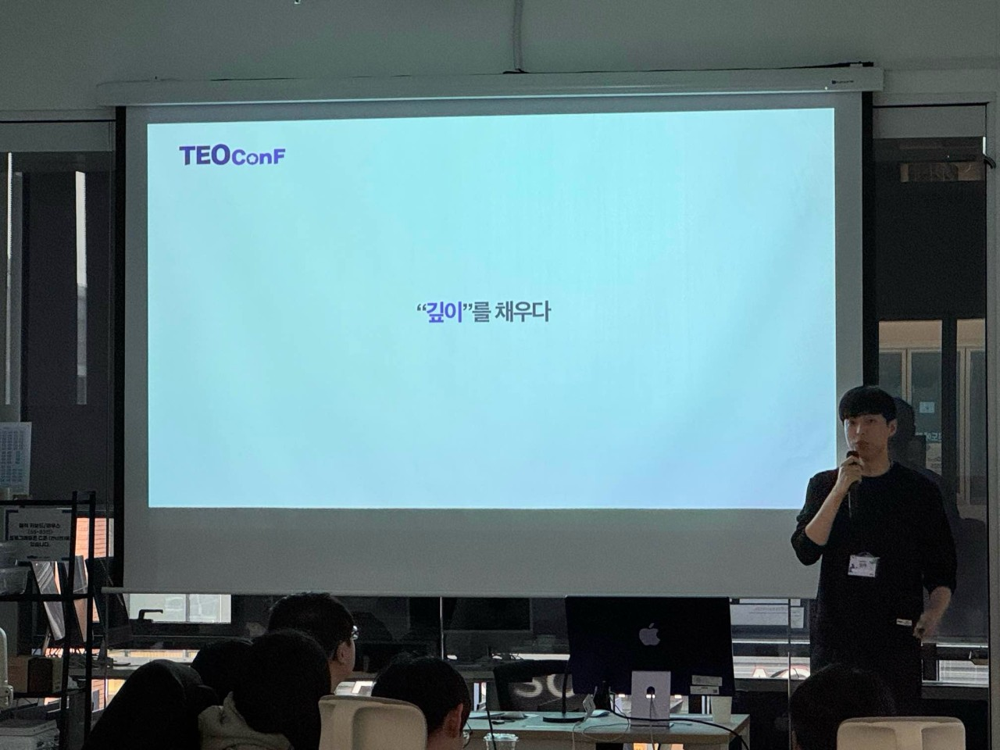
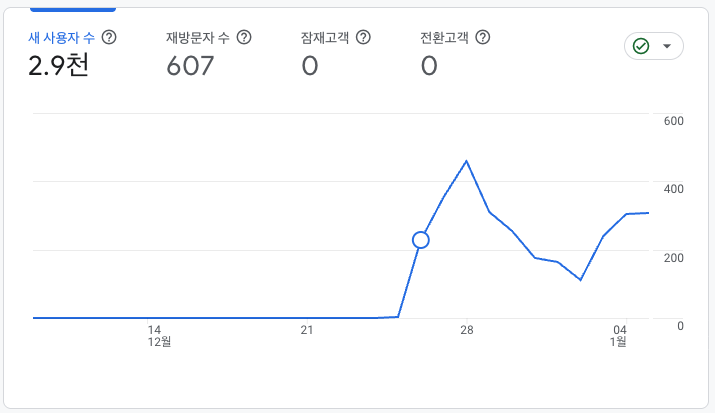
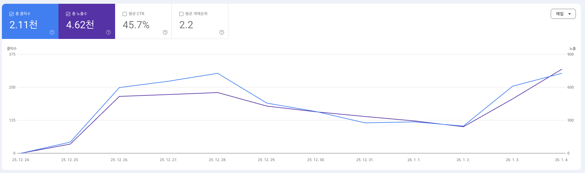

## 서론

개발을 떠나 공식적인 자리에서 발표를 하는 사람들이 너무 멋있어 보였습니다.
발표를 잘했던 못했던 것은 중요하지 않았습니다. 발표를 하는것 자체만으로 발표자 한 사람 한 사람은 이미 그 분야를 정말 잘하고 있거나, 아니면 곧 잘하게 될 잠재력이 있는 사람이라 생각합니다.

 

그 모습을 보며 자연스럽게 저도 그런 사람이 되고 싶다는 생각이 들었습니다.

당근에서의 인턴을 마무리하며 여러 이야기를 들었습니다. 그중 하나는 백엔드 개발을 했던 경험을 블로그 글이나 발표로 정리해보는 것도 좋은 마무리가 될 것 같다는 팀원의 말이었습니다.

 

평소에도 발표를 해보고 싶었고 마무리로써 좋은 활동일것 같다고 생각하던 중 “개발자라면 누구나 한 번쯤 많은 사람들 앞에서 나의 경험이나 성과, 활동 등을 멋지게 발표해보고 싶다고 생각합니다.”라는 테오콘의 문구를 보게 되었습니다. 그 문장을 보는 순간 홀린 듯이 발표자 신청을 해버렸습니다.

## 너무 어려운 준비

당근에서의 백엔드 경험 자체를 어떻게 풀어내야 할지 많은 고민이 되었는데요. 경험을 나열하듯 모두 작성해보자니 이 발표의 결론이 무엇인지, 무엇을 전달하고 싶은지 뚜렷하게 드러나지 않았습니다. 그래서 더 좋은 전달을 위해 경험을 정제하고 하나의 주제를 만들어 보고자 하였습니다.

 

경험이라는 것은 일반적으로 하나의 결론에 이르기까지 연속적인 흐름을 가집니다. 그 흐름을 그대로 전달하는 것이 스토리텔링이 되기도 하고 듣는 사람 입장에서도 이해하기 쉽습니다. 하지만 제가 발표에서 풀고자 했던 내용은 연속적이지 않고 지엽적으로 끊임없이 등장했던 순간들의 집합이었습니다. 어떤 내용은 발표와 무관한 고민을 하다 떠올린 것이었고, 어떤 것은 당근 인턴이 끝난 이후에 정리된 생각이었으며, 또 어떤 것은 갑자기 번쩍 떠오른 것이기도 했습니다.

 

이 모든 것을 진실되게 정리해 풀어내자니 발표는 점점 블로그에 가까워졌고 제가 전달하고 싶은 핵심보다 배경 설명에 더 많은 힘을 써야 하는 문제가 생겼습니다. 그래서 진실을 조금 포기하고 MSG를 약간 더해 하나의 흐름으로 만들고자 하였습니다. 실제 있었던 일들을 짜집기하기 시작했고 그렇게 두 번의 지우고 다시 쓰기를 거쳐서야 비로소 하나의 흐름을 완성할 수 있었습니다.

 

이 과정에서 받았던 테오의 피드백 중에는 신선한 관점도 있었습니다. 발표는 블로그 글과 다르게 내가 해주고 싶은 그 한마디를 위해 처음부터 빌드업을 하며 상대를 설득해야 하고 이 발표를 들은 뒤 그 결론이 여운으로 오래 남아야 한다는 이야기였습니다. 저는 기술 관련 발표는 당연히 기술적인 내용들이 중심이라고 생각하고 있었습니다. 정교하고 준비가 잘된 기술적인 내용들을 토대로 발표하는 것이죠.

 

좋은 발표라 생각이 되는 내용을 돌아보니 전하고자 하는 바를 잘 전달하기 위해 중간중간 설득을 위한 장치들이 존재하고 있었습니다. 이 장치들의 임펙트의 크기에 따라서 발표의 몰입도가 달라지고 있다 것을 느꼈습니다. 발표자의 경험, 생각, 혹은 그 기술이 없었을 때의 상황과 의견처럼 기술이 아닌 현실 세계의 이야기를 발표 안으로 끌어들이고 있다는 점이 공통적이었습니다. 즉 기술적인 내용을 사람들의 머리속에서 남게 하기 위해서는 결국 사람들이 몰입할 수 있는 장치들의 임펙트가 중요하다는 것입니다.
이 피드백을 받고 나서야 제가 당근에서 일하던 당시 현실에서는 어떤 일을 하고 있었는지, 그에 대한 반응은 어땠는지와 같은 실제 이야기를 발표에 담아내고자 하였습니다.

## 발표하기

발표 시작 2주 전 최종 리허설을 진행하였습니다. 발표 내용을 하나의 흐름으로 고정하기 위해 리허설 당일까지 계속 수정하다 보니 발표에 대한 숙지가 충분하지 않은 상태였습니다.
그 결과 리허설 당시 발표 스피치에 대해 많은 피드백을 받게 되었습니다. 그중 하나는 제가 긴장하면 턱에 힘을 주고 말하는 습관이 있다는 점이었는데 스스로도 전혀 인지하지 못하고 있던 부분이라 이 기회에 고쳐나가보자 하였습니다.

 

다행히 2주라는 시간이 남아있어 하루에 한 번 정도 실제 발표처럼 연습을 진행하였습니다. 반복해서 연습하다 보니 발표 자체에 대한 긴장은 점차 사라졌고 이 과정이 저 스스로에게 발표에 대한 대비가 잘 되어 있다는 자신감을 심어주었습니다. 그 자신감은 실제 발표에서 심리적인 여유로 이어졌습니다.

 

이 덕분에 본 발표는 오히려 리허설보다 덜 떨리는 상태로 진행할 수 있었고 개인적으로도 만족할 만한 발표를 마칠 수 있었습니다.

## 참가자로 참가

테오콘은 발표자들도 참가자와 함께 다른 발표를 듣고 서로 의견을 나눌수 줄길 수 있었습니다. 의견을 보다 잘 공유할 수 있는 환경을 만들기 위해 참가자들을 조로 나누고 조원들과 조금 더 친해질 수 있도록 레크리에이션과 같은 프로그램들을 준비해 주었습니다. 그 덕분에 발표로 시작한 이야기를 조원들과 함께 나누며 발표 내용이 자연스럽게 확장되는 느낌을 받을 수 있었습니다. 이런 경험을 공유하고 이야기하며 생각을 확장하는 과정이 개발자로써 느끼는 즐거움 중 하나가 아닐까 하는 생각도 들었습니다.

 

덕분에 모든 세션이 재미있었고 얻어가는 점이 많았습니다.

“권한 관리, 아직도 그렇게 하세요?” 세션을 통해 단순히 if 문에 머물러 있던 권한 로직 제어에 대한 시야를 넓혀볼 수 있었고

“유명한 기술을 쓰는 게 정답인가?”와 “아직 2년 차인데 팀장이 되어버렸다!” 세션을 보며 기술 자체보다는 사람과 사람 사이에서 설득하고 관리하는 과정 그리고 관계에 대해 다시 생각해보게 되었습니다.

또 “우리 팀은 코드 리뷰를 병목 과정으로 두지 않기로 했다” 세션에서는 코드 리뷰에 AI를 도입하며 리뷰 문화 자체에도 AI를 적극적으로 활용하는 사례를 볼 수 있었습니다.

 

이중에서도 “10만 명 사용자 게임, 2주 만에 아이디어부터 배포까지”를 들으며 예상하지 못했던 지점에서의 아하 포인트를 얻을 수 있었습니다.

## 뜻밖의 동기부여

주변에서 흔히 사이드 프로젝트가 성공했다고 이야기되는 것들의 공통점은 결국 사용자가 존재한다는 점이었습니다. 그것이 라이브러리 형태의 플랫폼이든 하나의 서비스든 프로젝트를 실제로 사용해주는 누군가가 있어야 성공이라고 생각하게 되었습니다.

 

제 경험상 기술 공부보다 더 어려운 것이 이 사용자를 유치하는 일이라고 느꼈습니다. 불편한 점을 찾아내고 그것을 서비스로 구체화한 뒤 사용자가 불편함 없이 사용할 수 있도록 만들어 전달해야 합니다. 단순히 개발만 잘한다고 해결되는 문제가 아니라 기획, 정책, UI, 마케팅 등등 개발 외적인 감각도 함께 필요합니다. 내가 아무리 잘 만들었다고 생각해도 사용자에게 전달되기까지 오랜 시간이 걸리기도 하고 내가 해결했다고 생각한 부분이 또 다른 불편함을 만들어내기도 하며 불편하다고 생각했던 지점이 사실은 불편함이 아니었을 수도 있습니다.

 

그동안 저는 제가 불편하다고 느끼는 지점을 중심으로 사이드 프로젝트를 진행해왔습니다. 사이드 프로젝트를 진행할때는 공부도 해야 하고 제품 개발도 해야 하며 홍보까지 모두 직접 챙기면서 처음부터 차근차근 쌓아가는 방식으로 항상 접근해왔습니다.

 

그러다 보니 프로젝트를 만들 때마다 비슷한 코드, 비슷한 세팅, 비슷한 과정을 반복하게 되었고 정작 서비스를 사용자에게 전달하는 방법은 약해 결국 아무도 사용하지 않는 서비스가 만들어지곤 했습니다. 사용자가 없다 보니 개발하는 입장에서도 흥미를 쉽게 잃게 되며 내 서비스의 발전 방향을 찾지 못한 채 사이드 프로젝트는 흐지부지 끝나버리는 상황이 반복되고 있었습니다. 아무것도 없는 상태에서부터 시작해 실행하고 공부와 제품을 동시에 잡으려다 보니 결국 어느 하나도 제대로 잡지 못하고 있었던 것입니다.

 

이런 상황에서 “10만 명 사용자 게임, 2주 만에 아이디어부터 배포까지” 발표를 통해 들었던 두 가지 이야기가 저에게 큰 아하 포인트로 다가왔습니다.

“무언가를 자력으로 유명하게 만들기보다는 이미 유명한 인터넷 방송의 영향력에 탑승한다면 적은 비용으로도 프로젝트를 성공시킬 수 있다”는 이야기와
“개발 공부와 제품 개발을 동시에 잡기보다는 둘을 분리해서 생각해보자”는 내용이었습니다.

 

이를 통해 내가 기존 사이드 프로젝트를 하면서 느꼈던 마케팅과 홍보의 어려움을 직접 해결하려 하기보다는 자연스럽고 쉽게 될수 있는 서비스를 만들면 되지 않을까 하는 생각이 들었습니다. 그리고 내가 느끼는 불편함이 아니라 이미 유명한 것에 일단 어떻게든 탑승해서 만들어 보면 되지 않을까 싶었습니다.

 

이 경험을 통해 제 사이드 프로젝트에 대한 시각이 ‘불편함’에서 ‘유명세’로 바뀌게 되었습니다.

## 사이드 프로젝트 하기

유행하거나 인터넷 방송처럼 쉽게 얻어탈 수 있는 무언가를 활용한 서비스를 만든다면 내 프로젝트의 유저를 무조건 유치할 수 있지 않을까 생각하였습니다.

 

그러던 중 인스타그램에서 유행하던 say-the-word-on-beat 챌린지를 보게 되었고 여기에 탑승하자 생각하였습니다.
이 프로젝트의 목표는 오직 사용자 유치와 저 스스로의 재미였습니다. 무언가를 개발 공부 차원에서 깊게 파기보다는 하나의 실험에 가깝게 진행해보자는 목표를 세웠습니다.

 

그 결과 운영을 시작한 지 일주일이 조금 넘은 시점에서 제 사이드 프로젝트 역사상 가장 많은 사용자를 유치할 수 있었습니다.

 

유명한 챌린지였기 때문에 제가 따로 무언가를 하지 않아도 이미 많은 사람들이 해당 챌린지를 검색하고 있었습니다. 그 덕분에 첫날에는 별다른 홍보 없이도 단순 검색 유입만으로 많은 사용자를 불러올 수 있었습니다.

사용자가 늘어나자 굉장히 자연스럽게 운영 관점의 숙제들이 따라오기 시작했습니다.

- 운영 업무를 쉽게 해주기 위한 어드민 페이지의 필요
- supabase 스토리지 비용 증가로 인한 다른 버킷으로의 마이그레이션 필요
- 사용자가 만든 챌린지가 골고루 소비되지 않고 조회 수가 높은 것만 소비되며 콘텐츠 다양성이 사라지는 문제
- 의미 없는 챌린지를 공개로 작성하는 사용자로 인해 리스트 상단에 불필요한 콘텐츠가 노출되는 문제
- 챌린지를 공급하는 사용자들이 난이도 조절을 하지 못해 지나치게 쉽거나 어려운 챌린지만 업로드되는 문제

 

예정되어 있던 기능 추가들이 있었지만 실제 운영 과정에서 드러난 문제들을 마주하며 자연스럽게 우선순위가 다시 정리되었습니다. 그렇게 개발하고 다시 확인하고 또 개선하는 사이클이 반복되었습니다.

 

일주일간 이 사이클을 통해 점점 나아지는 서비스를 보며 스스로도 꽤 뿌듯함을 느꼈습니다. 그 개발 과정 자체도 재미있었습니다. 이 경험을 통해 저는 사용자에게 가치를 전달하는 일이 저에게 굉장히 중요한 동기가 된다는 것을 느끼게 되었습니다.

 

결국 사용자가 유입되어야 프로젝트가 성장하고 그에 따라 어떤 방향의 기능이 우선적으로 필요한지도 명확해집니다. 그리고 그 흐름 속에서 개발 역시 함께 성장할 수 있는 사이클이 만들어집니다. 사이드 프로젝트를 할떄의 개발 공부는 사용자를 유치하는 결과가 되어야지 원인이 되어서는 안 되겠다는 생각을 하게 되었습니다. 일주일 반이라는 짧은 사이드 프로젝트의 시간을 통해 사이드 프로젝트를 어떻게 운영할것인가에 대한 방향을 잡을 수 있었습니다.

## 결론

발표 준비에서 시작해 발표를 하고 다른 사람의 발표에 영감을 얻어 사이드 프로젝트까지 테오콘 하나로 발표, 참여, 실행을 모두 시도할 수 있었습니다. 처음에 당근에서의 마무리라고 생각했던 발표가 오히려 새로운 시작점이 되어 자연스럽게 다음 행동으로 이어졌던 경험이었습니다. 그동안 고민하고 있었던 지점이나 스스로 막혀 있다고 느꼈던 돌파구에 대한 힌트들을 사람과 사람이 교류하는 공간에서 뜻밖의 경험을 통해 얻을 수 있었던 좋은 사례였다고 생각합니다.

 

테오콘에서 얻은 이러한 경험과 인사이트는 다음 스텝으로 나아가기 위한 밑거름이 되었습니다. 좋은 기회를 만들어주신 테오콘 관계자분들 그리고 함께했던 참가자 및 발표자 여러분께 늦었지만 진심으로 감사드립니다.
