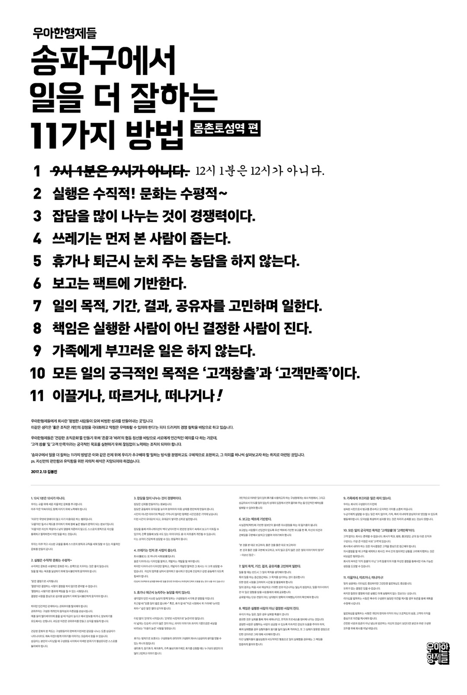
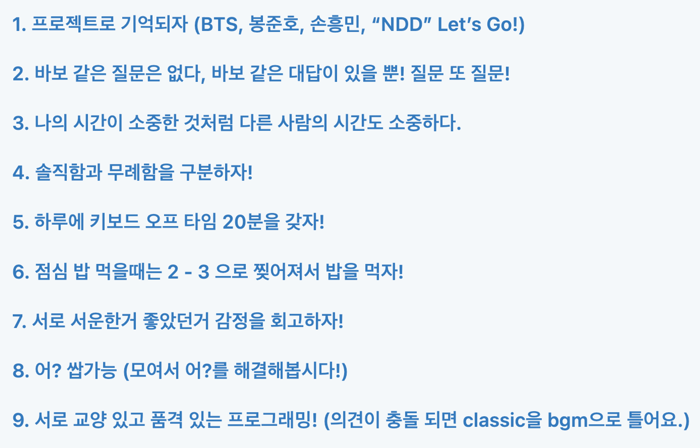

프로젝트를 시작할 때 가장 고민이 큰 부분은 어떻게 하면 이 프로젝트에 잘 성공하고 어떤 걸 얻어갈 수 있는 것인지 고민을 많이 했습니다. 제가 생각하는 보편적인 성공한 프로젝트는 다음과 같은 특징이 있었습니다.

1. 중도 포기 없이 끝까지 완주하는 프로젝트
2. 모든 구성원이 모두 얻어갈 수 있는 프로젝트
3. 모두가 재미있게 진행할 수 있는 프로젝트
4. 내 프로젝트를 직접 사용할 수 있는 프로젝트
5. 프로젝트에 애정이 있어서 오랫동안 유지되는 프로젝트

생각보다 특별한 내용이 없죠? 보편적인 “잘” 한다는 정의는 별것 없습니다. 하지만 사람마다 프로젝트를 하는 이유와 목적이 다르기 때문에 어떤 구성원은 잘 끝냈다고 정의할 수 있지만 다른 사람은 아닐 수도 있습니다. 이 프로젝트에서 어떤 걸 하고 싶은지는 다 다르니까요. 그래서 프로젝트를 아무리 실력이 좋은 사람들이 모여있거나 기획이 엄청 기발 하더라도 프로젝트에 준비를 잘못해서 금방 엎어지거나 생각했던 것보다 부진한 팀들을 많이 보았습니다. 그래서 프로젝트를 잘하기 위해서는 먼저 내가 어떤 걸 하고 싶은지부터 정의하는 게 필요합니다.

이번 부스트캠프 프로젝트도 예외는 아니었고 이런 고민을 바탕으로 제가 어떻게 팀을 구성하고 준비하였는지 공유해보고자 합니다.

## 프로젝트의 목적

개발 프로젝트는 크게 3가지로 나뉜다고 생각합니다.

1. 취미로 하는 프로젝트
2. 제품을 만들려는 프로젝트
3. 학습하려는 프로젝트

셋 다 결과물은 완성한다는 점에서는 같지만, 프로젝트의 중점사항이 다릅니다. 이 3개의 중점사항에 따라서 얻어갈 수 있는 것이 다른데요. 저는 다음과 같은 특징들이 있다고 생각합니다.

 

먼저 취미로 하는 프로젝트는 취미에 중점이 되어있는데 이런 프로젝트에서는 실질적인 개발 중점보다는 취미기 때문에 각자의 생활이나 활동에 더 중점이 된다고 생각합니다. 굳이 완성하지 않아도 되고 가볍게 실시할 수 있는 프로젝트인데요. 이는 개발의 난이도나 시간 투자와 노력은 낮은 대신 네트워킹과 취미로 만드는 특징이 있습니다. 저는 보통 여기서 네트워킹에 집중하면서 인사이트를 얻는 것을 목적으로 합니다.

 

두 번째로 무언가 제품을 만들려는 프로젝트는 제품에 대한 출시가 필수로 동반이 되고 제품을 중점으로 기획하고 개발하게 됩니다. 이는 실제 결과물을 토대로 배포해서 제품을 만들다 보니 좀 더 일 하는 것과 가깝게 진행이 된다는 특징이 있습니다. 저는 보통 여기서 실제 현업처럼 일하며 제품에 대해서 좀 더 고민하곤 했습니다.

 

세 번째로는 학습하려는 프로젝트인데요. 프레임워크나 라이브러리를 위해서 사용하는 프로젝트입니다. 이는 혼자서 진행하는 경우가 많고 하나의 학습을 위해서 사용하는 프로젝트다 보니 자유롭게 프로젝트를 진행하는 특징이 있습니다. 저는 보통 여기서 해당 기술에 대해서 집중하고 빠르게 프로젝트를 끝내려 하곤 했습니다. 기술에 대해서 딥다이브를 해보거나 간단한 레포를 만들어서 테스트해 보곤 합니다.

 

이런 특징을 토대로 나는 어떤 프로젝트를 하고 싶은지부터 고민을 해봐야 합니다. 대부분의 상황에서는 어떤 프로젝트를 해야 하는지 명확하게 나누실 수 있을 것입니다. 다만 프로젝트를 “잘”하기 위해서는 목적만으로는 부족합니다.

## 어떤 가치관을 가지고 있나?

어떤 목적으로 만들지 정했으면 이제 팀을 모집해야 하는데요. 사실 여기가 1차 고비입니다. 많이 싸우고 깨지는 첫 번째 난관입니다. 나부터 나는 어떤 개발자인지 정의하는 과정이 필요합니다. 나는 일할 때 어떻게 일하는지, 어느 부분을 중요하게 생각하는지에 대한 정의를 미리 해보면서 목표를 정해 보면 좋겠습니다.

 

제 목표는 내가 사용할 서비스를 만들자는 것이었습니다. 또한 제가 생각하는 저에 대한 정의는 다음과 같았습니다.

1. 가치를 창출하는 개발자입니다.
   1. 단순히 서비스를 개발하는 것을 넘어서 사용자에게 어떤 가치를 줄 것인가 생각하는 사람이다
   2. 사용자뿐만 아니라 개발자에게도 가치를 창출해 좋은 일하는 문화를 만들고 싶다.
2. 클린 코드를 중요시합니다.
   1. 가독성이 좋아야 합니다. 코드 내에 흐름이 명확하고 의도가 보이는 코드를 추구합니다.
   2. 언제든지 부술 수 있는 코드를 추구합니다.
   3. 코드는 적으면 적을수록 좋은 코드라 생각합니다.
3. 팀원과 나는 동기화가 되어서 같은 방향을 추구해야 합니다.
   1. 특히 코드를 짤 때 서로 구조는 동일해서 내가 해당 코드를 만질 수 있어야 합니다.
4. 하지 않아도 되는 일을 하는 것을 싫어합니다.
   1. 그중에서도 오버 엔지니어링을 지양합니다.
5. 오픈 마인드를 가지려 노력합니다
   1. 주장은 무조건 근거가 있어야 합니다.
   2. 내가 선택한 답이 정답이 아니라는 전재를 항상 염두에 둡니다.

## 팀을 짜보자

나에 대해서 고민을 해보았다면 이제 팀을 구해야 하는데요. 팀을 모집하는 방법은 무작위로 모집이 되거나 직접 모집을 하거나 하는데 두 가지 전략을 약간 다르게 잡습니다.

### 무작위

먼저 무작위로 잡는 방법입니다. 사실 프로젝트를 함에 있어서 가장 좋아하지 않은 모집 방법인데요. 무작위로 팀원이 만들어지면 진짜 아무것도 모르는 상태로 프로젝트가 진행됩니다.

다양한 사람이 모일수록 서로 가지고 있는 생각이 다 다릅니다. 코딩 컨벤션을 어떻게 할 것인가? 왜 이 기술을 쓸 것인가? 왜 규칙은 이렇게 정해야 하는가? 나는 이 상황에서 이렇게 하고 싶은데? 등등 정말 다양한 충돌 점들이 필연적으로 생기게 됩니다.

 

상대방을 모르고 상대도 나를 모르니 어떤 자세를 취해야 할지 모르는 것이고 만약 추구하는 방향이 정반대이면 합의점 없이 충돌을 해결하다가 시간을 다 보내는 경우도 생기는 것이죠.

따라서 무작위인 방법은 팀과의 의견 동기화를 위해서 상당히 긴 시간을 가져야 합니다. 그래서 저는 무작위로 팀원이 짜진다면 먼저 프로젝트 시작보다는 늦더라도 그냥 놀면서 친해지는 걸 우선시해야 한다고 생각합니다.

 

이에 대해서 이렇게 생각할 수 있습니다. “생각하는 게 다른데 그걸 맞추는 게 먼저 아니야? 프로젝트는 언제 해?” 라고 반문할 수 있습니다. 저 또한 처음에는 그렇게 생각했지만, 이런 충돌 지점에서 사람을 설득하는 데 있어서는 객관적인 지표보다는 그 사람을 얼마나 이해하는 데에서 출발해야 상대방을 설득할 수 있다고 생각합니다. 내가 객관적이라고 생각하는 자료는 사실 그 사람한테서는 주관적이라고 생각할 수 있습니다.

 

간단하게 예를 들자면 대학교에 처음 입학했을 때 배우는 것이 참고 자료는 무조건 논문을 사용해 자료조사 및 정리를 하라는 것입니다. 대학교에서는 그것을 가장 객관적인 자료라 생각하기 때문이죠. 하지만 막 대학교 1학년에 올라온 새내기들은 왜 이것이 객관적인 자료인지 알지 못합니다. 결국 논문도 한 사람의 주장하는 글이고 인터넷에서 검색해서 찾아온 글도 똑같이 누군가의 주장하는 사실들인데 왜 이것은 다르게 두지? 나는 둘 다 객관적이라고 생각하는데 하곤 합니다. 따라서 이런 생각을 하는 새내기들을 위해 그 사람을 이해하고 상대방의 생각에서 이야기를 해주어야 합니다.

 

이것은 사람과 사람 사이에 있어서 모두 동일하게 작용한다고 생각합니다. 절대적인 것은 없고 상대적인 관계만 있기 때문에 객관적인 것은 없다. 즉 내가 상대와 무언가를 맞추려면 상대방을 이해하는 것이 가장 중요하다입니다. 이는 상대방이 편안한 환경에서 즐길 때 즉 놀면서 많이 이야기해 볼 때 알 수 있는 부분이라 생각합니다.

### 구하기

팀을 자율적으로 구해서 짜는 방법도 있는데요. 이 방법은 회사가 인재를 채용하는 작업과 똑같이 접근해야 한다고 생각합니다. 과연 저 사람들은 나와 맞을까? 저 사람들과 했을 때 능률이 더 올라가는가에 대해서 생각해 보면 되는 것이죠.

그러기 위해서 저는 조금 부족하지만, 팀원들이 이걸 채워줬으면 좋겠어! 하는 점을 찾기 시작했습니다.

1. 진행을 잘하는 사람이 있었으면 좋겠습니다.
2. 열린 마인드의 사람이었으면 좋겠습니다.
3. 무언가에 대해서 갈팡질팡하고 있을 때 뭐가 됐든 속 시원하게 하나로 밀고 나가는 추진력 있는 사람이었으면 좋겠습니다.
4. 백엔드 팀원은 백엔드에 대해서 믿고 맡길 수 있는 사람이었으면 좋겠습니다

이렇게 내가 정의해 둔 내용을 바탕으로 팀원을 찾습니다. 그다음에는 채용 프로세스를 생각하면서 따라가면 되는데요. 만약 사람을 구한다면 내가 적었던 내용을 토대로 그 사람에게 이럴 때는 어떤지 물어보거나 의견을 공유하며 나와 같이 협업을 할 수 있는지 체크합니다. 반대로 내가 어디에 들어가는 입장이라면 거기에 있는 구성원의 목표나 일하는 방식 혹은 그 팀의 리더와 이야기를 하면서 협업을 할 수 있는 상대인지 체크합니다.

 

여기서 정답은 없습니다. 전부 만족하는 팀이 나올 수도 있고 아닐 수도 있습니다. 나와 협업 적으로 가장 잘 맞을 것 같은 사람을 찾는 것이기 때문에 잘 타협해서 선택하는 게 중요합니다. 다만 무작위와 다른 점은 대부분 직접 구하면 비슷한 목표를 가진 사람들과 서로 보완해 줄 수 있는 팀원들이 생기기에 초반 적응하고 맞추는 데 있어서는 큰 속도를 낼 수 있는 특징을 가지고 있습니다. 이런 이점에 있어서 조금 더 에너지가 세이브되고 더 빠르게 친해질 수 있죠.

## 프로젝트를 진행하자

지금까지는 어떻게 구성원을 짜야 할까에 대해 개인적인 관점에서 봤다면 이제는 팀의 관점에서 생각해 봐야 할 차례입니다. 사실 이렇게 신중하게 팀을 구성했어도 서로 경험이 다르기에 맞춰야 하는 부분이 많습니다. 기술적인 부분이 많겠지만 그전에 먼저 선행되어야 하는 것이 팀 간의 유대감 형성입니다. 팀을 짜보자는 무작위 부분에서 서술한 내용에서 유대감 형성을 위해서 같이 많이 만나고 놀아야 한다 부분이 있는데 사실 어떤 팀 프로젝트를 원활하게 잘 진행하기 위해서는 가장 중요하고 첫 번째 단계로 꼭 들어가야 할 사안이라고 생각합니다.

 

이 부분은 프로젝트 유지 기간에 따라서 얼마나 비중을 둘지 달라지는데요. 저는 이 기준을 4주로 잡습니다. 4주 미만인 프로젝트들은 조금 더 기술적인 부분에 신경을 쓰고 각자 맡은 구역을 배분해서 빠르게 처리하는데 초점을 두어서 개발을 합니다.

4주 미만의 프로젝트를 A-Z까지 제품을 만들려는 목적으로 개발하는 것은 MVP만 막 만들어서 시장에 검증하거나 학교에서 과제로 하는 경우 밖에 없다고 생각합니다. 이런 경우는 사실 뭔가 기술적으로 한다기보다는 제품 자체에 대한 검증(과제 제출에 대한 검증)이 최우선시되므로 그냥 각자 빠르게 task를 처리하고 그 결과를 보면서 4주 이상의 프로젝트로 전환을 할 것인지 고민하는 게 베스트인 것 같습니다.

 

다만 4주 이상의 보편적으로 길게 진행하는 프로젝트에서는 끝까지 도달하기 위한 원동력으로 유대감이 필수적이다라고 생각합니다. 그래서 아이스 브레이킹과 함께 만들어야 하는 게 바로 팀 문화죠.

이런 점에서 팀문화라는 것은 되게 별거 아닌데 재미있네?라는 생각이 들게 적으면 좋다고 생각합니다. 이걸 적으면서 맞아 이거 누가 이렇게 냈지? 아 이거는 꼭 필요하지 등등 그 작성을 할 때 어떤 마음가짐으로 우리는 진행할 것인가 생각해 보면서 팀원이 뭉치는 계기가 되도록 하는 게 중요합니다.

위는 배달의 민족의 문화인데요 이게 딱 제가 생각하는 이상적인 팀문화를 정한 것이라 생각했습니다. 그냥 봤을 때 피식피식하면서 우리 팀에서는 이런 가치관과 마음가짐으로 진행할 것이다라는 점을 잘 나타내주고 있다고 생각했습니다.

 

여기까지 했다면 프로젝트를 “잘” 진행하기 위한 준비는 끝났다고 봅니다. 제 경험상 이 타이밍에는 팀원 개개인의 대한 프로젝트 가치관에 대해서 분석이 끝났을 것이라 생각이 드는데요 저는 여기서 이 팀은 어디까지 갈 수 있을까 와 진짜 나와 맞는 팀 인가에 대한 확신이 생깁니다. 따라서 이 판단을 토대로 최종적으로 내가 지금 프로젝트에 얼마만큼의 힘을 쓸 것인지 진짜 “잘” 할 수 있는 사람들인지 판단을 하게 됩니다.

 

만약 여기서 내 판단이 “잘”할 수 있는 프로젝트라고 판단이 서면 힘을 온전히 쏟아서 실제로도 “잘”했다라고 생각할 만한 결과물을 가져갔으면 좋겠습니다. 저는 실제로 이런 판단이 선 프로젝트들에 대해서는 모든 프로젝트가 끝까지 갔고 좋은 경험으로 자리 잡았습니다.

## 충돌과 다툼

아무리 팀원이 이상적이고 좋아도 충돌은 피해 갈 수 없는데요 마치 의도치 않은 git conflict처럼 예상하지도 못한 곳에서 충돌이 나는 경우가 많습니다. 특히 당연한데?라고 생각한 부분이 당연하지 않은 경우가 많았는데요. 이 과정에서 서로의 감정만 상하고 마무리가 되는 경우가 많이 발생하면 결론적으로 감정만 상하는 프로젝트가 되어버립니다.

 

제 경험상으로는 충돌이 자주 나는 부분은 기술 스택 및 코드에 관한 부분이 컸습니다. 문화적이거나 규칙적인 부분은 서로가 양보하고 하고 싶은 것을 적용하면 가볍게 넘어가는 분위기지만 이 부분에서 판단미스는 스노우볼이 되어 점점 큰 문제가 생기는 경우가 많기 때문입니다.

 

왜 이런 부분에서 문제가 생기냐 생각을 해보자면 일단 가장 큰 부분은 각각의 경험은 다르고 개발에는 답이라는 게 없기 때문입니다. 하나에 문제에 있어서 적용할 수 있는 답들이 여러 개인데 이 중에서 어떤 게 가장 합리적인지 판단하고 적용하더라도 나중에 문제가 될 수도 있고 그 답이 보편적으로 맞지만, 현재 내가 부딪힌 문제에서는 아닐 수도 있는 등 다양한 이유가 있습니다. 그다음으로는 전달력의 문제입니다. 나는 A 안으로 전달했지만, 상대방은 A`로 들은 경우이죠. 서로 맞지 않으니까, 서로를 탓하게 되는 것이죠.

 

이에 대한 해결책으로 저는 문서화와 회의를 제안합니다. 저는 팀 단위 프로젝트를 하면 최소 일주일에 한 번은 회의를 하는데요. 이 고정적인 회의 이외에도 뭔가 충돌 점이 날 것 같은 부분들은 최대한 수시로 팀원과 이야기하면서 맞춰 보려 합니다.
회의를 하면서 저는 개발자는 코드를 짜는 게 아니라 문제를 해결하려는 사람이라는 마인드를 가집니다. 팀과의 불화나 충돌도 하나의 문제라 생각하고 해결하려 하는 자세만 가지더라도 생각보다 많은 걸 해결할 수 있기 때문입니다. 이 충돌은 서로의 논리에 충돌의 문제인가? 감정 충돌의 문제인가? 논리의 충돌이라면 어느 부분이 문제이지?? 이런 식으로 나아가다 보면 결국 최선의 결과에 도출할 수 있습니다. 이런 식으로 회의를 통해 문제에 대한 의사결정을 하게 되면 문제에 대한 책임이라는 것은 자연스럽게 혼자가 아닌 팀이 같이 해결하는 계기가 됩니다.

 

그다음은 문서화인데요. 문서로 기록하면 내가 생각을 정리해서 쓸 수 있게 됩니다. 저도 말로 전하다 보면 놓치는 부분이 생기거나 상대가 이해를 제대로 못하는 경우가 생기는데요. 그럴 때는 문서로 정리 후에 전달을 하곤 합니다. 상대방이 이해 못 한 부분이 있어도 어디서 이해가 안 된다고 바로 답변이 가능하다는 장점이 있죠. 또한 문서화는 히스토리가 만들어진 되는데요. 이는 해당하는 상황에 대한 케이스가 하나 기록되는 것으로써 팀 또는 개인의 성장이나 다음에, 문제에 대한 좋은 자료가 되곤 합니다.

따라서 이런 문서화와 회의에 대한 자신만의 룰이 있고 문화를 바탕으로 진행했으면 좋겠습니다.

## 그러면 부스트캠프에서는 어떻게 했어?

제가 놓인 상황은 부스트 캠프 그룹프로젝트를 앞두고 있었고 실제 프러덕트를 만들어야 하는 상황이었는데요. 저는 프로젝트 목적 두 번째인 제품을 만드는 프러덕트를 만들고자 하였습니다. 그래서 기본적인 프로젝트 자세를 힘들게 진행하는 프로젝트로 생각하면서 제품을 완성하자는 원론적인 목표를 잡을 수 있었습니다.

 

그다음으로 팀을 선택할 때 “구하기” 방법대로 진행을 했는데요 면접 프로세스처럼 위에서 설명한 저만의 기준을 세우고 진행하였습니다. 제가 필요한 팀원과 가지고 있는 생각을 토대로 진행했는데요. 백엔드 한 명을 먼저 구하고 기존 프론트 팀에 합치는 순서로 진행되었습니다. 다행히도 모두 추구하는 목표가 같았고 제가 원하는 사람에 가까운 사람들이 모이게 되었습니다. 단순히 학습을 위한 구현이 아닌 서비스를 성장시키면서 발생하는 문제를 기술로 풀고 싶은 사람들의 집합이 되었습니다.

 

그다음으로는 실제로 프로젝트들을 준비하면서 개인의 가치관들을 봐야 하는데 다들 비슷한 생각으로 팀의 문화에 중요성을 알고 있었고 이를 바탕으로 문화에 대한 내용을 공유하고 몇 가지 재미있는 규칙을 정할 수 있었습니다.

팀 내에서 충돌과 다툼의 방지를 하기 위해서 위에서 제가 제시한 문서화와 회의 또한 자주 이용했는데요. 기본적으로 최소 주 1회 오프라인으로 만나서 정기 회의를 두고 해당 회의에서는 큰 안건들을 위주로 다루면서 직접적으로 서로의 생각을 반영하곤 했습니다. 만약 이런 큰 건이 아닌 개인의 문제를 해결하다 마주치는 오류 들은 즉시 온라인 회의를 잡으면서 다 같이 해당 문제를 보며 팀 내 의견 차이를 좁히고는 했습니다. [pre commit review](https://blog.jbee.io/essay/%EC%BD%94%EB%93%9C+%EB%A6%AC%EB%B7%B0%EC%9D%98+%EB%AA%A9%EC%A0%81%EC%9D%80+%EC%84%B1%EC%9E%A5%EC%9D%B4%EC%96%B4%EC%95%BC+%ED%95%9C%EB%8B%A4)나 도움을 요청하는 회의 등이 있었습니다.

 

그럼에도 이런 다른 가치관에 대한 문제들이 코드 레벨이나 프로덕션 반영 직전까지 올라가는 경우도 있습니다. 저희는 이런 것을 반영하고자 [코드 리뷰](https://yoonhaemin.com/tag/experience/code-review/)를 도입했는데요. 실제로 뒤로 갈수록 다들 코드나 구조를 짜는 게 비슷해져 빠르고 덜 충돌이 일어나면서 빠른 개발 속도와 일정한 코드 품질을 유지할 수 있었습니다.

실제 코드 리뷰는 해당 팀원과 말하는 게 아닌 글로써 전달하니 기록으로도 남길 수 있고 정리해서 전달할 수 있다는 장점이 있습니다.

 

이런 문화와 팀을 토대로 6주가 끝나고 봤을 때 저희는 프로젝트를 “잘”한 팀이었을까요? 저는 우리 팀이 부스트캠프 조 중에서 결과물로써는 객관적으로 잘했다고 확신하지 못하였지만 제 기준에서는 서로가 보완해 주며 앞으로 나아갈 수 있는 가장 좋은 팀이라고 자부할 수 있습니다.

## 결론

단순히 프로그래밍 스킬뿐만 아니라 이런 사람 사이의 가치관에 대한 생각까지 고민하게 해 준 프로젝트라 만족하고 있고 이렇게 내가 부족한 부분을 채우고 잘하는 부분은 더 내세울 수 있는 프로젝트가 내가 정의하는 잘한 프로젝트지 않을까 생각합니다.
