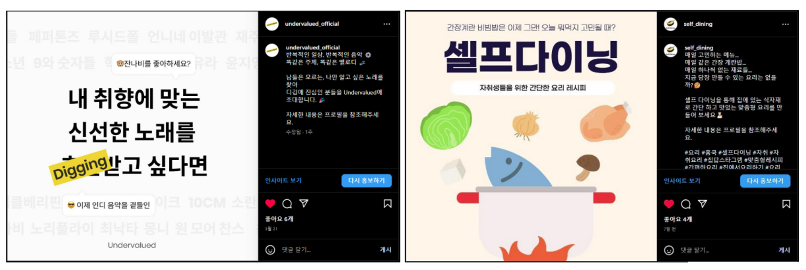

> 본 글은 프로그라피 초반에 기획단계에 관련된 글로 기획을 해보지 않은 필자의 밑바닥부터 고민한 경험입니다. 어떤 방식으로 흘러갔는지에 초점을 두어서 편안한 마음으로 읽어주시면 감사하겠습니다.

## **서비스 발표**

기존의 사이드 프로젝트를 진행하면서 아쉬웠던 점이 개발 기간이 끝나면 팀이 해체된다는 것이었다. 따라서 이번 프로젝트는 개발 기간이 끝나고도 계속 이어질 수 있는 프로젝트를 하길 원했었고 그러기 위해서는 모두가 즐겁고 실제 유저가 있는 서비스를 개발하고자 하는 욕구가 생겼다. 이에 프로그라피에서 이 서비스 자체에 대한 세션과 팀 내의 회의를 통해 기획을 세우고 결정하는 과정이 너무 좋았기에 길더라도 포스팅해서 리마인드 해보고자 한다.

## **아이디어 도출 시작**

처음에는 진짜 막 아이디어를 던졌었다. 진짜 생각 없이 던진 것 같다. 평소에 불편한 점이라던지 기존에 가지고 있는 아이디어라던지 생각 없이 뱉는다 던 지 해서 나온 아이디어가 총 11개였다

나온 모든 아이디어를 노션으로 정리하며 서로 코멘트를 남기고 특징을 추가하고 유사서비스를 보면서 재미있게 만들 수 있을법한 아이디어를 찾기 시작했다.

이 중에서 투표를 통해 선택된 것이 인디음악 플랫폼과 1인가구 음식 레시피였다

## **아이디어 구체화**

아이디어를 선정했으니 다음은 아이디어를 바탕으로 좀 더 서비스의 구체적인 형태를 만드는 구체화 단계였다.

구체화는 다음과 같이 진행했다.

1.  서비스명
2.  개요
3.  타겟팅 유저
4.  유사서비스
5.  기능
6.  유저 검증 사항

사실 구체화 단계는 각자 가지고 있는 생각이 있어서 진행하는 데 큰 어려움은 없었고 오히려 너무 많아서 이걸 다 쏟아 내는데 시간이 걸렸었다. 따라서 핵심은 이런 내용 중에 어느 것을 핵심 가치로 잡아야 할지에 초점이 맞춰지기 시작했다.

그렇게 핵심적인 기능이 다음과 같이 정해졌다.

1인가구 레시피 → 셀프 다이닝 / 식자재를 입력하면 그와 걸맞은 레시피를 보여주는 서비스

인디음악 플랫폼 → Undervalued / 내 취향에 맞는 유명하지 않는 노래를 추천해 주는 서비스

## **페이크 마케팅**

이 두 가지 서비스에 대한 페이크 마케팅을 시작했다. 간단하게 페이크 마케팅을 보고 가자면 페이크 마케팅(선행 마케팅)은 홍보글이나 랜딩 사이트를 통해서 없는 서비스를 미리 홍보하고 시장의 반응을 보는 것이다. 우리가 하고 싶은 아이디어가 있어도 시장에서 반응이 없으면 사실상 정적인 사이드 프로젝트로 그치게 된다. 하지만 우리는 좀 더 사용자가 있는 서비스를 만들어보고자 하였고 이런 이유 때문에 페이크 마케팅이 꼭 선행되어야 한다.

페이크 마케팅의 도구로 쉽고 빠르게 홍보할 수 있는 인스타그램과 유저의 피드백을 받을 수 있는 구글설문지를 선택하였고 계정을 만들었다.

광고는 실제 유저들이 서비스에 얼마나 관심 있는지에 대한 지표로 사용하고자 하였고 우리는 이것을 광고당 클릭 횟수 즉 클릭률로 정의했다. 설문지는 이 서비스가 어떤 방향으로 나아가야 하는지 우리가 타깃을 잘 잡았는지에 대한 지표를 삼았다 또한 설문지는 광고 및 지인들에게 돌려서 먼저 설문 결과를 모았었다.

#### **설문결과**

사람들은 음악 플랫폼을 선택할 때 알고리즘과 가격을 많이 보는 것을 알 수 있었다 우리도 알고리즘을 사용해서 맞춤형 서비스를 기획하고 있었고 이는 우리가 올바른 가설로 접근하고 있다는 근거가 되었다.

많은 사람들은 냉장고에 재료가 부족해서 음식을 만들기 어려웠다고 한다 우리는 이런 점을 토대로 있는 재료를 입력하면 지금 당장 만들 수 있는 레시피를 보여주는 것을 기획하고 있었고 이는 우리가 올바른 가설로 접근하고 있다는 근거가 되었다.

결과를 토대로 undervalued와 셀프다이닝이라는 서비스 이름을 붙이고 인스타그램 게시글을 작성했다.

홍보는 두 개의 계정을 사용해서 진행했다. 이때 관리자도 두 명이었어서 홍보비에 대한 오해가 있어 지출비에서 서로 불일치가 났었다 하지만 우리는 홍보에서 보고 싶었던 점이 유저의 반응 즉 클릭률(%)이었기 때문에 이 점을 무시하고 진행했었다

#### **홍보결과**

생각보다 클릭률이 낮았다. 지인 및 동아리 내에서 자체 조사를 했을 때는 셀프다이닝 보다도 큰 인기를 끌었었지만 정작 홍보에서는 1.7%의 클릭률을 보여주었다.

클릭률 6%로 생각보다 높은 클릭률을 보여주었다

## **서비스 결정**

사실 클릭률만 봤을 때 셀프다이닝이 높았지만 undervalued 또한 팀 내에서 굉장히 핫한 도메인이었기 때문에 쉽사리 결정하지 못하였고 3대 3의 투표결과로 팽팽하게 회의를 거듭했다. 이때 팀원 중 한 분이 좀 더 사용자에게 가치가 있는 걸 하고 싶다고 하셨고 그 결과 셀프다이닝 서비스를 하기로 결정하였다.

## **아이디어 발표 피드백**

서비스를 결정하고 와이어 프레임을 만들어서 ver 0.1 계획과 함께 발표를 하였다. 우리가 중점을 두는 것은 재료를 기반으로 검색해서 사용자에게 지금 당장 해 먹을 수 있는 레시피를 알려주는 것이고 이것이 필요한 타깃은 자취생이라 생각했는데 피드백의 결과로는 타깃이 여러 층으로 분리되었다.

또한 유사 서비스를 조사하면서 우리가 생각한 내용과 완전히 똑같은 서비스도 존재하는 걸 알게 되었다. 따라서 이를 토대로 내부 회의를 시작했고 차별화를 어떻게 시킬까에 대한 고민을 하였다.

회의를 하면서 2가지의 문제점 또한 발견할 수 있었는데 첫 번째로 기존 핵심 기능인 검색기능은 백엔드 크롤링 자동화의 기술적 문제를 맞게 되어 일단 스톱 상태였다는 점이다. 두 번째로는 우리의 기존 아이디어를 보면 브랜드 자체를 굳이 자취생으로만 가져갈 이유가 없다는 점이다. 따라서 0.1 버전의 목표를 검색에서 재미있는 카테고리를 앞세우자라는 결론을 내렸다. 또한 다음과 같은 아이디어 4가지도 추가로 가져가고자 하였다.

- 카테고리 기능
- 뱃지
- 블로그 / 유튜브
- 검색기능

## **결론**

아직 기획이 완벽한 게 아니라 앞으로 개발을 하면서 기획을 더 보강하면서 나아가야 한다. 그래서 지금 쓴 글의 기획이 사라질 수도 있다 하지만 사라지더라도 나한테 있어서는 단순히 개발하는 것이 아닌 기획의 입장에서 진행해 본 소중한 경험이었다. 같은 기능을 개발하더라도 기획에 따라서 우선순위가 정해진다는 것을 경험해 볼 수 있었다. 실제로 검색기능이 기술적으로 많은 걸 요구했기 때문에 우선순위가 밀렸고 프론트에서는 반응형 개발, 코드퀄리티와 같이 디테일 쪽이 우선순위가 밀렸었다. 실제로 나는 프로젝트를 할 때 feature 하나를 만들어서 개발할 때 디테일까지 최대한 잡아서 하곤 했었는데 지금 상황에서는 그렇게 하게 되면 오히려 많은 개발자 리소스를 낭비하게 되었다는 걸 몸소 경험하는 시간이 되었다.

따라서 지금은 팀원의 코드 스타일과 일하는 방식, 자동화, 아키텍처를 어떻게 잡을 것인가 등 큰 틀을 고민해 보며 적용해보고 있다.
