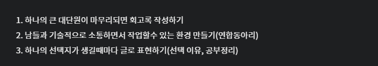

### 지원동기

6개월 전부터 it관련 연합동아리에 참여하고 싶다는 생각은 있었지만 딱히 동기가 없었고 간절하지도 않았기 때문에 그냥 서류를 찔러 넣는 식으로 여기저기 넣었었다. 결과는 모두 서류탈락이었고 it연합동아리 지원을 점점 포기하고 있었다.

하지만 원티드 프리온보딩 프론트엔드에 참여하면서 네트워킹의 중요성을 깨닫고 연합동아리에 꼭 들어가야겠다는 동기가 생겼었다

[조금 늦은 프리온보딩 프론트엔드 챌린지 1월 회고록](https://throwfe.tistory.com/18)

실제로 원티드 프리온보딩 회고를 하면서 다음과 같은 3가지 원칙을 세우고 실천해 나가고자 하였고 그중 2번을 실천하기 위해서 여느 때와 같이 연합동아리에 지원을 했다. 아직 글로 표현하는 것에 부족함을 작성한 글에 자신감과 만족도는 떨어져 큰 기대를 하지 않았었다. 하지만 이 중에서 처음으로 프로그라피 서류에 붙게 되었다.

채용 프로세스는 서류 => 과제 => 면접 이었다.

### 서류합격

서류자체는 아직 부족하다고 생각하는 점이 많았다고 느끼고 있었다. 실제로 단답형 문항 중에서 "경험해 보았던 모임이나 동아리가 있다면 적어주세요"의 문항을 보지 못하고 넘어갔었다. 서류합격 문자를 받자마자 직감적으로 서류점수가 하위권 정도로 체크되지 않았을까 생각을 하였고. 면접과 과제에서 이를 만회해보고자 하였다.

서술형 문항은 다음과 같은 것들이 있었고 나머지는 단답식이었다.

- 프로그라피 지원동기
- 가장 관심 있는 프론트엔드 라이브러리
- 가장 기억에 남는 프로젝트 하나 설명

### 과제

다른 동아리와 다르게 프로그라피는 과제가 있었다. 다행히도 나는 과제는 조금 자신 있었기에 여기서 점수를 만회해보고자 하였다. 실제 원티드 프리온보딩을 하면서 얻은 팁들을 바탕으로 과제를 진행하였다

과제는 public으로 바뀌게 된다면 링크를 추가해 보겠다.

#### Point1 (오버스펙으로 작성하지 말자)

> 프로그라피는 짧은 기간 동안 멋진 서비스를 뚝딱 만들어내기 때문에 클라이언트 개발 능력이 굉장히 중요합니다. 프로그라피 활동 진행 중 팀원들과 원활한 협업 및 프로젝트를 진행하기 위함과 운영진이 지원자에 따른 적합한 방향성 파악을 위함입니다. 사전 과제를 완벽히 완료하여야만 합격이 가능한 것이 아니므로 할 수 있는 만큼 보여주시면 됩니다. :)

해당 과제의 개요 부분이다 다음을 보면서 느낀 것이 굳이 기술을 내 뽐내는 것보다 딱 필요한 부분을 적절하게 사용하는 것이 목적이라 생각했고 과제를 위해서 필요 없는 기술과 내용은 과감하게 제거하였다. 또한 퀴즈페이지라는 점을 상기하면서 과제에 대한 구체적인 기획을 잡았다.

#### Point 2 (Readme는 면접자의 얼굴)

ReadMe에 과제에 내가 표현하고자 하는 바를 전부 넣도록 하였다. 여기서 가장 중요하게 생각했던 것이 내 의도를 면접관들이 모두 파악하기 쉽게 설명하자였다.

1\. 면접관이 테스트해 보기 쉽게 실제 배포 및 시현 영상을 넣었다.

2\. '나는 기술 사용한 이유가 있어요'라고 전달하기 위하여 사용기술에 대한 설명을 붙였다. 실제 면접 시에 styled-component 장단점을 물어봤었다.

3\. 기본적으로 어떤 기능을 포함하고 있는지 페이지별로 기능사항들을 정리하였다

4\. 어느 폴더에 무엇이 있는지 폴더구조에 대한 설명을 덧붙여 어떤 기준으로 분류했는지 명시하여 폴더 구조에도 이런 고민이 들어갔다는 것을 명시하였다.

5\. 비즈니스로직을 hook으로 빼서 코드를 작성했는데 이 로직의 이해를 돕게 하기 위해서 hook docs를 만들고 면접관이 이해하기 쉽게 설명을 해두었다

6\. 고민 point 말 그대로 내가 어느 부분에서 고민했는지 기록해 둔 항목이었다. 여기서 내가 이 과제를 위해서 어떤 점을 노력하고 고민했는지 어필하는 부분이었다 Readme에서 가장 중요하다고 생각하는 항목이어서 선정 및 작성하는데 오래 걸렸었다.

#### Point3 (git convention)

마스터 브랜치에 message에 prefix를 붙이는 방법으로 커밋하며 git convention을 사용하였다. 브랜치 별로 PR을 만들어서 구현할까 생각도 하였지만 이번 과제를 하면서 다짐했던 과제를 수행하는 데 있어서 오버스펙이 되지 않게 하자를 떠올리며 PR로 나누어서 작업하지 않고 마스터 브랜치에 작업을 하였다. 한 가지 아쉬운 점이 있었다면 해당 컨벤션을 Readme에 적어 놓았으면 좋았을 것이라고 생각한다. 단순히 type 변경으로 인한 수정은 prefix로 style을 사용할 것인가 refactor를 사용할 것인가 기능 추가가 아닌 스타일 추가는 어떤 prefix를 사용할 것인가? 등의 사소한 고민들도 있었지만 이를 표현하지 못한 것이 아쉬웠다.

### 면접

면접 시간표를 짜서 주는 게 아닌 면접자들이 열려있는 면접시간대에 신청하는 방식으로 진행하였다. 토, 일 이틀간 1시~7시까지 20분 단위로 시간이 나왔었다 나는 이 중에서 일요일 마지막 시간대를 선택하였다  지금생각해 보면 처음이나 마지막이나 똑같이 답했을 거 같은데 시간을 마지막으로 잡아서 하루 더 긴장했던 것 같다

면접 시작 전에 면접관 분들이 이건 면접이 아니라 지원자가 우리 동아리에 적합한 핏인지 찾는 자리니 긴장하지 않아도 된다고 말씀해 주셨다. 안심은 되었지만 긴장한 것은 매한가지였다 ㅋㅋㅋ

#### 문항

\- 자기소개 -> 꼬리질문 하나

\- 타입스크립트에서 as const는 왜 쓰는가?

\- 과제에서 가장 어필하고 싶은 점?

\- 현재 공부하고 있는 라이브러리? -> tailwind를 보고 있다 하니 tailwind의 장단점을 설명해 달라고 하였다

\- 프로젝트를 하면서 프론트엔로써 어느 역할을 수행했나?

\- 과제에 styled-component를 썼는데 장단점이 뭐가 있나?

\- rem과 em의 차이

확실히 기술면접은 사전에 연습하고 가는 것이 도움이 된다 처음으로 면접을 봐본 것이기 때문에 어떻게 준비해야 할지도 몰라 그냥 대학교 면접준비처럼 진행했었다.

첫 면접을 보고 나오니 다른 건 몰라도 한 가지는 확실하게 느낄 수 있었다 기술면접은 단기간에 되는 활동이 아니라 내가 직접 활동을 하면서 느낀 것을 정리하거나 누군가에게 설명하는 활동이 있어야 기술면접 또한 잘되는 것 같았다. 실제로 내가 고민한 부분에 대해서 질문을 받았을 때는 막힘없이 술술 나오지만 애매하게 사용만 할 줄 아는 기술은 어버버 하기 일쑤였다. 즉 기술을 이해하고 있는 건 기술에 대한 설명이 아닌 기술에 대한 고민이 얼마나 묻어 나오는가였다. 이러한 생각에서는 내가 단어로 설명을 못하겠으면 예시를 들어서 설명하는 방법을 사용하는 것이 표현하기 더 적합하겠다는 생각을 하였다.

### 후기

목표를 세우고 준비하니 이전보다 합격이 간절했고 간절한 마음에 닿아서였을까? 결국 최종까지 합격하였다. 최근 3개월간에 했던 도전들이 원티드 프리온보딩을 제외하고는 전부 실패로 끝나면서 무기력에 빠져있었는데 프로그라피를 기반으로 좀 더 활동적으로 만드는 계기가 되기를 바라며 열심히 참여해보고자 한다. 또한 동아리라는 특성상 기존에 개인 팀을 꾸려서 프로젝트를 진행할 때와 다르게 여러 팀이 진행하므로 다양한 경험들이 있을 것이라 기대해 본다.
