## 서론

분야를 막론하고 취지는 좋지만, 선뜻 도입하기가 어려운 것들이 많습니다. 저는 항상 애자일이 그랬는데요. 사용자에게 빠르게 도입하기 위해서 애자일 적인 프로젝트를 진행하고자 했지만 쉽지 않았습니다. 워터폴은 항상 성공했는데 애자일은 그렇지 않았죠.

애자일은 좋고 워터폴은 나쁜가? 애자일은 어떻게 해야 하지? 왜 애자일을 도입하고 나니 뭔가 이상하지? 애자일은 실패한 경험이 더 많은데? 사람들은 왜 애자일을 싫어하지? 등 애자일을 도입할 때마다 고민이 많았었는데요. 이번에 프로젝트 관리에 대해서 많은 인사이트를 얻고 고민하며 해당 내용에 대한 생각을 담아보았습니다.

## 워터폴 정의

워터폴 (Waterfall)은 폭포수로 뜻 그대로 위에서 쏟아 내려져 오는 방식을 뜻합니다. 우리가 하는 대부분의 작업 방법이죠.

미용 과정을 빗대어 설명해 보겠습니다.

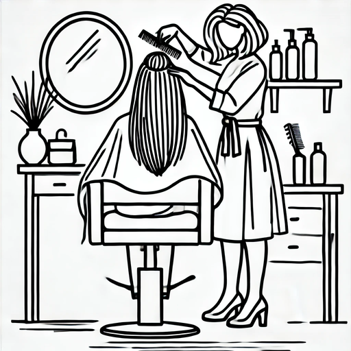
미용실 자리에 앉으면 미용사가 어떤 머리를 할 것이냐 물어봅니다. (기획)

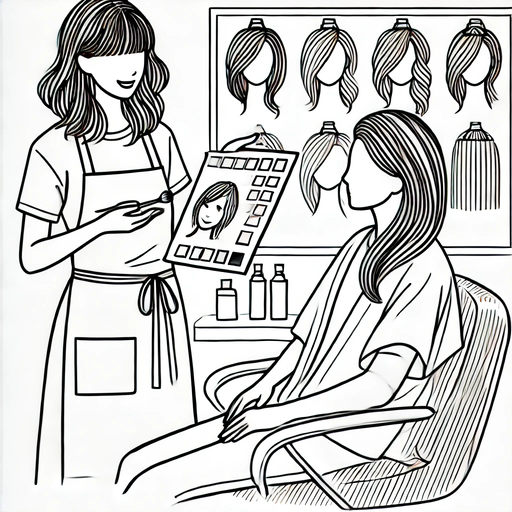
그래서 당신은 마음에 드는 디자인을 보여주었습니다. 염색과 파마가 필요한 머리였네요. 미용사가 그에 따라서 알맞은 색을 선택하고 어떤 식으로 디자인해야 하는지 알려주고 보여줍니다. (디자인)

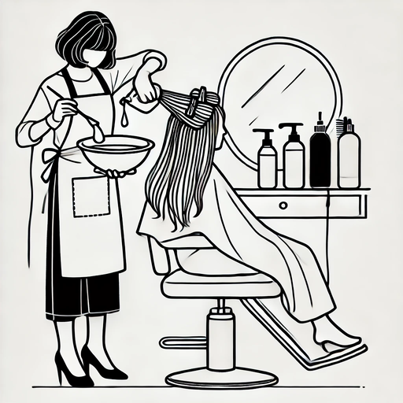
당신은 마음에 들어서 이를 수용하기로 하였습니다. 미용사는 필요한 약품을 전부 섞고 색상을 만들어 파마와 염색을 시작합니다.(개발)

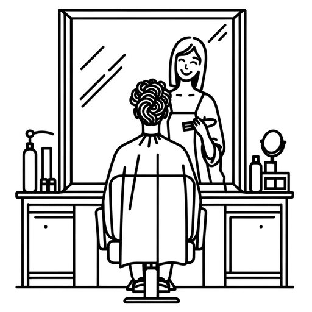
몇 시간이 지난 뒤 머리를 감고 완성된 모습을 거울로 확인했습니다. (테스트)

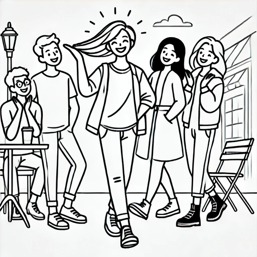
머리가 마음에 든 당신은 기분이 좋게 친구들에게 자랑하러 갔습니다 (배포)

 

워터폴의 한 사이클 입니다. 해당 과정에서 몇 가지 생각을 해볼까요?

- 만약 여기서 문제가 생기면 어떻게 할까요? 문제는 모든 머리 작업이 끝나고 난 테스트 시기 혹은 배포 시기에 발견할 수 있습니다.
- 작업 시간은? 그냥 평소랑 같은 이발 시간이 걸렸을 것 같네요.
- 만족도는? 내가 하고 싶은 게 나와 어울리면 만족하지만, 만약 근본적으로 어울리지 않다면 머리를 손쓰지도 못하게 되어 버립니다.
- 머리 실패 위험도는? 미용사의 실력에 일관성 있게 잘 완성되거나 잘 못 완성되거나 둘 중 하나의 결과가 나옵니다.
- 비용은? 처음에 파마와 염색 가격 그대로 지불하면 됩니다. 추가 요구사항이 있으면 처음 가격에 추가 요구사항 가격만 더해서 지불하면 됩니다.

## 애자일 정의

애자일 방법론의 정의는 딱 떨어지지는 않는데요. [애자일의 4대 원칙](https://agilemanifesto.org/iso/ko/manifesto.html)을 기반으로 민첩하고 빠르게 대응하는 것을 기반으로 합니다.

 

추상적이고 정확한 개념은 아니다 보니 애자일을 어떻게 해야 하는지 정확한 가이드가 따로 없습니다. 그렇다 보니 프로젝트마다 애자일을 하는 방법이 조금씩 다른 특징이 있습니다.

똑같이 미용 과정을 빗대어 설명해 보겠습니다.

미용실 자리에 앉으면 미용사가 어떤 머리를 할 것이냐 물어봅니다 (기획)

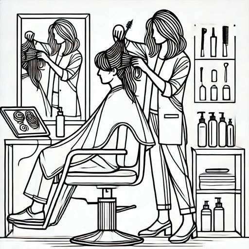
그런데 당신은 머리 느낌은 있지만 제대로 콕 집어 설명하지 못합니다. 미용사가 당신에게 이것저것 보여주고 설명하지만, 당신은 "그 느낌이 아니잖아"라고 말할 뿐 해답을 찾지 못합니다. 그래서 미용사는 당신의 머리 일부분에 마음에 드는 디자인을 뽑아서 하나씩 적용해 보자고 합니다. 그래서 당신은 해당 의견에 동의 하고 하나 선택해 진행하기로 합니다 (디자인)

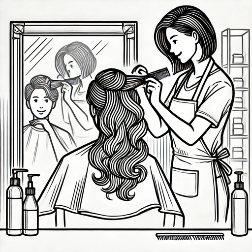
뒷머리에 염색과 파마를 하고 당신에게 보여줍니다. (개발)

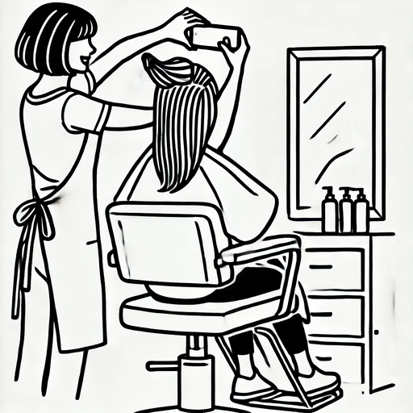
당신이 봤을 때 마음에 들었지만(테스트) 친구들에게 물어보기 위해서 뒷머리 사진을 찍어 보내봅니다(배포). 다행히도 친구들도 마음에 든다네요.

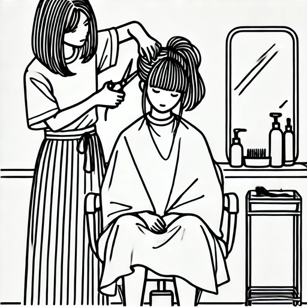
이제 앞머리를 하기로 합니다. 똑같이 마음에 드는 디자인(기획 및 디자인)을 뽑아서 미용을 진행합니다. (개발)

모든 머리가 완성되었고 이번에도 성공한 당신은 기쁜 마음에 친구들을 만나러 갑니다.

 

애자일의 사이클 방법입니다. 똑같이 해당 과정에서 몇 가지 생각을 해볼까요?

- 여기서 문제가 생긴다면 어떻게 할까요? 뒷머리가 완료되었을 때 해당 문제를 발견하고 수정을 요청할 수 있습니다.
- 작업 시간은? 한 번에 쭉 하는 것이 아니라 나눠서 하다 보니 뒷머리에 쓸 염색약과 파마약을 따로 만들고 앞머리에 쓸 약을 따로 만들고 기계를 다시 예열하고 등 일반적인 머리 작업 시간보다는 오래 소요가 되겠네요
- 만족도는? 미용사가 하나하나 의견을 물어보고 친구들에게 물어볼 수 있어서 어울리지 않는 것을 금방 알아차릴 수 있습니다.
- 머리 실패 위험도는? 미용사에 따라 다르지만, 염색약을 같은 색상으로 만들 수 있는가? 같은 농도의 파마약으로 할 수 있는가? 같은 온도의 미용실 기계를 세팅할 수 있는가? 와 같은 미용사의 역량에 따른 추가 변수가 존재합니다.
- 비용은? 선택이 바뀔 때마다 비용 책정이 천차만별이 될 수 있기 때문에 아무도 비용을 예측할 수가 없습니다.

## 왜 애자일은 어려울까?

미용사 예시를 살펴보면 애자일과 워터폴은 똑같이 필수적으로 기획, 디자인, 개발, 테스트, 배포의 단계를 전부 거쳐야 하지만 그 사이클의 주기에 차이가 있다는걸 볼 수 있습니다. 애자일이 더 빠르게 일부분만 완성해서 결과를 보여주는것이죠.

 

우리는 프로젝트를 생산해야 하는 입장이니 미용사 입장이 되어 봅시다. 어떤 미용 방법이 더 쉬울 것 같나요? 일단 저는 워터폴 예시가 더 쉬울 것 같습니다. 워터폴은 단순하게 처음 정한 장비와 디자인으로 미용만 하면 끝나는데 애자일 예시는 고객이 까다롭게 계속 요청하고 요청을 기반으로 요청에 따른 약물과 가위 및 기계, 기법을 써야 하는지 순간순간 생각해야 합니다.

 

워터폴 예시에서는 고객이 하고 싶은 머리가 있었지만, 애자 일에서는 고객이 하고 싶은 머리가 없었습니다. 고객 입장에서는 맞춤형 머리를 진행할 수 있어서 만족도가 높지만, 미용사 입장에서는 예측 예상할 수 있는 범위를 제한해 미용사의 불확실성과 리스크를 높이게 됩니다.

 

리스크가 높다는 말은 실패할 수 있는 확률 또한 높다는 이야기가 됩니다. 실패 확률이 높아지고 성공 경험이 적다보니 어렵다고 느끼는것이죠. 성공한 경험이 없는 조직은 애자일에 의문성을 두기도 합니다.

## 왜 서비스기업은 애자일을 선택할까?

그런데도 왜 서비스 기업은 리스크가 높은 애자일을 선택하는 것일까요? 저는 서비스 기업도 자기가 뭘 해야할지 모르기 때문에 애자일을 한다고 생각합니다. 서비스 기업이 프로젝트로 하고자 하는 큰 슬로건, 목적들은 있지만 실제로 고객이 어떤 기능과 디자인을 원하는지 모르기 때문이죠.

 

그래서 일단 보여주고 피드백받고 아 이런 기능이 좋구나 이해하며 고객의 만족도를 더 높이는 것이 결국 유입량과 관심도를 높일 수 있고, 이는 B2C에서 유저를 늘려서 돈을 벌 수 있는 구조가 되는 것입니다.

## 협업 관점에서 애자일

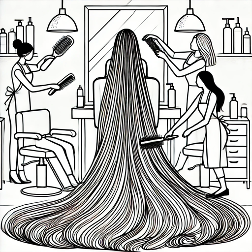
이번에 미용실에 라푼젤이 왔다고 가정해 보겠습니다. Ops, 더 이상 미용사 혼자서 미용하기 어려워졌네요. 그래서 동료 미용사들과 함께 작업하기로 하였습니다.

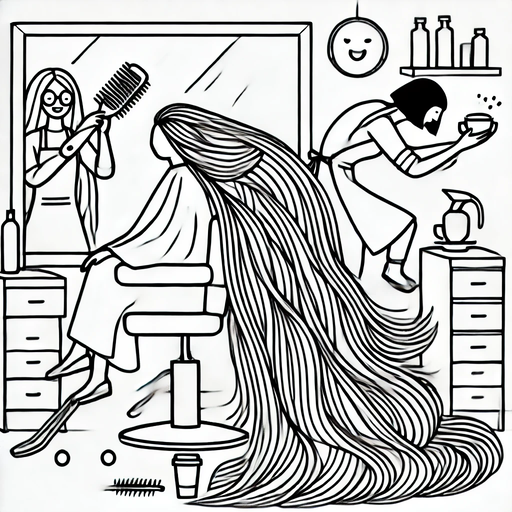
애자일 방법대로 미용 하고 수정하는데 문제가 생깁니다. 수정에서는 미용사 A, B작업 구역만 수정이 필요하고 C는 할 일이 없어진 것입니다. C는 룰루랄라 커피를 마시러 가버리고 A, B가 작업에 들어갔습니다. 하지만 둘이 이야기를 잘못했는지 아무도 옆머리를 만지지 않은 채 미용을 완료했습니다.

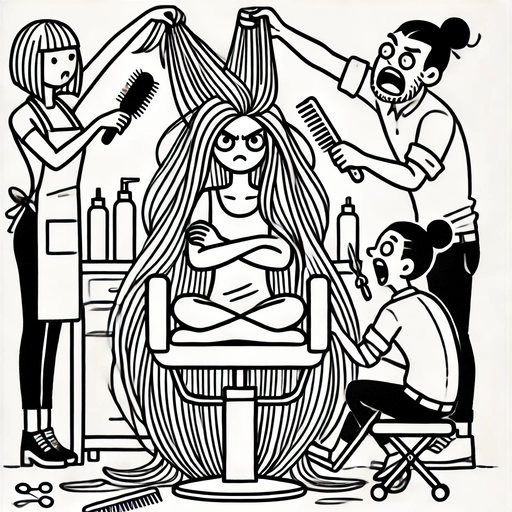
라푼젤은 화를 내며 옆머리는 왜 빼놓았냐고 씩씩거렸고 미용사가 사과하며 빠르게 수정하겠다고 했습니다. A B C 미용사가 모두 달려들어 빠르게 수정합니다.

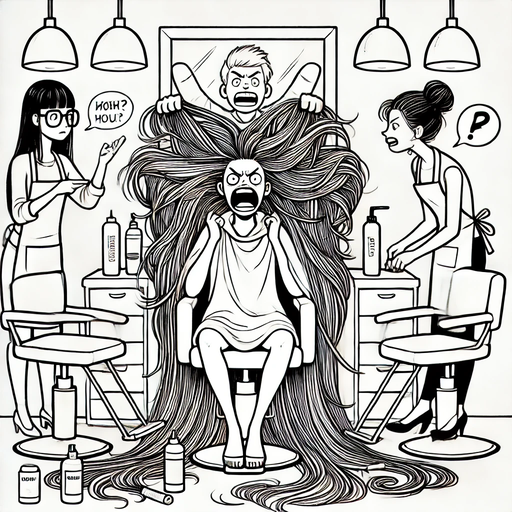
두번째 사이클에서 미용사 A가 A 제품을 사용해서 진행하자고 하였습니다. 하지만 미용사 B는 잘못들어 B 제품으로 사용하였고 결국 이상한 결과물이 나와버렸습니다. 라푼젤은 이렇게 하고 돈을 받는 거냐 화를 내며 미용실을 박차고 나가버렸습니다.

 

의사소통의 문제로 인해서 고객을 놓치게 되었는데요. 협업 자체에 의사소통이 중요하지만, 애자일에서는 매 사이클마다 매번 다른 선택과 진행이 필요하기 때문에 더 중요시됩니다. 아무리 좋은 방법과 피드백이 있어도 뒤 바쳐주는 협업 능력이 없다면 결국 실패할 수 밖에 없습니다.

 

다시 미용실로 돌아와 봅시다.

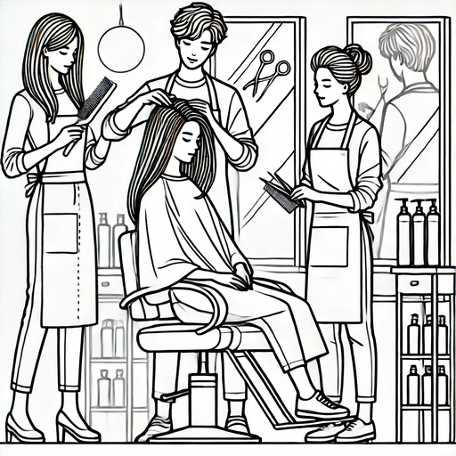
이번에는 꼭 성공하겠다는 마음가짐으로 새로운 손님을 받았습니다.

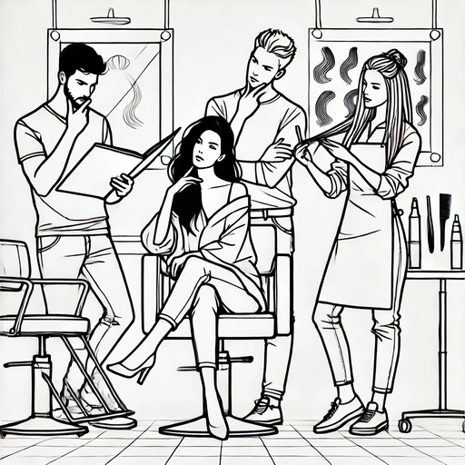
그런데 이번에는 좋은 아이디어가 없어서 디자인하는데 매우 많은 시간을 쏟았습니다.

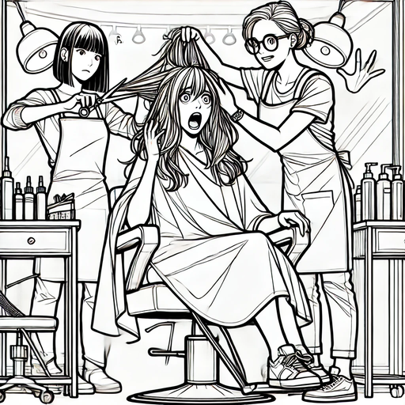
그러다 보니 작업을 해야 하는 미용사는 미용하는 시간이 너무 많이 줄어들어 다급하게 미용을 시작했고 처음 디자인과 완전히 다른 결과가 나오게 되었습니다. 이런 또 실패했네요….

 

앞부분에서 너무 많은 시간을 써서 결국 미용이라는 실제 구현을 잘하지는 못했습니다. 앞쪽에서 완료가 되어야 내가 시작할 수 있어 손가락만 쪽쪽 빨고 있어야 했고 감소 된 시간이 클수록 실제 미용을 하는 시간이 줄어들어 대충 대충 타협하면서 하게 되었습니다.

 

주기적인 배포로 인한 즉각적인 피드백과 여러 사람의 협업이라는 두 개의 특징 때문에 직군 외적으로 신경 써야 하는 게 너무 많아졌고 비효율과 실패하기 쉬운 환경이 조성되어 버렸습니다.

## 애자일에서 중요한 요소

미용사 이야기를 통해서 애자일의 실패 포인트들에 대해서 알아봤습니다. 이를 토대로 애자일에서 빠져서 안되는 중요한 요소를 정리해 봤습니다. 저는 이것 중에서 지켜지지 않는 게 하나라도 있을 시 해당 프로젝트는 실패와 매우 가까워진다고 생각합니다.

> "의사소통이 중요하다"

소통이 안 되어 서로 다른 결과를 내고 서로 다른 이해관계를 만들고, 이는 결국 미용사 이야기처럼 프러덕트의 실패를 야기합니다. 최소 1을 말하면 1을 잘 듣는 사람 나아가 1을 말하면 그 이상의 것을 이해하는 사람 말이죠. 다른 항목이 전부 잘되더라도 의사소통이 안 되는 팀은 100% 실패합니다.

 

- 적절한 문서 정리가 필요하다 (회의록, 공유하는 문화)
- 커뮤니케이션을 자주 해야 한다. (스크럼, 많은 회의)
- 팀워크가 좋아야 한다. (팀원 간의 말이 잘 통해야 한다.)
- 책임 범위가 명확해야 한다. (각자 해야 하는 범위를 명확하게 알고 있고 누가 어느 부분의 책임자인지 알고 있어야 한다)

 

> 시간, 인원 분배가 중요하다

애자일도 워터폴과 똑같은 사이클을 이행합니다. 다만 사이클에서 시간, 인원 분배가 잘못되었을 경우 사이클을 이행하는 시간이 훨씬 짧으니 뒤 단계일수록 워터폴보다 더 고통스럽게 되는데요. 팀 간의 명확한 시간 분배를 통해 불확실성에서 명확한 길을 찾아야 합니다.

 

- 적절한 스프린트 단위의 작업 범위 선정이 필요하다
- 팀 수준에 맞는 기간 설정이 필요하다

 

> 아키텍처링이 중요하다

 

기존의 사이클에서 어떤 결과가 나올지 모르니 최대한 변화에 용이한 아키텍처링이 필요합니다. 단순 개발뿐만 아니라 프로세스에서의 아키텍처링도 중요합니다.

 

- 개발자의 아키텍처링 실력이 필요하다.
- 작업의 독립성이 보장될수록 작업하기에 용이하다.

 

> 주인의식이 중요하다

단순히 자기 범위의 일만 쳐내는 것은 애자일에서는 성공하기 힘듭니다. 사이클마다 수정 범위가 내가 작업하는 범위일 수도 있고 혹은 없을 수도 없으나 결국 고객에게 전달해 주려면 다른 사람의 작업 범위를 해야 하는 건 필연적입니다. 그렇기 때문에 주인의식이 있어야 이런 대응을 하기 수월해집니다.

- 팀원 모두의 같은 목표설정

## 알맞은 개발 방법론 찾기

애자일에 관해서 이야기하였지만, 방법론에서 가장 중요한 것은 지금 프로젝트와 가장 알맞은 방법론 찾기입니다. 애자일 프로젝트를 워터폴로 진행한다면 그것대로 실패할 것이고 워터폴 프로젝트를 애자일로 진행하면 큰 비용과 시간이 들어갈 것입니다.

 

1. 가용할 수 있는 시간이 얼마큼 있는가? (개발 외적으로 의사소통이 일어나는 만큼 사용할 수 있는 시간이 부족하다면 애자일이 안 맞을 수 있습니다. 오히려 개발 시간이 덜 들어가는 워터폴이 맞을 수도 있습니다.)
2. 기술이 뒷받침할 정도로 충분한가? (기술 때문에 어느 순간 요구사항을 수정하지 못할 일이 생기는데 여기까지 도달할 기술력이 충분한지 점검이 필요합니다. 따라서 워터폴로 개발한 후 새로운 태스크로 시간을 잡아 다시 목표를 수정하는 게 더 기술적으로 시간상으로 쉬울 수 있습니다.)
3. 배포 주기가 얼마나 되는가? (완성해서 한 번에 전달해야 하는 방법이라면 워터폴로 개발하는 게 더 효율적일 수 있습니다.)
4. 피드백을 받아서 적용할 수 있는 환경인가? (피드백이 없다면 애자일을 할 이유가 없습니다.)
5. 협업이 잘되는가? (협업과 소통(참여)이 안 된다면 애자일이 필요한 상황이더라도 오히려 소통에 시간만 더 잡아먹을 수 있습니다.)

## 결론

제가 경험한 프로젝트들은 무언가 하나씩 부족해서 처음~중반까지는 쭉쭉 잘되어가다 결국 어느 순간 멈추게 되는 순간이 왔었습니다. 정리해서 글을 적고 나니 해당 내용들이 머릿속에서 스쳐 지나가네요.

 

공통으로 생각해 보면 애자일의 가장 어려운 벽은 결국 사람이라고 생각합니다. 애자일의 가치를 알고 있으면서 팀의 주인의식도 있고 협업도 잘되고 기술적으로도 뒷받침이 되는 개발자여야 하는데 이걸 알고 있는 개발자들은 흔하지 않다고 느꼈습니다.

 

개발자라고 단순히 개발하는 것을 넘어서 내가 맡은 프로젝트를 어떻게 나아가야 더 개발을 잘하고 더 좋은 결과를 낼 수 있을지 생각하는 것이 서비스 개발자로서 중요한 가치라 생각합니다.
