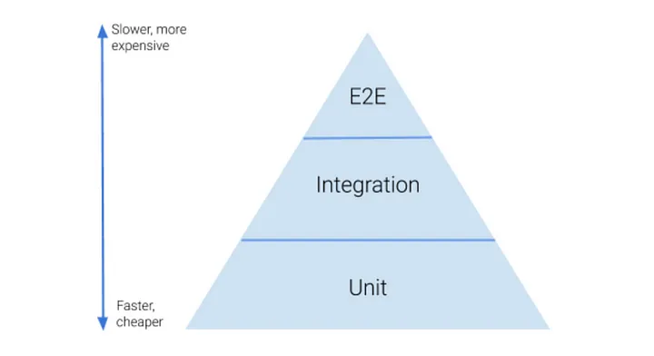
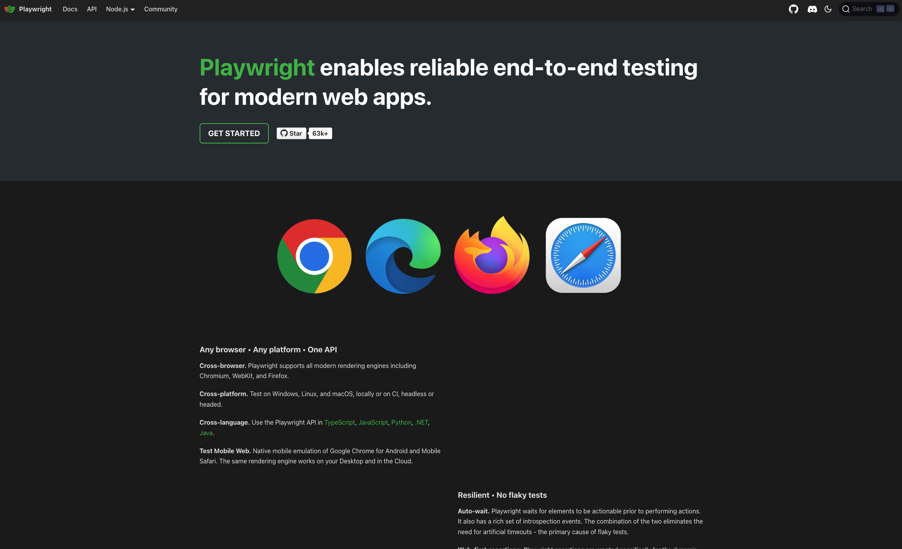
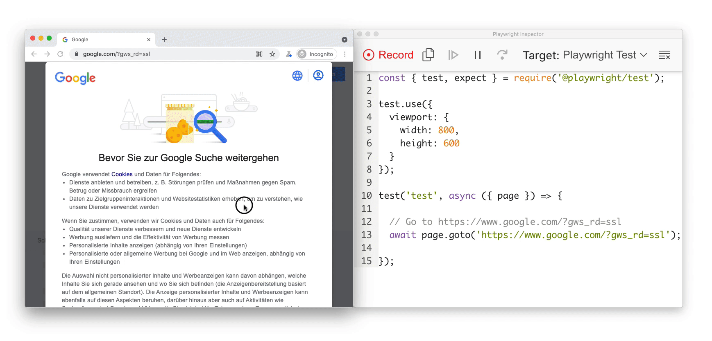
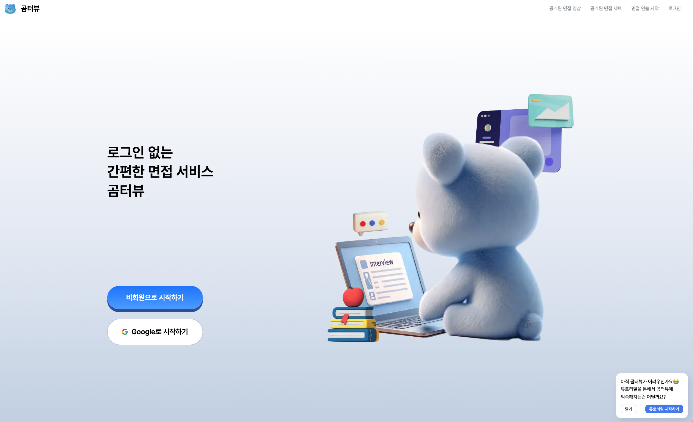
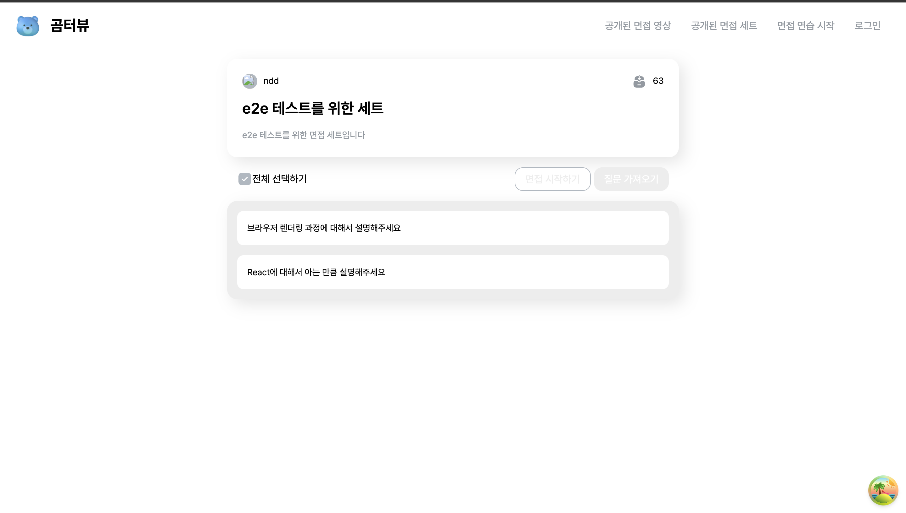

프론트엔드에서 테스트 코드가 백엔드만큼이나 채택률이 높지 않다고 생각합니다. 그렇지만 테스트 코드가 서비스 자체에는 긍정적인 영향을 미친다는 것은 모두가 동의하는데요. 추가하면 좋다는 것을 알지만 이런저런 이유 때문에 채택되지 못하곤 합니다. 비즈니스 로직에는 테스트 코드가 들어가는 경우 종종 봤지만, 그보다 더 큰 범위의 테스트 코드는 아직 보지도 작성하지도 못 해봤는데요. 이번에 좀 더 큰 규모의 E2E 테스트 코드를 직접 작성해 보면서 E2E 테스트가 필요할까? 어떻게 사용해야 할까? 에 대한 궁금증을 풀어보고자 하였습니다.

## E2E 테스트

End To End 테스트는 애플리케이션을 처음부터 끝까지 end to end 테스트하는 것입니다. 기본적으로 사용되는 단위 테스트나 통합 테스트는 해당 테스트 범위의 무결성을 검증해 주는 특징을 가지고 있지만 E2E 테스트는 코드의 무결성보다는 시나리오를 토대로 서비스가 의도한 대로 동작하는지 동작하지 않는지 검증하는 것이 목적입니다.



모든 테스트 코드는 애플리케이션의 무결성을 검증해 안정성을 높이고 사람이 직접 검증하던 것을 자동으로 해주니 검증하는 시간을 줄일 수 있고, 클린 코드를 위한 기반으로도 사용할 수 있습니다. 이런 대목에서는 애플리케이션의 품질과 개발에서 테스트 코드가 중요하다 할 수 있습니다.

## 왜 프론트엔드에서는 테스트 코드를 사용하지 않을까?

하지만 현실과 이상은 다릅니다. 프론트엔드에서는 백엔드보다 테스트 코드의 중요성이 상대적으로 낮다 생각합니다.

<br/>

프론트엔드에서는 UI와 관련된 작업이 많은데 UI는 DEV 서버를 실행하면 그 결과가 즉각적으로 보이기 때문에 단순히 UI에 대한 테스트 코드를 짜는 것은 불필요한 행동이다 라고 생각하는게 가장 큰 것 같습니다.

<br/>

하지만 UI를 보여주기 위한 로직 부분에서는 테스트 코드가 필요하다고 생각합니다. 로직 부분은 실제 하나씩 실행해야 검증할 수 있기 때문이죠. 하지만 테스트 코드를 무작정 적용하는 것보다는 코드를 작성한다는 행위는 개발자가 관여하는 영역을 추가한다는 의미이기 때문에 유지보수와 해당 작업에 투자하는 시간을 우선으로 고려되어야 합니다.

<br/>

대부분 일정이 빠듯함 + 리펙토링보다는 다시 리뉴얼되는 코드가 더 많다는 프론트엔드 기조 때문에 테스트 코드를 작성해도 그 편리함을 맛보기 전에 코드 전체가 폐기되어서 도입조차 하지 않는 경우가 다반사입니다. 특히 서비스를 진행하는 프로젝트에서 굳이? 라는 인식이 강하기 때문에 도입하기가 어렵죠.

<br/>

저도 테스트 코드 도입에 대해서는 약간 비판적인데요. 테스트 코드를 짜는 시간에 요구사항을 체크하고 코드를 더 유지 보수하게 쉽게 만드는 데 힘쓰는 게 더 좋다고 생각했습니다. 그래서 공부는 해봐야지 하였지만 딱히 직접적인 필요성은 크게 느끼지 못하였습니다.

## 그럼에도 불구하고 도입해 보자

사실 이번 프로젝트에서도 테스트 코드에 대한 필요성은 느끼지 못했습니다. 곰터뷰 1.0 배포가 되고 추가 개발이 일어나기 전까지만요.

<br/>

해당 프로젝트는 사이드 프로젝트이기 때문에 기획서 시나리오 등등 개발 외적인 부분들이 아주 부족한 프로젝트였습니다. 그러다 보니 규모가 커질수록 이런 부분들이 아주 아쉬웠고 걸림돌이 되었습니다.

<br/>

따로 QA 팀이 있는 것도 아니었고 버그나 품질 자체도 개발자 개개인들이 자기가 맡은 시나리오를 검사하고 진행하다 보니 여기서 오는 피로감이 컸습니다. 기능을 추가하면서 사이드 이펙트나 놓치고 넘어가는 시나리오가 존재하는 경우도 있었습니다. 또한 팀원의 코드를 수정하고 테스트 해볼때마다 어떤 시나리오가 고려가 되었는지 어느 테스트를 해봤는지 알 방법이 없었습니다. 그럴 때마다 테스트를 생각해서 임의로 진행하거나 물어봐야 했고 그러다 보니 기능 개발이 점점 늦어지고 버그만 점점 쌓여가는 상황이 발생했습니다.

<br/>

그래서 이번에는 E2E 테스트를 넣어서 이런 피로감을 줄이고 시나리오를 테스트 케이스로 정리하고자 하였습니다.

## 왜 PlayWright인가?

E2E 테스트를 위한 기술 선택은 쉬웠습니다. 여러 가지 장점이 있지만 저희 서비스는 여러 환경에서 돌아가는 걸 목표로 잡았기 때문에 여러 브라우저 환경에서 테스트가 되어야 합니다. 이를 안정적으로 잘 지원해 준 것이 Playwright였습니다.




playwright는 자동화 라이브러리로 실제 웹페이지에 어떠한 행동을 코드로 이용해서 자동으로 실행하게 해 줍니다. ui 옵션을 통해서 실제로 코드가 실행되는 과정을 볼 수 있고 테스트 코드 실행 후 report 및 vsc extension까지 지원해 주고 있어 편리하게 사용할 수 있습니다. 또한 프레임워크(라이브러리)에 종속적이지 않는다는 점이 좋았습니다.

## 어떤 방식으로 테스트를 진행해야 할까?

다시 한번 정리하자면 이번 E2E 테스트의 목적은 사이드 이팩트 방지 및 손으로 하던 시나리오를 자동화하는 것이 목적입니다. 이와 더불어 변경되는 기획에 대응하고 개발자의 피로감을 줄이자 최대한 빠르고 단순하게 테스트 코드를 작성하는 것을 목표로 하였습니다.

### view에 대한 테스트는 어디까지?

랜딩페이지를 테스트한다고 생각해 보겠습니다.


여기서는 어떤걸 테스트 할 수 있을까요? 그냥 단순히 생각해 봤을 때 생각난 것들입니다.

- 버튼을 hover 했을 때의 애니메이션 검증 (사용자 action과 관련된 컴포넌트 테스트)
- 회원 비회원일 때 나오는 버튼의 차이 검증 (사용자가 행하기를 원하는 시나리오 테스트)
- nav를 hover 했을 때 나오는 툴팁 검증 (사용자 action과 관련된 컴포넌트 테스트)
- 듀토리얼 시작하기 버튼을 눌렀을 때 나오는 튜토리얼 검증 (사용자가 행하기를 원하는 시나리오 테스트)
- 나와야 하는 버튼 및 text, 이미지 검증 (단순 view test)
- 튜토리얼이 실제로 시작하는지에 관한 검증 (사용자가 행하기를 원하는 시나리오 테스트)
- ... 등등 ....

이것을 전부 테스트해야 하는 것일까요? 물론 테스트하는 항목이 많아질수록 안전성이 보장된다고 생각합니다. 그렇지만 테스트 코드를 마구잡이로 짜다 보면 테스트 코드를 작성하는 목적과 기능을 상실한 채로 피로감만 몰려올 뿐입니다. 그래서 어디를 중점으로 어디까지 테스트할까에 대한 기준을 정하고 큰 단위로 묶어 보았습니다.

- 단순 view test
- 사용자의 action과 관련된 컴포넌트 테스트
- 사용자가 행하기를 원하는 시나리오 테스트

여기서 E2E 테스트를 다시 생각해 보았습니다. 사용자의 입장에서 처음에서 끝까지 손으로 하던 것을 자동화 해주는 것이 목표였으므로 사용자가 입력하기를 원하는 시나리오의 기반 테스트가 가장 알맞을 것이라 생각하였습니다. 즉 컴포넌트 하나하나의 테스트보다는 페이지 레벨에서 컴포넌트와 다른 API 또는 컴포넌트들의 상호 관계를 테스트하기로 하였습니다.

따라서 다음과 같이 페이지 단위의 엮인 시나리오를 채택하여 테스트 케이스를 구성할 수 있었습니다.

- 비 로그인 상태일 때는 로그인과 비회원으로 시작하기 버튼이 보여야 한다.
- 로그인 상태일 때는 면접 연습 시작하기 버튼만 보여야 한다.
- 튜토리얼이 스킵되었으면 튜토리얼 시작하기 버튼이 보이도록 해야 한다.
- 메인페이지 튜토리얼이 동작해야 한다.

### DOM 요소를 가져오는 방법은?

그러면 해당 테스트 케이스를 바탕으로 테스트 코드를 직접 작성해야 하는데요. 작성 방법이 여러 가지가 있습니다.

```jsx
const { test, expect } = require('@playwright/test');

test('테스트', async ({ page }) => {
  // 1. 역할 및 화면에 표시되는 기반의 선택
  await page.getByRole('button', { name: 'Submit' }).click();

  // 2. 화면의 텍스트를 사용하여 요소 선택
  const message = await page.getByText('Welcome back!').textContent();

  // 3. 라벨을 사용하여 입력 필드 선택
  await page.getByLabel('Username').fill('playwright');

  // 4. Placeholder를 사용하여 입력 필드 선택
  await page.getByPlaceholder('Search...').fill('Playwright');

  // 5. Alt 텍스트를 사용하여 이미지 선택
  const image = await page.getByAltText('Logo');

  // 6. Title 속성을 사용하여 요소 선택
  const titleElement = await page.getByTitle('Tooltip text');

  // 7. Test ID를 사용하여 요소 선택
  const button = await page.getByTestId('submit-button');

  // 8. className을 사용하여 요소 선택
  const submitButton = await page.locator('.submit-button');
});
```

크게 보면 다음과 같은 3가지인데요.

- 화면에 표시되는 기반의 dom 선택
- className 기반의 dom 선택 (querySelector처럼)
- test id를 통한 고유한 값을 선택

물론 어떤 문법을 사용해도 테스트를 진행할 수 있습니다. 하지만 여기서 저는 프론트엔드에 특성에 맞춰서 UI 기반의 요소를 가져오는 첫 번째 기법을 위주로 사용하였습니다.

<br/>

테스트 코드를 문제는 기획이나 리뉴얼이 되면 해당 페이지가 완전히 엎어지는데 테스트 코드도 마찬가지로 사라지고 그렇게 되면 해놓은 노력대비 얻을 수 있는 효과가 미미합니다.
또한 E2E테스트로 인해서 오류를 잡았더라도 해당 케이스에서 실패한 것이지 어느 코드가 어떻게 오류가 일어났는지 알 수 없습니다. 그래서 개발 도중에 E2E 테스트를 작성하는 것도 쉽지 않죠.
또한 테스트 코드자체의 진입장벽도 있다 보니 기준이 없어 다양한 방식으로 작성하다 보니 가독성이 굉장히 떨어지게 됩니다.

<br/>

하지만 화면 기반의 dom을 선택하면 이런 단점들이 완화되게 되는데요. 화면에 보이는 요소로 내부 컴포넌트 코드에 상관없이 독립적으로 생각 및 굉장히 빠르게 작성할 수 있고 부수고 다시 생성하는 것에 대한 부담이 적습니다.

```ts
test('질문을 가져오려면 로그인 창이 나타나야 한다.', async ({ page }) => {
  await page.getByText('브라우저 렌더링 과정에 대해서 설명해주세요').click();

  const GetQuestionButton = page.getByText('질문 가져오기');

  await GetQuestionButton.waitFor();

  await GetQuestionButton.click();

  await expect(page.getByText('로그인하러 이동')).toBeVisible();
});
```


화면에서 브라우저 렌더링 과정에 대해서 설명해 주세요를 누르고 질문 가져오기를 누른 다음 로그인하러 이동하기 창이 뜨는지 체크하는 테스트 코드입니다. 시나리오 그대로 코드로 쓰면 됩니다.

<br/>

다만 이렇게 사용하지 못하는 부분도 있는데요. 특정 부분을 스냅샷을 이용한 화면을 찍거나 text가 없는 icon들의 요소, 다중 선택이 필요할 때는 화면에 나와 있는 view를 기반으로 요소를 가져오기가 어려웠습니다.

해당 부분만 test id 및 기타 dom의 직접적인 요소를 통해서 진행하였습니다.

```ts

await expect(page.getByTestId('setting-page-content')).toHaveScreenshot(
'step3.png'
);
...
const Menu = page.locator('button[aria-label="더보기"]');

//등등
```

### 데이터의 Fetch는 어떻게 관리할까?

시나리오에 맞춰서 테스트하다 보면 API 호출이 필연적으로 일어나게 됩니다. 이 API를 직접적으로 호출할지 mocking을 해야할지 정해야 하죠. 각자의 장단점이 있지만 저는 API 호출이 꼭 일어나야 한다고 보았습니다.

<br/>

우선 API를 직접 호출했을 때는 실제 개발자나 QA 팀이 테스트하는 것과 똑같은 환경에서 테스트할 수 있습니다. 다만 API에 너무 의존적이다 보니 서버가 문제일 경우 프론트 코드가 완벽하더라도 모든 E2E가 실패한다는 단점이 있습니다. 또한 실제 API의 응답 값을 기다려야 하므로 API 비용이 들어가고 그만큼의 테스트 지연 시간이 존재한다는 단점도 있죠. 하지만 mocking을 했을 경우는 완전히 반대입니다. 단점이 장점이 되고 장점이 단점이 되지요.

<br/>

그래서 API의 mocking여부를 선택해야 합니다. 저는 API를 mocking 하지 않기로 하였는데요. 처음에 세워 두었던 목표를 기반으로 실제 손으로 하던 것처럼 API 호출이 일어나야 한다고 생각했었고 API mocking에서 코드를 검증하는 것은 storybook 같은 컴포넌트 기반으로의 테스트를 할 때 효과적이겠다고 생각하였습니다.

## 테스트를 진행하자

이렇게 기준을 만들었으면 테스트 코드를 짜는 것 자체는 얼마 걸리지 않았습니다. 시나리오를 그대로 옮겨서 말 그대로 풀어내면 되기 때문입니다.

```ts
test('질문을 기존에 있는 면접 세트에 추가할 수 있다.', async ({ page }) => {
  const GetQuestionButton = page.getByText('질문 가져오기');
  await GetQuestionButton.waitFor();

  await page.getByText('브라우저 렌더링 과정에 대해서 설명해주세요').click();
  await GetQuestionButton.click();
  await page.getByText('기존에 있던 면접 세트').click();
  await page.getByRole('button', { name: '추가' }).click();
  await page.getByText('기존에 있던 면접 세트').click();

  await expect(page.getByText('브라우저 렌더링 과정에 대해서 설명해주세요')).toBeVisible();
});
```

실제 테스트를 진행하면서 문제들을 발견할 수 있었습니다. 다만 해당 테스트가 어떤 컴포넌트의 어떤 로직이 틀렸다고 제공해 주지는 않아서 해결하는 데는 도움이 되지는 못했습니다.

<br/>

또한 API를 직접 통신하며 테스트를 진행하다 보니 더미 데이터들이 계속 쌓이는데요

```ts
test.afterAll('테스트용 데이터 삭제', async ({ browser }) => {
  // 새 페이지 열기
  const page = await browser.newPage();
  await page.goto(PATH.MYPAGE);

  // '질문 추가' 버튼 클릭
  await page.getByText('질문 추가').click();

  // 'e2e 테스트를 위한 세트 복사본'이 있는 모든 항목에 대해 처리
  const copyWorkbook = await page.getByText('e2e 테스트를 위한 세트 복사본').all();
  for (const workbook of copyWorkbook) {
    await workbook.waitFor();
    await workbook.click();
  }

  // '더보기' 메뉴 열기
  const menu = page.locator('button[aria-label="더보기"]');
  await menu.waitFor();
  await menu.click();

  // '면접 세트 삭제' 선택
  await page.getByRole('menuitem').filter({ hasText: '면접 세트 삭제' }).click();

  // 기존에 있던 면접 세트 클릭
  await page.getByText('기존에 있던 면접 세트').click();
  await menu.click();

  // '면접 세트 편집' 선택
  await page.getByRole('menuitem').filter({ hasText: '면접 세트 편집' }).click();

  // '브라우저 렌더링 과정에 대해서 설명해주세요' 텍스트가 있는 모든 대상 선택
  const deleteTarget = await page.getByText('브라우저 렌더링 과정에 대해서 설명해주세요').all();
  for (const target of deleteTarget) {
    await target.waitFor();
    await target.click();
  }

  // 선택된 대상 삭제
  await page.locator('button[aria-label="삭제"]').click();
});
```

다음과 같이 해당 테스트 케이스가 끝날 때 테스트용 데이터를 삭제하는 로직을 추가해서 더미 데이터를 관리하였습니다.

## 어떻게 테스트 코드를 어떻게 사용할까?

기존의 jest를 이용한 비즈니스 로직 단위 테스트 storybook을 이용한 컴포넌트 테스트 이번에 E2E테스트까지 경험해 보고 나니 어떻게 써야 할지에 대한 윤곽이 드러나는 것 같습니다.

- 기본적으로 로직에 대한 테스트 검증은 많을수록 좋다 생각합니다. jest를 이용해서 로직에 대한 단위 테스트만 실시하죠.
- 더 큰 범위의 안정성을 보장해야 한다면 (디자인 시스템이나 여러 프로젝트에 들어가 있는 컴포넌트들) storybook으로 컴포넌트 단위의 테스트를 넣을 것 같습니다.
- 서비스에서 해당 프로젝트가 핵심적이고 중요하다면 그때야 E2E 테스트를 진행하고 에러가 많이 일어났고 복잡한 곳부터 천천히 추가할 것 같습니다.

모든 테스트는 실제 코드와 독립적으로 넣을 수 있기 때문에 어느 타이밍에 넣어도 상관없습니다. 해당 프로젝트의 일정에 맞춰서 진행하는 게 가장 좋을 것 같습니다. 개인적으로는 jest을 이용한 로직 테스트는 진행하고 storybook E2E는 완성 후 쿨다운 or 필요시 추가가 가장 좋다 생각합니다.
