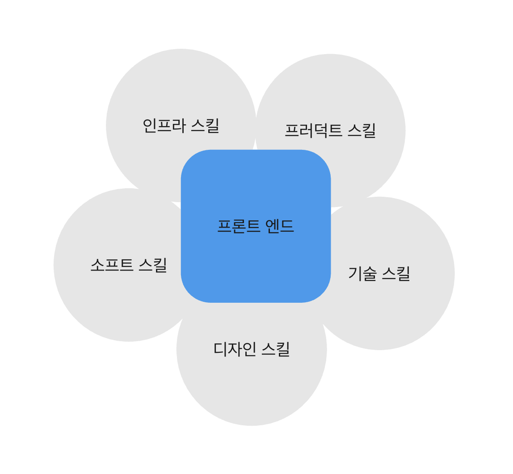

## 서론

프론트엔드 개발은 서비스 프로젝트 개발에 있어 전반적인 영역에 관여합니다. 이런 특징 때문에 개발을 하다 보면 개발 자체의 전문성과 정체성을 의심하게 됩니다. 저 또한 내가 지금 하고 있는 게 개발자로서의 성장과 스킬이 맞을까…? 이런 고민을 했었습니다.

 

이러한 이유는 개발자는 CS 지식 네트워크 지식 개발지식 등 가지고 있는 지식을 깊게 알고 해당 지식을 바탕으로 프로그램을 만드는 것이 개발자라고 생각하였기 때문입니다. 물론 틀린 말은 아니죠. 그렇지만 실제 서비스를 개발하다 보면 기술 이외 것들을 더 많이 접하게 됩니다.

 

개발 자체와 기술 이외에 것이 개발자가 얼마나 필요한것인지 연관된 부분을 찾고 이에 따라서 개발 스탯이라는 개념으로 개발을 보고 있습니다. 게임 스탯을 기반으로 환경을 이해하고 내 스탯을 올리면서 개발자로서의 가치와 강점을 찾을 수 있어서 공유해 보고자 합니다.

## 프론트개발의 범위

하나의 프로젝트를 0부터 진행해 본다고 가정하겠습니다. 프론트엔드 개발자는 다음과 같은 일을 진행하게 됩니다.

 

1. 디자이너와의 소통: 반응형 대응에 대한 논의, UI/UX 의견 제시, 기획에 대한 구현 가능성 체크
2. 일정 관리: 일정 산출, 개발비용 산정, 진행 상황 공유, 타 직군과의 일정 조율
3. 개발: 라이브러리 선택, 개발 착수, 지식 습득
4. 배포: CI/CD, 배포 방식 선택
5. QA: 디버깅, 피드백
6. 유지 보수: 사용자 피드백 반영, 기획 추가, 비즈니스에 대한 처리

 

위 항목을 토대로 다음과 같이 프론트엔드가 관여하는 스킬을 정립해 봤습니다.

 

- 코어 스킬: 서버, 모노레포 관리 파이프라인 설정 등 코어로써 스킬을 의미합니다.
- 소프트 스킬: 명확한 의사전달, 피드백, 공유, 마인드, 타 직군 간 소통 등 사람과 관련된 스킬을 의미합니다.
- 디자인 스킬: figma, 디자인 감각, UI/UX, 인터렉션 등 디자인 스킬을 의미합니다.
- 기술 스킬: 라이브러리, JS, TS, NodeJs, CS 지식 등을 의미합니다.
- 프러덕트 스킬: 일정 관리, 사용자 경험, 비즈니스 관리 등을 의미합니다.

 

해당 세부 사항은 임의로 나누었습니다. 하나의 서비스를 개발해야하는데 순수 프론트 개발 이외에도 다른 스킬들이 필요하고 타 직군과 접점이 많다는것을 볼 수 있습니다. 이런 이유로 프론트 개발자는 다양한 스킬을 가지고 있어야 합니다.

 

개발 성장에 슬럼프가 오면 “개발 스킬이 부족한 것 같아…” “개발하고 싶은데 다른 활동들이 너무 시간을 잡아먹어…” “다른 직군에 비해서 전문성이 없어…” “성장한 게 없어…” 이런 생각이 듭니다. 이유는 단순히 개발 스킬업만 성장이라고 생각하기 떄문입니다. 저 또한 개발자는 개발만이 성장이다 생각하고 있었죠. 다른 기술들도 중요한 것은 알고 있었지만 실제로 얼마나 중요한지 알지 못했습니다.

 

저는 이 각각의 스킬을 스탯으로 관리해서 이런 생각을 떨쳐낼 수 있었습니다. 또한 진취적 사고와 강점을 찾고 이를 토대로 다른 개발자들의 스탯을 확인하고자 하는 안목 발전으로도 성장할 수 있었습니다.

 

## 스탯을 찍어보자

각 항목을 RPG 게임의 스탯이라 생각하고 관리하면 됩니다. 여기서 중요한 것은 남과 비교하면서 생각하지 말고 내가 가지고 있는 스킬만 집중해 상대적으로 찍는 것입니다.

 

자기만의 기준과 근거를 가지고 포인트를 찍어 봅시다.

 

1. 코어 스킬 (10p)
2. 소프트 스킬(15p)
3. 디자인 스킬 (5p)
4. 기술 스킬 (16p)
5. 프러덕트 스킬(7p)

저는 이렇게 나왔는데요. 이를 토대로 알 수 있는 건 저는 지금 기술 스킬이 많은 개발자라는 걸 볼 수 있습니다. 즉 제 현재 강점은 기술 스킬이라는 것이죠.

 

내가 가지고 있는 경험이 수치화가 되어서 눈에 보이니 그만큼 자신감이 자연스럽게 생겼습니다. 또한 내가 하고자 하는 스탯이 생각보다 낮구나 라는것도 인지할 수 있었습니다. 이런식으로 스탯을 찍어보면서 내가 가지고 있는 강점과 약점을 파악할 수 있습니다.

 

마인드도 변화하였습니다. 제가 가진 기술 스킬은 1년 전과 막 크게 다르지 않습니다. 그래서 처음에는 나는 개발자로서 성장을 하지 못했다고 생각하고 있었죠. 개발로써의 도전적인 것들을 하지 못했고 면접만 보러 다녔는데 결과는 안 좋고 외주에서도 사용하는 스킬만 사용하다 보니 1년 전의 나와 똑같다고 느낀것이 원인이었습니다.

 

그렇지만 해당 결과를 보니 1년 전과 지금과 소프트 스킬 프러덕트 스킬이 엄청 늘어났다는 걸 알 수 있었습니다. 외주와 면접을 통해 자기주장 및 일정 관리 부분에서 엄청나게 성장을 했던 것이죠.

## 스탯 키우기

 

이렇게 나라는 캐릭터를 생성했으니 이제 잘 키워야겠죠. RPG 게임에서도 어떤 직업이든지 모든 스탯을 전부 찍으면 망한 캐릭터라는 소리가 나옵니다. 개발 스탯도 그렇습니다. 내가 가고자 하는 스탯을 집중적으로 찍는 게 중요합니다.

 

나는 어떤 것을 좋아할까? 어떤 스탯을 찍을 수 있는 환경인가? 잘 생각해 보고 결정하면 됩니다. 저의 경우에는 실제 비즈니스와는 거리가 먼 환경이기 때문에 프러덕트 스탯은 얻기 힘들었습니다. 하지만 강제로 소프트와 기술 스킬이 늘어나고 해당 스탯을 중점으로 얻으려 노력하였습니다.

 

단순한 경험 이외에 우리에게는 경험치 포션 아이템을 사용해서 스탯을 빠르게 얻는 방법도 있습니다. 이것이 바로 책, 강의 등이죠. 다만 해당 직업의 고유한 스킬을 얻기 위해서는 아이템이 아닌 히든 퀘스트들을 진행해야 한다는 것을 명심하고 있어야 합니다.

 

프론트엔드 개발을 게임으로 생각해서 표현해 보았습니다. 게임 자체도 자기만족을 위해서 끊임없이 퀘스트 하고 아이템을 사고 스탯을 찍고 발전하듯이 개발도 게임처럼 레벨업과 전직을 하면서 성장하는 건 어떤가요??
